# UMT

# Database Systems

## Unit 6 – Entity Relationship Modeling

# School of Systems & Technology - SST

Lecture 11 & 12
Mr. Maaz Waseem

# Chapter Objectives

## **In this chapter you will learn:**

- How to use Entity-Relationship (ER) modeling in database design.
- The basic concepts associated with the ER model: entities, relationships, and attributes.
- A diagrammatic technique for displaying an ER model using the Unified Modeling Language (UML).
- How to identify and resolve problems with ER models called connection traps.

2

# Entity / Entity Types

## **Entity Type:** A group of objects with the same properties and independent existence.

This is the blueprint or template. For example, **STUDENT** is the entity type. It defines the structure (schema) that all students will follow.

## **Entity (Instance) or Entity Occurrence:** is a uniquely identifiable object of an entity type. In the table, the individual rows (like "Andrew" or "Isabella") are the entities.

## **Entity Set:** The collection of all entities of a particular type at a specific point in time (the entire table of students).

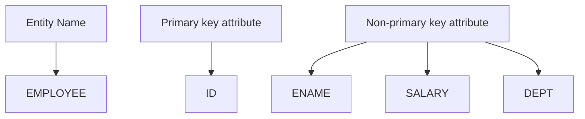

| Student  |               |     |            | Entity Type |
| -------- | ------------- | --- | ---------- | ----------- |
| Roll\_no | Student\_name | Age | Mobile\_no |             |
| 1        | Andrew        | 18  | 7089117222 | → E1        |
| 2        | Oliver        | 19  | 8709054568 | → E2        |
| 3        | Isabella      | 20  | 9864257315 | → E3        |
| 4        | Julian        | 21  | 9847852156 | → E4        |

| ENTITY SET |
| ---------- |
| E1         |
| E2         |
| E3         |
| E4         |

3

# Relationship Types

- **Relationship Type:** It describes a meaningful association between two Entity Types (like PROFESSOR and COURSE). It's the "verb" that connects them.
- Example: "Professors Teach Courses."
- We usually represent this with a line or a diamond shape connecting two boxes.

- **Relationship Occurrence:** This is one specific instance of that relationship. It's when a specific professor actually gets linked to a specific course in the real world.
- Example: "Faisal Teaches Data Structures."
- In a Database: This would be a specific entry in a table that connects Professor ID 101 with Course ID CS202.

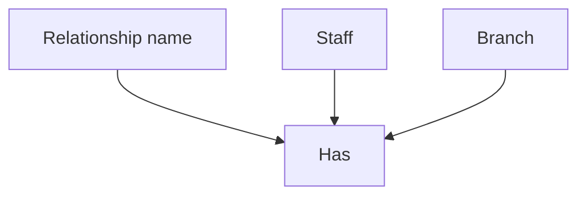

4

# Relationship Types

## **The Ovals:** The ovals represent Entity Sets.

- Left Oval represents The set of all Branches (the offices).
- Right Oval represents The set of all Staff (the employees).
- Middle Oval represents The set of all Relationships currently happening between them.

## **The Points inside the Ovals:** Each point represents an Entity Instance (also called an Entity Occurrence).

- It is **NOT** an attribute. An attribute would be something like "Branch Name" or "Staff Salary."
- It **IS** a specific object. B003 is one specific branch office. SG37 is one specific person.

## **The Middle Oval (r1, r2, r3):** These points represent Relationship Occurrences.

- Each `r` is a connection line.
- r1 is the specific "link" that tells the database, "Staff SG37 works at Branch B003."

## **The Logic of the Lines:** The lines reveal the Rules of the business:

- Look at B003: Two lines come out of it (r1 and r2). This means one branch can have multiple staff members.
- Look at the Staff (Right side): Only one line goes into each person. This means one staff member can only work at one branch at a time.

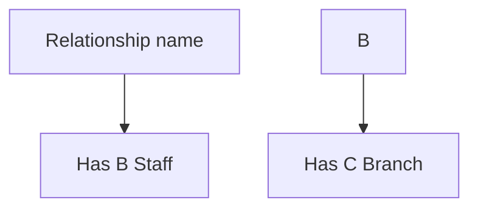

**Figure 12.4** A semantic net showing individual occurrences of the *Has* relationship type.

5

# **Degree of a relationship type**

- ❖ The **degree of a relationship type** is the number of participating entity types in a relationship.

- • A relationship of degree two is called **binary**.

- • A relationship of degree three is called **ternary**.

- • A relationship of degree four is called **quaternary**.

| Entity 1                       | Relationship | Entity 2 |
| ------------------------------ | ------------ | -------- |
| Customer                       | has          | Account  |
| Binary Relationship (degree 2) |              |          |

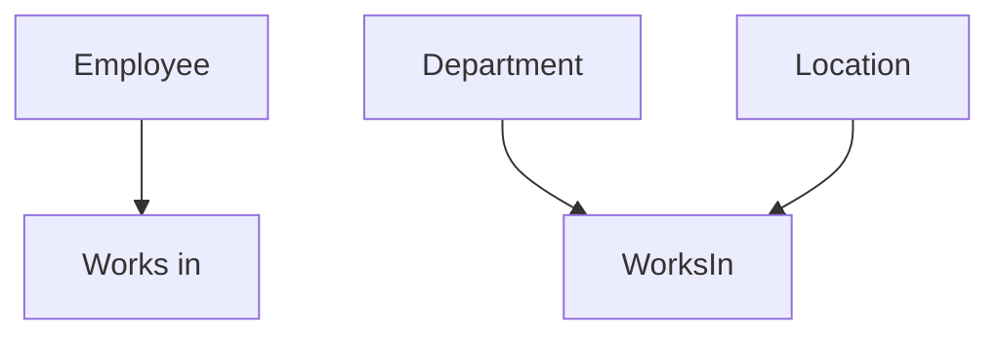

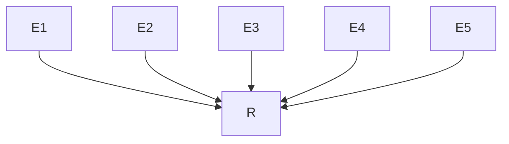

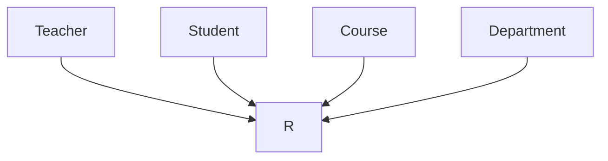

6

# Cardinality of a Relationship Type

**Cardinality:** The number of instances of one entity type that can be associated with each instance of another entity type.

**One-to-One (1:1):** One instance of A is associated with exactly one instance of B. Example: One Manager manages one Department.

**One-to-Many (1:N):** One instance of A is associated with many instances of B. Example: One University has many Students.

**Many-to-Many (M:N):** Many instances of A are associated with many instances of B. Example: Many Students enroll in many Courses.

| Symbol | Meaning          |
| ------ | ---------------- |
| —\|    | One              |
| —<     | Many             |
| —\|\|  | One and only one |
| —o\|   | Zero or one      |
| —<\|   | One or many      |
| —o<    | Zero or many     |

## One to one database relationship

| capital             |
| ------------------- |
| **capital\_id** int |
| name varchar        |
| country             |
| **country\_id** int |
| name varchar        |
| capital\_id int     |

## One to many database relationship

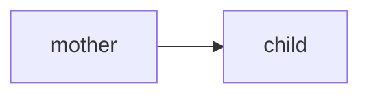

| authors                 |
| ----------------------- |
| **id** int              |
| name varchar            |
| dob datetime            |
| gender varchar          |
| books                   |
| **id** int              |
| name varchar            |
| released\_date datetime |
| title varchar           |

7

# Recursive (Unary) Relationship

**Definition:** A relationship where an entity type associates with itself.

**Roles:** The same entity plays different parts (e.g., an Employee acts as a Manager to another Employee).

**Implementation:** Uses a Self-Referencing Foreign Key (one column in the table points back to the Primary Key of the same table).

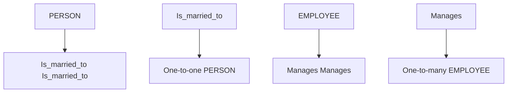

| EMPLOYEE       |
| -------------- |
| EmpId {PK}     |
| Name           |
| Sex            |
| ManagerId {FK} |

An ER representation of recursive relationships

8

# **Associative Entity**

- **associative entity** (sometimes called a "bridge" or "junction" table) is an entity used to resolve a **Many-to-Many (M:N)** relationship between two other entities.

- A many-to-many relationship cannot be represented directly in a relational model. It must be **decomposed into two one-to-many relationships** using an associative entity. This design avoids redundancy and maintains data integrity.

- An associative entity should be created when:
  - We have a **Many-to-Many** relationship between two tables.
  - The relationship has attributes that cannot logically belong to either entity alone.
  - The relationship is independent enough to be treated as its own "thing" or "event."

9

# *Associative Entity*

## **Real-World Example: Student Enrollment**

- Imagine a database for a University:
  - A **Student** can enroll in many **Courses**.
  - A **Course** can have many **Students**.

- **The Problem:** Where do you store the **Grade**?
  - If you put it in the Student table, you don't know which course it's for.
  - If you put it in the Course table, you don't know which student earned it.

- **The Solution:** Create an associative entity called **Enrollment**.

10

# Associative Entity

## Real-World Example: **Student Enrollment**

- Imagine a database for a University:
  - A **Student** can enroll in many **Courses**.
  - A **Course** can have many **Students**.

- **The Problem:** Where do you store the **Grade**?
  - If you put it in the Student table, you don't know which course it's for.
  - If you put it in the Course table, you don't know which student earned it.

- **The Solution:** Create an associative entity called **Enrollment**.

## Key Characteristics

- **Relationship Link:** It contains Foreign Keys (FK) from both parent entities.

- **Primary Key Options:**
  - A **Composite Primary Key** made of both Foreign Keys.
  - A new, separate column created specifically to identify each row (e.g., `Enrollment_ID`).

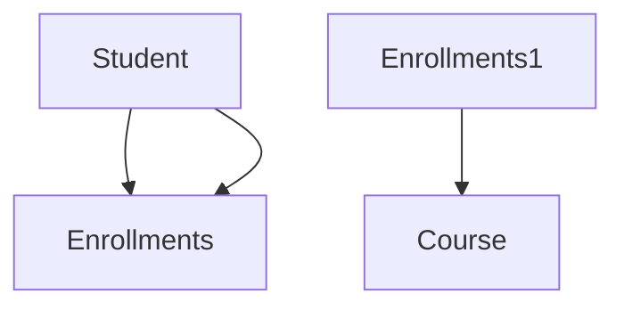

11

# Academic System – ER Diagram

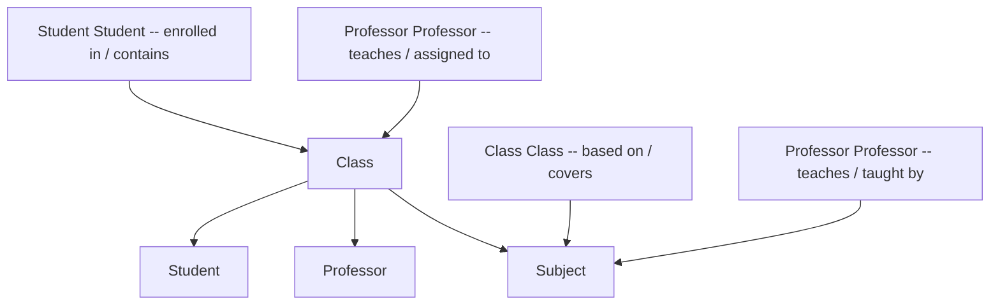

- enrolled in / contains
- teaches / assigned to
- based on / covers
- teaches / taught by

12

# Academic System – ER Diagram (Corrected)

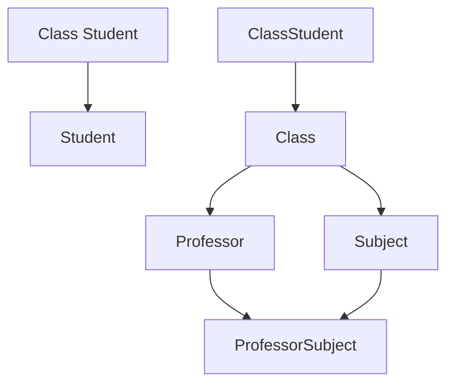

13

# **Attributes**

- An attribute is a <mark>property or characteristic of an entity</mark>.
- An entity may contain any number of attributes.
- One of the attributes is considered as the primary key. In an Entity-Relation model, attributes are represented in an elliptical shape.
- Example: Student has attributes like name, age, roll number, and many more. To uniquely identify the student, we use the primary key as a roll number as it is not repeated. Attributes can also be subdivided into another set of attributes.
- There are six types of attributes: Simple, Composite, Single-valued, Multi-valued, and Derived. A sixth, though rarely used, type is the Complex attribute.

14

# **Types of Attributes**

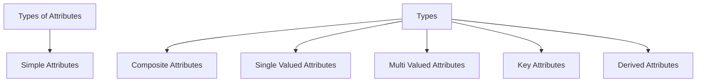

15

# Types of Attributes in ER Model

## <u>Simple attribute :</u>

- An attribute that cannot be further subdivided into components is a simple attribute.
- Example: The roll number of a student, the gender of a person.

## <u>Composite attribute :</u>

- An attribute that can be split into smaller sub-parts is a composite attribute.
- Example: The address can be further split into house number, street number, city, state, country, and pin code, the name can also be split into first name, middle name, and last name.

## <u>Single-valued attribute :</u>

- The attribute which takes up only a single value for each entity instance is a single-valued attribute.
- Example: The age of a student.

16

# Contd....

<u>~~Multi-valued attribute~~</u> :
- The attribute which takes up more than a single value for each entity instance is a multi-valued attribute.
- Example: Phone number of a student, or skills of a person.

<u>~~Derived attribute~~</u> :
- An attribute that can be derived from other attributes is derived attributes.
- Example: Age can be derived from Date of Birth.

<u>~~Key attribute:~~</u>
- Key attributes are those attributes that can uniquely identify the entity in the entity set.
- Example: Roll-No is the key attribute because it can uniquely identify the student.

<u>~~Complex Attribute:~~</u>
- It is a combination of composite and multi-valued attributes (e.g., an "Address" attribute that is composite, but a person can have "Multiple Addresses").

17

# How attributes are represented

| Visual Representation | Label                 |
| --------------------- | --------------------- |
| ~~A~~                 | Attribute             |
| ~~A~~                 | Multivalued Attribute |
| ~~A~~                 | Composite Attribute   |
| ~~A~~                 | Key Attribute         |
| ~~A~~                 | Partial Attribute     |
| ~~A~~                 | Derived Attribute     |

18

# Example

19

# Strong vs Weak Entity Types

## Strong Entity

- An entity that exists independently and can be uniquely identified on its own. It is **not** dependent on any other entity.
- **Key Identification:** It always possesses a **Primary Key** (<u>underlined with a solid line</u>).
- **Example from Diagram (Customer):**
- The "**Customer**" entity is strong.
- It is identified by its own unique primary key: C_id.
- The existence of a "Customer" does not depend on whether they have a "Loan" or not.
- **ER Notation:** Represented by a **single rectangle** (like "Customer").

| Attribute | Type                      |
| --------- | ------------------------- |
| C\_id     | Primary Key (Underlined)  |
| C\_name   | Attribute                 |
| L-name    | Foreign Key (Underdashed) |
| L-date    | Attribute                 |

[signature: Strong Entity]

20

# Strong vs Weak Entity Types

**Weak Entity:** An entity whose existence is dependent upon another "strong" (owner) entity. It cannot be uniquely identified by its own attributes alone.

- **Key Identification:** It does not have a primary key. It relies on a partial attribute (Discriminator), which is visually represented by a **dashed underline**. To uniquely identify a record, the Discriminator is combined with the owner entity's primary key (`C_id + L-name`).

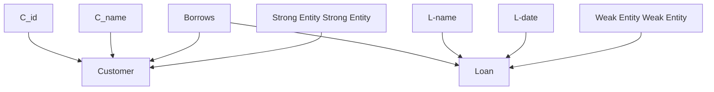

| Entity   | Attribute | Type                           |
| -------- | --------- | ------------------------------ |
| Customer | C\_id     | Primary Key (Underlined)       |
| Customer | C\_name   | Attribute                      |
| Loan     | L-name    | Partial Key (Dashed Underline) |
| Loan     | L-date    | Attribute                      |

21

# Database Keys

- A key **refers to an attribute/a set of attributes that help us identify a row** (or tuple) uniquely in a table (or relation).

- A key is **also used when we want to establish relationships** between the different columns and tables of a relational database.

- The individual values present in a key are commonly referred to as **key values**.

- We use a key for **defining various types of integrity constraints** in a database.

- A table, on the other hand, represents a collection of the records of various events for any relation.

- The keys in DBMS **can be a combination of multiple attributes** (or columns), or they can be just one single attribute.

- The primary motive of the keys is to **provide every record with a unique identity** of its own.

22

# DB Key types

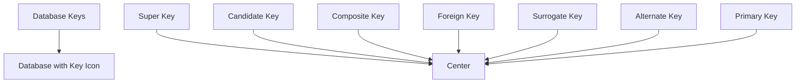

www.learncomputerscienceonline.com

23

# Types of Keys

## 1. <u>Primary Key</u>

- The primary key refers to a column or a set of columns of a table that helps us identify all the records uniquely present in that table. A table can consist of just one primary key. Also, this primary key cannot consist of the same values reappearing/repeating for any of its rows. All the values of a primary key have to be different, and there should be no repetitions.

## 2. <u>Super Key</u>

- A super key refers to the set of all those keys that help us uniquely identify all the rows present in a table. It means that all of these columns present in a table that can identify the columns of that table uniquely act as the super keys.

24

# **Types of Keys**

## <u>3. Candidate Key</u>

- The candidate keys refer to those attributes that identify rows uniquely in a table. In a table, we select the primary key from a candidate key. Thus, a candidate key has similar properties as that of the primary keys that we have explained above. In a table, there can be multiple candidate keys.

## <u>4. Alternate Key</u>

- As we have stated above, any table can consist of multiple choices for the primary key. But, it can only choose one. Thus, all those keys that did not become a primary key are known as alternate keys.

## <u>5. Foreign Key</u>

- We use a foreign key to establish relationships between two available tables. The foreign key would require every value present in a column/set of columns to match the referential table's primary key. A foreign key helps us to maintain data as well as referential integrity.

25

# Types of Keys

## <u>6. Composite Key</u>

- The composite key refers to a set of multiple attributes that help us uniquely identify every tuple present in a table. The attributes present in a set may not be unique whenever we consider them separately. Thus, when we take them all together, it will ensure total uniqueness.

26

# Examples

## Table 1

| EmpID | Emp Name | EmpLicence | EmpPassport | DId |
| ----- | -------- | ---------- | ----------- | --- |
| 001   | Tom      | EL101      | PA123       | 2   |
| 005   | John     | EL102      | PA125       | 3   |
| 008   | Alice    | EL103      | PA129       | 5   |

## Table 2

Primary Key points to EmpID
Candidate Key points to EmpLicence and EmpPassport
Alternate Key points to EmpLicence and EmpPassport
Foreign Key points to DId

Primary Key Candidate Key Alternate Key
__________________
SuperKey

27

# Foreign Key — What is a Foreign Key (FK)

A **Foreign Key** is a column (or group of columns in case of composite primary key) in the **Child table** that points to the **Primary Key** of the **Parent table**. It acts as a cross-reference between tables because it references the primary key of another table.

## Key Terminology:

- **Referencing (Child) Table**: The table containing the Foreign Key.
- **Referenced (Parent) Table**: The table <u>containing the candidate key (usually the</u> Primary Key) being pointed to.

| Table: Departments (Parent) |                         |                |
| --------------------------- | ----------------------- | -------------- |
| Dept\_ID (PK)               | Dept\_Name              | Building\_Name |
| 101                         | Artificial Intelligence | SST-1          |
| 102                         | Data Science            | SST-1          |

| Table: Employees (Child) |            |               |
| ------------------------ | ---------- | ------------- |
| Emp\_ID (PK)             | Emp\_Name  | Dept\_ID (FK) |
| 1                        | Dr. Smith  | 101           |
| 2                        | Prof. Khan | 101           |
| 3                        | Ms. Lee    | 102           |

28

# Foreign Key — The Logic of the Link

- A Foreign Key (FK) is used to connect one table to another.
- It points to a Primary Key (PK) because a PK is always unique (no duplicates).
- If we tried to link Employees to a non-unique column like Building_Name, and two departments were in the same building, the database wouldn't know which department Dr. Smith actually belongs to.
- By using a PK, the database always knows exactly which row we mean.
- This makes sure every record in the child table is linked to one clear, correct record in the parent table.

| Table: Departments (Parent) Dept\_ID (PK) | Table: Departments (Parent) Dept\_Name | Table: Departments (Parent) Building\_Name |
| --------------------------------------------- | ------------------------------------------ | ---------------------------------------------- |
| 101                                           | Artificial Intelligence                    | SST-1                                          |
| 102                                           | Data Science                               | SST-1                                          |

| Table: Employees (Child) Emp\_ID (PK) | Table: Employees (Child) Emp\_Name | Table: Employees (Child) Dept\_ID (FK) |
| ----------------------------------------- | -------------------------------------- | ------------------------------------------ |
| 1                                         | Dr. Smith                              | 101                                        |
| 2                                         | Prof. Khan                             | 101                                        |
| 3                                         | Ms. Lee                                | 102                                        |

29

# **Foreign Key — Summary of Rules**

- **Data Type Match:** If Dept_ID in the Parent table is an INT, the Dept_ID in the Child table **must** also be an INT.

- **Domain Consistency:** The values in the Employees. Dept_ID column must either match a value in Departments. Dept_ID or be NULL (if the employee hasn't been assigned a department yet).

- **Logical Ownership:** The Foreign Key always lives in the table that represents the "Many" side of the relationship (Multiple employees belong to one department).

| Table: Departments (Parent) |                         |                |
| --------------------------- | ----------------------- | -------------- |
| Dept\_ID (PK)               | Dept\_Name              | Building\_Name |
| 101                         | Artificial Intelligence | SST-1          |
| 102                         | Data Science            | SST-1          |

| Table: Employees (Child) |            |               |
| ------------------------ | ---------- | ------------- |
| Emp\_ID (PK)             | Emp\_Name  | Dept\_ID (FK) |
| 1                        | Dr. Smith  | 101           |
| 2                        | Prof. Khan | 101           |
| 3                        | Ms. Lee    | 102           |

30

# Foreign Key — Modeling Relationships

## **One-to-Many (1:N)**

**Concept:** One record in the "Parent" table relates to many in the "Child" table.

**Logic:** Place the Foreign Key on the **Many** side.

**Example: Departments and Professors**
- One **Department** can have many **Professors**.
- One **Professor** works for exactly one **Department**.

| Departments (Parent) DeptID (PK) | Departments (Parent) DeptName | Departments (Parent) Building | Departments (Parent) Budget |
| ------------------------------------ | --------------------------------- | --------------------------------- | ------------------------------- |
| **101**                              | Computer Science                  | Turing Hall                       | $500,000                        |
| **102**                              | Mathematics                       | Euler Annex                       | $350,000                        |

| Professors (Child) ProfID (PK) | Professors (Child) Name | Professors (Child) Salary | Professors (Child) DeptID (FK) |
| ---------------------------------- | --------------------------- | ----------------------------- | ---------------------------------- |
| P\_01                              | Dr. Smith                   | $95,000                       | **101**                            |
| P\_02                              | Dr. Jones                   | $88,000                       | **101**                            |
| P\_03                              | Dr. Brown                   | $91,000                       | **102**                            |

31

# Foreign Key — Modeling Relationships

## **One-to-One (1:1)**

**Concept:** Each record in Table A is related to **at most one** record in Table B, and vice versa.

**Logic:** Place the FK in either table, but apply a **UNIQUE constraint** so a value cannot be repeated.

**Example: Professors and Office Spaces**
- One **Professor** is assigned one **Office**.
- One **Office** belongs to only one **Professor**.

>If you try to assign P_01 to a second room, the database will throw an error because of the Unique rule on the FK.

| Professors  |           |                |
| ----------- | --------- | -------------- |
| ProfID (PK) | Name      | Email          |
| P\_01       | Dr. Smith | smith\@uni.edu |
| P\_02       | Dr. Jones | jones\@uni.edu |

| OfficeAssignments |               |          |                      |
| ----------------- | ------------- | -------- | -------------------- |
| OfficeNum (PK)    | SquareFootage | PhoneExt | ProfID (FK + UNIQUE) |
| Room 404          | 120           | x4404    | **P\_01**            |
| Room 502          | 150           | x4502    | **P\_02**            |

32

# Foreign Key — Modeling Relationships

## **Many-to-Many (N:M)**

**The Concept:** Multiple records in Table A relate to multiple records in Table B.

**The Rule:** Databases cannot do this directly. We must use an **Associative (Junction) Table** that holds FKs from both sides.

**Example: Students and Courses**

- A **Student** enrolls in many **Courses**, a **Course** has many **Students**.

| StudentID (PK) | FirstName | Age | Phone Number |
| -------------- | --------- | --- | ------------ |
| **S\_99**      | Alice     | 20  | 033XXXXXXXX  |
| **S\_88**      | Bob       | 21  | 034XXXXXXXX  |

| CourseID (PK) | Title       | Credits |
| ------------- | ----------- | ------- |
| **CS101**     | Database I  | 3       |
| **MA202**     | Calculus II | 4       |

| StudentID (FK) | CourseID (FK) | Grade | Semester    |
| -------------- | ------------- | ----- | ----------- |
| **S\_99**      | **CS101**     | A     | Fall 2025   |
| **S\_99**      | **MA202**     | B+    | Fall 2025   |
| **S\_88**      | **CS101**     | A-    | Spring 2026 |

33

# Foreign Key — Modeling Relationships

## **Self-Referencing (Unary)**

**The Concept:** A table where a record relates to another record within the same table.

**The Rule:** The FK points back to the PK of the **same table**.

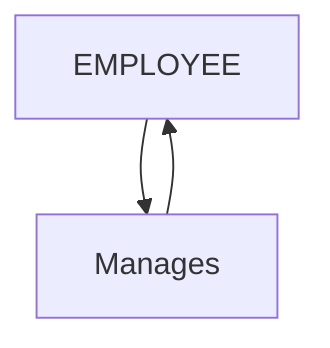

| EmployeeID (PK) | Name        | Job Title   | ManagerID (FK) |
| --------------- | ----------- | ----------- | -------------- |
| **E\_01**       | Alice Chen  | CEO         | NULL           |
| **E\_02**       | Bob Harris  | VP of Sales | **E\_01**      |
| **E\_03**       | Charlie Wu  | VP of Tech  | **E\_01**      |
| **E\_04**       | David Rossi | Sales Lead  | **E\_02**      |

34

# Foreign Keys — Referential Integrity

| Departments (Parent) |                         |
| -------------------- | ----------------------- |
| Dept\_ID (PK)        | Dept\_Name              |
| **101**              | Artificial Intelligence |
| **102**              | Data Science            |

| Professors (Child) |            |               |
| ------------------ | ---------- | ------------- |
| Prof\_ID           | Prof\_Name | Dept\_ID (FK) |
| 1                  | Dr. Faizan | **101**       |
| 2                  | Dr. Sana   | **102**       |

**Referential Integrity (RI):** The guarantee that every Foreign Key (FK) in a "Child" table always points to a valid, existing Primary Key (PK) in the "Parent" table.

## The Rules (The Restrictions):

The database prevents three types of data corruption:

- **INSERT:** You cannot add a Child (Professor) pointing to a non-existent Parent (Dept ID: 999).
- **DELETE:** You cannot delete a Parent (Dept) if Children (Professors) are still linked to it.
- **UPDATE:** You cannot change a Parent PK without "fixing" the Child FKs first.

35

# Foreign Keys — Referential Integrity

| Departments (Parent) |                         |
| -------------------- | ----------------------- |
| Dept\_ID (PK)        | Dept\_Name              |
| **101**              | Artificial Intelligence |
| **102**              | Data Science            |

| Professors (Child) |            |               |
| ------------------ | ---------- | ------------- |
| Prof\_ID           | Prof\_Name | Dept\_ID (FK) |
| 1                  | Dr. Faizan | **101**       |
| 2                  | Dr. Sana   | **102**       |

When a user tries to Update or Delete a Parent record, the database doesn't *have* to just block the action. We can define specific Policies for how the database should react:

| Policy                   | Result                                                                                         |
| ------------------------ | ---------------------------------------------------------------------------------------------- |
| **RESTRICT (No Action)** | The default. The database \*\*blocks\*\* the deletion/update and throws an error.              |
| **CASCADE**              | If the Parent is deleted, the database \*\*automatically deletes\*\* all linked Child records. |
| **SET NULL**             | If the Parent is deleted, the Child's Foreign Key is \*\*changed to NULL\*\*.                  |
| **SET DEFAULT**          | If the Parent is deleted, the Child is moved to a \*\*pre-defined default\*\* value.           |

36

# Problems with ER Models — Fan Trap

## Introduction to the Fan Trap

- **The Concept:** A Fan Trap occurs when a model represents two 1:N relationships linked to a central entity, but fails to show the association between the two "end" entities.

- **The Structure:**

| Entity        | Relationship           |
| ------------- | ---------------------- |
| A             | 1:N to Center Entity   |
| Center Entity | 1:N to B               |
| B             | 1:N from Center Entity |

- **The Symptom:** You can link A to Center and B to Center, but you cannot link A to B with certainty.

37

# Problems with ER Models — Fan Trap

- Imagine a University database where we track which **Department** a **Staff** member belongs to, and which Department offers a **Course**.
- **Relationship 1:** A Department employs many Staff members.
- **Relationship 2:** A Department offers many Courses.
- **The Logical Gap:** We know the Department for both, but we don't know which Staff member is assigned to which Course.

| Entity     | Relationship |
| ---------- | ------------ |
| Staff      | many-to-many |
| Department | many-to-many |
| Course     | many-to-many |

38

# **Problems with ER Models — Fan Trap**

Staff --> Department <-- Course

**Question:** Who teaches Quantum Mechanics?

**Answer:** Someone in Department D01... but we don't know if it's Dr. Bohr or Dr. Fermi." (This is the Trap!)

| Department |            |
| ---------- | ---------- |
| Dept\_ID   | Dept\_Name |
| D01        | Physics    |

| Course     |                   |               |
| ---------- | ----------------- | ------------- |
| Course\_ID | Title             | Dept\_ID (FK) |
| PH101      | Quantum Mechanics | **D01**       |
| PH102      | Thermodynamics    | **D01**       |

| Staff     |           |               |
| --------- | --------- | ------------- |
| Staff\_ID | Name      | Dept\_ID (FK) |
| S1        | Dr. Bohr  | **D01**       |
| S2        | Dr. Fermi | **D01**       |

39

# Problems with ER Models — Fan Trap

## Solution to Fan Trap

- The most semantically correct fix is to place the *active* entity in the middle.

- The Correct Chain: Department -- Staff -- Course

- Logic:
  - The Department employs the Staff
  - The Staff member is responsible for the Course.

- Result: We know which Staff works for which Dept. We know exactly who teaches which Course. We can still find the Course's Department by following the chain back through the Staff member.

40

# Solution to the Fan Trap

Department --< Staff --< Course

**Question:** Who teaches Quantum Mechanics?

**Answer:** Dr. Bohr teaches Quantum Mechanics

| Department Dept\_ID | Department Dept\_Name |
| ----------------------- | ------------------------- |
| D01                     | Physics                   |

| Course Course\_ID | Course Title  | Course Staff\_ID (FK) |
| --------------------- | ----------------- | ------------------------- |
| PH101                 | Quantum Mechanics | **S1**                    |
| PH102                 | Thermodynamics    | **S2**                    |

| Staff Staff\_ID | Staff Name | Staff Dept\_ID (FK) |
| ------------------- | -------------- | ----------------------- |
| S1                  | Dr. Bohr       | **D01**                 |
| S2                  | Dr. Fermi      | **D01**                 |

41

# Problems with ER Models — Chasm Trap

## Introduction to the Chasm (Pronounced Ka.zm)Trap

**The Concept:** A Chasm Trap occurs when a model suggests a relationship between entities through an intermediate entity, but the pathway "breaks" because some records are not mandatory.

- **The Structure:** A relationship exists between Entity A and Entity C via Entity B, but because the link between A and B (or B and C) is **optional**, we lose the connection to Entity C for certain records.

| Entity |
| ------ |
| A      |
| B      |
| C      |

- **The Symptom:** You can see some connections, but others "fall into the chasm" and disappear from your queries.

42

# **Problems with ER Models — Chasm Trap**

- In this scenario, we assume that every Course is linked to a Department through a Staff member.

- **Relationship 1:** A Department employs many Staff (Mandatory: Every Staff must belong to a Dept).

- **Relationship 2:** A Staff member oversees many Courses (**Optional**: A Staff member might not be teaching any course right now).

- **The Trap:** If we want to see all Courses offered by a Department, we can only see the ones currently assigned to a Staff member.

| Entity     | Relationship to Next Entity |
| ---------- | --------------------------- |
| Department | 1..\*                       |
| Staff      | 1..\*                       |
| Course     | 0..\*                       |

43

# Problems with ER Models — Chasm Trap

Let's look at what happens when a Course exists but hasn't been assigned a Professor yet.

**The Question:** "List all courses offered by the Physics Department (D01)."

**The Data's Answer:** "Quantum Mechanics."

**The Reality:** Thermodynamics is also a Physics course, but because it has no Staff_ID assigned, it is "lost" in the chasm between Department and Course.

| Dept\_ID | Dept\_Name |
| -------- | ---------- |
| D01      | Physics    |

| Staff\_ID | Name     | Dept\_ID (FK) |
| --------- | -------- | ------------- |
| S1        | Dr. Bohr | D01           |

| Course\_ID | Title             | Staff\_ID (FK) |
| ---------- | ----------------- | -------------- |
| PH101      | Quantum Mechanics | S1             |
| PH102      | Thermodynamics    | **NULL**       |

Department --||<-- Staff --||--o<-- Course

44

# Solution to the Chasm Trap

## **Solution:** Add a direct (1:N) relationship between Department and Course.

1. We link **Course** to **Department** directly (Mandatory link). We now know PH102 belongs to D01.

2. We keep the link between **Staff** and **Course** (Optional link). We use this only to see who is teaching what.

**Outcome:** No more lost data! Even if a course has no teacher, we still know which department owns it.

| Dept\_ID | Dept\_Name |
| -------- | ---------- |
| D01      | Physics    |

| Staff\_ID | Name     | Dept\_ID (FK) |
| --------- | -------- | ------------- |
| S1        | Dr. Bohr | D01           |

| Course\_ID | Title             | Staff\_ID (FK) | Dept\_ID (FK) |
| ---------- | ----------------- | -------------- | ------------- |
| PH101      | Quantum Mechanics | S1             | D01           |
| PH102      | Thermodynamics    | **NULL**       | D01           |

Department --||< Staff --||<o Course

45

# Thankyou

## Any Queries?

46