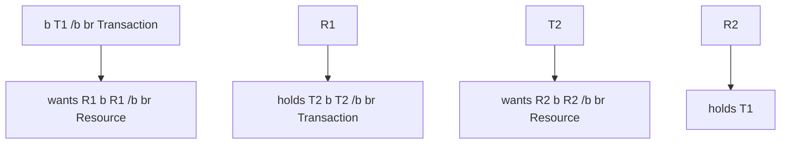

# Database Systems

## Unit 16 – Transaction Management & Database Recovery

# School of Systems & Technology - SST

Lecture 31 & 32
Mr. Maaz Waseem

# Learning Objectives

## **In this chapter you will learn:**

- Transaction Support
- Concurrency Control
- Database Recovery
- Some causes of database failure
- How to recover following database failure

2

**Transaction**  
An action, or series of actions, carried out by a single user or application program, that reads or updates the contents of the database.

<u>**Introduction**</u>: <mark>A transaction is a sequence of one or more database operations that are executed as a single unit.</mark> It has following ACID properties:

- **Atomicity**: Transactions are all-or-nothing; either all operations within the transaction succeed, or none do.
- **Consistency**: Transactions ensure that the database moves from one valid state to another, maintaining data integrity.
- **Isolation**: Transactions operate independently; changes in one transaction are not visible to others until completed.
- **Durability**: Once a transaction is committed, its changes are permanently saved in the database, even if the system crashes.

3

| Property        | What it means                                                                                                                                  | Bank transfer example ($100 from A → B)                                                                                                                                            |
| --------------- | ---------------------------------------------------------------------------------------------------------------------------------------------- | ---------------------------------------------------------------------------------------------------------------------------------------------------------------------------------- |
| **A**tomicity   | **All or nothing** Every step in a transaction must succeed. If even one step fails, the entire transaction is cancelled and undone.       | Both the debit from A and the credit to B must happen together. If the credit to B fails, the debit from A is automatically reversed. Money never disappears.                  |
| **C**onsistency | **Valid states only** A transaction must leave the database in a valid state — it cannot break any defined rules or constraints.           | The total money across both accounts must stay the same before and after. If A has $100, after transfer: A has $0 and B gains $100. The sum doesn't change.                    |
| **I**solation   | **Independent Execution** Each transaction runs as if it's the only one happening. Others can't see its in-progress changes.               | If someone checks Account A during the transfer, they won't see a halfway state. They'll see either the full old balance or the full new balance — never something in between. |
| **D**urability  | **Saved forever** Once a transaction is committed (completed), its changes are permanently saved — even if the system crashes right after. | Once the transfer is marked "successful," it stays that way. Even if the server crashes one second later, the transfer record is safe.                                         |

4

# How Transactions Share Data — Locks

**Lock:** A temporary hold a transaction places on data it is reading or writing, preventing other transactions from changing that data at the same time.

- When a transaction needs to read or update data, it first acquires a lock on that data. Other transactions must wait until the lock is released before they can access it.

- Consider a library book; while one person has it checked out (transaction in progress), no one else can borrow it. Once they return it (transaction completes), the next person can take it.

- The data being locked is called a resource — this could be an entire table, a single row, or even a single value in the database.

- Once the transaction finishes; either successfully (committed) or unsuccessfully (rolled back); the lock is released and the resource becomes available again.

5

# **Concurrency control**

The process of managing simultaneous operations on the database without having them interfere with one another.

- Concurrency control in database management systems <mark>ensures that multiple transactions can occur simultaneously</mark> without causing data inconsistency or conflicts.

- It <mark>manages the simultaneous execution of transactions</mark> in a way that maintains database integrity.

- Concurrency control systems <mark>handle deadlocks</mark>, which occur when two or more transactions wait indefinitely for each other to release locks.

<mark>For example, if Transaction A locks Resource 1 and waits for Resource 2 while Transaction B locks Resource 2 and waits for Resource 1, the system detects this and takes action, such as rolling back one of the transactions.</mark>

6

# The Need for Concurrency Control

- A major objective in developing a database is to **enable many users to access shared data concurrently**.

- Concurrent access **is relatively easy if all users are only reading data**, as there is no way that they can interfere with one another.

- However, **when two or more users are accessing the database simultaneously** and at least one is updating data, **there may be interference** that can result in inconsistencies.

- This **objective is similar to the objective of multi-user computer systems**, which allow two or more programs (or transactions) to execute at the same time.

- However, although two transactions may be perfectly correct in themselves, **the interleaving of operations in this way may produce an incorrect result**, thus compromising the integrity and consistency of the database.

7

# The Need for Concurrency Control

- **Consider a scenario:**
  Account X has **$1,000**. Two people act at the exact same moment:
- **Person A** wants to deposit $200
- **Person B** wants to deposit $300

## Without concurrency control — what goes wrong:

| Step | Person A                 | Person B                 | Account Balance |
| ---- | ------------------------ | ------------------------ | --------------- |
| 1    | Reads balance → $1,000   |                          | $1,000          |
| 2    |                          | Reads balance → $1,000   | $1,000          |
| 3    | Adds $200, writes $1,200 |                          | $1,200          |
| 4    |                          | Adds $300, writes $1,300 | $1,300          |

- **Expected balance: $1,500. Actual balance: $1,300.**
  Person A's deposit was effectively lost because Person B read the old balance before A's write was saved.

8

# **What Happens Without Concurrency Control**

- **Lost Updates:**
  - Two transactions read the same value, both make changes based on that original value, and then both write back — meaning the first write gets completely overwritten by the second. The first transaction's update is lost as if it never happened.

- **Dirty Reads:**
  - Without concurrency control, one transaction might read uncommitted changes made by another transaction. For example, if Transaction A updates a record and Transaction B reads that update before A commits, B could be using incorrect data if A rolls back.

- **Non-repeatable Reads:**
  - A transaction might read the same data twice and get different results if another transaction modifies the data in between. For instance, if Transaction A reads a customer's balance and then reads it again after Transaction B updates it, A sees inconsistent data.

9

# **What Happens Without Concurrency Control**

- **Phantom Reads:**
  - A transaction reads a set of rows matching a condition, but when it reads again the results have changed because another transaction inserted or deleted rows in between. The new or missing rows seem to appear or disappear like "phantoms". For example, if Transaction A reads all orders for a customer, then Transaction B adds a new order, A's subsequent read will see a different set of orders.

- **Deadlocks:**
  - Two or more transactions can get stuck waiting for each other to release locks. For instance, if Transaction A locks a product record and waits for a customer record while Transaction B locks the customer record and waits for the product record, neither can proceed.

10

# **Concurrency control techniques**

## **1. Lock-Based Protocols**

- **Two-Phase Locking (2PL):**
  - <mark>Definition</mark>: A concurrency control protocol where a transaction must acquire and release locks in two distinct phases. In growing phase, the transaction can only acquire locks. In shrinking phase, the transaction can only release locks. Once the first lock is released, no new locks can be obtained. Under basic 2PL, a transaction is allowed to release its locks before the entire transaction actually ends (commits or aborts).
  - <mark>Example</mark>: A transaction acquires all necessary locks without releasing any, then once all locks are acquired, it can start releasing .

- **Strict Two-Phase Locking:**
  - <mark>Definition</mark>: A stricter version of 2PL where a transaction holds all exclusive (write) locks until it ends (commits or aborts).
  - <mark>Example</mark>: Ensures that once a transaction writes data, no other transaction can read or write that data until the first transaction is completed.

- **Deadlock Detection and Prevention:**
  - <mark>Example</mark>: Using timeouts (cancelling a transaction if it has been waiting too long) or wait-for graphs (a map the system draws showing which transaction is waiting on which: if the map shows a circle, a deadlock is detected) to resolve deadlocks when two or more transactions are stuck waiting on each other's locks.

11

# 2. Timestamp-Based Protocols

In timestamp-based protocols every transaction is assigned a **timestamp number** when it starts to track its age:

- **Older transactions** are assigned smaller numbers (e.g., 100).
- **Younger transactions** are assigned larger numbers (e.g., 200).

## Basic Timestamp Ordering:

- <mark>Definition</mark>: A protocol that forces transactions to read and write data in strict order of their age. If a younger transaction modifies data first, any late-arriving older transaction is completely blocked from reading or writing that data.

- <mark>Example</mark>:
  - If an older transaction tries to READ data that a younger transaction already changed: **Abort & Restart.**
  - If an older transaction tries to WRITE data that a younger transaction already read or changed: **Abort & Restart.**

## Thomas's Write Rule:

- <mark>Definition</mark>: A specific optimization that **only applies to write operations**. It allows the database to safely ignore an older transaction's write if a younger transaction has already overwritten that same data.

- <mark>Example</mark>: If a younger transaction has already overwritten a data item, an older transaction's write to it is simply ignored and the older transaction continues.

12

# 3. **Optimistic Concurrency Control**

- **Validation-Based Protocols:**
  - <mark>Definition</mark>: This protocol assumes that conflicts between transactions are rare. Instead of locking data or checking timestamps during execution, it lets transactions do whatever they want in secret, and only checks for errors at the very end.
  - <mark>Example</mark>: A transaction reads data and saves updates locally in a private workspace. During its validation phase, if the database detects that another transaction modified that same data, this transaction is aborted and restarted. If no conflicts are found, it permanently writes the changes.

13

# 4. **Multiversion Concurrency Control (MVCC)**

In standard databases, if someone is writing to a row, readers usually have to wait. MVCC solves this by **never** **overwriting old data**. Instead, every time data is updated, a brand-new "version" of that data is created. Old versions are kept for old transactions.

- **Versioning:**
  - <mark>Definition</mark>: A method where the database maintains multiple historical copies of a data item so that read and write operations can occur at the same time without interfering.
  - <mark>Example</mark>: A read operation can access an older version of the data, while a write operation creates a new version, thus allowing concurrent access without conflicts.

- **Snapshot Isolation:**
  - <mark>Definition</mark>: An isolation technique where a transaction operates on a completely frozen "snapshot" of the database taken at the exact moment the transaction began.
  - <mark>Example</mark>: A transaction reads data from its own private snapshot. Even if other background transactions modify data and create newer versions after this transaction started, it remains completely unaffected and only sees its own frozen data timeline.

# 5. **Index-Based Concurrency Control**

- **Index Locking:**
  - <mark>Definition</mark>: A protocol where locks are placed directly onto index entries (like a book's index) rather than locking the actual data records themselves, primarily used to prevent other transactions from inserting data into a specific range.
  - <mark>Example</mark>: A transaction wants to read all employee accounts with IDs between 10 and 20. It locks the index entries for numbers 10 through 20. If another transaction tries to insert a brand-new employee with ID 15, it is forced to wait because the index path for that range is locked.

15

# Deadlock

- **Definition**: A deadlock is a situation where two or more transactions are stuck in a state of waiting for each other to release resources, and none of them can proceed.

- <mark>Deadlocks in a Database Management System (DBMS) occur when two or more transactions are unable to proceed</mark> because each is waiting for the other to release a resource (e.g., a lock on a data item).

- <mark>This creates a cycle of dependencies</mark> with no way to break free, effectively halting the involved transactions.

- <u>Examples:</u>
  - Transaction A locks Resource 1 and waits for Resource 2.
  - Transaction B locks Resource 2 and waits for Resource 1.
  - Both transactions are waiting indefinitely for each other to release the required resources, resulting in a deadlock.

16

# Conditions for Deadlock:

- <mark>Mutual Exclusion</mark>: At least one resource must be held in a non-shareable mode (only one transaction can use a resource at a time, it can't be shared).

- <mark>Hold and Wait</mark>: A transaction holds onto what it has while waiting for more resources.

- <mark>No Preemption</mark>: Resources cannot be forcibly taken from a transaction; they must be given up voluntarily.

- <mark>Circular Wait</mark>: Transactions are stuck in a closed loop, each waiting for a resource held by the next.

17

# Deadlock Detection and Resolution:

- **Deadlock Detection:**
  - The DBMS periodically checks for cycles in the resource allocation graph.
  - If a cycle is detected, it indicates a deadlock.

- **Resolution:**
  - Once a deadlock is detected, the DBMS can resolve it by aborting one or more transactions involved in the deadlock to break the cycle and release resources.

### Resource allocation graph

18

# **Deadlock Prevention Techniques:**

- <mark>Resource Ordering</mark>: A deadlock prevention technique that assigns a fixed order to all resources and requires transactions to request them in that order. This prevents circular waits and eliminates deadlocks. For example if Resource 1 and Resource 2 are needed, every transaction must request Resource 1 before Resource 2. No transaction is allowed to request Resource 2 first and then Resource 1.

- <mark>Wait-Die and Wound-Wait Schemes</mark>: Timestamp-based deadlock prevention schemes that prioritize older transactions. In **Wait-Die**, an older transaction may wait for a younger one, but a younger transaction requesting a resource held by an older one is aborted. In **Wound-Wait**, an older transaction can force a younger transaction to release its resources and restart, while younger transactions must wait for older ones.

- <mark>Timeouts</mark>: A transaction is automatically aborted if it waits too long for a resource. This prevents it from staying stuck in a deadlock indefinitely.

19

# Database Recovery

| **Database recovery** | The process of restoring the database to a correct state in the event of a failure. |
| --------------------- | ----------------------------------------------------------------------------------- |

- The <mark>storage of data generally includes four different types of media</mark> with an increasing degree of reliability: main memory, magnetic disk, magnetic tape, and optical disk.

- There are <mark>many different types of failure</mark> that can affect database processing, each of which has to be dealt with in a different manner.

- <mark>Some failures affect main memory only,</mark> while others involve nonvolatile (secondary) storage.

20

# Causes of Database Failure

- <u>System crashes</u> The computer system suddenly stops working due to hardware or operating system failures, causing data stored in main memory (RAM) to be lost.

- <u>Media failures</u> Storage devices such as hard disks, SSDs, or storage media become damaged or unreadable, causing stored data to be lost.

- <u>Application software errors</u>, such as logical errors in the application program accessing the database cause transactions to execute incorrectly or fail. For example a bug in a banking application accidentally deducts money twice from a customer's account, causing transaction failure.

- <u>Natural physical disasters</u>, such as fires, floods, earthquakes, or power failures.

- <u>Carelessness</u> or unintentional destruction of data or facilities by operators or users.

- <u>Sabotage,</u> or intentional corruption or destruction of data, hardware, or software facilities.

21

# **Recovery Facilities**

<mark>A DBMS should provide the following facilities to assist with recovery:</mark>

- **A backup mechanism** – creates regular copies of the database so data can be restored if it is lost or damaged;

- **Logging facilities** – Keep a record of all database transactions and changes made to the data;

- **Checkpoint facility** – Periodically saves the current state of the database, reducing the amount of work needed during recovery;

- **Recovery manager** – Restores the database to a correct and consistent state after a failure by using backups and log records.

22

# Database Recovery Techniques

- **Log-Based Recovery:** Records all transaction activities in a log file so that changes can be redone or undone after a failure.

- **Checkpointing:** Periodically saves the database state to reduce the amount of work needed during recovery.

- **Shadow Paging:** Before editing a page, the database keeps a photocopy (shadow page) of the original. If something goes wrong, it throws away the edited version and goes back to the photocopy.

- **Rollback Recovery:** Undoes incomplete or failed transactions to maintain database consistency.

- **Forward Recovery:** Reapplies committed transactions after restoring a backup to bring the database up to date.

- **Deferred Update:** Changes made by a transaction are kept temporary and are written permanently to the database only after the transaction commits.

- **Immediate Update:** Changes are written to the database as they occur, but enough information is stored in the log to undo them if the transaction fails. For example a salary update is written immediately. If the transaction later fails, the old salary value stored in the log is used to restore the original data.

23

# **Thankyou**

## Any Queries?

24