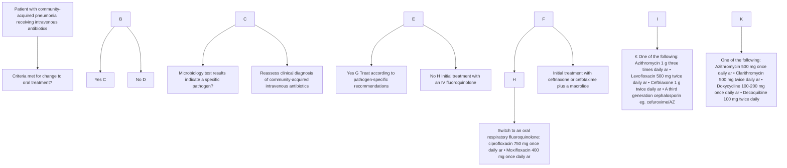
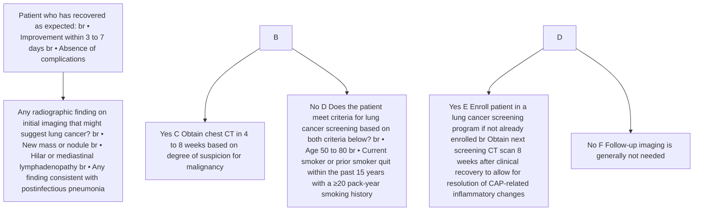
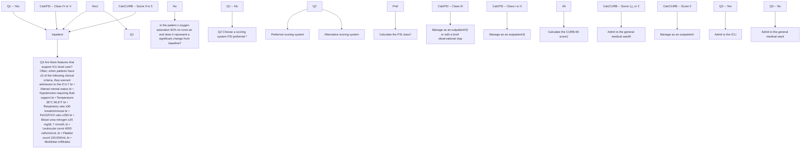
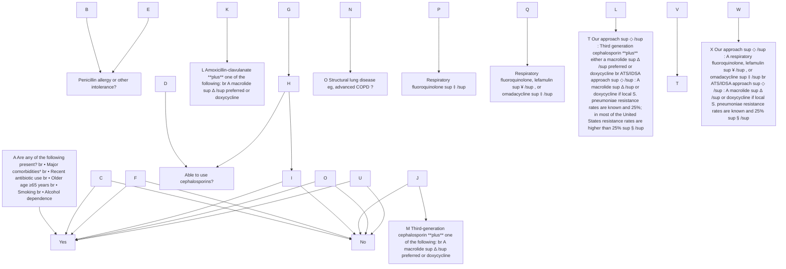
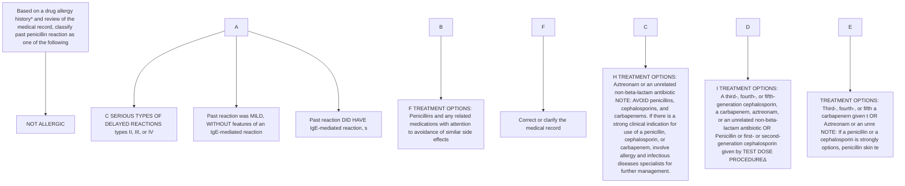
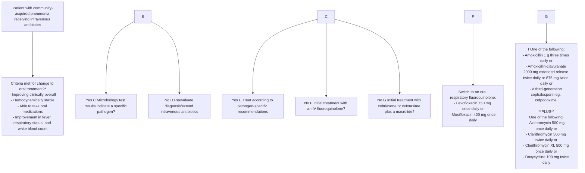

3/18/26, 5:05 PM Overview of community-acquired pneumonia in adults - UpToDate

# Overview of community-acquired pneumonia in adults

# UpToDate® Official reprint from UpToDate® www.uptodate.com © 2026 UpToDate, Inc. and/or its affiliates. All Rights Reserved.

**AUTHOR:** Julio A Ramirez, MD, FACP
**SECTION EDITOR:** Thomas M File, Jr, MD
**DEPUTY EDITORS:** Jennifer Mitty, MD, MPH, Han Li, MD, Sheila Bond, MD

All topics are updated as new evidence becomes available and our <u>peer review process</u> is complete.

Literature review current through: **Feb 2026.**
This topic last updated: **Nov 12, 2024.**

## INTRODUCTION

Community-acquired pneumonia (CAP) is a leading cause of morbidity and mortality worldwide. The clinical presentation of CAP varies, ranging from mild pneumonia characterized by fever and productive cough to severe pneumonia characterized by respiratory distress and sepsis. Because of the wide spectrum of associated clinical features, CAP is a part of the differential diagnosis of nearly all respiratory illnesses.

This topic provides a broad overview of the epidemiology, microbiology, pathogenesis, clinical features, diagnosis, and management of CAP in immunocompetent adults. Detailed discussions of each of these issues are presented separately; links to these discussions are provided within the text below.

## DEFINITIONS

Pneumonia is frequently categorized based on site of acquisition (<u>table 1</u>).

* **Community-acquired pneumonia** (CAP) refers to an acute infection of the pulmonary parenchyma acquired outside of the hospital.
* **Nosocomial pneumonia** refers to an acute infection of the pulmonary parenchyma acquired in hospital settings and encompasses both **hospital-acquired pneumonia** (HAP) and **ventilator-associated pneumonia** (VAP).
    * HAP refers to pneumonia acquired ≥48 hours after hospital admission.
    * VAP refers to pneumonia acquired ≥48 hours after endotracheal intubation.

Health care-associated pneumonia (HCAP; no longer used) referred to pneumonia acquired in health care facilities (eg, nursing homes, hemodialysis centers) or after recent hospitalization. The term HCAP was used to identify patients at risk for infection with multidrug-resistant pathogens. However, this categorization may have been overly sensitive, leading to increased, inappropriately broad antibiotic use and was thus retired. In general, patients previously classified as having HCAP should be treated similarly to those with CAP. (See <u>"Epidemiology, pathogenesis, microbiology, and diagnosis of hospital-acquired and ventilator-associated pneumonia in adults"</u>.)

## EPIDEMIOLOGY

**Incidence** — CAP is one of the most common and morbid conditions encountered in clinical practice [1-3]. In the United States, CAP accounts for over 4.5 million outpatient and emergency room visits annually, corresponding to approximately 0.4 percent of all encounters [4]. CAP is the second most common cause of hospitalization and the most common infectious cause of death [5,6]. Approximately 650 adults are hospitalized with CAP every year per 100,000 population in the United States, corresponding to 1.5 million unique CAP hospitalizations each year [7]. Nearly 9 percent of patients hospitalized with CAP will be rehospitalized due to a new episode of CAP during the same year.

### Risk factors

* **Older age** – The risk of CAP rises with age [7,8]. The annual incidence of hospitalization for CAP among adults ≥65 years old is approximately 2000 per 100,000 in the United States [7,9]. This figure is approximately three times higher than the general population and indicates that 2 percent of the older adult population will be hospitalized for CAP annually (<u>figure 1</u>).

* **Chronic comorbidities** – The comorbidity that places patients at highest risk for CAP hospitalization is chronic obstructive pulmonary disease (COPD), with an annual incidence of 5832 per 100,000 in the United States [7]. Other comorbidities associated with an increased incidence of CAP include other forms of chronic lung disease (eg, bronchiectasis, asthma), chronic heart disease (particularly congestive heart failure), stroke, diabetes mellitus, malnutrition, and immunocompromising conditions (<u>figure 2</u>) [7,10,11].

https://www.uptodate.com/contents/overview-of-community-acquired-pneumonia-in-adults/print?search=pneumonia&source=search_result&sele... 1/50

3/18/26, 5:05 PM Overview of community-acquired pneumonia in adults - UpToDate
Combinations of risk factors, such as smoking, COPD, and congestive heart failure, are additive in terms of risk [15]. These risk factors and other predisposing conditions for the development of CAP are discussed separately. (See "<u>Epidemiology, pathogenesis, and microbiology of community-acquired pneumonia in adults</u>", section on 'Predisposing host conditions'.)

- **Viral respiratory tract infection** – Viral respiratory tract infections can lead to primary viral pneumonias and also predispose to secondary bacterial pneumonia. This is most pronounced for influenza virus infection. (See "<u>Seasonal influenza in adults: Clinical manifestations and diagnosis</u>", section on 'Pneumonia'.)

- **Impaired airway protection** – Conditions that increase risk of macroaspiration of stomach contents and/or microaspiration of upper airway secretions predispose to CAP, such as alteration in consciousness (eg, due to stroke, seizure, anesthesia, drug or alcohol use) or dysphagia due to esophageal lesions or dysmotility.

- **Smoking and alcohol overuse** – Smoking, alcohol overuse (eg, >80 g/day), and opioid use are key modifiable behavioral risk factors for CAP [7,10,12,13].

- **Other lifestyle factors** – Other factors that have been associated with an increased risk of CAP include crowded living conditions (eg, prisons, homeless shelters), residence in low-income settings, and exposure to environmental toxins (eg, solvents, paints, or gasoline) [7,10,11,14].

## MICROBIOLOGY

**Common causes** — *Streptococcus pneumoniae* (pneumococcus) and respiratory viruses are the most frequently detected pathogens in patients with CAP [8,16]. However, in a large proportion of cases (up to 62 percent in some studies performed in hospital settings), no pathogen is detected despite extensive microbiologic evaluation [8,17,18].

The most commonly identified causes of CAP can be grouped into three categories:

- **Typical bacteria**
  - *S. pneumoniae* (most common bacterial cause)
  - *Haemophilus influenzae*
  - *Moraxella catarrhalis*
  - *Staphylococcus aureus*
  - Group A streptococci
  - Aerobic gram-negative bacteria (eg, Enterobacteriaceae such as *Klebsiella* spp or *Escherichia coli*)
  - Microaerophilic bacteria and anaerobes (associated with aspiration)

- **Atypical bacteria** ("atypical" refers to the intrinsic resistance of these organisms to beta-lactams and their inability to be visualized on Gram stain or cultured using traditional techniques)
  - *Legionella* spp
  - *Mycoplasma pneumoniae*
  - *Chlamydia pneumoniae*
  - *Chlamydia psittaci*
  - *Coxiella burnetii*

- **Respiratory viruses**
  - Influenza A and B viruses
  - Severe acute respiratory syndrome coronavirus 2 (SARS-CoV-2)
  - Other coronaviruses (eg, CoV-229E, CoV-NL63, CoV-OC43, CoV-HKU1)
  - Rhinoviruses
  - Parainfluenza viruses
  - Adenoviruses
  - Respiratory syncytial virus
  - Human metapneumovirus
  - Human bocaviruses

The relative prevalence of these pathogens varies with geography, pneumococcal vaccination rates, host risk factors (eg, smoking), season, and pneumonia severity (table 2

Certain epidemiologic exposures also raise the likelihood of infection with a particular pathogen (table 3

). As examples, exposure to contaminated water is a risk factor for *Legionella* infection, exposure to birds raises the possibility of *C. psittaci* infection, travel or residence in the southwestern United States should raise suspicion for coccidioidomycosis, and poor dental hygiene may predispose patients with pneumonia caused by oral flora or anaerobes. In immunocompromised patients, the spectrum of possible pathogens also broadens to

https://www.uptodate.com/contents/overview-of-community-acquired-pneumonia-in-adults/print?search=pneumonia&source=search_result&sele... 2/50

3/18/26, 5:05 PM Overview of community-acquired pneumonia in adults - UpToDate
While the list above details some of most common causes of CAP, >100 bacterial, viral, fungal, and parasitic causes have been reported. (See "Epidemiology, pathogenesis, and microbiology of community-acquired pneumonia in adults", section on 'Microbiology'.)

include fungi and parasites as well as less common bacterial and viral pathogens. (See "Epidemiology of pulmonary infections in immunocompromised patients" and "Approach to the immunocompromised patient with fever and pulmonary infiltrates".)

## **Important trends** — Both the distribution of pathogens that cause CAP and our knowledge of these pathogens are evolving. Key observations that have changed our understanding of CAP and influenced our approach to management include:

- **Decline in *S. pneumoniae* incidence** – Although *S. pneumoniae* (pneumococcus) is the most commonly detected bacterial cause of CAP in most studies, the overall incidence of pneumococcal pneumonia is decreasing. This is in part due to widespread use of pneumococcal vaccination, which results in both a decline in the individual rates of pneumococcal pneumonia and herd immunity in the population. (See "Pneumococcal pneumonia in patients requiring hospitalization", section on 'Prevalence'.)

Because pneumococcal vaccination rates vary regionally, the prevalence of *S. pneumoniae* infection also varies. As an example, *S. pneumoniae* is estimated to cause approximately 30 percent of cases of CAP in Europe but only 10 to 15 percent in the United States, where the population pneumococcal vaccination rate is higher [8].

- **The coronavirus disease 2019 (COVID-19) pandemic** – SARS-CoV-2 is an important cause of CAP and is discussed in detail elsewhere. (See "COVID-19: Epidemiology, virology, and prevention".)

- **Increased recognition of other respiratory viruses** – Respiratory viruses have been detected in approximately one-third of cases of CAP in adults when using molecular methods [8]. The extent to which respiratory viruses serve as single pathogens, cofactors in the development of bacterial CAP, or triggers for dysregulated host immune response has not been established.

- **Low overall rate of pathogen detection** – Despite extensive evaluation using molecular diagnostics and other microbiologic testing methods, a causal pathogen can be identified in only half of cases of CAP. This finding highlights that our understanding of CAP pathogenesis is incomplete. As molecular diagnostics become more advanced and use broadens, our knowledge is expected to grow.

- **Discovery of the lung microbiome** – Historically, the lung has been considered sterile. However, culture-independent techniques (ie, high throughput 16S ribosomal ribonucleic acid [rRNA] gene sequencing) have identified complex and diverse communities of microbes that reside within the alveoli [19-21]. This finding suggests that resident alveolar microbes play a role in the development of pneumonia, either by modulating the host immune response to infecting pathogens or through direct overgrowth of specific pathogens within the alveolar microbiome. (See 'Pathogenesis' below.)

## **Antimicrobial resistance** — Knowledge of antimicrobial resistance patterns and risk factors for infection with antimicrobial-resistant pathogens help inform the selection of antibiotics for empiric CAP treatment (📊 table 4).

- **S. pneumoniae** may be resistant to one or more antibiotics commonly used for the empiric treatment of CAP.

- Macrolide resistance rates vary regionally but are generally high (>25 percent) in the United States, Asia, and southern Europe. Resistance rates tend to be lower in northern Europe. (See "Resistance of Streptococcus pneumoniae to the macrolides, azalides, and lincosamides".)

- Estimates of doxycycline resistance are less certain and vary substantially worldwide. In the United States, rates tend to be less than 20 percent but may be rising. (See "Resistance of Streptococcus pneumoniae to the fluoroquinolones, doxycycline, and trimethoprim-sulfamethoxazole".)

- Beta-lactam resistance rates also vary regionally but to a lesser extent than macrolide and doxycycline resistance. In the United States, <20 percent of isolates are resistant to penicillin and <1 percent to cephalosporins. (See "Resistance of Streptococcus pneumoniae to beta-lactam antibiotics".)

- Fluoroquinolone resistance tends to be <2 percent in the United States but varies regionally and with specific risk factors such as recent antibiotic use or hospitalization. (See "Resistance of Streptococcus pneumoniae to the fluoroquinolones, doxycycline, and trimethoprim-sulfamethoxazole".)

Because resistance rates vary even at local levels, clinicians should refer to local antibiograms to guide antibiotic selection when available. General epidemiologic data can be obtained through sources such as the 🔗 OneHealthTrust (formerly the Center for Disease Dynamics, Economics & Policy [CDDEP]).

- **Methicillin-resistant S. aureus (MRSA)** is an uncommon cause of CAP. Risk factors for MRSA have two patterns: health care associated and community acquired. The strongest risk factors for MRSA pneumonia include known MRSA colonization or prior MRSA infection, particularly involving the respiratory tract. Gram-positive cocci on sputum Gram stain are also predictive of MRSA infection. Other factors that should raise suspicion for MRSA infection include recent antibiotic use (particularly receipt of intravenous antibiotics within the past three months), recent influenza-like illness, the presence of empyema, necrotizing/cavitary pneumonia, and immunosuppression (📊 table 4).

https://www.uptodate.com/contents/overview-of-community-acquired-pneumonia-in-adults/print?search=pneumonia&source=search_result&sele... 3/50

3/18/26, 5:05 PM Overview of community-acquired pneumonia in adults - UpToDate
In contrast with health care-associated MRSA, community-acquired MRSA (CA-MRSA) infections tend to occur in younger healthy persons <u>[22]</u>. Risk factors for CA-MRSA infection include a history of MRSA skin lesions, participation in contact sports, injection drug use, crowded living conditions, and men who have sex with men. (See "<u>Methicillin-resistant Staphylococcus aureus (MRSA) in adults: Epidemiology</u>".)

CAP caused by CA-MRSA can be severe and is associated with necrotizing and/or cavitary pneumonia, empyema, gross hemoptysis, septic shock, and respiratory failure. These features may be attributable to infection with toxin-producing CA-MRSA strains. In the United States, these strains tend to be methicillin resistant and belong to the USA300 clone. (See "<u>Methicillin-resistant Staphylococcus aureus (MRSA): Microbiology and laboratory detection</u>".)

- **Pseudomonas** is also an uncommon cause of CAP and tends to occur more frequently in patients with known colonization or prior infection with *Pseudomonas* spp, recent hospitalization or antibiotic use, underlying structural lung disease (eg, cystic fibrosis or advanced chronic obstructive pulmonary disease [bronchiectasis]), and immunosuppression. Antibiotic resistance is common among pseudomonal strains, and empiric therapy with more than one agent that targets *Pseudomonas* is warranted for at-risk patients with moderate to severe CAP (table 4

). (See "<u>*Pseudomonas aeruginosa pneumonia*</u>" and 'Inpatient antibiotic therapy' below.)

## PATHOGENESIS

Traditionally, CAP has been viewed as an infection of the lung parenchyma, primarily caused by bacterial or viral respiratory pathogens. In this model, respiratory pathogens are transmitted from person to person via droplets or, less commonly, via aerosol inhalation (eg, as with *Legionella* or *Coxiella* species). Following inhalation, the pathogen colonizes the nasopharynx and then reaches the lung alveoli via microaspiration. When the inoculum size is sufficient and/or host immune defenses are impaired, infection results. Replication of the pathogen, the production of virulence factors, and the host immune response lead to inflammation and damage of the lung parenchyma, resulting in pneumonia (<u>figure 3</u>).

With the identification of the lung microbiome, that model has changed <u>[19-21]</u>. While the pathogenesis of pneumonia may still involve the introduction of respiratory pathogens into the alveoli, the infecting pathogen likely has to compete with resident microbes to replicate. In addition, resident microbes may also influence or modulate the host immune response to the infecting pathogen. If this is correct, an altered alveolar microbiome (alveolar dysbiosis) may be a predisposing factor for the development of pneumonia.

In some cases, CAP might also arise from uncontrolled replication of microbes that normally reside in the alveoli. The alveolar microbiome is similar to oral flora and is primarily comprised of anaerobic bacteria (eg, *Prevotella* and *Veillonella*) and microaerophilic streptococci <u>[19-21]</u>. Hypothetically, exogenous insults such as a viral infection or smoke exposure might alter the composition of the alveolar microbiome and trigger overgrowth of certain microbes. Because organisms that compose the alveolar microbiome typically cannot be cultivated using standard cultures, this hypothesis might explain the low rate of pathogen detection among patients with CAP.

In any scenario, the host immune response to microbial replication within the alveoli plays an important role in determining disease severity. For some patients, a local inflammatory response within the lung predominates and may be sufficient for controlling infection. In others, a systemic response is necessary to control infection and to prevent spread or complications, such as bacteremia. In a minority, the systemic response can become dysregulated, leading to tissue injury, sepsis, acute respiratory distress syndrome, and/or multiorgan dysfunction.

The pathogenesis of CAP is discussed in greater detail separately. (See "<u>Epidemiology, pathogenesis, and microbiology of community-acquired pneumonia in adults</u>".)

## CLINICAL PRESENTATION

The clinical presentation of CAP varies widely, ranging from mild pneumonia characterized by fever, cough, and shortness of breath to severe pneumonia characterized by sepsis and respiratory distress. Symptom severity is directly related to the intensity of the local and systemic immune response in each patient.

- **Pulmonary signs and symptoms** – Cough (with or without sputum production), dyspnea, and pleuritic chest pain are among the most common symptoms associated with CAP. Signs of pneumonia on physical examination include tachypnea, increased work of breathing, and adventitious breath sounds, including rales/crackles and rhonchi. Tactile fremitus, egophony, and dullness to percussion also suggest pneumonia. These signs and symptoms result from the accumulation of white blood cells (WBCs), fluid, and proteins in the alveolar space. Hypoxemia can result from the subsequent impairment of alveolar gas exchange. On chest radiograph, accumulation of WBCs and fluid within the alveoli appears as pulmonary opacities (<u>image 1A-B</u>).

- **Systemic signs and symptoms** – The great majority of patients with CAP present with fever. Other systemic symptoms such as chills, fatigue, malaise, chest pain (which may be pleuritic), and anorexia are also common. Tachycardia, leukocytosis with a leftward shift, or

https://www.uptodate.com/contents/overview-of-community-acquired-pneumonia-in-adults/print?search=pneumonia&source=search_result&sele... 4/50

3/18/26, 5:05 PM
Overview of community-acquired pneumonia in adults - UpToDate

leukopenia are also findings that are mediated by the systemic inflammatory response. Inflammatory markers, such as the erythrocyte sedimentation rate (ESR), C-reactive protein (CRP), and procalcitonin may rise, though the latter is largely specific to bacterial infections. CAP is also the leading cause of sepsis; thus, the initial presentation may be characterized by hypotension, altered mental status, and other signs of organ dysfunction such as renal dysfunction, liver dysfunction, and/or thrombocytopenia [23].

Although certain signs and symptom such as fever, cough, tachycardia, and rales are common among patients with CAP, these features are ultimately nonspecific and are shared among many respiratory disorders (see <u>'Differential diagnosis'</u> below). No individual symptom or constellation of symptoms is adequate for diagnosis without chest imaging. For example, the positive predictive value of the combination of fever, tachycardia, rales, and hypoxia (oxygen saturation <95 percent) among patients with respiratory complaints presenting to primary care was <60 percent when chest radiograph was used as a reference standard [24].

Signs and symptoms of pneumonia can also be subtle in patients with advanced age and/or impaired immune systems, and a higher degree of suspicion may be needed to make the diagnosis. As examples, older patients may present with mental status changes but lack fever or leukocytosis [25]. In immunocompromised patients, pulmonary infiltrates may not be detectable on chest radiographs but can be visualized with computed tomography.

## DIAGNOSIS

**Making the diagnosis** — The diagnosis of CAP generally requires the demonstration of an infiltrate on chest imaging in a patient with a clinically compatible syndrome (eg, fever, dyspnea, cough, and sputum production) [26].

- For most patients with suspected CAP, we obtain posteroanterior and lateral chest radiographs. Radiographic findings consistent with the diagnosis of CAP include lobar consolidations (<u>image 1C</u>), interstitial infiltrates (<u>image 1D-E</u>), and/or cavitations (<u>image 2</u>). Although certain radiographic features suggest certain causes of pneumonia (eg, lobar consolidations suggest infection with typical bacterial pathogens), radiographic appearance alone cannot reliably differentiate among etiologies.

- For selected patients in whom CAP is suspected based on clinical features despite a negative chest radiograph, we obtain computed tomography (CT) of the chest. These patients include immunocompromised patients, who may not mount strong inflammatory responses and thus have negative chest radiographs, as well as patients with known exposures to epidemic pathogens that cause pneumonia (eg, *Legionella*). Because there is no direct evidence to suggest that CT scanning improves outcomes for most patients and cost is high, we do not routinely obtain CT scans when evaluating patients for CAP.

The combination of a compatible clinical syndrome and imaging findings consistent with pneumonia are sufficient to establish an initial clinical diagnosis of CAP. However, this combination of findings is nonspecific and is shared among many cardiopulmonary disorders. Thus, remaining attentive to the possibility of an alternate diagnosis as a patient's course evolves is important to care. (See <u>'Differential diagnosis'</u> below.)

**Defining severity and site of care** — For patients with a working diagnosis of CAP, the next steps in management are defining the severity of illness and determining the most appropriate site of care. Determining the severity of illness is based on clinical judgement and can be supplemented by use of severity scores (algorithm 1).

The most commonly used severity scores are the Pneumonia Severity Index (PSI) and CURB-65 [27,28]. We generally prefer the PSI, also known as the PORT score (calculator 1), because it is the most accurate and its safety and effectiveness in guiding clinical decision-making have been validated [29-32]. However, the CURB-65 score is a reasonable alternative and is preferred by many clinicians because it is easier to use (calculator 2).

The three levels of severity (mild, moderate, and severe) generally correspond to three levels of care:

- **Ambulatory care** – Most patients who are otherwise healthy with normal vital signs (apart from fever) and no concern for complication are considered to have mild pneumonia and can be managed in the ambulatory setting. These patients typically have PSI scores of I to II and CURB-65 scores of 0 (or a CURB-65 score of 1 if age >65 years).

- **Hospital admission** – Patients who have peripheral oxygen saturations <92 percent on room air (and a significant change from baseline) should be hospitalized. In addition, patients with PSI scores of ≥III and CURB-65 scores ≥1 (or CURB-65 score ≥2 if age >65 years) should also generally be hospitalized.

### Community-acquired pneumonia: Determining the appropriate site of treatment in adults

| Step | Criteria                                             | Action                                        |
| ---- | ---------------------------------------------------- | --------------------------------------------- |
| 1    | Is the patient stable?                               | Yes: Go to Step 2 No: Admit to ICU        |
| 2    | Is the patient able to eat and drink?                | Yes: Outpatient No: Go to Step 3          |
| 3    | Is the patient able to tolerate oral intake?         | Yes: Outpatient No: Admit to General Ward |
| 4    | Is the patient's oxygen saturation <92% on room air? | Yes: Admit to General Ward No: Outpatient |
| 5    | Is the patient's PSI score ≥III?                     | Yes: Admit to General Ward No: Outpatient |
| 6    | Is the patient's CURB-65 score ≥1?                   | Yes: Admit to General Ward No: Outpatient |

Algorithm 1 - larger image below

https://www.uptodate.com/contents/overview-of-community-acquired-pneumonia-in-adults/print?search=pneumonia&source=search_result&sele... 5/50

3/18/26, 5:05 PM Overview of community-acquired pneumonia in adults - UpToDate

Because patients with early signs of sepsis, rapidly progressive illness, or suspected infections with aggressive pathogens are not well represented in severity scoring systems, these patients may also warrant hospitalization in order to closely monitor the response to treatment.

Practical concerns that may warrant hospital admission include an inability to take oral medications, cognitive or functional impairment, or other social issues that could impair medication adherence or ability to return to care for clinical worsening (eg, substance use, homelessness, or residence far from a medical facility).

- **Intensive care unit (ICU) admission** – Patients who meet either of the following major criteria have severe CAP and should be admitted to the ICU [26]:
  - Respiratory failure requiring mechanical ventilation
  - Sepsis requiring vasopressor support

Recognizing these two criteria for ICU admission is relatively straightforward. The challenge is to identify patients with severe CAP who have progressed to sepsis before the development of organ failure. For these patients, early ICU admission and administration of appropriate antibiotics improve outcomes. To help identify patients with severe CAP before development of organ failure, the American Thoracic Society (ATS) and the Infectious Diseases Society of America (IDSA) suggest minor criteria [<u>1,26</u>].

The presence of three of these criteria warrants ICU admission:
- Altered mental status
- Hypotension requiring fluid support
- Temperature <36°C (96.8°F)
- Respiratory rate ≥30 breaths/minute
- Arterial oxygen tension to fraction of inspired oxygen (PaO2/FiO2) ratio ≤250
- Blood urea nitrogen (BUN) ≥20 mg/dL (7 mmol/L)
- Leukocyte count <4000 cells/microL
- Platelet count <100,000/microL
- Multilobar infiltrates

Although several other scores for identifying patients with severe CAP and/or ICU admission have been developed, we generally use the ATS/IDSA major and minor criteria because they are well validated [<u>33-35</u>].

Detailed discussion on assessing severity and determining the site of care in patients with CAP is provided separately. (See "<u>Community-acquired pneumonia in adults: Assessing severity and determining the appropriate site of care</u>"). (Related Pathway(s): <u>🔗 Community-acquired pneumonia: Determining the appropriate site of care for adults.</u>)

Triage of patients with known or suspected COVID-19 is also discussed elsewhere. (See "<u>COVID-19: Evaluation and management of adults with acute infection in the outpatient setting</u>", section on 'Clinical evaluation and triage'.)

**Microbiologic testing** — The benefit of obtaining a microbiologic diagnosis should be balanced against the time and cost associated with an extensive evaluation in each patient.

Generally, we take a tiered approach to microbiologic evaluation based on CAP severity and the site of care (<u>table 5</u>):

- **Outpatients** – For most patients with mild CAP being treated in the ambulatory setting, microbiologic testing is not needed (apart from testing for SARS-CoV-2 during the pandemic). Empiric antibiotic therapy is generally successful, and knowledge of the infecting pathogen does not usually improve outcomes.

- **Patients with moderate CAP admitted to the general medicine ward** – For most patients with moderate CAP admitted to the general medical ward, we obtain the following:
  - Blood cultures
  - Sputum Gram stain and culture
  - Urinary antigen testing for *S. pneumoniae*
  - Testing for *Legionella* spp (polymerase chain reaction [PCR] when available, urinary antigen test as an alternate)
  - SARS-CoV-2 testing

During the pandemic, we test all patients for COVID-19. During respiratory virus season (eg, late fall to early spring in the northern hemisphere), we also test for other respiratory viruses (eg, influenza, adenovirus, parainfluenza, respiratory syncytial virus, and human metapneumovirus). When testing for influenza, PCR is preferred over rapid antigen testing. (See "<u>Seasonal influenza in adults: Clinical manifestations and diagnosis</u>".)

For these patients, making a microbiologic diagnosis allows for directed therapy, which helps limit antibiotic overuse, prevent antimicrobial resistance, and reduce unnecessary complications, such as *Clostridioides difficile* infections.

https://www.uptodate.com/contents/overview-of-community-acquired-pneumonia-in-adults/print?search=pneumonia&source=search_result&sele... 6/50

3/18/26, 5:05 PM Overview of community-acquired pneumonia in adults - UpToDate
- For patients with known or probable exposures to epidemic pathogens such as *Legionella* or epidemic coronaviruses, we broaden our evaluation to include tests for these pathogens. (See "<u>Clinical evaluation and diagnostic testing for community-acquired pneumonia in adults</u>", section on 'Important pathogens'.)

- **Patients with severe CAP (including ICU admission)** – For most hospitalized patients with severe CAP, including those admitted to the ICU, we send blood cultures, sputum cultures, urinary streptococcal antigen, and *Legionella* testing. In addition, we obtain bronchoscopic specimens for microbiologic testing when feasible, weighing the benefits of obtaining a microbiologic diagnosis against the risks of the procedure (eg, need for intubation, bleeding, bronchospasm, pneumothorax) on a case-by-case basis. When pursuing bronchoscopy, we usually send specimens for aerobic culture, *Legionella* culture, fungal stain and culture, and testing for respiratory viruses.

The type of viral diagnostic tests used (eg, PCR, serology, culture) vary among institutions. In some cases, multiplex PCR panels that test for a wide array of viral and bacterial pathogens are used. While we generally favor using these tests for patients with severe pneumonia, we interpret results with caution as most multiplex assays have not been approved for use on lower respiratory tract specimens. In particular, the detection of single viral pathogen does not confirm the diagnosis of viral pneumonia because viruses can serve as cofactors in the pathogenesis of bacterial CAP or can be harbored asymptomatically.

In all cases, we modify this approach based on epidemiologic exposures, patient risk factors, and clinical features regardless of CAP severity or treatment setting (📋 table 3). As examples:

- For patients with cavitary pneumonia, we may include testing for tuberculosis, fungal pathogens, and *Nocardia*.
- For immunocompromised patients, we broaden our differential to include opportunistic pathogens such as *Pneumocystis jirovecii*, fungal pathogens, parasites, and less common viral pathogens such as cytomegalovirus. The approach to diagnostic testing varies based on the type and degree of immunosuppression and other patient-specific factors. (See "<u>Approach to the immunocompromised patient with fever and pulmonary infiltrates</u>" and "<u>Epidemiology of pulmonary infections in immunocompromised patients</u>".)

When defining the scope of our microbiologic evaluation, we also take the certainty of the diagnosis of CAP into consideration. Because a substantial portion of patients hospitalized with an initial clinical diagnosis of CAP are ultimately found to have alternate diagnoses [17], pursuing a comprehensive microbiologic evaluation can help reach the final diagnosis (eg, blood cultures obtained as part of the evaluation for CAP may help lead to a final diagnosis of endocarditis).

Detailed discussion on the microbiologic evaluation of CAP is provided separately. (See "<u>Clinical evaluation and diagnostic testing for community-acquired pneumonia in adults</u>" and "<u>Sputum cultures for the evaluation of bacterial pneumonia</u>".)

The diagnosis of COVID-19 during the pandemic is also discussed in detail elsewhere. (See "**COVID-19: Diagnosis**".)

## DIFFERENTIAL DIAGNOSIS

CAP is a common working diagnosis and is frequently on the differential diagnosis of patients presenting with a pulmonary infiltrate and cough, patients with respiratory tract infections, and patients with sepsis. (See "<u>Clinical evaluation and diagnostic testing for community-acquired pneumonia in adults</u>", section on 'Differential diagnosis'.)

Noninfectious illnesses that mimic CAP or co-occur with CAP and present with pulmonary infiltrate and cough include:

- Congestive heart failure with pulmonary edema
- Pulmonary embolism
- Pulmonary hemorrhage
- Atelectasis
- Aspiration or chemical pneumonitis
- Drug reactions
- Lung cancer
- Collagen vascular diseases
- Vasculitis
- Acute exacerbation of bronchiectasis
- Interstitial lung diseases (eg, sarcoidosis, asbestosis, hypersensitivity pneumonitis, cryptogenic organizing pneumonia)

For patients with an initial clinical diagnosis of CAP who have rapidly resolving pulmonary infiltrates, alternate diagnoses should be investigated. Pulmonary infiltrates in CAP are primarily caused by the accumulation of white blood cells (WBCs) in the alveolar space and typically take weeks to resolve. A pulmonary infiltrate that resolves in one or two days may be caused by accumulation of fluid in the alveoli (ie, pulmonary edema) or a collapse of the alveoli (ie, atelectasis) but not due to accumulation of WBCs.

Respiratory illnesses that mimic CAP or co-occur with CAP include:

- Acute exacerbations of chronic obstructive pulmonary disease
  Influenza and other respiratory viral infections

https://www.uptodate.com/contents/overview-of-community-acquired-pneumonia-in-adults/print?search=pneumonia&source=search_result&sele... 7/50

3/18/26, 5:05 PM

# Overview of community-acquired pneumonia in adults - UpToDate

- Acute bronchitis (<u>figure 4</u>)
- Asthma exacerbations

Febrile illness and/or sepsis can also be the presenting syndrome in patients with CAP; other common causes of these syndromes include urinary tract infections, intraabdominal infections, and endocarditis.

## **TREATMENT**

For most patients with CAP and excluding COVID-19, the etiology is not known at the time of diagnosis, and antibiotic treatment is empiric, targeting the most likely pathogens. The pathogens most likely to cause CAP vary with severity of illness, local epidemiology, and patient risk factors for infection with drug-resistant organisms.

As an example, for most patients with mild CAP who are otherwise healthy and treated in the ambulatory setting, the range of potential pathogens is limited. By contrast, for patients with CAP severe enough to require hospitalization, potential pathogens are more diverse, and the initial treatment regimens are often broader. (Related Pathway(s): <u>Community-acquired pneumonia: Empiric antibiotic selection for adults in the outpatient setting</u> and <u>Community-acquired pneumonia: Empiric antibiotic selection for adults admitted to a general medical ward</u> and <u>Community-acquired pneumonia: Empiric antibiotic selection for adults admitted to the intensive care unit</u>.)

The management of COVID-19 is discussed in detail elsewhere.

## **Outpatient antibiotic therapy** — For all patients with CAP, empiric regimens are designed to target *S. pneumoniae* (the most common and virulent bacterial CAP pathogen) and atypical pathogens. Coverage is expanded for outpatients with comorbidities, smoking, and recent antibiotic use to include or better treat beta-lactamase-producing *H. influenzae*, *M. catarrhalis*, and methicillin-susceptible *S. aureus*. For those with structural lung disease, we further expand coverage to include Enterobacteriaceae, such as *E. coli* and *Klebsiella* spp (<u>algorithm 2</u>).

Selection of the initial regimen depends on the adverse effect profiles of available agents, potential drug interactions, patient allergies, and other patient-specific factors.

- For most patients aged <65 years who are otherwise healthy and have not recently used antibiotics, we typically use oral <u>amoxicillin</u> (1 g three times daily) plus a macrolide (eg, <u>azithromycin</u> or <u>clarithromycin</u>) or <u>doxycycline</u>. Generally, we prefer to use a macrolide over doxycycline.

This approach differs from the American Thoracic Society (ATS)/Infectious Diseases Society of America (IDSA), which recommend monotherapy with <u>amoxicillin</u> as first line and monotherapy with either <u>doxycycline</u> or a macrolide (if local resistance rates are <25 percent [eg, not in the United States]) as alternatives for this population [26]. The rationale for each approach is discussed separately. (See "<u>Treatment of community-acquired pneumonia in adults in the outpatient setting</u>", section on 'Empiric antibiotic treatment'.)

- For patients who have major comorbidities (eg, chronic heart, lung, kidney, or liver disease, diabetes mellitus, alcohol dependence, or immunosuppression), who are smokers, and/or who have used antibiotics within the past three months, we suggest oral <u>amoxicillin-clavulanate</u> (875 mg twice daily or extended release 2 g twice daily) plus either a macrolide (preferred) or <u>doxycycline</u>.

Alternatives to amoxicillin-based regimens include combination therapy with a cephalosporin plus a macrolide or <u>doxycycline</u> or monotherapy with <u>lefamulin</u>.

- For patients who can use cephalosporins, we use a third-generation cephalosporin (eg, <u>cefpodoxime</u>) plus either a macrolide or <u>doxycycline</u>.

- For patients who cannot use any beta-lactam, we select a respiratory fluoroquinolone (eg, <u>levofloxacin</u>, <u>moxifloxacin</u>, gemifloxacin) or <u>lefamulin</u>. For those with structural lung disease, we prefer a respiratory fluoroquinolone because its spectrum of activity includes Enterobacteriaceae.

In the absence of hepatic impairment or drug interactions, <u>lefamulin</u> is a potential alternative to fluoroquinolones for most others. However, clinical experience with this agent is limited. Use should be avoided in patients with moderate to severe hepatic dysfunction, known long QT syndrome, or in those taking QT-prolonging agents, pregnant and breastfeeding women, and women with reproductive potential not using contraception. There are drug interactions with CYP3A4 and P-gp inducers and substrates; in addition, lefamulin tablets are contraindicated with QT-prolonging CYP3A4 substrates. Refer to the <u>drug interactions program</u> included within UpToDate.

<u>Omadacycline</u> is another newer agent that is active against most CAP pathogens, including Enterobacteriaceae. It is a potential alternative for patients who cannot tolerate beta-lactams (or other agents) and want to avoid fluoroquinolones. (See "<u>Treatment of community-acquired pneumonia in adults who require hospitalization</u>", section on 'New antimicrobial agents'.)

### Community-acquired pneumonia: Empiric outpatient antibiotic selection in adults

| Indication         | Drug         | Dose       | End Treatment     |
| ------------------ | ------------ | ---------- | ----------------- |
| Healthy, <65 years | Amoxicillin  | 1 g TID    | Macrolide         |
| Healthy, <65 years | Doxy         | 100 mg BID | Macrolide         |
| Comorbidities      | Amox-Clav    | 875 mg BID | Macrolide or Doxy |
| Comorbidities      | Cefpodoxime  | 200 mg BID | Macrolide or Doxy |
| Comorbidities      | Levo         | 750 mg QD  | -                 |
| Comorbidities      | Moxi         | 400 mg QD  | -                 |
| Comorbidities      | Gemi         | 400 mg QD  | -                 |
| Comorbidities      | Lefamulin    | 600 mg QD  | -                 |
| Comorbidities      | Omadacycline | 300 mg QD  | -                 |

Algorithm 2 - larger image below

3/18/26, 5:05 PM Overview of community-acquired pneumonia in adults - UpToDate
We treat most patients for five days. However, we generally ensure that all patients are improving on therapy and are afebrile for at least 48 hours before stopping antibiotics. In general, extending the treatment course beyond seven days does not add benefit. Studies supporting this approach are discussed separately. (See "<u>Treatment of community-acquired pneumonia in adults in the outpatient setting</u>", section on 'Duration of therapy'.)

Modifications to these regimens may be needed for antibiotic allergy, drug interactions, specific exposures, and other patient-specific factors. In particular, during influenza season, patients at high risk for poor outcomes from influenza may warrant antiviral therapy (<u>table 6</u>).

Detailed discussion on the treatment of CAP in the outpatient setting, including antibiotic efficacy data, is provided separately. (See "<u>Treatment of community-acquired pneumonia in adults in the outpatient setting</u>"). (Related Pathway(s): <u>Community-acquired pneumonia: Empiric antibiotic selection for adults in the outpatient setting</u>.))

## Inpatient antibiotic therapy

**General medical ward** — For patients with CAP admitted to the medical ward, empiric antibiotic regimens are designed to treat *S. aureus*, gram-negative enteric bacilli (eg, *Klebsiella pneumoniae*) in addition to typical pathogens (eg, *S. pneumoniae*, *H. influenzae*, and *M. catarrhalis*) and atypical pathogens (eg, *Legionella pneumophila*, *M. pneumoniae*, and *C. pneumoniae*).

We generally start antibiotic therapy as soon as we are confident that CAP is the appropriate working diagnosis and, ideally, within four hours of presentation. Delays in appropriate antibiotic treatment that exceed four hours have been associated with increased mortality [36].

The key factors in selecting an initial regimen for hospitalized patients with CAP are risk of infection with *Pseudomonas* and/or methicillin-resistant *S. aureus* (MRSA). The strongest risk factors for MRSA or *Pseudomonas* infection are known colonization or prior infection with these organisms, particularly from a respiratory tract specimen. Recent hospitalization (ie, within the past three months) with receipt of intravenous (IV) antibiotics is also a risk factor, particularly for pseudomonal infection. Suspicion for these pathogens should otherwise be based on local prevalence (when known), other patient-specific risk factors, and the overall clinical assessment (<u>algorithm 3</u> and <u>table 4</u>):

- For patients **without suspicion for MRSA or Pseudomonas**, we generally use one of two regimens: combination therapy with a beta-lactam plus a macrolide or monotherapy with a respiratory fluoroquinolone [26]. Because these two regimens have similar clinical efficacy, we select among them based on other factors (eg, antibiotic allergy, drug interactions). For patients who are unable to use either a macrolide or a fluoroquinolone, we use a beta-lactam plus <u>doxycycline</u>.

- For patients **with known colonization or prior infection with Pseudomonas**, recent **hospitalization with IV antibiotic use, or other strong suspicion for pseudomonal infection**, we typically use combination therapy with both an antipseudomonal beta-lactam (eg, <u>piperacillin-tazobactam</u>, <u>cefepime</u>, <u>ceftazidime</u>, <u>meropenem</u>, or <u>imipenem</u>) plus an antipseudomonal fluoroquinolone (eg, <u>ciprofloxacin</u> or <u>levofloxacin</u>). The selection of empiric regimens should also be informed by the susceptibility pattern for prior isolates.

- For patients with **known colonization or prior infection with MRSA or other strong suspicion for MRSA infection**, we add an agent with anti-MRSA activity, such as <u>vancomycin</u> or <u>linezolid</u>, to either of the above regimens. We generally prefer linezolid over vancomycin when community-acquired MRSA is suspected (eg, a young, otherwise healthy patient who plays contact sports presenting with necrotizing pneumonia) because of linezolid's ability to inhibit bacterial toxin production [37]. <u>Ceftaroline</u> is a potential alternative for the treatment of MRSA pneumonia but is not US Food and Drug Administration approved. (See "<u>Treatment of community-acquired pneumonia in adults who require hospitalization</u>", section on 'Community-acquired MRSA'.))

Modifications to initial empiric regimens may be needed for antibiotic allergy, potential drug interactions, current epidemics, specific exposures, resistance patterns of known colonizing organisms or organisms isolated during prior infections, and other patient-specific factors. In particular, antiviral treatment (eg, <u>oseltamivir</u>) should be given as soon as possible for any hospitalized patient with known or suspected influenza. (See "<u>Seasonal influenza in nonpregnant adults: Treatment</u>".))

Detailed discussion about antibiotic therapy, including use of new agents (eg, <u>lefamulin</u>, <u>omadacycline</u>) for patients hospitalized to a general medical ward is provided separately. (See "<u>Treatment of community-acquired pneumonia in adults who require hospitalization</u>".)) (Related Pathway(s): <u>Community-acquired pneumonia: Empiric antibiotic selection for adults admitted to a general medical ward</u>.))

## ICU admission

**Antibiotic selection** — For patients with CAP admitted to the intensive care unit (ICU), our approach to antibiotic selection is similar to that used for patients admitted to the general

### Community-acquired pneumonia: Empiric antibiotic selection for adults admitted to the general medical ward*

| Step | Criteria                             | Regimen                                                                                  |
| ---- | ------------------------------------ | ---------------------------------------------------------------------------------------- |
| 1    | Assess for MRSA or Pseudomonas risk  |                                                                                          |
| 2    | No suspicion for MRSA or Pseudomonas | Combination therapy: beta-lactam + macrolide OR monotherapy: respiratory fluoroquinolone |
| 3    | Suspicion for MRSA or Pseudomonas    | Adjust regimen based on specific risk factors                                            |

Algorithm 3 - larger image below

### Community-acquired pneumonia: Empiric antibiotic selection for adults admitted to the intensive care unit*

https://www.uptodate.com/contents/overview-of-community-acquired-pneumonia-in-adults/print?search=pneumonia&source=search_result&sele... 9/50

3/18/26, 5:05 PM
Overview of community-acquired pneumonia in adults - UpToDate

medical ward. However, because of the severity of illness in this population, we do not use monotherapy (algorithm 4). In addition, we start antibiotic therapy within one hour of presentation for patients who are critically ill.

The spectrum of activity of the empiric regimen should be broadened in patients with risk factors for *Pseudomonas* infection or MRSA infection (table 4).

- For most patients **without suspicion for MRSA or Pseudomonas**, we treat with a beta-lactam (eg, ceftriaxone, cefotaxime, ceftaroline, ampicillin-sulbactam, ertapenem) plus a macrolide (eg, azithromycin or clarithromycin) or a beta-lactam plus a respiratory fluoroquinolone (eg, levofloxacin or moxifloxacin) [26].

For patients with penicillin hypersensitivity reactions, we select an appropriate agent (eg, later-generation cephalosporin, carbapenem, or a beta-lactam alternative) based on the type and severity of reaction (algorithm 5). For patients who cannot use any beta-lactam (ie, penicillins, cephalosporins, and carbapenems), we typically use combination therapy with a respiratory fluoroquinolone and aztreonam.

- For patients **with known colonization or prior infection with MRSA, recent hospitalization with IV antibiotic use, or other strong suspicion for MRSA infection**, we add an agent with anti-MRSA activity, such as vancomycin or linezolid, to either of the above regimens [26].

- For patients **with known colonization or prior infection with Pseudomonas, recent hospitalization with IV antibiotic use, or other strong suspicion for pseudomonal infection**, we typically use combination therapy with both an antipseudomonal beta-lactam (eg, piperacillin-tazobactam, cefepime, ceftazidime, meropenem, or imipenem) plus an antipseudomonal fluoroquinolone (eg, ciprofloxacin or levofloxacin) for empiric treatment [26].

For patients with penicillin hypersensitivity reactions, we select an appropriate agent based on the type and severity of penicillin reaction (algorithm 5) and prior pseudomonal susceptibility testing.

Modifications to initial empiric regimens may be needed for antibiotic allergy, potential drug interactions, current epidemics, specific exposures, resistance patterns of colonizing bacteria or bacteria isolated during prior infections, and other patient-specific factors. In particular, antiviral treatment (eg, oseltamivir) should be given as soon as possible for any hospitalized patient with known or suspected influenza. (See "Seasonal influenza in nonpregnant adults: Treatment".)

Detailed discussion about antibiotic treatment for patients with CAP admitted to the ICU and patients with sepsis and/or respiratory failure are provided separately. (See "Treatment of community-acquired pneumonia in adults who require hospitalization", section on 'Intensive care unit' and "Evaluation and management of suspected sepsis and septic shock in adults".) (Related Pathway(s): :: Community-acquired pneumonia: Empiric antibiotic selection for adults admitted to the intensive care unit.)

## **Adjunctive glucocorticoids** — The role of adjunctive glucocorticoid treatment for CAP is evolving. The rationale for use is to reduce the inflammatory response to pneumonia, which may in turn reduce progression to lung injury, ARDS, and mortality. Based on randomized trials, the greatest benefit is for patients with impending respiratory failure or those requiring mechanical ventilation, particularly when glucocorticoids are given early in the course.

- For most immunocompetent patients with respiratory failure due to CAP who require invasive or non-invasive mechanical ventilation or with significant hypoxemia (ie, PaO2:FiO2 ratio <300 with an FiO2 requirement of ≥50 percent and use of either high flow nasal cannula or a nonrebreathing mask), we suggest continuous infusion of hydrocortisone 200 mg daily for 4 to 7 days followed by a taper. Because mortality benefit appears to be greatest with early initiation, hydrocortisone should ideally be started as soon as possible. The decision to taper glucocorticoids at day 4 or 7 is based on clinical response.

- Because glucocorticoid use may impair the immune control of influenza, tuberculosis, and fungal pathogens, we avoid hydrocortisone use in patients with CAP caused by these pathogens or for patients with concurrent acute viral hepatitis or active herpes viral infection, which may also be worsened with glucocorticoid use.

- For immunocompromised patients, we weigh the risks and benefits of use on an individual basis.

- While we do not treat CAP with adjunctive glucocorticoids in most other circumstances, we do not withhold glucocorticoids when they are indicated for other reasons, including:
  - Refractory septic shock (see "Corticosteroid therapy for refractory septic shock in adults")
  - Acute exacerbations of COPD (see "COPD exacerbations: Management", section on 'Glucocorticoids (inpatient)')
  - COVID-19 (see "COVID-19: Management in hospitalized adults", section on 'Dexamethasone and other glucocorticoids')

### Community-acquired pneumonia: Empiric antibiotic selection for adults admitted to the intensive care unit*

| Box 1                                                                                                                                                                                                                                                                                                                                                                                                                                             |
| ------------------------------------------------------------------------------------------------------------------------------------------------------------------------------------------------------------------------------------------------------------------------------------------------------------------------------------------------------------------------------------------------------------------------------------------------- |
| For most patients without suspicion for MRSA or Pseudomonas, we treat with a beta-lactam (eg, ceftriaxone, cefotaxime, ceftaroline, ampicillin-sulbactam, ertapenem) plus a macrolide (eg, azithromycin or clarithromycin) or a beta-lactam plus a respiratory fluoroquinolone (eg, levofloxacin or moxifloxacin) \[26].                                                                                                                          |
| For patients with known colonization or prior infection with MRSA, recent hospitalization with IV antibiotic use, or other strong suspicion for MRSA infection, we add an agent with anti-MRSA activity, such as vancomycin or linezolid, to either of the above regimens \[26].                                                                                                                                                                  |
| For patients with known colonization or prior infection with Pseudomonas, recent hospitalization with IV antibiotic use, or other strong suspicion for pseudomonal infection, we typically use combination therapy with both an antipseudomonal beta-lactam (eg, piperacillin-tazobactam, cefepime, ceftazidime, meropenem, or imipenem) plus an antipseudomonal fluoroquinolone (eg, ciprofloxacin or levofloxacin) for empiric treatment \[26]. |

Algorithm 4 - larger image below

https://www.uptodate.com/contents/overview-of-community-acquired-pneumonia-in-adults/print?search=pneumonia&source=search_result&sel... 10/50

3/18/26, 5:05 PM Overview of community-acquired pneumonia in adults - UpToDate
Additional detail on the use of glucocorticoids for CAP and review of the evidence are discussed separately. (See "<u>Treatment of community-acquired pneumonia in adults who require hospitalization</u>").

**Disposition** — Once a patient with CAP is hospitalized, further management will be dictated by the patient's response to initial empiric therapy. Clinical response should be assessed during daily rounds. While various criteria have been proposed to assess clinical response [38-40], we generally look for subjective improvement in cough, sputum production, dyspnea, and chest pain. Objectively, we assess for resolution of fever and normalization of heart rate, respiratory rate, oxygenation, and white blood cell count. Generally, patients demonstrate some clinical improvement within 48 to 72 hours (📊 table 7).

**Antibiotic de-escalation** — For patients in whom a causative pathogen has been identified, we tailor therapy to target the pathogen [<u>41</u>]. If coverage for MRSA was added empirically, and MRSA was not identified as a pathogen nor on a screening nasal swab and the patient is improving, we typically discontinue the anti-MRSA agent (eg, <u>vancomycin</u>). However, for the majority of patients hospitalized with CAP, a causative pathogen is not identified. For these patients, we continue empiric treatment for the duration of therapy, provided that the patient is improving. Intravenous antibiotic regimens can be transitioned to oral regimens with a similar spectrum activity as the patient improves (👤 algorithm 6) [<u>42,43</u>].

**Duration of therapy** — We generally determine the duration of therapy based on the patient's clinical response to therapy.

In accord with the ATS/IDSA, we do not use procalcitonin to help determine whether to start antibiotics [<u>26</u>]. However, we sometimes use procalcitonin thresholds as an adjunct to clinical judgment to help guide antibiotic discontinuation in clinically stable patients. We generally obtain a level at the time of diagnosis and repeat the level every one to two days in patients who are clinically stable. We determine the need for continued antibiotic therapy based on clinical improvement and serial procalcitonin levels (👤 algorithm 7). (See "<u>Procalcitonin use in lower respiratory tract infections</u>").

**Discharge** — Hospital discharge is appropriate when the patient is clinically stable, can take oral medication, has no other active medical problems, and has a safe environment for continued care. Patients do not need to be kept overnight for observation following the switch to oral therapy. Early discharge based on clinical stability and criteria for switching to oral therapy is encouraged to reduce risk associated with prolonged hospital stays and unnecessary cost.

**Immunocompromised patients** — The spectrum of potential pathogens expands considerably in immunocompromised patients to include invasive fungal infections, less common viral infections (eg, cytomegalovirus), and parasitic infections (eg, toxoplasmosis) [<u>44</u>].

The risk for specific infections varies with the type and degree of immunosuppression and whether the patient is taking prophylactic antimicrobials. As examples, prolonged neutropenia, T cell immunosuppression, and use of tumor necrosis factor-alpha inhibitors predispose to invasive fungal infections (eg, aspergillosis, mucormycosis) as well as mycobacterial infections. Advanced human immunodeficiency virus (HIV) infection (eg, CD4 cell count <200 cells/microL), prolonged glucocorticoid use (particularly when used with certain chemotherapeutics), and lymphopenia each should raise suspicion for pneumocystis pneumonia. Multiple infections may occur concurrently in this population, and the likelihood of disseminated infection is greater. Because signs and symptoms of infection can be subtle and nonspecific in immunocompromised patients, diagnosis can be challenging and invasive procedures are often required for microbiologic diagnosis. Broad-spectrum empiric therapy may be needed prior to obtaining a specific microbiologic diagnosis [<u>45</u>].

Because management is complex, drug interactions are common, adjustments in immunosuppressive regimens may be needed, and empiric treatment options (eg, amphotericin B) can be associated with significant toxicity, we generally involve a multidisciplinary team of specialists when caring for immunocompromised patients with pneumonia. (See "<u>Epidemiology of pulmonary infections in immunocompromised patients</u>" and "<u>Approach to the immunocompromised patient with fever and pulmonary infiltrates</u>" and "<u>Tumor necrosis factor-alpha inhibitors: Bacterial, viral, and fungal infections</u>").

## FOLLOW-UP IMAGING

https://www.uptodate.com/contents/overview-of-community-acquired-pneumonia-in-adults/print?search=pneumonia&source=search_result&sel... 11/50

3/18/26, 5:05 PM Overview of community-acquired pneumonia in adults - UpToDate
This approach is similar to that outlined by the ATS/IDSA, which recommend not obtaining a follow-up chest radiograph in patients whose symptoms have resolved within five to seven days [26]. (See "<u>Treatment of community-acquired pneumonia in adults who require hospitalization</u>", section on '<u>Follow-up chest radiograph</u>'.)

Most patients with clinical resolution after treatment do not require a follow-up chest radiograph, as radiographic response lags behind clinical response. However, follow-up clinic visits are good opportunities to review the patient's risk for lung cancer based on age, smoking history, and recent imaging findings (<u>algorithm 8</u>).

## COMPLICATIONS AND PROGNOSIS

While most patients with CAP will recover with appropriate antibiotic treatment, some will progress and/or develop complications despite appropriate therapy (ie, clinical failure) and some will remain symptomatic (ie, nonresolving pneumonia).

Algorithm 8 - larger image below

**Clinical failure** — Clear indicators of clinical failure include progression to sepsis and/or respiratory failure despite appropriate antibiotic treatment and respiratory support. Other indicators include an increase in subjective symptoms (eg, cough, dyspnea) usually in combination with objective criteria (eg, decline in oxygenation, persistent fever, or rising white blood cell). Various criteria have been proposed to define clinical failure but none widely adopted [46-48].

Reasons for clinical failure generally fall into these categories:

- **Progression of the initial infection** – For some patients, CAP can lead to overwhelming infection despite appropriate antibiotic treatment. In some, this indicates a dysregulated host immune response. In others, this may indicate that the infection has spread beyond the pulmonary parenchyma (eg, empyema, lung abscess, bacteremia, endocarditis).

Other possibilities include infection with a drug-resistant pathogen or an unusual pathogen not covered by the initial empiric antibiotic regimen. Alternatively, failure to respond to treatment may signify the presence of an immunodeficiency (eg, new diagnosis of HIV infection).

- **Development of comorbid complications** – Comorbid complications may be infectious or noninfectious. Nosocomial infections, particularly hospital-acquired pneumonia (HAP), are common causes of clinical failure. In addition to HAP, others include catheter-related bloodstream infections, urinary tract infections, and *C. difficile* infection [49].

Cardiovascular events are also common complications and include acute myocardial infarction, cardiac arrhythmias, congestive heart failure, pulmonary embolism, and stroke [50-52]. Older age, preexisting cardiovascular disease, severe pneumonia, and infection with certain pathogens (ie, *S. pneumoniae* and influenza) have each been associated with increased risk of cardiovascular events [50,53-55]. Recognition that cardiovascular events and other systemic complications can occur during the acute phase of CAP is also changing our view of CAP from an acute pulmonary process to an acute systemic disease. (See "<u>Morbidity and mortality associated with community-acquired pneumonia in adults</u>", section on 'Cardiac complications'.)

Because of these possibilities, we generally broaden our initial antibiotic regimen for patients who are progressing despite appropriate empiric treatment and evaluate for alternate diagnoses, less common or drug-resistant pathogens, and/or infectious and cardiovascular complications. (See 'Differential diagnosis' above and "<u>Morbidity and mortality associated with community-acquired pneumonia in adults</u>".)

**Nonresolving CAP** – For some patients, initial symptoms will neither progress nor improve with at least seven days of appropriate empiric antibiotic treatment. We generally characterize these patients as having nonresolving pneumonia. Potential causes of nonresolving CAP include:

- **Delayed clinical response** – For some patients, particularly those with multiple comorbidities, severe pneumonia, bacteremia, and infection with certain pathogens (eg, *S. pneumoniae*), treatment response may be slow. Eight or nine days of treatment may be needed before clinical improvement is evident.

- **Loculated infection** – Patients with complications such as lung abscess, empyema, or other closed space infections may fail to improve clinically despite appropriate antibiotic selection. Such infections may require drainage and/or prolonged antibiotic treatment. (See "<u>Lung abscess in adults</u>" and "<u>Epidemiology, clinical presentation, and diagnostic evaluation of parapneumonic effusion and empyema in adults</u>".)

- **Bronchial obstruction** – Bronchial obstruction (eg, by a tumor) can cause a postobstructive pneumonia that may fail to respond or slowly respond to standard empiric antibiotic regimens for CAP.

- **Pathogens that cause subacute/chronic CAP** – *Mycobacterium tuberculosis*, nontuberculous mycobacteria (eg, *Mycobacterium kansasii*), fungi (eg, *Histoplasma capsulatum*, *Blastomyces dermatitidis*), or less common bacteria (eg, *Nocardia* spp, *Actinomyces israelii*) can cause subacute or chronic pneumonia that may fail to respond or may incompletely respond to standard empiric antibiotic regimens for CAP.

https://www.uptodate.com/contents/overview-of-community-acquired-pneumonia-in-adults/print?search=pneumonia&source=search_result&sel... 12/50

3/18/26, 5:05 PM Overview of community-acquired pneumonia in adults - UpToDate

- **Incorrect initial diagnosis** – Failure to improve despite seven days of treatment also raises the possibility of an alternate diagnosis (eg, malignancy or inflammatory lung disease). (See <u>Differential diagnosis</u> above.)

Once a patient is characterized as having nonresolving CAP, a complete new physical examination, laboratory evaluation, imaging studies, and microbiologic workup will be necessary to define the etiology of nonresolving CAP [49]. Initiation of workup for nonresolving CAP should not be automatically associated with a change in initial empiric antibiotic therapy. (See <u>Nonresolving pneumonia</u>.)

**Long-term complications and mortality** — Although the majority of patient with CAP recover without complications, CAP is a severe illness and among the leading causes of mortality worldwide. Mortality can be directly attributable to CAP (eg, overwhelming sepsis or respiratory failure) or can result indirectly from cardiovascular events or other comorbid complications (eg, advanced chronic obstructive pulmonary disease [COPD]) [56].

Long-term complications resulting from pneumonia are increasingly recognized and there is a shift in the medical community to define pneumonia as a systemic illness that can lead to chronic disease [57]. While the precise incidence of long-term complications is not known, the more common long-term sequelae involve the respiratory tract and cardiovascular system [58].

In the United States, pneumonia (combined with influenza) is among the top 10 most common causes of death [5]. Thirty-day mortality rates vary with disease severity, ranging from less than 1 percent in ambulatory patients to approximately 20 to 25 percent in patients with severe CAP. In addition to disease severity, older age, comorbidities (eg, COPD, diabetes mellitus, cardiovascular disease), infection with certain pathogens (eg, *S. pneumoniae*), and acute cardiac complications are each associated with increased short-term mortality [50,59,60].

CAP is also associated with increased long-term mortality [7,61-63]. In one population-based study evaluating 7449 patients hospitalized with CAP, mortality rates were 6.5 percent during hospitalization, 13 percent 30 days after hospitalization, 23 percent at six months after hospitalization, and 31 percent at one year after hospitalization [7]. During the same study year, an estimated 1,581,860 patients were hospitalized in the United States. Extrapolating mortality data to these patients, the number of deaths in the United States population will be 102,821 during hospitalization, 205,642 at 30 days, 370,156 at six months, and 484,050 at one year [7]. Causes of long-term mortality are primarily related to comorbidities and include malignancy, COPD, and cardiovascular disease [56].

Data associating CAP with long-term mortality indicate that CAP is not only a common cause of acute morbidity and mortality but also a disease with important chronic health outcomes.

## PREVENTION

The primary pillars for the prevention of CAP are <u>[64-66]</u>:

- Smoking cessation (when appropriate)
- Influenza vaccination for all patients
- Pneumococcal vaccination for at-risk patients
- Vaccination against SARS-CoV-2

Each is discussed in detail separately. (See <u>"Overview of smoking cessation management in adults"</u> and <u>"Seasonal influenza vaccination in adults"</u> and <u>"Pneumococcal vaccination in adults"</u> and <u>"COVID-19: Vaccines"</u>.)

The United States Centers for Disease Control and Prevention provides online <u>clinician</u> and <u>patient</u> resources for all seasonal respiratory viral vaccinations.

## SOCIETY GUIDELINE LINKS

Links to society and government-sponsored guidelines from selected countries and regions around the world are provided separately. (See <u>"Society guideline links: Community-acquired pneumonia in adults"</u>.)

## INFORMATION FOR PATIENTS

UpToDate offers two types of patient education materials, "The Basics" and "Beyond the Basics." The Basics patient education pieces are written in plain language, at the 5th to 6th grade reading level, and they answer the four or five key questions a patient might have about a given condition. These articles are best for patients who want a general overview and who prefer short, easy-to-read materials. Beyond the Basics patient education pieces are longer, more sophisticated, and more detailed. These articles are written at the 10th to 12th grade reading level and are best for patients who want in-depth information and are comfortable with some medical jargon.

Here are the patient education articles that are relevant to this topic. We encourage you to print or email these topics to your patients. (You can also locate patient education articles on a variety of subjects by searching on "patient info" and the keyword(s) of interest.)

https://www.uptodate.com/contents/overview-of-community-acquired-pneumonia-in-adults/print?search=pneumonia&source=search_result&sel... 13/50

3/18/26, 5:05 PM Overview of community-acquired pneumonia in adults - UpToDate

- Basics topic (see "<u>Patient education: Pneumonia in adults (The Basics)</u>" and "<u>Patient education: Pneumonia in adults – Discharge instructions (The Basics)</u>")
- Beyond the Basics topic (see "<u>Patient education: Pneumonia in adults (Beyond the Basics)</u>")

# SUMMARY AND RECOMMENDATIONS

- **Background** – Community-acquired pneumonia (CAP) is a leading cause of morbidity and mortality worldwide. (See <u>'Incidence'</u> above.)
- **Risk factors** – Risk factors include age ≥65 years, chronic comorbidities, concurrent or antecedent respiratory viral infections, impaired airway protection, smoking, excess alcohol use, and other lifestyle factors (eg, crowded living conditions). (See <u>'Risk factors'</u> above.)
- **Microbiology** – The most commonly identified causes of CAP include respiratory viruses (particularly severe acute respiratory syndrome coronavirus 2 during the pandemic), typical bacteria (eg, *Streptococcus pneumoniae*, *Haemophilus influenzae*, *Moraxella catarrhalis*) and atypical bacteria (eg, *Legionella* spp, *Mycoplasma pneumoniae*, *Chlamydia pneumoniae*). *Pseudomonas* and methicillin-resistant *Staphylococcus aureus* (MRSA) are less common causes that predominantly occur in patients with specific risk factors. (See <u>'Microbiology'</u> above and <u>'Pathogenesis'</u> above.)
- **Making the diagnosis** – Diagnosis requires demonstration of an infiltrate on chest imaging in a patient with a clinically compatible syndrome (eg, fever, dyspnea, cough, and leukocytosis). For most patients, a posteroanterior and lateral chest radiograph is sufficient. Computed tomography scan is reserved for selected cases. (See <u>'Clinical presentation'</u> above and <u>'Making the diagnosis'</u> above.)
- **Alternate and concurrent diagnoses** – While the combination of a compatible clinical syndrome and an infiltrate on chest imaging are sufficient to establish an initial clinical diagnosis of CAP, these findings are nonspecific. Remaining attentive to the possibility of an alternate or concurrent diagnosis as a patient's course evolves is important to care. (See <u>'Differential diagnosis'</u> above.)
- **Determining severity of illness** – For patients with a working diagnosis of CAP, the initial steps in management are defining the severity of illness and determining the most appropriate site of care (🧑 algorithm 1). For most patients, we determine our approach to microbiologic testing based on this assessment (📊 table 5). (See <u>'Microbiologic testing'</u> above.)
- **Empiric antibiotic selection** – The selection of an empiric antibiotic regimen is based on the severity of illness, site of care, and most likely pathogens. We generally start antibiotics as soon as we are confident that CAP is the appropriate working diagnosis and, ideally, within four hours of presentation for inpatients and within one hour of presentation for those who are critically ill (see <u>'Treatment'</u> above):
  - For most outpatients, we prefer to use combination therapy with a beta-lactam and either a macrolide (preferred) or <u>doxycycline</u>. Alternatives to beta-lactam-based regimens include monotherapy with either a fluoroquinolone or, alternatively, <u>lefamulin</u> or <u>omadacycline</u> (newer agents). Selection among these agents depends on patient comorbidities, drug interactions, allergies, and other intolerances. Clinical experience with lefamulin and omadacycline are limited; warnings and contraindications exist (🧑 algorithm 2).
  
  This approach differs from the American Thoracic Society/Infectious Diseases Society of America, which recommend monotherapy with <u>amoxicillin</u> as first line and monotherapy with either <u>doxycycline</u> or a macrolide (if local resistance rates are <25 percent [eg, not in the United States]) as alternatives for this population.

- For most inpatients admitted to the general medical ward, treatment options include either intravenous (IV) combination therapy with a beta-lactam plus a macrolide or <u>doxycycline</u> or monotherapy with a respiratory fluoroquinolone (🧑 algorithm 3). These regimens should be expanded for patients with risk factors for *Pseudomonas* or MRSA (📊 table 4).
  - For most patients admitted to the intensive care unit (ICU), treatment options include IV combination therapy with a beta-lactam plus either a macrolide or a respiratory fluoroquinolone (🧑 algorithm 4). As with other hospitalized patients, regimens should be expanded for patients with risk factors for *Pseudomonas* or MRSA (📊 table 4).
- **Adjunctive glucocorticoids** – The benefit of adjunctive glucocorticoids appears greatest in patients with impending respiratory failure or requiring mechanical ventilation, particularly when they are given early in the course. Generally, we add <u>hydrocortisone</u> for most immunocompetent patients with respiratory failure due to CAP who require invasive or non-invasive mechanical ventilation or with significant hypoxemia (ie, PaO2:FIO2 ratio <300 with an FiO2 requirement of ≥50 percent and use of either high flow nasal cannula or a nonrebreathing mask), unless there are reason to avoid their use (eg, infection with certain pathogen [influenza, fungi, tuberculosis, or immunocompromise]). (See <u>Adjunctive glucocorticoids</u> above.)
- **Directed antibiotic therapy** – For patients in whom a causative pathogen has been identified, we tailor therapy to target the pathogen. (See <u>'Antibiotic de-escalation'</u> above.)
- **Duration of antibiotics** – For all patients, we treat until the patient has been afebrile and clinically stable for at least 48 hours and for a minimum of five days. Patients with mild infection generally require five to seven days of therapy; those with severe infection or chronic comorbidities generally require 7 to 10 days of therapy. (See <u>'Duration of therapy'</u> above.)

https://www.uptodate.com/contents/overview-of-community-acquired-pneumonia-in-adults/print?search=pneumonia&source=search_result&sel... 14/50

3/18/26, 5:05 PM Overview of community-acquired pneumonia in adults - UpToDate
1. Mandell LA, Wunderink RG, Anzueto A, et al. Infectious Diseases Society of America/American Thoracic Society consensus guidelines on the management of community-acquired pneumonia in adults. Clin Infect Dis 2007; 44 Suppl 2:S27.

- **Lack of response to antibiotics** – Failure to respond to antibiotic treatment within 72 hours should prompt reconsideration of the diagnosis and empiric treatment regimen as well as an assessment for complications. (See 'Clinical failure' above and <u>Nonresolving CAP</u> above.)

- **Prevention** – Key preventive measures include smoking cessation (when appropriate), influenza vaccination for the general population, and pneumococcal vaccination for at-risk populations. (See 'Prevention' above.)

## ACKNOWLEDGMENT

UpToDate gratefully acknowledges John G Bartlett, MD, who contributed as Section Editor on earlier versions of this topic and was a founding Editor-in-Chief for UpToDate in Infectious Diseases.

Use of UpToDate is subject to the <u>Terms of Use</u>.

## REFERENCES

2. File TM. Community-acquired pneumonia. Lancet 2003; 362:1991.

3. Musher DM, Thorner AR. Community-acquired pneumonia. N Engl J Med 2014; 371:1619.

4. National Ambulatory Medical Care Survey (NAMCS) and National Hospital Ambulatory Medical Care Survey (NHAMCS) 2009 - 2010. http://www.cdc.gov/nchs/data/ahcd/combined_tables/2009-2010_combined_web_table01.pdf (Accessed on June 06, 2018).

5. Xu J, Murphy SL, Kochanek KD, Bastian BA. Deaths: Final Data for 2013. Natl Vital Stat Rep 2016; 64:1.

6. Pfuntner A, Wier LM, Stocks C. Most Frequent Conditions in U.S. Hospitals, 2011. HCUP Statistical Brief #162, Agency for Healthcare Research and Quality, Rockville, MD, September 2013.

7. Ramirez JA, Wiemken TL, Peyrani P, et al. Adults Hospitalized With Pneumonia in the United States: Incidence, Epidemiology, and Mortality. Clin Infect Dis 2017; 65:1806.

8. Jain S, Self WH, Wunderink RG, et al. Community-Acquired Pneumonia Requiring Hospitalization among U.S. Adults. N Engl J Med 2015; 373:415.

9. Griffin MR, Zhu Y, Moore MR, et al. U.S. hospitalizations for pneumonia after a decade of pneumococcal vaccination. N Engl J Med 2013; 369:155.

10. Almirall J, Bolíbar I, Balanzó X, González CA. Risk factors for community-acquired pneumonia in adults: a population-based case-control study. Eur Respir J 1999; 13:349.

11. Torres A, Peetermans WE, Viegi G, Blasi F. Risk factors for community-acquired pneumonia in adults in Europe: a literature review. Thorax 2013; 68:1057.

12. Bello S, Menéndez R, Antoni T, et al. Tobacco smoking increases the risk for death from pneumococcal pneumonia. Chest 2014; 146:1029.

13. Wiese AD, Griffin MR, Schaffner W, et al. Opioid Analgesic Use and Risk for Invasive Pneumococcal Diseases: A Nested Case-Control Study. Ann Intern Med 2018; 168:396.

14. Bain MR, Chalmers JW, Brewster DH. Routinely collected data in national and regional databases--an under-used resource. J Public Health Med 1997; 19:413.

15. Curcio D, Cané A, Isturiz R. Redefining risk categories for pneumococcal disease in adults: critical analysis of the evidence. Int J Infect Dis 2015; 37:30.

16. Johansson N, Kalin M, Tiveljung-Lindell A, et al. Etiology of community-acquired pneumonia: increased microbiological yield with new diagnostic methods. Clin Infect Dis 2010; 50:202.

17. Musher DM, Roig IL, Cazares G, et al. Can an etiologic agent be identified in adults who are hospitalized for community-acquired pneumonia: results of a one-year study. J Infect 2013; 67:11.

18. Musher DM, Abers MS, Bartlett JG. Evolving Understanding of the Causes of Pneumonia in Adults, With Special Attention to the Role of Pneumococcus. Clin Infect Dis 2017; 65:1736.

19. Dickson RP, Erb-Downward JR, Martinez FJ, Huffnagle GB. The Microbiome and the Respiratory Tract. Annu Rev Physiol 2016; 78:481.

20. Dickson RP, Erb-Downward JR, Huffnagle GB. Towards an ecology of the lung: new conceptual models of pulmonary microbiology and pneumonia pathogenesis. Lancet Respir Med 2014; 2:238.

21. Faner R, Sibila O, Agustí A, et al. The microbiome in respiratory medicine: current challenges and future perspectives. Eur Respir J 2017; 49.

https://www.uptodate.com/contents/overview-of-community-acquired-pneumonia-in-adults/print?search=pneumonia&source=search_result&sel... 15/50

3/18/26, 5:05 PM Overview of community-acquired pneumonia in adults - UpToDate

22. Francis JS, Doherty MC, Lopatin U, et al. Severe community-onset pneumonia in healthy adults caused by methicillin-resistant Staphylococcus aureus carrying the Panton-Valentine leukocidin genes. Clin Infect Dis 2005; 40:100.

23. Annane D, Renault A, Brun-Buisson C, et al. Hydrocortisone plus Fludrocortisone for Adults with Septic Shock. N Engl J Med 2018; 378:809.

24. Moore M, Stuart B, Little P, et al. Predictors of pneumonia in lower respiratory tract infections: 3C prospective cough complication cohort study. Eur Respir J 2017; 50.

25. Waterer GW, Kessler LA, Wunderink RG. Delayed administration of antibiotics and atypical presentation in community-acquired pneumonia. Chest 2006; 130:11.

26. Metlay JP, Waterer GW, Long AC, et al. Diagnosis and Treatment of Adults with Community-acquired Pneumonia. An Official Clinical Practice Guideline of the American Thoracic Society and Infectious Diseases Society of America. Am J Respir Crit Care Med 2019; 200:e45.

27. Fine MJ, Auble TE, Yealy DM, et al. A prediction rule to identify low-risk patients with community-acquired pneumonia. N Engl J Med 1997; 336:243.

28. Lim WS, van der Eerden MM, Laing R, et al. Defining community acquired pneumonia severity on presentation to hospital: an international derivation and validation study. Thorax 2003; 58:377.

29. Marrie TJ, Lau CY, Wheeler SL, et al. A controlled trial of a critical pathway for treatment of community-acquired pneumonia. CAPITAL Study Investigators. Community-Acquired Pneumonia Intervention Trial Assessing Levofloxacin. JAMA 2000; 283:749.

30. Yealy DM, Auble TE, Stone RA, et al. Effect of increasing the intensity of implementing pneumonia guidelines: a randomized, controlled trial. Ann Intern Med 2005; 143:881.

31. Carratalà J, Fernández-Sabé N, Ortega L, et al. Outpatient care compared with hospitalization for community-acquired pneumonia: a randomized trial in low-risk patients. Ann Intern Med 2005; 142:165.

32. Labarere J, Stone RA, Scott Obrosky D, et al. Factors associated with the hospitalization of low-risk patients with community-acquired pneumonia in a cluster-randomized trial. J Gen Intern Med 2006; 21:745.

33. Liapikou A, Ferrer M, Polverino E, et al. Severe community-acquired pneumonia: validation of the Infectious Diseases Society of America/American Thoracic Society guidelines to predict an intensive care unit admission. Clin Infect Dis 2009; 48:377.

34. Mandell LA. Severe community-acquired pneumonia (CAP) and the Infectious Diseases Society of America/American Thoracic Society CAP guidelines prediction rule: validated or not. Clin Infect Dis 2009; 48:386.

35. Chalmers JD, Taylor JK, Mandal P, et al. Validation of the Infectious Diseases Society of America/American Thoracic Society minor criteria for intensive care unit admission in community-acquired pneumonia patients without major criteria or contraindications to intensive care unit care. Clin Infect Dis 2011; 53:503.

36. Lim WS, Woodhead M, British Thoracic Society. British Thoracic Society adult community acquired pneumonia audit 2009/10. Thorax 2011; 66:548.

37. Wunderink RG, Niederman MS, Kollef MH, et al. Linezolid in methicillin-resistant Staphylococcus aureus nosocomial pneumonia: a randomized, controlled study. Clin Infect Dis 2012; 54:621.

38. Aliberti S, Zanaboni AM, Wiemken T, et al. Criteria for clinical stability in hospitalised patients with community-acquired pneumonia. Eur Respir J 2013; 42:742.

39. Halm EA, Fine MJ, Marrie TJ, et al. Time to clinical stability in patients hospitalized with community-acquired pneumonia: implications for practice guidelines. JAMA 1998; 279:1452.

40. Menéndez R, Torres A, Rodríguez de Castro F, et al. Reaching stability in community-acquired pneumonia: the effects of the severity of disease, treatment, and the characteristics of patients. Clin Infect Dis 2004; 39:1783.

41. van der Eerden MM, Vlaspolder F, de Graaff CS, et al. Comparison between pathogen directed antibiotic treatment and empirical broad spectrum antibiotic treatment in patients with community acquired pneumonia: a prospective randomised study. Thorax 2005; 60:672.

42. Ramirez JA, Srinath L, Ahkee S, et al. Early switch from intravenous to oral cephalosporins in the treatment of hospitalized patients with community-acquired pneumonia. Arch Intern Med 1995; 155:1273.

43. Ramirez JA, Vargas S, Ritter GW, et al. Early switch from intravenous to oral antibiotics and early hospital discharge: a prospective observational study of 200 consecutive patients with community-acquired pneumonia. Arch Intern Med 1999; 159:2449.

44. Di Pasquale MF, Sotgiu G, Gramegna A, et al. Prevalence and Etiology of Community-acquired Pneumonia in Immunocompromised Patients. Clin Infect Dis 2019; 68:1482.

45. Ramirez JA, Musher DM, Evans SE, et al. Treatment of Community-Acquired Pneumonia in Immunocompromised Adults: A Consensus Statement Regarding Initial Strategies. Chest 2020; 158:1896.

46. Menéndez R, Torres A, Zalacain R, et al. Risk factors of treatment failure in community acquired pneumonia: implications for disease outcome. Thorax 2004; 59:960.

47. Aliberti S, Amir A, Peyrani P, et al. Incidence, etiology, timing, and risk factors for clinical failure in hospitalized patients with community-acquired pneumonia. Chest 2008; 134:955.

https://www.uptodate.com/contents/overview-of-community-acquired-pneumonia-in-adults/print?search=pneumonia&source=search_result&sel... 16/50

3/18/26, 5:05 PM Overview of community-acquired pneumonia in adults - UpToDate

48. Rosón B, Carratalà J, Fernández-Sabé N, et al. Causes and factors associated with early failure in hospitalized patients with community-acquired pneumonia. Arch Intern Med 2004; 164:502.

49. Arancibia F, Ewig S, Martinez JA, et al. Antimicrobial treatment failures in patients with community-acquired pneumonia: causes and prognostic implications. Am J Respir Crit Care Med 2000; 162:154.

50. Violi F, Cangemi R, Falcone M, et al. Cardiovascular Complications and Short-term Mortality Risk in Community-Acquired Pneumonia. Clin Infect Dis 2017; 64:1486.

51. Eurich DT, Marrie TJ, Minhas-Sandhu JK, Majumdar SR. Risk of heart failure after community acquired pneumonia: prospective controlled study with 10 years of follow-up. BMJ 2017; 356:j413.

52. Ramirez J, Aliberti S, Mirsaedi M, et al. Acute myocardial infarction in hospitalized patients with community-acquired pneumonia. Clin Infect Dis 2008; 47:182.

53. Perry TW, Pugh MJ, Waterer GW, et al. Incidence of cardiovascular events after hospital admission for pneumonia. Am J Med 2011; 124:244.

54. Warren-Gash C, Blackburn R, Whitaker H, et al. Laboratory-confirmed respiratory infections as triggers for acute myocardial infarction and stroke: a self-controlled case series analysis of national linked datasets from Scotland. Eur Respir J 2018; 51.

55. Viasus D, Garcia-Vidal C, Manresa F, et al. Risk stratification and prognosis of acute cardiac events in hospitalized adults with community-acquired pneumonia. J Infect 2013; 66:27.

56. Bruns AH, Oosterheert JJ, Cucciolillo MC, et al. Cause-specific long-term mortality rates in patients recovered from community-acquired pneumonia as compared with the general Dutch population. Clin Microbiol Infect 2011; 17:763.

57. Dela Cruz CS, Wunderink RG, Christiani DC, et al. Future Research Directions in Pneumonia. NHLBI Working Group Report. Am J Respir Crit Care Med 2018; 198:256.

58. Corrales-Medina VF, Alvarez KN, Weissfeld LA, et al. Association between hospitalization for pneumonia and subsequent risk of cardiovascular disease. JAMA 2015; 313:264.

59. Fine MJ, Smith MA, Carson CA, et al. Prognosis and outcomes of patients with community-acquired pneumonia. A meta-analysis. JAMA 1996; 275:134.

60. Lepper PM, Ott S, Nüesch E, et al. Serum glucose levels for predicting death in patients admitted to hospital for community acquired pneumonia: prospective cohort study. BMJ 2012; 344:e3397.

61. Peyrani P, Ramirez JA. One-year mortality in patients with community-acquired pneumonia. Univ Louisville J Respir Infect 2017; 1.

62. Eurich DT, Marrie TJ, Minhas-Sandhu JK, Majumdar SR. Ten-Year Mortality after Community-acquired Pneumonia. A Prospective Cohort. Am J Respir Crit Care Med 2015; 192:597.

63. Mortensen EM, Kapoor WN, Chang CC, Fine MJ. Assessment of mortality after long-term follow-up of patients with community-acquired pneumonia. Clin Infect Dis 2003; 37:1617.

64. Groshkopf LA, Sokolow LZ, Broder KR, et al. Prevention and Control of Seasonal Influenza With Vaccines: Recommendations of the Advisory Committee on Immunization Practices-United States, 2017-18 Influenza Season. Am J Transplant 2017; 17:2970.

65. Tomczyk S, Bennett NM, Stoecker C, et al. Use of 13-valent pneumococcal conjugate vaccine and 23-valent pneumococcal polysaccharide vaccine among adults aged ≥65 years: recommendations of the Advisory Committee on Immunization Practices (ACIP). MMWR Morb Mortal Wkly Rep 2014; 63:822.

66. Centers for Disease Control and Prevention (CDC). Use of 13-valent pneumococcal conjugate vaccine and 23-valent pneumococcal polysaccharide vaccine for adults with immunocompromising conditions: recommendations of the Advisory Committee on Immunization Practices (ACIP). MMWR Morb Mortal Wkly Rep 2012; 61:816.

Topic 117561 Version 43.0

https://www.uptodate.com/contents/overview-of-community-acquired-pneumonia-in-adults/print?search=pneumonia&source=search_result&sel... 17/50

3/18/26, 5:05 PM Overview of community-acquired pneumonia in adults - UpToDate

# GRAPHICS

## Table 1: Pneumonia terminology

| Term                                               | Definition                                                                                                                                                                                                                                  |
| -------------------------------------------------- | ------------------------------------------------------------------------------------------------------------------------------------------------------------------------------------------------------------------------------------------- |
| **Classification by site of acquisition**          |                                                                                                                                                                                                                                             |
| Community-acquired pneumonia (CAP)                 | An acute infection of the pulmonary parenchyma acquired outside of health care settings                                                                                                                                                     |
| Nosocomial pneumonia                               | An acute infection of the pulmonary parenchyma acquired in hospital settings, which encompasses hospital-acquired pneumonia and ventilator-associated pneumonia                                                                             |
| Hospital-acquired pneumonia (HAP)                  | Pneumonia acquired ≥48 hours after hospital admission; includes both HAP and VAP                                                                                                                                                            |
| Ventilator-associated pneumonia (VAP)              | Pneumonia acquired ≥48 hours after endotracheal intubation                                                                                                                                                                                  |
| Non-ventilated hospital-acquired pneumonia (nvHAP) | Pneumonia that develops in hospitalized patients who are not on mechanical ventilation nor underwent extubation within 48 hours before pneumonia developed                                                                                  |
| Health care-associated pneumonia (HCAP)            | Retired term, which referred to pneumonia acquired in health care facilities (eg, nursing homes, hemodialysis centers) or after recent hospitalization\*                                                                                    |
| **Classification by etiology**                     |                                                                                                                                                                                                                                             |
| Atypical pneumonia                                 | Pneumonia caused by "atypical"‡ pathogens including *Legionella* spp, *Mycoplasma pneumoniae*, *Chlamydia pneumoniae*, *Chlamydia psittaci*, *Coxiella burnetii*                                                                            |
| Aspiration pneumonia                               | Pneumonia resulting from entry of gastric or oropharyngeal fluid, which may contain bacteria and/or exogenous substances (eg, ingested food particles or liquids, mineral oil, salt or fresh water) or be of low pH, into the lower airways |
| Chemical pneumonitis                               | Aspiration of substances (eg, acidic gastric fluid) that cause an inflammatory reaction in the lower airways, independent of bacterial infection                                                                                            |
| Bacterial aspiration pneumonia                     | An active infection caused by inoculation of large amounts of bacteria into the lungs via orogastric contents                                                                                                                               |

* The term HCAP was used to identify patients at risk for infection with multidrug-resistant pathogens. This categorization may have been overly sensitive, leading to increased, inappropriately broad antibiotic use.

‡ The origin of the term "atypical" is a matter of debate. The term may refer to the fact that these organisms are not "typical" bacteria (eg, *Streptococcus pneumoniae*), which can be identified by standard microbiologic techniques. Others suggest that atypical refers to the mild nature of the pneumonia caused by some of these organisms compared with pneumonia caused by *S. pneumoniae*.

Graphic 130821 Version 6.0

https://www.uptodate.com/contents/overview-of-community-acquired-pneumonia-in-adults/print?search=pneumonia&source=search_result&sel... 18/50

3/18/26, 5:05 PM Overview of community-acquired pneumonia in adults - UpToDate

# Figure 1: The impact of age on the incidence of patients hospitalized with community-acquired pneumonia in the United States

| Age            | Rate per 100,000 adults |
| -------------- | ----------------------- |
| 18 to 24 years | 69                      |
| 25 to 34 years | 123                     |
| 35 to 44 years | 228                     |
| 45 to 54 years | 376                     |
| 55 to 59 years | 715                     |
| 60 to 64 years | 898                     |
| 65 to 74 years | 1507                    |
| 75 to 84 years | 2205                    |
| ≥85 years      | 3951                    |

*Reproduced from: Ramirez JA, Wiemken TL, Peyrani P, et al. Adults hospitalized with pneumonia in the United States: Incidence, epidemiology, and mortality. Clin Infect Dis 2017; 65(11):1806-1812. By permission of Oxford University Press on behalf of the Infectious Diseases Society of America. Copyright © 2017.*

Graphic 118032 Version 14.0

https://www.uptodate.com/contents/overview-of-community-acquired-pneumonia-in-adults/print?search=pneumonia&source=search_result&sel... 19/50

3/18/26, 5:05 PM Overview of community-acquired pneumonia in adults - UpToDate

# Figure 2: The impact of comorbid conditions on the incidence of patients hospitalized with community-acquired pneumonia in the United States

| Conditions     | Rate per 100,000 adults |
| -------------- | ----------------------- |
| Overall        | 634                     |
| Obese          | 674                     |
| Current smoker | 822                     |
| Diabetes       | 1808                    |
| Stroke         | 2034                    |
| CHF            | 3456                    |
| COPD           | 5832                    |

CHF: congestive heart failure; COPD: chronic obstructive pulmonary disease.

*Reproduced from: Ramirez JA, Wiemken TL, Peyrani P, et al. Adults hospitalized with pneumonia in the United States: Incidence, epidemiology, and mortality. Clin Infect Dis 2017; 65(11):1806-1812. By permission of Oxford University Press on behalf of the Infectious Diseases Society of America. Copyright © 2017.*

Graphic 118033 Version 13.0

https://www.uptodate.com/contents/overview-of-community-acquired-pneumonia-in-adults/print?search=pneumonia&source=search_result&sel... 20/50

3/18/26, 5:05 PM
Overview of community-acquired pneumonia in adults - UpToDate

# Table 2: Microbial etiology of community-acquired pneumonia by site of care*

|                                             | Outpatients Spain\[1]                                                                                                                                                                                                                                                                                                                       | Outpatients Canada\[2]                                                         | Ward patients Spain\[1]                                                                                                                                                                                                                                                                                                                     | Ward patients United States\[3]                                                                                                                      | Intensive care unit patients Spain\[1]                                                                                                                                                                                                                                                                                                      | Intensive care unit patients United States\[3]                                                                                                               |
| ------------------------------------------- | ----------------------------------------------------------------------------------------------------------------------------------------------------------------------------------------------------------------------------------------------------------------------------------------------------------------------------------------------- | ---------------------------------------------------------------------------------- | ----------------------------------------------------------------------------------------------------------------------------------------------------------------------------------------------------------------------------------------------------------------------------------------------------------------------------------------------- | -------------------------------------------------------------------------------------------------------------------------------------------------------- | ----------------------------------------------------------------------------------------------------------------------------------------------------------------------------------------------------------------------------------------------------------------------------------------------------------------------------------------------- | ---------------------------------------------------------------------------------------------------------------------------------------------------------------- |
| Total patients evaluated                    | 514                                                                                                                                                                                                                                                                                                                                             | 507                                                                                | 2521                                                                                                                                                                                                                                                                                                                                            | 585                                                                                                                                                      | 488                                                                                                                                                                                                                                                                                                                                             | 145                                                                                                                                                              |
| Patients in whom a pathogen was identified  | 161 (31.3)                                                                                                                                                                                                                                                                                                                                      | 244 (48.1)                                                                         | 1042 (41)                                                                                                                                                                                                                                                                                                                                       | 120 (21)                                                                                                                                                 | 260 (53)                                                                                                                                                                                                                                                                                                                                        | 57 (39)                                                                                                                                                          |
| Patients in whom no pathogen was identified | 353 (68.7)                                                                                                                                                                                                                                                                                                                                      | 263 (51.9)                                                                         | 1479 (59)                                                                                                                                                                                                                                                                                                                                       | 465 (79)                                                                                                                                                 | 228 (47)                                                                                                                                                                                                                                                                                                                                        | 88 (61)                                                                                                                                                          |
| **Pathogen†**                               |                                                                                                                                                                                                                                                                                                                                                 |                                                                                    |                                                                                                                                                                                                                                                                                                                                                 |                                                                                                                                                          |                                                                                                                                                                                                                                                                                                                                                 |                                                                                                                                                                  |
| *Streptococcus pneumoniae*                  | 56 (10.9)                                                                                                                                                                                                                                                                                                                                       | 30 (5.9)                                                                           | 447 (17.7)                                                                                                                                                                                                                                                                                                                                      | 38 (6.5)                                                                                                                                                 | 110 (22.5)                                                                                                                                                                                                                                                                                                                                      | 22 (15.2)                                                                                                                                                        |
| Other *Streptococcus* spp                   | 0                                                                                                                                                                                                                                                                                                                                               | 5 (1.0)                                                                            | 0                                                                                                                                                                                                                                                                                                                                               | 0                                                                                                                                                        | 0                                                                                                                                                                                                                                                                                                                                               | 0                                                                                                                                                                |
| *Haemophilus influenzae*                    | 8 (1.6)                                                                                                                                                                                                                                                                                                                                         | 25 (4.9)                                                                           | 54 (2.1)                                                                                                                                                                                                                                                                                                                                        | 16 (2.7)                                                                                                                                                 | 8 (1.6)                                                                                                                                                                                                                                                                                                                                         | 3 (2.1)                                                                                                                                                          |
| *Haemophilus parainfluenzae*                | 0                                                                                                                                                                                                                                                                                                                                               | 10 (2.0)                                                                           | 0                                                                                                                                                                                                                                                                                                                                               | 0                                                                                                                                                        | 0                                                                                                                                                                                                                                                                                                                                               | 0                                                                                                                                                                |
| *Moraxella catarrhalis*                     | 0                                                                                                                                                                                                                                                                                                                                               | 6 (1.2)                                                                            | 4 (0.2)                                                                                                                                                                                                                                                                                                                                         | 0                                                                                                                                                        | 1 (0.2)                                                                                                                                                                                                                                                                                                                                         | 0                                                                                                                                                                |
| *Legionella pneumophila*                    | 10 (1.9)                                                                                                                                                                                                                                                                                                                                        | Δ                                                                                  | 87 (3.5)                                                                                                                                                                                                                                                                                                                                        | ◇                                                                                                                                                        | 21 (4.3)                                                                                                                                                                                                                                                                                                                                        | ◇                                                                                                                                                                |
| *Mycoplasma pneumoniae*                     | 27 (5.3)§                                                                                                                                                                                                                                                                                                                                       | 87 (17.2)§                                                                         | 32 (1.3)§                                                                                                                                                                                                                                                                                                                                       | ¥                                                                                                                                                        | 6 (1.2)§                                                                                                                                                                                                                                                                                                                                        | ¥                                                                                                                                                                |
| *Chlamydia pneumoniae*                      | 10 (1.9)§                                                                                                                                                                                                                                                                                                                                       | 72 (14.2)§                                                                         | 32 (1.3)§                                                                                                                                                                                                                                                                                                                                       | ¥                                                                                                                                                        | 8 (1.6)§                                                                                                                                                                                                                                                                                                                                        | ¥                                                                                                                                                                |
| *Coxiella burnetii*                         | 11 (2.1)§                                                                                                                                                                                                                                                                                                                                       | Δ                                                                                  | 17 (0.7)§                                                                                                                                                                                                                                                                                                                                       | ¥                                                                                                                                                        | 2 (0.4)§                                                                                                                                                                                                                                                                                                                                        | ¥                                                                                                                                                                |
| *Staphylococcus aureus*                     | 1 (0.2)                                                                                                                                                                                                                                                                                                                                         | 6 (1.2)                                                                            | 18 (0.7)                                                                                                                                                                                                                                                                                                                                        | 25 (4.3)                                                                                                                                                 | 6 (1.2)                                                                                                                                                                                                                                                                                                                                         | 12 (8.3)                                                                                                                                                         |
| MSSA                                        | 1 (0.2)                                                                                                                                                                                                                                                                                                                                         | NR                                                                                 | 9 (0.4)                                                                                                                                                                                                                                                                                                                                         | 18 (3.1)                                                                                                                                                 | 4 (0.8)                                                                                                                                                                                                                                                                                                                                         | 9 (6.2)                                                                                                                                                          |
| MRSA                                        | 0                                                                                                                                                                                                                                                                                                                                               | NR                                                                                 | 9 (0.4)                                                                                                                                                                                                                                                                                                                                         | 7 (1.2)                                                                                                                                                  | 2 (0.4)                                                                                                                                                                                                                                                                                                                                         | 3 (2.1)                                                                                                                                                          |
| Gram-negative enteric bacilli               | 1 (0.2)                                                                                                                                                                                                                                                                                                                                         | 2 (0.4)                                                                            | 23 (0.9)                                                                                                                                                                                                                                                                                                                                        | 15 (2.6)                                                                                                                                                 | 3 (0.6)                                                                                                                                                                                                                                                                                                                                         | 4 (2.8)                                                                                                                                                          |
| *Pseudomonas aeruginosa*                    | 1 (0.2)                                                                                                                                                                                                                                                                                                                                         | 1 (0.2)                                                                            | 37 (1.5)                                                                                                                                                                                                                                                                                                                                        | 12 (2.1)                                                                                                                                                 | 12 (2.5)                                                                                                                                                                                                                                                                                                                                        | 8 (5.5)                                                                                                                                                          |
| Respiratory viruses†                        | 15 (2.9)§                                                                                                                                                                                                                                                                                                                                       | †                                                                                  | 123 (4.9)§                                                                                                                                                                                                                                                                                                                                      | †                                                                                                                                                        | 10 (2.0)§                                                                                                                                                                                                                                                                                                                                       | †                                                                                                                                                                |
| Other pathogen                              | 6 (1.2)                                                                                                                                                                                                                                                                                                                                         | 14 (2.8)                                                                           | 33 (1.3)                                                                                                                                                                                                                                                                                                                                        | 8 (1.4)                                                                                                                                                  | 15 (3.1)                                                                                                                                                                                                                                                                                                                                        | 3 (2.1)                                                                                                                                                          |
| >1 pathogen                                 | 15 (2.9)                                                                                                                                                                                                                                                                                                                                        | \*\*                                                                               | 135 (5.4)                                                                                                                                                                                                                                                                                                                                       | 6 (1.0)                                                                                                                                                  | 58 (11.9)                                                                                                                                                                                                                                                                                                                                       | 7 (4.8)                                                                                                                                                          |
| **Diagnostic methods**                      |                                                                                                                                                                                                                                                                                                                                                 |                                                                                    |                                                                                                                                                                                                                                                                                                                                                 |                                                                                                                                                          |                                                                                                                                                                                                                                                                                                                                                 |                                                                                                                                                                  |
|                                             | Cultures (sputum, blood, transthoracic needle aspirate, transbronchial aspirates, BAL fluid, protected specimen brush respiratory samples, pleural fluid), serologic testing (for *M. pneumoniae*, *C. pneumoniae*, *L. pneumophila*, *C. burnetii*, influenza A and B, parainfluenza viruses 1 to 3, respiratory syncytial virus, adenovirus), | Cultures (sputum, blood), serologic testing (for *M. pneumoniae*, *C. pneumoniae*) | Cultures (sputum, blood, transthoracic needle aspirate, transbronchial aspirates, BAL fluid, protected specimen brush respiratory samples, pleural fluid), serologic testing (for *M. pneumoniae*, *C. pneumoniae*, *L. pneumophila*, *C. burnetii*, influenza A and B, parainfluenza viruses 1 to 3, respiratory syncytial virus, adenovirus), | Cultures (blood, endotracheal aspirates, protected specimen brush respiratory samples, BAL fluid, pleural fluid), urinary antigen (for *L. pneumophila*) | Cultures (sputum, blood, transthoracic needle aspirate, transbronchial aspirates, BAL fluid, protected specimen brush respiratory samples, pleural fluid), serologic testing (for *M. pneumoniae*, *C. pneumoniae*, *L. pneumophila*, *C. burnetii*, influenza A and B, parainfluenza viruses 1 to 3, respiratory syncytial virus, adenovirus), | Cultures (blood, endotracheal aspirates, protected specimen brush respiratory samples, BAL fluid, pleural fluid), urinary antigen testing (for *L. pneumophila*) |

https://www.uptodate.com/contents/overview-of-community-acquired-pneumonia-in-adults/print?search=pneumonia&source=search_result&sel... 21/50

3/18/26, 5:05 PM

# Overview of community-acquired pneumonia in adults - UpToDate

|   | Diagnostic Method                                                                                                                                                                                                                           | Diagnostic Method                                                                                                                                                                                                                           | Diagnostic Method                                                                                                                                                                                                                           |
| - | ------------------------------------------------------------------------------------------------------------------------------------------------------------------------------------------------------------------------------------------- | ------------------------------------------------------------------------------------------------------------------------------------------------------------------------------------------------------------------------------------------- | ------------------------------------------------------------------------------------------------------------------------------------------------------------------------------------------------------------------------------------------- |
|   | urinary antigen testing (for S. *pneumoniae* and L. *pneumophila*), immunofluorescence assay plus virus isolation or reverse transcriptase PCR for influenza A and B, parainfluenza viruses 1 to 3, respiratory syncytial virus, adenovirus | urinary antigen testing (for S. *pneumoniae* and L. *pneumophila*), immunofluorescence assay plus virus isolation or reverse transcriptase PCR for influenza A and B, parainfluenza viruses 1 to 3, respiratory syncytial virus, adenovirus | urinary antigen testing (for S. *pneumoniae* and L. *pneumophila*), immunofluorescence assay plus virus isolation or reverse transcriptase PCR for influenza A and B, parainfluenza viruses 1 to 3, respiratory syncytial virus, adenovirus |

MSSA: methicillin-susceptible *Staphylococcus aureus*; MRSA: methicillin-resistant *Staphylococcus aureus*; NR: not reported; BAL: bronchoalveolar lavage; PCR: polymerase chain reaction.

* Results are reported as number of patients (percent). Different methods were used for diagnosis in each study, as described in the row on diagnostic methods.

¶ Results are reported as the number of patients with a given pathogen, followed by the percentage of patients in whom the pathogen was identified out of all of the patients in the study. For example, in the first column, *S. pneumoniae* was detected in 30 of 507 patients in the study (5.9%). Among the 244 patients in whom a pathogen was identified, *S. pneumoniae* was detected in 12.3%.

Δ Testing for *Legionella* spp and *C. burnetii* was not performed.

◇ *Legionella* urinary antigen testing was performed in 35 ward patients and 26 intensive care unit patients, but all results were negative. *Legionella* culture was not performed.

§ Pathogens detected by serologic methods may represent recent infection rather than active infection.

¥ Testing for *M. pneumoniae*, *C. pneumoniae*, and *C. burnetii* was not performed.

† Influenza viruses A or B, parainfluenza viruses 1 to 3, respiratory syncytial virus, adenovirus.

‡ Testing for viruses was not performed.

** Some patients had >1 pathogen isolated, but the details were not reported.

## References:

1. Cillóniz C, Ewig S, Polverino E, et al. Microbial aetiology of community-acquired pneumonia and its relation to severity. Thorax 2011; 66:340.
2. Marrie TJ, Poulin-Costello M, Beecroft MD, Herman-Bnjidic Z. Etiology of community-acquired pneumonia treated in an ambulatory setting. Resp Medicine 2005; 99:60.
3. Restrepo MI, Mortensen EM, Velez JA, et al. A comparative study of community-acquired pneumonia patients admitted to the ward and the ICU. Chest 2008; 133:610.

Graphic 72014 Version 14.0

https://www.uptodate.com/contents/overview-of-community-acquired-pneumonia-in-adults/print?search=pneumonia&source=search_result&sel... 22/50

3/18/26, 5:05 PM Overview of community-acquired pneumonia in adults - UpToDate

# Table 3: **Community-acquired pneumonia: Risk factors for specific pathogens in adults**

| Condition                                            | Commonly encountered pathogen(s)                                                                                                                                                                                    |
| ---------------------------------------------------- | ------------------------------------------------------------------------------------------------------------------------------------------------------------------------------------------------------------------- |
| Alcohol use disorder                                 | *Streptococcus pneumoniae*, oral anaerobes, *Klebsiella pneumoniae*, *Acinetobacter* species, *Mycobacterium tuberculosis*                                                                                          |
| COPD and/or smoking                                  | *Haemophilus influenzae*, *Pseudomonas aeruginosa*, *Legionella* species, *S. pneumoniae*, *Moraxella catarrhalis*, *Chlamydia pneumoniae*                                                                          |
| Aspiration                                           | Gram-negative enteric pathogens, oral anaerobes                                                                                                                                                                     |
| Lung abscess                                         | CA-MRSA, oral anaerobes, endemic fungal pneumonia, *M. tuberculosis*, atypical mycobacteria                                                                                                                         |
| Exposure to bat or bird droppings                    | *Histoplasma capsulatum*                                                                                                                                                                                            |
| Exposure to birds                                    | *Chlamydia psittaci* (if poultry: avian influenza)                                                                                                                                                                  |
| Exposure to rabbits                                  | *Francisella tularensis*                                                                                                                                                                                            |
| Exposure to farm animals or parturient cats          | *Coxiella burnetti* (Q fever)                                                                                                                                                                                       |
| HIV infection (early)                                | *S. pneumoniae*, *H. influenzae*, *M. tuberculosis*                                                                                                                                                                 |
| HIV infection (late)                                 | The pathogens listed for early infection plus *Pneumocystis jirovecii*, *Cryptococcus*, *Histoplasma*, *Aspergillus*, atypical mycobacteria (especially *Mycobacterium kansasii*), *P. aeruginosa*, *H. influenzae* |
| Hotel or cruise ship stay in previous two weeks      | *Legionella* species                                                                                                                                                                                                |
| Travel to or residence in southwestern United States | *Coccidioides* species, hantavirus                                                                                                                                                                                  |
| Travel to or residence in Southeast and East Asia    | *Burkholderia pseudomallei*, avian (H5N1, H7N9) influenza, SARS coronavirus                                                                                                                                         |
| Travel to or residence in the Arabian peninsula      | Middle East respiratory syndrome coronavirus                                                                                                                                                                        |
| Influenza active in community                        | *Influenza*, *S. pneumoniae*, *Staphylococcus aureus*, *H. influenzae*                                                                                                                                              |
| Cough >2 weeks with whoop or posttussive vomiting    | *Bordetella pertussis*                                                                                                                                                                                              |
| Structural lung disease (eg, bronchiectasis)         | *P. aeruginosa*, *Burkholderia cepacia*, *S. aureus*                                                                                                                                                                |
| Injection drug use                                   | *S. aureus*, anaerobes, *M. tuberculosis*, *S. pneumoniae*                                                                                                                                                          |
| Endobronchial obstruction                            | Anaerobes, *S. pneumoniae*, *H. influenzae*, *S. aureus*                                                                                                                                                            |
| In context of bioterrorism                           | **Bacillus anthracis** (anthrax), *Yersinia pestis* (plague), *Francisella tularensis* (tularemia)                                                                                                                  |

The most commonly identified causes of community-acquired pneumonia include respiratory viruses (particularly SARS coronavirus 2 during the pandemic), typical bacteria (eg, *S. pneumoniae*, *H. influenzae*, *M. catarrhalis*), and atypical bacteria (eg, *Legionella* spp, *Mycoplasma pneumoniae*, *C. pneumoniae*). The relative prevalence of these pathogens varies with geography, pneumococcal vaccination rates, patient risk factors, season, and pneumonia severity. Certain epidemiologic exposures, like those listed above, also raise the likelihood of infection with a particular pathogen.

**COPD:** chronic obstructive pulmonary disease; **CA-MRSA:** community-acquired methicillin-resistant *Staphylococcus aureus*; **HIV:** human immunodeficiency virus; **SARS:** severe acute respiratory syndrome.

*Adapted with permission from: Mandell, LA, Wunderink, RG, Anzueto, A, et al. Infectious Diseases Society of America/American Thoracic Society consensus guidelines on the management of community-acquired pneumonia in adults. Clin Infect Dis 2007; 44:S27. Copyright © 2007 University of Chicago Press.*

Graphic 52808 Version 5.0

https://www.uptodate.com/contents/overview-of-community-acquired-pneumonia-in-adults/print?search=pneumonia&source=search_result&sel... 23/50

3/18/26, 5:05 PM Overview of community-acquired pneumonia in adults - UpToDate

# Table 4: **Community-acquired pneumonia: Risk factors for MRSA and *Pseudomonas* in adults**

|                                                              | MRSA                                                                                                                                                                                                          | Pseudomonas                                                                |
| ------------------------------------------------------------ | ------------------------------------------------------------------------------------------------------------------------------------------------------------------------------------------------------------- | -------------------------------------------------------------------------- |
| **Strong risk factors\***                                    | Known MRSA colonization                                                                                                                                                                                       | Known *Pseudomonas* colonization                                           |
|                                                              | Prior MRSA infection                                                                                                                                                                                          | Prior *Pseudomonas* infection                                              |
|                                                              | Detection of gram-positive cocci in clusters on a good-quality sputum Gram stain                                                                                                                              | Detection of gram-negative rods on a good-quality sputum Gram stain        |
|                                                              |                                                                                                                                                                                                               | Hospitalization with receipt of IV antibiotics in the prior 3 months       |
| **Other factors that should raise suspicion for infection‡** | Recent hospitalization or antibiotic use, particularly hospitalization with receipt of IV antibiotics in the prior 3 months                                                                                   | Recent hospitalization or stay in a long-term care facility                |
|                                                              | Recent influenza-like illness                                                                                                                                                                                 | Recent antibiotic use of any kind                                          |
|                                                              | Necrotizing or cavitary pneumonia                                                                                                                                                                             | Frequent COPD exacerbations requiring glucocorticoid and/or antibiotic use |
|                                                              | EmpyemaΔ                                                                                                                                                                                                      | Other structural lung diseases (eg, bronchiectasis, cystic fibrosis)       |
|                                                              | Immunosuppression                                                                                                                                                                                             | Immunosuppression                                                          |
|                                                              | Risk factors for MRSA colonization, including: - End-stage kidney disease - Crowded living conditions (eg, incarceration)Δ - Injection drug useΔ - Contact sports participationΔ - Men who have sex with menΔ |                                                                            |

CAP: community-acquired pneumonia; MRSA: methicillin-resistant *Staphylococcus aureus*; IV: intravenous; COPD: chronic obstructive pulmonary disease.

* The presence of these risk factors generally warrant empiric treatment in patients with CAP of any severity.

‡ The presence of these factors should raise suspicion for MRSA or *Pseudomonas* infection and generally warrants treatment in those who are severely ill; in others, the need for empiric treatment should take into account local prevalence, severity of illness, and overall clinical assessment.

Δ This factor is associated with community-acquired MRSA infection, which can cause severe toxin-mediated infection. Refer to the UpToDate topic on MRSA infections and treatment of CAP in patients with risk factors for MRSA infection for further detail.

Graphic 118967 Version 4.0

https://www.uptodate.com/contents/overview-of-community-acquired-pneumonia-in-adults/print?search=pneumonia&source=search_result&sel... 24/50

3/18/26, 5:05 PM Overview of community-acquired pneumonia in adults - UpToDate

# Figure 3: **Community-acquired pneumonia (CAP) pathogenesis**

| Normal alveolus           | Alveolus during CAP                                                                                                    |
| ------------------------- | ---------------------------------------------------------------------------------------------------------------------- |
| **Normal alveolar flora** | **Step 1:** Arrival of pathogens in alveolar space \_Streptococcus pneumoniae\_                                    |
|                           | **Step 2:** Uncontrolled multiplication of pathogens                                                                   |
|                           | **Step 3:** Local production of cytokines primarily by alveolar macrophages                                            |
| Alveolar macrophage       | **Step 4:** Recruitment of neutrophils into the alveolar space and introduction of cytokines into systemic circulation |
|                           | **Step 5:** Generation of alveolar exudate                                                                             |
| Neutrophil                |                                                                                                                        |
| Lymphocyte                |                                                                                                                        |

Traditionally, CAP is thought to be caused by inhalation or aspiration of a respiratory pathogen into an otherwise sterile alveoli. The local inflammatory response to the pathogen results in pulmonary signs and symptoms such as cough, sputum production, dyspnea, crackles, and hypoxemia. Release of cytokines into the bloodstream leads to the systemic signs or symptoms of pneumonia, which often include fever, fatigue, tachycardia, and leukocytosis. With the discovery of the lung microbiome, the traditional model has evolved. When a respiratory pathogen arrives in the alveolar space, it likely has to compete with resident microbes to replicate. Additionally, resident microbes may also modulate the host immune response to the infecting pathogen. Hypothetically, CAP might also arise from uncontrolled replication of microbes that normally reside in the alveoli.

Graphic 118722 Version 1.0

https://www.uptodate.com/contents/overview-of-community-acquired-pneumonia-in-adults/print?search=pneumonia&source=search_result&sel... 25/50

3/18/26, 5:05 PM Overview of community-acquired pneumonia in adults - UpToDate
https://www.uptodate.com/contents/overview-of-community-acquired-pneumonia-in-adults/print?search=pneumonia&source=search_result&sel... 26/50

# Image 1A: **Pneumococcal pneumonia: Chest radiograph**

Chest Radiograph

64-year-old male with insulin-dependent diabetes mellitus. He was admitted with bacteremic pneumococcal pneumonia. Note the left lower lobe opacity.

*Courtesy of Thomas J Marrie, MD.*

Graphic 65658 Version 4.0

3/18/26, 5:05 PM Overview of community-acquired pneumonia in adults - UpToDate
https://www.uptodate.com/contents/overview-of-community-acquired-pneumonia-in-adults/print?search=pneumonia&source=search_result&sel... 27/50

# Image 1B: *Mycoplasma pneumoniae*pneumonia: Chest radiograph

Chest Radiograph

Diffuse bilateral interstitial infiltrates with *M. pneumoniae* infection.

*Courtesy of Dwight A Powell, MD.*

Graphic 86363 Version 4.0

3/18/26, 5:05 PM Overview of community-acquired pneumonia in adults - UpToDate
https://www.uptodate.com/contents/overview-of-community-acquired-pneumonia-in-adults/print?search=pneumonia&source=search_result&sel... 28/50

# Image 1C: **Pneumococcal pneumonia: Lateral chest radiograph**

Chest radiograph

Chest radiograph from a 55-year-old female with bacteremic pneumococcal pneumonia. Shows a dense left lower lobe opacity with a bulging fissure.

*Courtesy of Thomas J Marrie, MD.*

Graphic 64692 Version 6.0

3/18/26, 5:05 PM Overview of community-acquired pneumonia in adults - UpToDate
https://www.uptodate.com/contents/overview-of-community-acquired-pneumonia-in-adults/print?search=pneumonia&source=search_result&sel... 29/50

# **Image 1D: Chest radiograph of *Pneumocystis jirovecii* pneumonia with ground-glass opacification**

Chest Radiograph

Chest radiograph in patients with *Pneumocystis jirovecii* pneumonia, one that shows perihilar ground-glass opacification with early consolidation (A) and the other that shows left-sided ground-glass opacification and right-sided early consolidation (B).

Graphic 116892 Version 2.0

3/18/26, 5:05 PM Overview of community-acquired pneumonia in adults - UpToDate

# Image 1E: *Mycoplasmapneumonia*: Chest imaging

Image A
Image B
Image C

Chest radiograph (A) shows a bilateral reticulonodular pattern. High-resolution computed tomography (CT) image at the level of the main bronchi (B) demonstrates bilateral ground-glass opacities and centrilobular nodules (arrows). High-resolution CT scan at the level of the basal segmental bronchi (C) shows centrilobular nodules (straight arrows), branching opacities (tree-in-bud pattern; curved arrow), ground-glass opacities, small foci of consolidation, and mild thickening of the interlobular septa (arrowheads). The patient was a 20-year-old man with *Mycoplasma pneumoniae* pneumonia.

*Reproduced with permission from: Viruses, Mycoplasma, and Chlamydia. In: Imaging of Pulmonary Infections, Müller NL, Franquet T, Lee KS (Eds), Lippincott Williams & Wilkins, Philadelphia 2007. Copyright © 2007 Lippincott Williams & Wilkins. <u>www.lww.com</u>.*

Graphic 62313 Version 14.0

https://www.uptodate.com/contents/overview-of-community-acquired-pneumonia-in-adults/print?search=pneumonia&source=search_result&sel... 30/50

3/18/26, 5:05 PM Overview of community-acquired pneumonia in adults - UpToDate
https://www.uptodate.com/contents/overview-of-community-acquired-pneumonia-in-adults/print?search=pneumonia&source=search_result&sel... 31/50

# **Image 2: Pneumococcal pneumonia: Complications**

Radiographic images of the complications of pneumococcal pneumonia.
- **(Left panel)** Lung abscess with an air-fluid level in the right lung. Abscess cavity material is nearly always culture positive, and patients commonly defervesce within 48 hours of interventional drainage.
- **(Right panel)** Radiograph of necrotizing pneumonia in the left lung.

Graphic 53664 Version 9.0

3/18/26, 5:05 PM
Overview of community-acquired pneumonia in adults - UpToDate

# Algorithm 1: **Community-acquired pneumonia: Determining the appropriate site of treatment in adults**

CAP: community-acquired pneumonia; CURB-65: confusion, uremia, respiratory rate, blood pressure, age ≥65 years; ED: emergency department; FiO2: fraction of inspired oxygen; ICU: intensive care unit; PaO2: partial pressure of oxygen; PSI: Pneumonia Severity Index.

\* Among the available scoring systems for determining the need for admission in patients with CAP, we prefer the PSI because it is the best studied and validated. If a less complex scoring system is desired, the CURB-65 score is a reasonable alternative, although its effectiveness and safety in guiding the initial site of treatment have not been empirically assessed. Refer to the UpToDate topic on assessing severity and determining the appropriate site of care in patients with CAP for additional details and to access PSI and CURB-65 calculators.

¶ Scoring systems, such as the PSI and CURB-65, and clinical criteria are intended to supplement rather than override the judgment of the physician. Factors other than the predictors included in the rules and the clinical criteria may be important when making an admission decision or selecting the site of inpatient care. As examples, patients with early signs of sepsis or rapidly progressive illness are not well represented by severity scores. Patients with these features may warrant hospitalization and/or ICU admission regardless of score. Conversely, older age may be overrepresented in severity scores; this should be taken into account when determining site of care.

Δ Using the CURB-65 score, if the patient has a score of 1 because he or she is ≥65 years of age and he or she has no major comorbidities, hospital admission is not necessarily indicated.

◇ Although a definitive etiologic diagnosis is often not established until after the site of treatment decision has been made, clinical or epidemiologic evidence favoring pathogens associated with rapidly progressive forms of pneumonia (eg, postinfluenza bacterial pneumonias, severe acute respiratory syndrome, Middle East respiratory syndrome, avian influenza [eg, H5N1, H7N9], *Legionella* pneumonia, coronavirus disease 2019) indicate a need to perform close clinical follow-up to monitor severity of illness particularly for patients initially deemed low risk at presentation and treated outside of the hospital setting.

§ Some PSI class II and III patients may benefit from in-home health care support, also termed "hospital-at-home" (eg, a visiting nurse, intravenous fluids, intravenous antibiotics).

https://www.uptodate.com/contents/overview-of-community-acquired-pneumonia-in-adults/print?search=pneumonia&source=search_result&sel... 32/50

3/18/26, 5:05 PM # Overview of community-acquired pneumonia in adults - UpToDate
https://www.uptodate.com/contents/overview-of-community-acquired-pneumonia-in-adults/print?search=pneumonia&source=search_result&sel... 33/50

¥ Depending on clinical judgement, such patients may also be managed as outpatients with in-home health care support (eg, visiting nurse, intravenous fluids, intravenous antibiotics), or with a brief (<23 hour) observational stay.

Graphic 113076 Version 10.0

3/18/26, 5:05 PM Overview of community-acquired pneumonia in adults - UpToDate

# Table 5: Community-acquired pneumonia: Initial evaluation and site of care based on severity assessment in adults

|              | Severity score\*                                                                                                   | Site of care         | Microbiologic evaluation                                                                                                                                                                                                                                                                                                         |
| ------------ | ------------------------------------------------------------------------------------------------------------------ | -------------------- | -------------------------------------------------------------------------------------------------------------------------------------------------------------------------------------------------------------------------------------------------------------------------------------------------------------------------------- |
| **Mild**     | PSI: I or II \*\*or\*\* CURB-65: 0‡                                                                        | Ambulatory care      | ■ COVID-19 and influenza testing when incidence is high and results would change managementΔ ■ Otherwise, testing is usually not needed                                                                                                                                                                                      |
| **Moderate** | PSI: III or IV \*\*or\*\* CURB-65: 1‡ to 2                                                                 | General medical ward | ■ Blood cultures ■ Sputum Gram stain and culture ■ Urine streptococcal antigen ■ \*Legionella\* testing◇ ■ Testing for respiratory viruses during respiratory virus season or when community incidence is high (PCR preferred)§ ■ HIV screening¥                                                             |
| **Severe**   | PSI: IV or V \*\*or\*\* CURB-65: ≥3 **and/or** Fulfillment of ATS/IDSA criteria for ICU admission† | ICU                  | ■ Blood cultures ■ Sputum Gram stain and culture ■ Urine streptococcal antigen test ■ \*Legionella\* testing◇ ■ Testing for respiratory viruses (PCR preferred)§ ■ Bronchoscopy specimens for Gram stain, fungal stain, aerobic, fungal culture, and molecular testing (when feasible)† ■ HIV screening¥ |

CAP presents along a continuum of severity. For practical purposes, we typically categorize CAP as mild, moderate, or severe. Severity assessment is based on clinical judgement and can be aided by severity scores, such as the PSI or the CURB-65 score. We generally prefer the PSI as it is better validated; however, many clinicians prefer the CURB-65 as it is easier to use. The three levels of severity correspond to the three levels of care (ambulatory care, hospital admission to the general medical ward, and ICU). The severity assessment and site of care each inform the initial microbiologic evaluation and empiric antibiotic selection. For all patients, we modify our approach based on patient-specific factors such as epidemiologic exposures and ability to care for oneself at home. Refer to the UpToDate topic on the treatment of CAP for further detail.

ATS: American Thoracic Society; CAP: community-acquired pneumonia; COVID-19: coronavirus disease 2019; ICU: intensive care unit; IDSA: Infectious Diseases Society of America; PaO2/FiO2: arterial oxygen tension to fraction of inspired oxygen; PCR: polymerase chain reaction; PSI: Pneumonia Severity Index.

* Severity scores should be used as an adjunct to clinical judgment. Patients with early signs of sepsis (eg, patients fulfilling minor ATS/IDSA criteria) or rapidly progressive illness are not well represented in severity scoring systems. Patients with these features may warrant hospitalization and/or ICU admission regardless of score. Conversely, older age may be overrepresented in severity scores; this should be taken into account when determining site of care.

‡ Because age >65 years is a criterion in the CURB-65 score, patients with CURB-65 scores of 1 who are older than 65 years may also be reasonably treated in the ambulatory setting.

Δ Refer to the UpToDate content on the diagnosis of influenza and COVID-19 for details.

◇ PCR on sputum sample is preferred for the diagnosis of *Legionella* spp because it detects most clinically relevant *Legionella* spp. The urine antigen test is an acceptable alternative when PCR is not available but is specific for *Legionella pneumophila* serogroup 1.

§ The approach to testing for respiratory viruses varies among institutions. At a minimum, testing for SARS CoV-2 and influenza should be performed (PCR preferred). However, testing is often expanded to include adenovirus, parainfluenza virus, respiratory syncytial virus, and human metapneumovirus. The specific assay used (eg, PCR, antigen test) may also vary among institutions and multiplex PCR assays are becoming increasingly available. While use of these assays increases the likelihood of detecting a micro-organism, the predictive value of these results is not clear. For example, the detection of a viral pathogen does not rule out the possibility of bacterial coinfection. Similarly, some viral and bacterial pathogens can colonize the airways; their detection does not definitively indicate infection.

¥ Refer to UpToDate content on screening and diagnosis of HIV infection for detail.

† ATS and IDSA major criteria for ICU admission include either septic shock with need for vasopressor support and/or respiratory failure with need for mechanical ventilation. If major criteria are not met, patients should also be considered for ICU admission if 3 or more of the following minor criteria are present: altered mental status, hypotension requiring fluid support, temperature <36°C/96.8°F, respiratory rate ≥30 breaths/minute, PaO2/FiO2 ratio ≤250, blood urea nitrogen ≥20 mg/dL (7 mmol/L), leukocyte count <4000 cells/microL, platelet count <100,000/mL, or multilobar infiltrates.

† We generally weigh the benefits of obtaining a microbiologic diagnosis against the risks of the bronchoscopy (eg, need for intubation, bleeding, bronchospasm, pneumothorax) on a case-by-case basis. When pursuing bronchoscopy, we usually send specimens for aerobic and anaerobic culture, *Legionella* culture, fungal stain and culture, and testing for viral pathogens (influenza, adenovirus, parainfluenza, respiratory syncytial virus, and human metapneumovirus).

Graphic 118966 Version 8.0

https://www.uptodate.com/contents/overview-of-community-acquired-pneumonia-in-adults/print?search=pneumonia&source=search_result&sel... 34/50

3/18/26, 5:05 PM Overview of community-acquired pneumonia in adults - UpToDate
https://www.uptodate.com/contents/overview-of-community-acquired-pneumonia-in-adults/print?search=pneumonia&source=search_result&sel... 35/50

**Figure 4: Distinguishing acute bronchitis from pneumonia in adults**

3/18/26, 5:05 PM Overview of community-acquired pneumonia in adults - UpToDate
— in Adults —

# Acute Bronchitis **vs.** **Pneumonia**

**Inflamed and edematous large airways**
**Mucus in airway**

Often caused by respiratory viruses, uncommonly by lower virulence bacteria (eg, *Mycoplasma pneumoniae*)

**Open alveoli**

**Inflamed edema and large parenchyma (bronchopneumonia)**

More often caused by virulent bacteria (eg, *Streptococcus pneumoniae*)

**Pus, mucus, and fluid-filled alveoli which can lead to consolidation (lobar pneumonia)**

## OTHER FEATURES: Acute Bronchitis

**Cough:** Acute onset, persistent cough

**Respiration:** Mild dyspnea and/or wheeze

**Body temperature:** Normal or low-grade fever (<100.4°F/38.0°C)

**Chest examination:** Lacks signs of lung consolidation

**Other findings:** Recent or concurrent upper respiratory tract infection

## OTHER FEATURES: Pneumonia

**Cough:** Acute or subacute onset cough

**Respiration:** Dyspnea

**Body temperature:** Fever (>100.4°F/38.0°C)

**Chest examination:** Signs of lung consolidation (eg, rhonchi, egophony, tactile fremitus)

**Other findings:** Other abnormal vital signs (eg, tachycardia, decreased oxygen saturation)

## KEY CONCEPTS

Acute bronchitis is typically **diagnosed** based on the presence of **compatible clinical findings** (eg, acute onset, persistent cough, concurrent upper respiratory infection) and lack of clinical evidence of pneumonia. Chest radiography is typically not needed for diagnosis.

**Chest radiography is required to diagnose pneumonia** and is indicated when pneumonia is suspected or when acute bronchitis is clinically distinguished from pneumonia. Indications for obtaining chest imaging include abnormal vital signs (pulse >100/min, rate >24 breaths/min, temperature >38°C [100.4°F], or oxygen saturation <95%), signs of consolidation on lung examination, status changes in patients >75 years old.

https://www.uptodate.com/contents/overview-of-community-acquired-pneumonia-in-adults/print?search=pneumonia&source=search_result&sel... 36/50

3/18/26, 5:05 PM
Overview of community-acquired pneumonia in adults - UpToDate

<mark>Distinguishing between these two disorders is important because management strategies differ. Acute bronchitis is typically symptom control and patient education are the cornerstones of care. Pneumonia is associated with significant morbidity and treated with antibiotics.</mark>

Graphic 135143 Version 4.0

https://www.uptodate.com/contents/overview-of-community-acquired-pneumonia-in-adults/print?search=pneumonia&source=search_result&sel... 37/50

3/18/26, 5:05 PM
Overview of community-acquired pneumonia in adults - UpToDate

# Algorithm 2: **Community-acquired pneumonia: Empiric outpatient antibiotic selection in adults**

| Antibiotic class                                                                                                                                                                                             | Drug                         | Oral dosing (may need adjustment for renal or hepatic dysfunction) |
| ------------------------------------------------------------------------------------------------------------------------------------------------------------------------------------------------------------ | ---------------------------- | ------------------------------------------------------------------ |
| Penicillins                                                                                                                                                                                                  | Amoxicillin                  | 1 g three times daily                                              |
| Extended-spectrum beta-lactams                                                                                                                                                                               | Amoxicillin-clavulanate      | 2000 mg (extended release) twice daily                             |
|                                                                                                                                                                                                              |                              | 875 mg orally twice daily                                          |
|                                                                                                                                                                                                              | Cefpodoxime (3rd generation) | 200 mg twice daily                                                 |
|                                                                                                                                                                                                              | Cefditoren (3rd generation)  | 400 mg twice daily                                                 |
| Macrolides                                                                                                                                                                                                   | Azithromycin                 | 500 mg on first day then 250 mg daily                              |
|                                                                                                                                                                                                              | Clarithromycin               | 500 mg twice daily or 1 g (extended release) once daily            |
| Tetracyclines                                                                                                                                                                                                | Doxycycline                  | 100 mg twice daily                                                 |
|                                                                                                                                                                                                              | Omadacycline                 | 300 mg twice daily on day 1, then 300 mg once daily                |
| Respiratory fluoroquinolones                                                                                                                                                                                 | Levofloxacin                 | 750 mg once daily                                                  |
|                                                                                                                                                                                                              | Moxifloxacin                 | 400 mg once daily                                                  |
|                                                                                                                                                                                                              | Gemifloxacin                 | 320 mg once daily                                                  |
| Pleuromutilin                                                                                                                                                                                                | Lefamulin                    | 600 mg twice daily                                                 |
| A 5-day course is sufficient for most outpatients. In general, a follow-up visit or communication is indicated within a few days of starting treatment to ensure that the patient is afebrile and improving. |                              |                                                                    |

For all patients, our empiric regimens are designed to target: ○
- *Streptococcus pneumoniae* (most common bacterial CAP pathogen)
- Atypical pathogens (eg, *Legionella* spp, *Mycoplasma pneumoniae*, *Chlamydia pneumoniae*)

Coverage is expanded in those with comorbidities, older age, or recent antibiotic use to include or better treat:
- Beta-lactamase-producing *Haemophilus influenzae*
- *Moraxella catarrhalis*
- Methicillin-susceptible *Staphylococcus aureus*

For patients with structural lung disease (eg, advanced COPD), coverage is further expanded to include Enterobacteriaceae, such as *Escherichia coli* and *Klebsiella* spp.

ATS/IDSA: American Thoracic Society/Infectious Diseases Society of America; CAP: community-acquired pneumonia; COPD: chronic obstructive pulmonary disease; IgE: immunoglobulin E.

* Major comorbidities include but are not limited to chronic heart, renal, or liver disease, diabetes mellitus, asplenia, and immunosuppression.

‡ Patients with mild non-IgE-mediated reactions (eg, maculopapular rash) to penicillin or known cephalosporin tolerance can generally use later-generation cephalosporins safely. Patients with IgE-mediated reactions (hives, angioedema, anaphylaxis) or severe delayed reactions should generally use other agents. Refer to the UpToDate text on penicillin hypersensitivity reactions for detail.

https://www.uptodate.com/contents/overview-of-community-acquired-pneumonia-in-adults/print?search=pneumonia&source=search_result&sel... 38/50

3/18/26, 5:05 PM # Overview of community-acquired pneumonia in adults - UpToDate

Δ Reasons to avoid macrolides include baseline prolonged QTc interval or risk for QTc prolongation (eg, hypokalemia, hypomagnesemia, clinically significant bradycardia, or use of other QT-prolonging agents).

◇ Our approach differs from the ATS/IDSA, which recommend monotherapy with amoxicillin, doxycycline, or a macrolide (in areas where macrolide resistance is low) as options for patients without comorbidities or risk factors for drug-resistant *S. pneumoniae*. By contrast, we prefer to treat all patients with a regimen that treats most strains of drug-resistant *S. pneumoniae* and atypical pathogens for all patients because the potential to reduce morbidity is high and the downside of a short course of therapy for most patients is low. Refer to the UpToDate text for detail.

§ For macrolides, resistance rates among *S. pneumoniae* are often >30% in the United States and typically >25% for most parts of the world, apart from some regions in Northern Europe. For doxycycline, resistance rates are less well established but are approximately 10 to 20% in the United States and likely rising.

¥ Lefamulin is a newer agent that is active against most CAP pathogens including *S. pneumoniae*, *H. influenzae*, *M. catarrhalis*, *S. aureus*, and atypical pathogens. Although lefamulin lacks activity against Enterobacteriaceae (eg, *Klebsiella* spp and *E. coli*) and thus is not appropriate for patients with structural lung disease, its more targeted spectrum makes it less disruptive to the microbiome. Clinical experience with lefamulin is limited, and it is not recommended in moderate to severe hepatic dysfunction, pregnancy, breastfeeding, known long QT syndrome, or with concomitant QT-prolonging agents. There are drug interactions with CYP3A4 and P-gp inducers and substrates; in addition, lefamulin tablets are contraindicated with QT-prolonging CYP3A4 substrates. Refer to the drug monograph and UpToDate text for detail.

† Omadacycline is another newer agent that is active against most CAP pathogens, including Enterobacteriaceae. It is a potential alternative for patients who cannot tolerate beta-lactams (or other agents) and want to avoid fluoroquinolones.

Graphic 111829 Version 12.0

https://www.uptodate.com/contents/overview-of-community-acquired-pneumonia-in-adults/print?search=pneumonia&source=search_result&sel... 39/50

3/18/26, 5:05 PM Overview of community-acquired pneumonia in adults - UpToDate

# Table 6: **Adults at increased risk for influenza complications**

| Adults ≥65 years of age                                                                                                                                                                                                                                                                                                                                                                                                                                                                                                                                                                                                                                                                                                                                                                                                                                                                                                                                    |
| ---------------------------------------------------------------------------------------------------------------------------------------------------------------------------------------------------------------------------------------------------------------------------------------------------------------------------------------------------------------------------------------------------------------------------------------------------------------------------------------------------------------------------------------------------------------------------------------------------------------------------------------------------------------------------------------------------------------------------------------------------------------------------------------------------------------------------------------------------------------------------------------------------------------------------------------------------------- |
| People who are pregnant or up to 2 weeks postpartum                                                                                                                                                                                                                                                                                                                                                                                                                                                                                                                                                                                                                                                                                                                                                                                                                                                                                                        |
| Residents of nursing homes and long-term care facilities                                                                                                                                                                                                                                                                                                                                                                                                                                                                                                                                                                                                                                                                                                                                                                                                                                                                                                   |
| Non-Hispanic Black persons, Hispanic or Latino persons, and American Indian or Alaska Native persons\*                                                                                                                                                                                                                                                                                                                                                                                                                                                                                                                                                                                                                                                                                                                                                                                                                                                     |
| People with medical conditions including:                                                                                                                                                                                                                                                                                                                                                                                                                                                                                                                                                                                                                                                                                                                                                                                                                                                                                                                  |
| - Asthma - Neurologic and neurodevelopmental conditions (including disorders of the brain, spinal cord, and peripheral nerve and muscle such as cerebral palsy, epilepsy, stroke, intellectual disability, moderate-to-severe developmental delay, muscular dystrophy, and spinal cord injury) - Chronic lung disease (eg, chronic obstructive pulmonary disease, cystic fibrosis) - Heart disease (eg, congenital heart disease, congestive heart failure, coronary artery disease) - Blood disorders (eg, sickle cell disease) - Endocrine disorders (eg, diabetes mellitus) - Kidney diseases - Liver disorders - Metabolic disorders (eg, inherited metabolic disorders and mitochondrial disorders) - Weakened immune system due to disease (eg, HIV, AIDS, cancer) or medication (eg, chemotherapy or radiation therapy, chronic glucocorticoids) - People with Class III obesity (body mass index \[BMI] ≥40 or ≥140% of the 95th percentile value) |

* Possibly related to economic and social conditions (eg, poverty, multigenerational households, limited access or barriers to influenza vaccination).

*Adapted from: Influenza: People at higher risk of flu complications. Centers for Disease Control and Prevention. Available at: cdc.gov/flu/highrisk/index.htm (Accessed on May 21, 2025).*

Graphic 72029 Version 30.0

https://www.uptodate.com/contents/overview-of-community-acquired-pneumonia-in-adults/print?search=pneumonia&source=search_result&sel... 40/50

3/18/26, 5:05 PM Overview of community-acquired pneumonia in adults - UpToDate

# Algorithm 3: **Community-acquired pneumonia: Empiric antibiotic selection for adults admitted to the general ward***

| Question                                                                                                                                     | Yes                                                                                                                                                                               | No                                                                                                                                                                                                      |
| -------------------------------------------------------------------------------------------------------------------------------------------- | --------------------------------------------------------------------------------------------------------------------------------------------------------------------------------- | ------------------------------------------------------------------------------------------------------------------------------------------------------------------------------------------------------- |
| Does the patient have a severe beta-lactam allergy (eg, anaphylaxis) that precludes the use of penicillins, cephalosporins, and carbapenems? | Is the patient at increased risk for MRSA or *Pseudomonas*? Refer to **Box A** for risk factors                                                                               | Is the patient at increased risk for MRSA or *Pseudomonas*? Refer to **Box A** for risk factors                                                                                                     |
| MRSA and *Pseudomonas* risk factors                                                                                                          | **•** An anti-MRSA agent **plus** **•** Levofloxacin **plus** **•** AztreonamΔ **plus** **•** An aminoglycoside  Refer to **Box B** for antimicrobial classes | **•** An anti-MRSA agent **plus** **•** An antipseudomonal/antipneumococcal beta-lactam **plus** **•** An antipseudomonal fluoroquinolone  Refer to **Box B** for antimicrobial classes |
| *Pseudomonas* risk factor(s) only                                                                                                            | **•** Levofloxacin **plus** **•** AztreonamΔ **plus** **•** An aminoglycoside  Refer to **Box B** for antimicrobial classes                                       | **•** An antipseudomonal/antipneumococcal beta-lactam **plus** **•** An antipseudomonal fluoroquinolone  Refer to **Box B** for antimicrobial classes                                       |
| MRSA risk factor(s) only                                                                                                                     | **•** An anti-MRSA agent **plus** **•** A respiratory fluoroquinolone  Refer to **Box B** for antimicrobial classes                                                   | **•** Select a combination antipneumococcal beta-lactam regimen or a respiratory fluoroquinolone \<diamond> 5                                                                                           |
| No MRSA or *Pseudomonas* risk factors                                                                                                        | **•** Respiratory fluoroquinolone monotherapy  Refer to **Box B** for antimicrobial classes                                                                               | Combination beta-lactam-based regimen (preferred) Fluoroquinolone-based regimen (alternative)                                                                                                       |

| Combination beta-lactam-based regimen (preferred)                                                                                          | Fluoroquinolone-based regimen (alternative)                                                                                                                      |                                                                                        |
| ------------------------------------------------------------------------------------------------------------------------------------------ | ---------------------------------------------------------------------------------------------------------------------------------------------------------------- | -------------------------------------------------------------------------------------- |
| Does the patient have a contraindication to a macrolide?                                                                                   | **•** A respiratory fluoroquinolone **plus** **•** An anti-MRSA agent  Refer to **Box B** for antimicrobial classes                                  |                                                                                        |
| Yes                                                                                                                                        | No                                                                                                                                                               | Yes                                                                                    |
| **•** An anti-MRSA agent **plus** **•** An antipneumococcal beta-lactam **plus**  Refer to **Box B** for antimicrobial classes | **•** An anti-MRSA agent **plus** **•** An antipneumococcal beta-lactam **plus** **•** A macrolide  Refer to **Box B** for antimicrobial classes | **•** An antipne beta-lactar **Doxycyclin**  Refer to **Box** antimicrobia |

## **Box A**

### **Risk factors**

**MRSA:**
**Strong risk factors that indicate need for empiric therapy:**
- Known colonization or prior infection with MRSA (positive rapid nasal PCR or any prior isolation)
- Gram-positive cocci in clusters on good-quality sputum Gram stain

**Other factors that raise suspicion for *Pseudomonas* and may indicate need for empiric therapy depending on local prevalence and overall clinical assessment:**
- Structural lung abnormalities (eg, bronchiectasis)
- Frequent COPD exacerbations requiring frequent glucocorticoid or antibiotic use

## **Box B**

### **Antimicrobial classes**

**Anti-MRSA agents:**
- Vancomycin†
- Linezolid

**Aminoglycosides:**
- Gentamicin
- Tobramycin
- Amikacin

**Antipseudomonal fluoroquinolones:**
- Ciprofloxacin
- Levofloxacin

**Antipseudomonal/antipneumococcal beta-lactams:**
- Piperacillin-tazobactam†
- Cefepime
- Ceftazidime
- Imipenem
- Meropenem

**Antipneumococcal beta-lactams:**
- Ceftriaxone
- Cefotaxime
- **Ceftaroline****
- Ertapenem
- Ampicillin-sulbactam

CAP: community-acquired pneumonia; MRSA: methicillin-resistant *Staphylococcus aureus*; PCR: polymerase chain reaction; IV: intravenous; COPD: chronic obstructive pulmonary disease.

* This algorithm is intended for patients in whom admission to a general medical ward is considered appropriate. Refer to related UpToDate content to determine the site of care. Antibiotics should be administered as soon as possible after diagnosing CAP. If the etiology of CAP has been identified based upon reliable microbiologic methods and there is no laboratory or epidemiologic evidence of coinfection, treatment regimens should be simplified and directed to that pathogen.

‖ Individuals with a past reaction to penicillin that was mild (not Stevens Johnson syndrome, toxic epidermal necrolysis, or drug reaction with eosinophilia and systemic symptoms [DRESS]) and did not have features of an immunoglobulin (Ig)E-mediated reaction can receive a broad-spectrum (third- or fourth-generation) cephalosporin or carbapenem safely.

Δ Empiric therapy with aztreonam plus levofloxacin plus an aminoglycoside is generally appropriate for patients who warrant antipseudomonal coverage but have beta-lactam allergies that preclude the use of penicillins, cephalosporins, and carbapenems. However, patients with a prior life-threatening or anaphylactic reaction to ceftazidime should not be given aztreonam unless evaluated by an allergy specialist because of the possibility of cross-reactivity. Such patients can receive levofloxacin plus an aminoglycoside for antipseudomonal coverage in the interim.

https://www.uptodate.com/contents/overview-of-community-acquired-pneumonia-in-adults/print?search=pneumonia&source=search_result&sel... 41/50

3/18/26, 5:05 PM # Overview of community-acquired pneumonia in adults - UpToDate

§ Omadacycline and lefamulin are newer agents and potential alternatives for patients who cannot tolerate beta-lactams (or other agents) and want to avoid fluoroquinolones, although use may be limited by availability and/or insurance coverage.
¥ Examples of contraindications include increased risk for a prolonged QT interval and allergy.
† Doxycycline should not be used in pregnant women.
‡ The combination of vancomycin and piperacillin-tazobactam has been associated with acute kidney injury. In patients who require an anti-MRSA agent and an antipseudomonal/antipneumococcal beta-lactam, options include using a beta-lactam other than piperacillin-tazobactam (eg, cefepime or ceftazidime) or, if piperacillin-tazobactam is favored, using linezolid instead of vancomycin.
** Ceftaroline has activity against MRSA but not Pseudomonas; because of its extended spectrum, it is often reserved for patients with concern for MRSA.

Graphic 112543 Version 8.0

https://www.uptodate.com/contents/overview-of-community-acquired-pneumonia-in-adults/print?search=pneumonia&source=search_result&sel... 42/50

3/18/26, 5:05 PM Overview of community-acquired pneumonia in adults - UpToDate

# Algorithm 4: **Community-acquired pneumonia: Empiric antibiotic selection for adults admitted to the intensive care unit**\*

| Question                                                                                                                                     |
| -------------------------------------------------------------------------------------------------------------------------------------------- |
| Does the patient have a severe beta-lactam allergy (eg, anaphylaxis) that precludes the use of penicillins, cephalosporins, and carbapenems? |
| **Yes**                                                                                                                                      |
| **No**                                                                                                                                       |

| Question                                                    |
| ----------------------------------------------------------- |
| Is the patient at increased risk for MRSA or *Pseudomonas*? |
| **Refer to Box A for risk factors**                         |
| **Refer to Box A for risk factors**                         |

```mermaid
graph TD
  N0[A Does the patient have a severe beta-lactam allergy eg, anaphylaxis that precludes the use of penicillins, cephalosporins, and carbapenems?] --> N1[Yes]
  N2[A] --> N3[No]
  N4[B] --> N5[Is the patient at increased risk for MRSA or Pseudomonas?]
  N6[C] --> N5[Is the patient at increased risk for MRSA or Pseudomonas?]
  N7[D] --> N8[Refer to Box A for risk factors]
  N9[E] --> N8[Refer to Box A for risk factors]
  N10[F] --> N11[MRSA and Pseudomonas risk factors]
  N10[F] --> N12[I Pseudomonas risk factor s only]
  N10[F] --> N13[J MRSA risk factor s only]
  N10[F] --> N14[No MRSA or Pseudomonas risk factors]
  N15[G] --> N11[MRSA and Pseudomonas risk factors]
  N15[G] --> N16[M Pseudomonas risk factor s only]
  N15[G] --> N17[N MRSA risk factor s only]
  N18[H] --> N19[An anti-MRSA agent plus br Levofloxacin plus br Aztreonam plus br An aminoglycoside]
  N20[I] --> N21[Levofloxacin plus br Aztreonam plus br An aminoglycoside]
  N22[J] --> N23[An anti-MRSA agent plus br A respiratory fluoroquinolone plus br Aztreonam]
  N24[K] --> N25[A respiratory fluoroquinolone plus br Aztreonam]
  N26[L] --> N27[An anti-MRSA agent plus br An antipseudomonal/antipneumococcal beta-lactam plus br An antipseudomonal fluoroquinolone]
  N28[M] --> N29[An antipseudomonal/antipneumococcal beta-lactam plus br An antipseudomonal fluoroquinolone]
  N30[N] --> N31[Select a macrolide- or respiratory fluoroquinolone-containing regimen]
  N32[O] --> N33[Refer to Box B for antimicrobial classes]
  N34[P] --> N33[Refer to Box B for antimicrobial classes]
  N35[Q] --> N33[Refer to Box B for antimicrobial classes]
  N36[R] --> N33[Refer to Box B for antimicrobial classes]
  N37[S] --> N33[Refer to Box B for antimicrobial classes]
  N38[T] --> N33[Refer to Box B for antimicrobial classes]
  N39[U] --> N40[AB Macrolide-containing regimen preferred]
  N39[U] --> N41[AC Fluoroquinolone-containing regimen alternative]
  N42[AB] --> N43[An anti-MRSA agent plus br An antipneumococcal beta-lactam plus br A macrolide]
  N44[AC] --> N45[An anti-MRSA agent plus br An antipneumococcal beta-lactam plus br A respiratory fluoroquinolone]
  N46[AD] --> N33[Refer to Box B for antimicrobial classes]
  N47[AE] --> N33[Refer to Box B for antimicrobial classes]
```

## Box A

### Risk factors and other conditions that generally indicate need for empiric therapy

**MRSA:**
- Septic shock
- Respiratory failure requiring mechanical ventilation
- Gram-positive cocci in clusters on good-quality sputum Gram stain
- Known colonization or prior infection with MRSA (positive rapid nasal PCR or any prior isolation)
- Receipt of IV antibiotics during a hospitalization in the prior 3 months
- Recent influenza-like illness
- Necrotizing or cavitary pneumonia
- Presence of empyema
- Risk factors for MRSA colonization:
  - End-stage renal disease
  - Patients who are men who have sex with men
  - Living in crowded conditions
  - Incarceration
  - Injection drug use
  - Contact sports participation

***Pseudomonas*:**
- Gram-negative bacilli seen on good-quality sputum Gram stain
- Known colonization or prior infection with *Pseudomonas*
- Receipt of IV antibiotics during a hospitalization in the prior 3 months
- Structural lung abnormalities (eg, bronchiectasis)
- Frequent COPD exacerbations requiring frequent glucocorticoid or antibiotic use

## Box B

### Antimicrobial classes

**Anti-MRSA agents:**
- Vancomycin§
- Linezolid

**Aminoglycosides:**
- Gentamicin
- Tobramycin
- Amikacin

**Respiratory fluoroquinolones:**
- Levofloxacin
- Moxifloxacin

**Antipseudomonal fluoroquinolones:**
- Ciprofloxacin
- Levofloxacin

**Antipseudomonal/antipneumococcal beta-lactams:**
- Piperacillin-tazobactam§
- Cefepime
- Ceftazidime
- Imipenem
- Meropenem

**Antipneumococcal beta-lactams:**
- Ceftriaxone
- Cefotaxime
- Ceftaroline¥
- Ertapenem
- Ampicillin-sulbactam

**Macrolides:**
- Azithromycin
- Clarithromycin

CAP: community-acquired pneumonia; MRSA: methicillin-resistant *Staphylococcus aureus*; PCR: polymerase chain reaction; IV: intravenous; COPD: chronic obstructive pulmonary disease.

\* This algorithm is intended for patients in whom admission to an intensive care unit is considered appropriate. Refer to related UpToDate content to determine the site of care. Antibiotics should be administered as soon as possible after diagnosing CAP. If the etiology of CAP has been identified based upon reliable microbiologic methods and there is no laboratory or epidemiologic evidence of coinfection, treatment regimens should be simplified and directed to that pathogen.

† Individuals with a past reaction to penicillin that was mild (not Stevens Johnson syndrome, toxic epidermal necrolysis, or drug reaction with eosinophilia and systemic symptoms [DRESS]) and did not have features of an immunoglobulin (Ig)E-mediated reaction can receive a broad-spectrum (third- or fourth-generation) cephalosporin or carbapenem safely.

Δ Empiric therapy with aztreonam plus levofloxacin plus an aminoglycoside is generally appropriate for patients who warrant antipseudomonal coverage but have beta-lactam allergies that preclude the use of penicillins, cephalosporins, and carbapenems. However, patients with a prior life-threatening or anaphylactic reaction to ceftazidime should not be given aztreonam unless evaluated by an allergy specialist because of the possibility of cross-reactivity. Such patients can receive levofloxacin plus an aminoglycoside for antipseudomonal coverage in the interim.

◇ Regimens containing either a macrolide or fluoroquinolone have been generally comparable in clinical trials. However, many observational studies have suggested that macrolide-containing regimens are associated with better clinical outcomes for patients with severe CAP, possibly due to the immunomodulatory effects of macrolides. Furthermore, the severity of adverse effects (including the risk for *Clostridioides* [formerly *Clostridium*] difficile infection) and the risk of selection for resistance in colonizing organisms are generally thought to be greater with fluoroquinolones than with other antibiotic classes. For this reason, we generally favor a macrolide-containing regimen in this setting, unless there is a specific reason to avoid macrolides, such as patient allergy or intolerance. Recent antibiotic use should also inform the decision about the most appropriate regimen; if the patient has used a beta-lactam in the prior three months, a fluoroquinolone should be chosen if possible, and vice versa.

§ The combination of vancomycin and piperacillin-tazobactam has been associated with acute kidney injury. In patients who require an anti-MRSA agent and an antipseudomonal/antipneumococcal beta-lactam, options include using a beta-lactam other than piperacillin-tazobactam (eg, cefepime or ceftazidime) or, if piperacillin-tazobactam is favored, using linezolid instead of vancomycin.

¥ Ceftaroline has activity against MRSA but not *Pseudomonas*; because of its extended spectrum, it is often reserved for patients with concern for MRSA.

https://www.uptodate.com/contents/overview-of-community-acquired-pneumonia-in-adults/print?search=pneumonia&source=search_result&sel... 43/50

3/18/26, 5:05 PM
Overview of community-acquired pneumonia in adults - UpToDate

Graphic 112544 Version 7.0

https://www.uptodate.com/contents/overview-of-community-acquired-pneumonia-in-adults/print?search=pneumonia&source=search_result&sel... 44/50

3/18/26, 5:05 PM Overview of community-acquired pneumonia in adults - UpToDate

# Algorithm 5: **Approach to the patient with a past penicillin reaction who requires antibiotics**

This algorithm is intended for use in conjunction with the UpToDate content on choice of antibiotics in penicillin-allergic hospitalized patients. It is oriented toward hospitalized patients but also applies to outpatients if test dose procedures can be performed in an appropriately monitored setting with the staff and equipment needed to manage allergic reactions, including anaphylaxis.

IgE: immunoglobulin E.

* Ask the following:

1. What exactly were the symptoms?
   - Raised, red, itchy spots with each lesion lasting less than 24 hours (hives/urticaria)?
   - Swelling of the mouth, eyes, lips, or tongue (angioedema)?
   - Blisters or ulcers involving the lips, mouth, eyes, urethra, vagina, or peeling skin (seen in SJS, TEN, other severe type IV reactions)?
   - Respiratory or hemodynamic changes (anaphylaxis)?
   - Joint pains (seen in serum sickness)?
   - Did the reaction involve organs like the kidneys, lungs, or liver (seen in DRESS, other severe type IV reactions)?

2. What was the timing of the reaction after taking penicillin: Minutes, hours, or days later? Was it after the first dose or after multiple doses?

3. How long ago did the reaction happen? (After 10 years of avoidance, only 20% of patients with IgE-mediated penicillin allergy will still be allergic).

4. How was the reaction treated? Was there a need for urgent care or was adrenaline/epinephrine administered?

5. Has the patient tolerated similar medications, such as ampicillin, amoxicillin, or cephalexin since the penicillin reaction?

‡ Isolated mild hives, without other symptoms of an IgE-mediated reaction, can often occur in the setting of an infection. Patients with this history, especially if it occurred in childhood or >10 years ago, may also be considered to be at minimal risk for a recurrent serious reaction.

Δ This algorithm is intended for use in conjunction with additional UpToDate content. For a description of how to safely perform a TEST DOSE PROCEDURE, refer to the UpToDate topic on choice of antibiotics in penicillin-allergic hospitalized patients.

◇ Consult allergist to perform skin testing. If skin testing is not possible, patient may still be able to receive penicillins or first- or second-generation cephalosporins using a desensitization (also known as tolerance induction) procedure. Refer to the UpToDate topic on rapid drug desensitization for immediate hypersensitivity reactions.

*Original figure modified for this publication. Blumenthal KG, Shenoy ES, Varughese CA, et al. Impact of a clinical guideline for prescribing antibiotics to inpatients reporting penicillin or cephalosporin allergy. Ann Allergy Asthma Immunol 2015; 115:294. Illustration used with the permission of Elsevier Inc. All rights reserved.*

Graphic 112936 Version 5.0

https://www.uptodate.com/contents/overview-of-community-acquired-pneumonia-in-adults/print?search=pneumonia&source=search_result&sel... 45/50

3/18/26, 5:05 PM Overview of community-acquired pneumonia in adults - UpToDate

# Table 7: Usual duration of findings in treated community-acquired pneumonia

| Abnormality                     | Duration (days) |
| ------------------------------- | --------------- |
| Tachycardia and hypotension     | 2               |
| Fever, tachypnea, and hypoxia   | 3               |
| Cough                           | 14              |
| Fatigue                         | 14              |
| Infiltrates on chest radiograph | 30              |

*References:*
1. Marrie TJ, Beecroft MD, Herman-Gnjidic Z. Resolution of symptoms in patients with community-acquired pneumonia treated on an ambulatory basis. J Infect 2004; 49:302.
2. Metlay JP, Atlas SJ, Borowsky LH, Singer DE. Time course of symptom resolution in patients with community-acquired pneumonia. Respir Med 1998; 92:1137.
3. Fine MJ, Stone RA, Singer DE, et al. Processes and outcomes of care for patients with community-acquired pneumonia: results from the Pneumonia Patient Outcomes Research Team (PORT) cohort study. Arch Intern Med 1999; 159:970.

Graphic 74599 Version 2.0

https://www.uptodate.com/contents/overview-of-community-acquired-pneumonia-in-adults/print?search=pneumonia&source=search_result&sel... 46/50

3/18/26, 5:05 PM Overview of community-acquired pneumonia in adults - UpToDate

# Algorithm 6: **Transitioning inpatients with community-acquired pneumonia from IV to oral antibiotics**

IV: intravenous.

* Patients should show some clinical response before switching to oral medications. Fever may persist with lobar pneumonia. Cough from pneumococcal pneumonia may not clear for a week; abnormal chest radiograph findings usually clear within 4 weeks but may persist for 12 weeks in older individuals and those with underlying pulmonary disease.

¶ Generally avoid in patients with known QT interval prolongation or risk factors for QT interval prolongation.

Δ Dose adjustment is necessary in patients with renal insufficiency.

◇ Cefpodoxime has similar coverage to ceftriaxone and cefotaxime and is generally preferred for patients with structural lung disease and others at risk for infection with Enterobacteriaceae (eg, *Escherichia coli*, *Klebsiella spp*).

§ If the patient has already received 1.5 g of azithromycin, atypical coverage can be discontinued.

Graphic 89822 Version 6.0

https://www.uptodate.com/contents/overview-of-community-acquired-pneumonia-in-adults/print?search=pneumonia&source=search_result&sel... 47/50

3/18/26, 5:05 PM Overview of community-acquired pneumonia in adults - UpToDate

# Algorithm 7: Algorithm for procalcitonin-guided antibiotic discontinuation in clinically stable adult patients with known or suspected community-acquired pneumonia*

```mermaid
graph TD
  N0[Obtain procalcitonin level every 1 to 2 days] --> N1[B What is the most likely diagnosis based on clinical features, initial procalcitonin levels, and other test results ?]
  N2[B] --> N3[Viral CAP]
  N2[B] --> N4[Bacterial CAP]
  N2[B] --> N5[Noninfectious cause]
  N6[C] --> N7[Procalcitonin 0.25 ng/mL?]
  N8[F] --> N9[Yes]
  N8[F] --> N10[No]
  N11[G] --> N12[Concurrent bacterial CAP unlikely br Antibiotic discontinuation encouraged]
  N13[H] --> N14[Consider concurrent bacterial CAP or alternate cause of procalcitonin elevation]
  N15[D] --> N16[Procalcitonin level declining?]
  N17[K] --> N9[Yes]
  N17[K] --> N10[No]
  N18[L] --> N19[Procalcitonin level 0.25 ng/mL?]
  N20[N] --> N9[Yes]
  N20[N] --> N10[No]
  N21[O] --> N22[Antibiotic discontinuation encouraged if at least 5 days of appropriate antibiotic treatment received]
  N23[P] --> N24[Peak level 5 ng/mL?]
  N25[R] --> N9[Yes]
  N25[R] --> N10[No]
  N26[S] --> N27[≥80% decline from peak?]
  N28[U] --> N9[Yes]
  N28[U] --> N10[No]
  N29[V] --> N30[Antibiotic discontinuation encouraged]
  N31[W] --> N32[Continue antibiotics]
  N33[T] --> N34[Y]
  N35[M] --> N36[Consider changing antibiotic therapy or alternate cause of procalcitonin elevation]
  N37[E] --> N7[Procalcitonin 0.25 ng/mL?]
  N38[AA] --> N9[Yes]
  N38[AA] --> N10[No]
  N39[AB] --> N12[Concurrent bacterial CAP unlikely br Antibiotic discontinuation encouraged]
  N40[AC] --> N14[Consider concurrent bacterial CAP or alternate cause of procalcitonin elevation]
```

CAP: community-acquired pneumonia.

* Procalcitonin has not been well studied in immunocompromised patients, trauma or surgery patients, pregnant women, patients with cystic fibrosis, and patients with chronic kidney disease. The algorithm may not be applicable to these populations or other patients with complex comorbidities.

† Optimal thresholds have not been precisely determined. Some experts use a lower threshold, typically 0.1 ng/mL when deciding to discontinue antibiotics.

Δ Decisions to stop antibiotics should be made in combination with clinical judgment and presume that the patient is stable and that a bacterial infection that requires a longer course of therapy, such as CAP complicated by bacteremia, was not identified.

◇ Systemic inflammation due to other causes, such as burns, trauma, surgery, pancreatitis, malaria, or invasive candidiasis can also lead to elevated procalcitonin levels.

§ Reaching a procalcitonin level of <0.25 ng/mL is not a requirement for antibiotic discontinuation. For patients with clinically resolved pneumonia and levels >0.25 ng/mL, clinical judgment alone is adequate.

Graphic 117052 Version 2.0

https://www.uptodate.com/contents/overview-of-community-acquired-pneumonia-in-adults/print?search=pneumonia&source=search_result&sel... 48/50

3/18/26, 5:05 PM Overview of community-acquired pneumonia in adults - UpToDate

# **Algorithm 8: Follow-up imaging for immunocompetent adults who have recovered from community-acquired pneumonia**

Follow-up imaging is not needed for most patients who have promptly recovered from CAP (eg, within 5 to 7 days for an otherwise healthy person). However, follow-up clinic visits are good opportunities to review the patient's risk for lung cancer based on age, smoking history, and recent imaging findings.

CT: computed tomography; CAP: community-acquired pneumonia.

* Criteria for lung cancer screening vary among clinical practice guidelines (eg, thresholds for age and duration of smoking therapy). Refer to UpToDate text for detail.

‡ Exceptions include patients who are followed radiographically for other reasons (eg, selected patients with advanced structural lung disease). Whether patients with small pleural effusions require follow-up is an open question. We generally do not obtain follow-up imaging unless the patient is slow to recover or develops new systemic or respiratory symptoms.

Graphic 131579 Version 3.0

https://www.uptodate.com/contents/overview-of-community-acquired-pneumonia-in-adults/print?search=pneumonia&source=search_result&sel... 49/50

3/18/26, 5:05 PM
Overview of community-acquired pneumonia in adults - UpToDate

# **Contributor Disclosures**

**Julio A Ramirez, MD, FACP** Grant/Research/Clinical Trial Support: Pfizer [Vaccines]. All of the relevant financial relationships listed have been mitigated. **Thomas M File, Jr, MD** Consultant/Advisory Boards: Eagle Pharmaceuticals [Severe community-acquired pneumonia]; Merck [Pneumococcal vaccine]; Paratek [Omadacycline]; Shionogi [Cefiderocol]; ThermoFisher [Biomarker for infection]. Other Financial Interest: Board of Directors of Infectious Diseases Society of America (2017-2022) [Infections diseases]; HealthTrackRX [Travel expenses]; Wolters Kluwer-Editor-in-Chief, Infectious Diseases in Clinical Practice [Infections diseases]. All of the relevant financial relationships listed have been mitigated. **Jennifer Mitty, MD, MPH** No relevant financial relationship(s) with ineligible companies to disclose. **Han Li, MD** No relevant financial relationship(s) with ineligible companies to disclose. **Sheila Bond, MD** No relevant financial relationship(s) with ineligible companies to disclose.

Contributor disclosures are reviewed for conflicts of interest by the editorial group. When found, these are addressed by vetting through a multi-level review process, and through requirements for references to be provided to support the content. Appropriately referenced content is required of all authors and must conform to UpToDate standards of evidence.

Conflict of interest policy

→

https://www.uptodate.com/contents/overview-of-community-acquired-pneumonia-in-adults/print?search=pneumonia&source=search_result&sel... 50/50