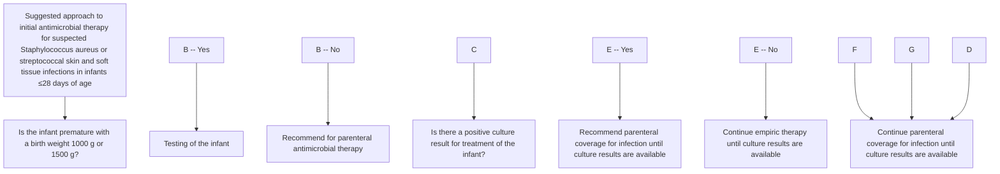
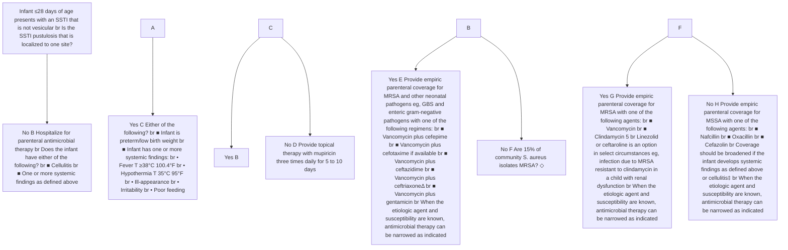

3/18/26, 3:48 PM Skin and soft tissue infections in neonates: Evaluation and management - UpToDate

# UpToDate®

Official reprint from UpToDate®
www.uptodate.com © 2026 UpToDate, Inc. and/or its affiliates. All Rights Reserved.

# **Skin and soft tissue infections in neonates: Evaluation and management**

**AUTHOR:** Sheldon L Kaplan, MD
**SECTION EDITOR:** Morven S Edwards, MD
**DEPUTY EDITOR:** Diane Blake, MD

All topics are updated as new evidence becomes available and our <u>peer review process</u> is complete.

Literature review current through: **Feb 2026.**
This topic last updated: **Nov 06, 2025.**

## **INTRODUCTION**

The evaluation and management of suspected *Staphylococcus aureus* or streptococcal skin and soft tissue infections (SSTIs) in neonates (≤28 days of age) are discussed here. Clinical features of SSTI; the evaluation and management of staphylococcal and streptococcal SSTIs in children older than 28 days; the epidemiology, prevention, and control of methicillin-resistant S. *aureus* (MRSA) infections in children; and the treatment of invasive MRSA infections in children are discussed separately.

- (See "<u>Vesicular, pustular, and bullous lesions in the newborn and infant</u>", section on 'Bacterial infection'.)
- (See "<u>Erythroderma in children</u>", section on 'Infectious diseases'.)
- (See "<u>Skin abscesses, cellulitis, and erysipelas in children >28 days: Evaluation and management</u>".)
- (See "<u>Methicillin-resistant Staphylococcus aureus (MRSA) in children: Epidemiology and clinical spectrum</u>".)
- (See "<u>Methicillin-resistant Staphylococcus aureus (MRSA) in children: Prevention and control</u>".)
- (See "<u>*Staphylococcus aureus* in children: Overview of treatment of invasive infections</u>".)

## **ETIOLOGY**

https://www.uptodate.com/contents/skin-and-soft-tissue-infections-in-neonates-evaluation-and-management/print?search=skin and soft tissue inf... 1/23

3/18/26, 3:48 PM Skin and soft tissue infections in neonates: Evaluation and management - UpToDate

## EVALUATION

Most bacterial skin and soft tissue infections (SSTIs) in neonates are caused by *S. aureus*. Group B *Streptococcus* occasionally causes cellulitis. Group A streptococcal SSTIs in neonates are uncommon but may occur. (See <u>"Vesicular, pustular, and bullous lesions in the newborn and infant"</u>, section on 'Bacterial infection' and <u>"Erythroderma in children"</u>, section on '<u>Infecious diseases</u>' and <u>"Group B streptococcal (GBS) infection in neonates and young infants"</u>, section on 'Other focal infection'.)

|   |
| - |

). (See <u>"Vesicular, pustular, and bullous lesions in the newborn and infant"</u>.)

Important aspects of the clinical evaluation include:

- Systemic signs or symptoms, such as fever (temperature ≥38°C [100.4°F]), hypothermia (temperature <35°C [95°F]), ill-appearance, irritability, and poor feeding
- Risk factors for sepsis and herpes simplex virus (HSV), which are discussed separately (see <u>"Neonatal bacterial sepsis: Clinical features and diagnosis in neonates born at <35 weeks of gestation"</u>, section on 'Risk factors' and <u>"Genital herpes simplex virus infection and pregnancy"</u> and <u>"Neonatal bacterial sepsis: Clinical features and diagnosis in neonates ≥35 weeks of gestation"</u>, section on 'Pathogenesis and risk factors')
- Associated features of congenital HSV, neonatal varicella virus, or congenital syphilis (table 2

) (see <u>"Neonatal herpes simplex virus (HSV) infection: Clinical features and diagnosis"</u>, section on '<u>Neonatal HSV</u>' and <u>"Congenital syphilis: Clinical manifestations, evaluation, and diagnosis"</u>, section on '<u>Early congenital syphilis</u>' and <u>"Varicella-zoster virus (VZV) infection in the newborn"</u>, section on '<u>Postnatal infection</u>')

## Laboratory evaluation

- **Gram stain, culture, and susceptibility testing of purulent material** – We obtain specimens for Gram stain, culture, and susceptibility testing from

### Clinical manifestations that are suggestive of specific congenital infections in the neonate

| Category                            | Manifestations                                                                                                                                                                                                                                            |
| ----------------------------------- | --------------------------------------------------------------------------------------------------------------------------------------------------------------------------------------------------------------------------------------------------------- |
| **Congenital infections**           | - Increased intracranial pressure - Hepatomegaly - Hepatosplenomegaly - Hepatomegaly - Hepatosplenomegaly - Hepatosplenomegaly - Hepatosplenomegaly - Hepatosplenomegaly - Hepatosplenomegaly - Hepatosplenomegaly                                        |
| **Congenital syphilis**             | - Congenital heart block - Congenital heart block - Congenital heart block - Congenital heart block - Congenital heart block - Congenital heart block - Congenital heart block - Congenital heart block - Congenital heart block - Congenital heart block |
| **Congenital syphilis (continued)** | - Hepatosplenomegaly - Hepatosplenomegaly - Hepatosplenomegaly - Hepatosplenomegaly - Hepatosplenomegaly - Hepatosplenomegaly - Hepatosplenomegaly - Hepatosplenomegaly - Hepatosplenomegaly - Hepatosplenomegaly                                         |
| **Herpes simplex virus**            | - Vesicular rash - Vesicular rash - Vesicular rash - Vesicular rash - Vesicular rash - Vesicular rash - Vesicular rash - Vesicular rash - Vesicular rash - Vesicular rash                                                                                 |
| **Congenital syphilis (continued)** | - Hepatosplenomegaly - Hepatosplenomegaly - Hepatosplenomegaly - Hepatosplenomegaly - Hepatosplenomegaly - Hepatosplenomegaly - Hepatosplenomegaly - Hepatosplenomegaly - Hepatosplenomegaly - Hepatosplenomegaly                                         |
| **Congenital syphilis (continued)** | - Hepatosplenomegaly - Hepatosplenomegaly - Hepatosplenomegaly - Hepatosplenomegaly - Hepatosplenomegaly - Hepatosplenomegaly - Hepatosplenomegaly - Hepatosplenomegaly - Hepatosplenomegaly - Hepatosplenomegaly                                         |

Clinical manifestations that are suggestive of specific congenital infections in the neonate

https://www.uptodate.com/contents/skin-and-soft-tissue-infections-in-neonates-evaluation-and-management/print?search=skin and soft tissue inf... 2/23

3/18/26, 3:48 PM Skin and soft tissue infections in neonates: Evaluation and management - UpToDate
Table 2 - larger image below

neonates with purulent/fluctuant skin lesions (ie, abscesses) if purulent material can be obtained [1-3].

Gram stain identification of gram-positive cocci may help to guide empiric therapy.

- Gram stain identification of gram-positive cocci in clusters provides early indication of staphylococcal infection. If S. aureus is isolated in bacterial culture, susceptibility testing is necessary to distinguish methicillin-resistant S. aureus from methicillin-susceptible S. aureus [4]. In some laboratories, methicillin resistance may be detected rapidly using commercially available molecular tests for the mecA gene that leads to methicillin resistance. (See "Methicillin-resistant *Staphylococcus aureus* (MRSA): Microbiology and laboratory detection").)

- Gram stain identification of gram-positive cocci in chains provides early identification of streptococcal infection. Culture is necessary to distinguish between group A and group B *Streptococcus*. The empiric treatment of neonatal group B streptococcal infection is discussed separately. (See "Group B streptococcal (GBS) infection in neonates and young infants", <u>section on 'Antibiotic therapy'</u>.)

- **Other studies** – Our approach to obtaining other laboratory studies and cultures in neonates with suspected bacterial SSTI depends upon the type of infection and associated systemic findings. Systemic findings include fever (temperature ≥38°C [100.4°F]), hypothermia (temperature <35°C [95°F]), ill-appearance, irritability, and poor feeding.

- **Neonates with mastitis** – The evaluation of neonates with mastitis is discussed separately. (See "Mastitis and breast abscess in infants younger than two months", <u>section on 'Additional evaluation'</u>.))

- **Term neonates (≥37 weeks **gestation**)** with **localized pustulosis** and no **systemic findings** – Localized pustulosis (🖼️ picture 1) usually is caused by *S. aureus*. We generally do not obtain blood cultures or other microbiologic studies unless it is necessary to distinguish staphylococcal pustulosis from other causes of pustular lesions (📊 table 1) [5]. In otherwise asymptomatic neonates with pustulosis, the Gram stain is helpful in distinguishing pustulosis from other conditions. If HSV remains a possibility, the infant should undergo full evaluation for HSV. (See "Neonatal herpes simplex virus (HSV) infection: Clinical features and diagnosis", <u>section on 'Evaluation and diagnosis'</u>.))

- **Preterm (<37 weeks gestation)**, **low birth weight neonates with localized pustulosis (with or without **systemic findings**)** – We usually obtain blood cultures.

- **Term or preterm neonates with multiple sites of pustulosis, other types of SSTI (eg, **cellulitis**, **abscess**, **mastitis**), or **systemic findings**** – We obtain blood and urine cultures

https://www.uptodate.com/contents/skin-and-soft-tissue-infections-in-neonates-evaluation-and-management/print?search=skin and soft tissue inf... 3/23

3/18/26, 3:48 PM Skin and soft tissue infections in neonates: Evaluation and management - UpToDate

in all such patients and cerebrospinal fluid (CSF) cultures as clinically indicated (eg, fever/hypothermia, ill-appearing) [2]. Indications for CSF cultures in neonates are discussed separately:

- Preterm neonates (<34 weeks gestation) (see "Neonatal bacterial sepsis: Clinical features and diagnosis in neonates born at <35 weeks of gestation", section on 'Other studies in selected cases')

- Term (>37 weeks gestation) and late preterm (34 to 36 weeks gestation) neonates <7 days (see "Neonatal bacterial sepsis: Clinical features and diagnosis in neonates ≥35 weeks of gestation", section on 'Early-onset (<72 hours) presentation')

- Term and late preterm neonates ≥7 days of age (see "The febrile infant (29 to 90 days of age): Outpatient evaluation", section on 'Focal infection' and "The febrile neonate (28 days of age or younger): Outpatient evaluation", section on 'Focal infection')

Significant CSF pleocytosis with sterile CSF culture may be seen in association with community-associated *S. aureus* infection in neonates [2,5]. The pathogenesis of the pleocytosis is unclear.

## MANAGEMENT APPROACH

### Localized pustulosis

- **Term neonates without systemic findings** – We suggest that localized pustulosis (🖼️ picture 1) in term neonates (≥37 weeks gestation) without systemic findings (fever, hypothermia, ill-appearance, irritability, poor feeding) be treated with topical antibiotic therapy (eg, mupirocin three times daily for 5 to 10 days) in the outpatient setting (🧑‍⚕️ algorithm 1) [1,2]; close follow-up of such patients is imperative [2].

- **Term neonates with systemic findings** – We use parenteral rather than topical therapy for full-term neonates with localized pustulosis and fever or other signs or symptoms of systemic infection (🧑‍⚕️ algorithm 1). (See 'Choice of initial therapy' below.)

| Step | Condition              | Management                                                                                                                                           |
| ---- | ---------------------- | ---------------------------------------------------------------------------------------------------------------------------------------------------- |
| 1    | Infant ≤28 days of age | Obtain cultures                                                                                                                                      |
| 2    | Localizing findings    | • Fever from core or mucous membrane • Fever ≥38°C (100.4°F) • Hypothermia (<36°C) • Ill-appearing • Poor feeding • Irritability |
| 3    | Systemic findings      | • Fever • Hypothermia • Ill-appearing • Poor feeding • Irritability                                                                  |
| 4    | Localizing findings    | • Fever from core or mucous membrane • Fever ≥38°C (100.4°F) • Hypothermia (<36°C) • Ill-appearing • Poor feeding • Irritability |
| 5    | Systemic findings      | • Fever • Hypothermia • Ill-appearing • Poor feeding • Irritability                                                                  |

Algorithm 1 - larger image below

- **Preterm (<37 weeks gestation) low birth weight neonates** – We recommend that local pustulosis in preterm (<37 weeks gestation) low birth

https://www.uptodate.com/contents/skin-and-soft-tissue-infections-in-neonates-evaluation-and-management/print?search=skin and soft tissue inf... 4/23

3/18/26, 3:48 PM Skin and soft tissue infections in neonates: Evaluation and management - UpToDate

## **SSTI more severe than localized pustulosis** — We hospitalize neonates with skin and soft tissue infection (SSTI) more severe than localized pustulosis (eg, multiple sites of pustulosis, mastitis and other sites of cellulitis, abscess) for close monitoring and parenteral antimicrobial therapy (♂ algorithm 1) [2]. In addition to provision of parenteral antimicrobial therapy, we recommend drainage of purulent or fluctuant lesions (eg, cutaneous abscess). (See 'Choice of initial therapy' below.)

weight infants be treated parenterally at least until bacteremia is excluded (♂ algorithm 1) [1]. If blood cultures were not obtained, a five- to seven-day course of parenteral therapy is reasonable – provided that the infant continues to be clinically well and the pustulosis resolved completely. (See 'Choice of initial therapy' below and 'Duration of therapy' below.)

Neonates with SSTI other than localized pustulosis are at increased risk for sepsis and invasive infection (given the immaturity of their immune system). (See "Neonatal bacterial sepsis: Clinical features and diagnosis in neonates ≥35 weeks of gestation".)

Clinical features and clinical decision rules cannot accurately predict serious bacterial infection in young infants. Neonates with SSTI other than localized pustulosis typically have undergone evaluation for one or more concomitant serious bacterial infection (eg, bacteremia, urinary tract infection, meningitis, osteoarticular infection) and are treated with parenteral antimicrobial therapy until 48-hour culture results are available.

## **ANTIMICROBIAL THERAPY**

The safety and efficacy of topical, oral, and parenteral antimicrobial therapy for staphylococcal and streptococcal skin and soft tissue infection (SSTI) in neonates have not been well evaluated in clinical studies. We generally provide empiric coverage for *S. aureus* and add coverage for other pathogens as clinically indicated (♂ algorithm 1).

Our approach to antimicrobial therapy is consistent with that provided by the Infectious Diseases Society of America [1], which is based upon observations from a review of 126 cases treated between 2001 and 2006 at the author's institution [2].

## **Choice of initial therapy** — The empiric parenteral antibiotic regimen for suspected staphylococcal or streptococcal SSTI in neonates should be based upon the type of infection and local susceptibility pattern of community-associated *S. aureus* isolates. When the etiologic agent and susceptibility are known, antimicrobial therapy can be narrowed as indicated.

## **SSTI without systemic findings**

- **SSTI other than cellulitis** – For neonates with SSTI other than cellulitis and no systemic findings (eg, fever, hypothermia, ill-appearance, irritability, poor feeding), we provide initial empiric coverage for methicillin-resistant *S. aureus* (MRSA) with vancomycin or

https://www.uptodate.com/contents/skin-and-soft-tissue-infections-in-neonates-evaluation-and-management/print?search=skin and soft tissue inf... 5/23

3/18/26, 3:48 PM Skin and soft tissue infections in neonates: Evaluation and management - UpToDate
https://www.uptodate.com/contents/skin-and-soft-tissue-infections-in-neonates-evaluation-and-management/print?search=skin and soft tissue inf... 6/23

clindamycin, given the high prevalence of MRSA in our community (♂ algorithm 1 and 📄 table 3) [1,2]. For those infants in whom gram-negative pathogens are not a concern, monotherapy with linezolid or ceftaroline is an option in selected circumstances (eg, infection due to MRSA resistant to clindamycin in an infant with underlying kidney dysfunction). Ceftaroline is available for infants born at ≥34 weeks' gestation and ≥12 days of age [6].

In communities where MRSA is less prevalent (eg, ≤15 percent of *S. aureus* isolates), initial empiric coverage for methicillin-susceptible *S. aureus* (MSSA) is an alternative (♂ algorithm 1); other experts may have a different threshold of MRSA prevalence for MSSA coverage. Agents active against MSSA include nafcillin, oxacillin, or cefazolin; piperacillin-tazobactam is an alternative if it is necessary for another indication (eg, *Pseudomonas*) (📄 table 3). Parenteral coverage should be broadened to include MRSA, group B *Streptococcus* (GBS), and enteric gram-negative pathogens if the infant develops systemic findings and to include MRSA, GBS, and other beta-hemolytic streptococci if the infant develops cellulitis. (See 'SSTI with systemic findings' below.)

Studies comparing antistaphylococcal regimens in neonates with SSTI are lacking. The antibiotics suggested above are equally reasonable based upon in vitro data and clinical observations.

- **Cellulitis** – For neonates with cellulitis and no systemic findings, we provide coverage for GBS and other beta-hemolytic streptococci in addition to MRSA (♂ algorithm 1). Empiric parenteral therapy options include vancomycin plus either an extended spectrum cephalosporin (eg, cefotaxime [if available], ceftriaxone, ceftazidime) or gentamicin (📄 table 3).

**SSTI with systemic findings** — For neonates with suspected staphylococcal or streptococcal infection who have systemic findings (eg, fever, hypothermia, ill-appearance, irritability, poor feeding) it is usually necessary to add coverage for other neonatal pathogens (ie, gentamicin, cefotaxime [if available], ceftazidime, cefepime, or ceftriaxone for enteric gram-negative pathogens) (♂ algorithm 1). Ceftriaxone should be avoided in neonates with hyperbilirubinemia and in neonates receiving calcium-containing intravenous fluids. (See "Neonatal bacterial sepsis: Clinical features and diagnosis in neonates ≥35 weeks of gestation", section on 'Microbiology'.)

The combination of vancomycin plus one of these agents provides adequate empiric therapy for possible GBS cellulitis but is not appropriate for sepsis or meningitis (📄 table 3). Appropriate antimicrobial regimens for neonatal sepsis and meningitis are discussed separately. (See "Neonatal bacterial sepsis: Management, prevention, and outcome", section on 'Initial empiric antibiotic therapy' and "Group B streptococcal (GBS) infection in neonates and young infants", section on 'Antibiotic therapy'.)

3/18/26, 3:48 PM Skin and soft tissue infections in neonates: Evaluation and management - UpToDate

# Duration of therapy

- **SSTI confined to the skin and soft tissues** — The total duration of therapy for staphylococcal or streptococcal SSTI confined to the skin and soft tissues in neonates depends upon clinical response; a total of 7 to 14 days is usually adequate if there are no complications [2]. (See <u>Response to therapy</u> below.)

For neonates with SSTI confined to the skin and soft tissues, we continue parenteral therapy at least until all of the following criteria are met (see <u>Response to therapy</u> below):

- Resolution of systemic symptoms and fever
- Improvement in other clinical findings
- Antibiotic susceptibility results are available if a pathogen is isolated
- Systemic bacterial cultures (eg, blood, urine, cerebrospinal fluid) isolate no pathogens during at least 48 hours of incubation

Although we obtain blood cultures in preterm, low birth weight neonates with localized pustulosis, if blood cultures were not obtained, a five- to seven-day course of parenteral therapy is reasonable, provided that the infant continues to be clinically well and the pustulosis is completely resolved.

) [<u>7,8</u>]. Oral <u>linezolid</u> may be used when the isolate is resistant to other agents, but, given its high cost, consultation with an expert in infectious diseases may be warranted to make sure that it is the only oral option [2]. If a pathogen is not isolated, we continue coverage with an oral agent with activity against both MRSA and MSSA (eg, clindamycin). <u>Trimethoprim-sulfamethoxazole</u> should not be used in neonates because it may displace bilirubin, increasing the risk for bilirubin toxicity.

- **Invasive infection** — The duration of antimicrobial therapy for neonates with staphylococcal or GBS infections that have extended beyond the skin and soft tissues is discussed separately. (See "<u>Staphylococcus aureus in children: Overview of treatment of invasive infections</u>", section on 'Treatment of neonates' and "<u>Group B streptococcal (GBS) infection in neonates and young infants</u>", section on 'Antibiotic therapy'.)

## RESPONSE TO THERAPY

**Monitoring response** — Response to therapy is indicated by clinical improvement after 48 hours. In neonates who are admitted to the hospital for antimicrobial therapy, we monitor the

https://www.uptodate.com/contents/skin-and-soft-tissue-infections-in-neonates-evaluation-and-management/print?search=skin and soft tissue inf... 7/23

3/18/26, 3:48 PM Skin and soft tissue infections in neonates: Evaluation and management - UpToDate

skin and soft tissue infection (SSTI) for improvement or progression, the patient's vital signs, and culture and susceptibility results (if obtained).

Neonates who are treated for staphylococcal or streptococcal SSTI in the outpatient setting should be instructed to seek medical care promptly if they develop systemic symptoms (eg, fever, hypothermia, irritability, ill-appearance, poor feeding) or if local symptoms worsen <u>[9]</u>. They should be seen for follow-up within 48 hours. Follow-up is essential to ensure clinical improvement and determine the need for drainage, additional drainage (if drained initially), or change in antimicrobial therapy.

**Failure to respond** — Initiation of systemic therapy (for neonates initially treated with topical antibiotics) or change in antimicrobial therapy (guided by culture and susceptibility results, if available) is indicated for neonates who worsen at any time during treatment and may be warranted for patients who remain stable but whose skin lesions have not improved after 48 hours of observation or antimicrobial therapy.

Possible explanations for failure to respond in neonates receiving an agent to which their isolate is susceptible include inadequate drainage (if drainage was performed), abscess recurrence, or development of a new abscess. Ultrasonography may identify residual, recurrent, or new abscesses that require drainage.

In a retrospective study of 202 neonates treated with antibiotics for an uncomplicated SSTI, perirectal site of the infection was a risk factor for antibiotic treatment failure (17 percent with perirectal infections versus 5 percent with other types of infection [odds ratio 4.1, 95% CI 1.5-11.3]) <u>[10]</u>.

If cultures remain negative and ultrasonography does not identify lesions that require drainage, a change in empiric therapy may be indicated (eg, to include coverage for methicillin-resistant *S. aureus* [MRSA] if MRSA was not initially included). In such cases, consultation with an expert in infectious diseases is suggested.

## SOCIETY GUIDELINE LINKS

Links to society and government-sponsored guidelines from selected countries and regions around the world are provided separately. (See "<u>Society guideline links: Skin and soft tissue infections</u>".)

## INFORMATION FOR PATIENTS

UpToDate offers two types of patient education materials, "The Basics" and "Beyond the Basics." The Basics patient education pieces are written in plain language, at the 5th to 6th

https://www.uptodate.com/contents/skin-and-soft-tissue-infections-in-neonates-evaluation-and-management/print?search=skin and soft tissue inf... 8/23

3/18/26, 3:48 PM Skin and soft tissue infections in neonates: Evaluation and management - UpToDate
- **Evaluation**

grade reading level, and they answer the four or five key questions a patient might have about a given condition. These articles are best for patients who want a general overview and who prefer short, easy-to-read materials. Beyond the Basics patient education pieces are longer, more sophisticated, and more detailed. These articles are written at the 10th to 12th grade reading level and are best for patients who want in-depth information and are comfortable with some medical jargon.

Here are the patient education articles that are relevant to this topic. We encourage you to print or email these topics to your patients. (You can also locate patient education articles on a variety of subjects by searching on "patient education" and the keyword[s] of interest.)

- Basics topic (see "Patient education: Methicillin-resistant Staphylococcus aureus (MRSA) (The Basics)")

- Beyond the Basics topic (see "Patient education: Methicillin-resistant Staphylococcus aureus (MRSA) (Beyond the Basics)")

## SUMMARY AND RECOMMENDATIONS

- **History and examination** – The clinical evaluation of the neonate with suspected *Staphylococcus aureus* or streptococcal skin and soft tissue infection (SSTI) focuses on identification of systemic infection and clinical manifestations of conditions that require management that differs from the management of staphylococcal or streptococcal SSTI in neonates. These conditions often are associated with vesiculopustular skin lesions (table 1

). (See 'History and examination' above.)

- **Laboratory evaluation** – We obtain specimens for Gram stain, culture, and susceptibility testing from neonates with purulent/fluctuant skin lesions (abscess) if purulent material can be obtained. Our approach to obtaining other laboratory studies and cultures in neonates with suspected bacterial SSTI depends upon the type of infection and associated clinical features. (See 'Laboratory evaluation' above.)

- **Management**

- **Localized pustulosis**

- - **Term neonates without systemic findings** – For full-term neonates with localized pustulosis (🖼️ picture 1) and no systemic findings (eg, temperature ≥38°C [100.4°F] or <35°C [95°F], ill-appearance, irritability, poor feeding), we suggest topical rather than systemic therapy (⚙️ algorithm 1) (Grade 2C). We generally use mupirocin three times

https://www.uptodate.com/contents/skin-and-soft-tissue-infections-in-neonates-evaluation-and-management/print?search=skin and soft tissue inf... 9/23

3/18/26, 3:48 PM Skin and soft tissue infections in neonates: Evaluation and management - UpToDate

daily for 5 to 10 days. Close outpatient follow-up is essential. (See '<u>Localized pustulosis</u>' above.)

- **Term neonates with systemic findings** – We use parenteral rather than topical therapy for full-term neonates with localized pustulosis and fever or other signs or symptoms of systemic infection.

- **Preterm low birth weight neonates** – We hospitalize preterm low birth weight neonates with localized pustulosis for parenteral therapy.

- **More severe SSTI** – We hospitalize neonates with SSTI more severe than localized pustulosis (eg, pustulosis in multiple sites, cellulitis, abscess, mastitis) and neonates who undergo evaluation for serious bacterial infection (eg, bacteremia, urinary tract infection, meningitis, arthritis, osteomyelitis). (See '<u>Localized pustulosis</u>' above and '<u>SSTI more severe than localized pustulosis</u>' above.)

- **Choice of initial therapy** – The empiric parenteral antibiotic regimen for suspected staphylococcal or streptococcal SSTI in neonates should be based upon the type of infection and local susceptibility pattern of community-associated *S. aureus* isolates (♂ algorithm 1). In areas with an increased prevalence of methicillin-resistant *S. aureus*, vancomycin, clindamycin, and linezolid or ceftaroline are appropriate alternatives for infection limited to the skin and soft tissues; gentamicin, cefotaxime (if available), ceftazidime, cefepime, or ceftriaxone may be added to broaden coverage (📋 table 3). When the etiologic agent and susceptibility are known, antimicrobial therapy can be narrowed as indicated. (See '<u>Choice of initial therapy</u>' above.)

- **Duration of therapy** – The duration of therapy for staphylococcal or streptococcal SSTI confined to the skin and soft tissues in neonates depends upon clinical response; a total of 7 to 14 days is usually adequate if there are no complications. (See '<u>Duration of therapy</u>' above.)

Use of UpToDate is subject to the Terms of Use.

## REFERENCES

1. Liu C, Bayer A, Cosgrove SE, et al. Clinical practice guidelines by the infectious diseases society of america for the treatment of methicillin-resistant Staphylococcus aureus infections in adults and children. Clin Infect Dis 2011; 52:e18.

2. Fortunov RM, Hulten KG, Hammerman WA, et al. Evaluation and treatment of community-acquired Staphylococcus aureus infections in term and late-preterm previously healthy neonates. Pediatrics 2007; 120:937.

https://www.uptodate.com/contents/skin-and-soft-tissue-infections-in-neonates-evaluation-and-management/print?search=skin and soft tissue i... 10/23

3/18/26, 3:48 PM Skin and soft tissue infections in neonates: Evaluation and management - UpToDate

3. American Academy of Pediatrics. *Staphylococcus aureus*. In: Red Book: 2024-2027 Report of the Committee on Infectious Diseases, 33rd ed, Kimberlin DW, Banerjee R, Barnett ED, Lynfield R, Sawyer MH (Eds), American Academy of Pediatrics, Itasca, IL 2024. p.767.

4. Miller LG, Perdreau-Remington F, Bayer AS, et al. Clinical and epidemiologic characteristics cannot distinguish community-associated methicillin-resistant Staphylococcus aureus infection from methicillin-susceptible S. aureus infection: a prospective investigation. Clin Infect Dis 2007; 44:471.

5. Day CT, Kaplan SL, Mason EO, Hulten KG. Community-associated Staphylococcus aureus infections in otherwise healthy infants less than 60 days old. Pediatr Infect Dis J 2014; 33:98.

6. Teflaro (ceftaroline fosamil) for injection. United States Prescribing Information. Revised September 2019. US Food & Drug Administration. (Available online http://www.accessdata.fda.gov/scripts/cder/drugsatfda/index.cfm (Accessed on October 22, 2019).

7. Autret E, Laugier J, Marimbu J, et al. [Comparison of plasma levels of amoxicillin administered by oral and intravenous routes in neonatal bacterial colonization]. Arch Fr Pediatr 1988; 45:679.

8. Boothman R, Kerr MM, Marshall MJ, Burland WL. Absorption and excretion of cephalexin by the newborn infant. Arch Dis Child 1973; 48:147.

9. Gorwitz RJ. A review of community-associated methicillin-resistant Staphylococcus aureus skin and soft tissue infections. Pediatr Infect Dis J 2008; 27:1.

10. Patel P, Foster CE, Stimes G, et al. Risk Factors for Treatment Failure in Neonates With Skin and Soft Tissue Infection: A Retrospective Cohort Study. Clin Pediatr (Phila) 2024; 63:689.

Topic 106447 Version 24.0

https://www.uptodate.com/contents/skin-and-soft-tissue-infections-in-neonates-evaluation-and-management/print?search=skin and soft tissue i... 11/23

3/18/26, 3:48 PM Skin and soft tissue infections in neonates: Evaluation and management - UpToDate

# **GRAPHICS**

## Table 1: **Vesiculopustular lesions in neonates and infants that require treatment and/or monitoring**

| Condition                                   | Clinical features                                                                                                                                                                                                                                                              | Significance                                                                                                                                                                           |
| ------------------------------------------- | ------------------------------------------------------------------------------------------------------------------------------------------------------------------------------------------------------------------------------------------------------------------------------ | -------------------------------------------------------------------------------------------------------------------------------------------------------------------------------------- |
| **Infectious conditions**                   |                                                                                                                                                                                                                                                                                |                                                                                                                                                                                        |
| Congenital herpes simplex virus (HSV)       | Grouped or single vesicles on erythematous base in crops on skin and mucous membranes; lesions usually appear between 1 and 2 weeks of age; may be associated with nonspecific signs of serious illness: temperature instability, respiratory distress, poor feeding, lethargy | Requires antiviral therapy; significant morbidity and mortality if untreated                                                                                                           |
| Neonatal varicella zoster virus             | Grouped or single vesicles on erythematous base in crops on skin and mucous membranes                                                                                                                                                                                          | Requires antiviral therapy; associated with significant morbidity and mortality                                                                                                        |
| Congenital syphilis                         | Blisters, erosions that frequently involve the palms and soles; other manifestations include rhinitis, anemia, jaundice, hepatomegaly                                                                                                                                          | Requires antibiotic therapy; late manifestations in untreated infants may include central nervous system, skeletal, and dental abnormalities; hearing loss; and interstitial keratitis |
| Staphylococcal pustulosis                   | Erythematous papules, pustules, honey-colored crusts often in areas of trauma                                                                                                                                                                                                  | Requires antibiotic therapy; Gram stain and culture of lesions should be obtained; may be associated with systemic/invasive infection                                                  |
| Staphylococcal scalded skin syndrome (SSSS) | Fever, irritability, diffuse blanching erythema, flaccid blisters; positive Nikolsky sign\*                                                                                                                                                                                    | Requires antibiotic therapy; cultures should be obtained from any suspected focus of infection (eg, blood, urine, nasopharynx, umbilicus)                                              |
| Streptococcal infections                    | May mimic staphylococcal infections                                                                                                                                                                                                                                            | Same as for staphylococcal pustulosis and SSSS                                                                                                                                         |
| Listeria                                    | Pustules of the skin and mucus membranes may be present in early onset disease (<7 days of age)                                                                                                                                                                                | Requires antibiotic therapy; may be associated with septicemia and/or meningitis                                                                                                       |
| Candidiasis                                 | Erythematous macules and papules evolving to pustules and vesicles                                                                                                                                                                                                             | Requires antifungal therapy; has the potential to disseminate via the bloodstream in susceptible hosts                                                                                 |
| **Congenital disorders**                    |                                                                                                                                                                                                                                                                                |                                                                                                                                                                                        |
| Epidermolysis bullosa                       | Blister development with little or no trauma                                                                                                                                                                                                                                   | Management involves prevention of trauma, careful wound care, and treatment of infection                                                                                               |

https://www.uptodate.com/contents/skin-and-soft-tissue-infections-in-neonates-evaluation-and-management/print?search=skin and soft tissue i... 12/23

3/18/26, 3:48 PM Skin and soft tissue infections in neonates: Evaluation and management - UpToDate

|                              |                                                                                                                                                                                                    |                                                                                            |
| ---------------------------- | -------------------------------------------------------------------------------------------------------------------------------------------------------------------------------------------------- | ------------------------------------------------------------------------------------------ |
| Epidermolytic hyperkeratosis | Widespread blistering and erythema and or hyperkeratosis; denuded areas of skin                                                                                                                    | Increased susceptibility to cutaneous infection                                            |
| Aplasia cutis congenita      | Erosions present at birth that re-epithelialize to form hypertrophic or atrophic scar; involves the epidermis and dermis                                                                           | May be associated with other disorders (eg, trisomy 13, 4p-)                               |
| Incontinentia pigmenti       | Four stages that may occur simultaneously: linear streaks of erythematous papules and vesicles; warty papules or plaques in linear or swirling patterns; swirled; hypopigmented patches or streaks | Majority of cases associated with neurologic, ocular, dental, and structural abnormalities |
| **Miscellaneous**            |                                                                                                                                                                                                    |                                                                                            |
| Scabies                      | May be seen in infants as young as 3 to 4 weeks of age but never present at birth; vesicles, pustules, and papules; rare burrows on hands, feet, trunk, genitalia                                  | Requires treatment with scabicide and measures to prevent spread                           |
| Cutaneous mastocytosis       | Bullous eruptions with hemorrhage; positive Darier sign¶                                                                                                                                           | Requires symptomatic therapy and avoidance of triggers                                     |

* Nikolsky sign: Separation of the upper dermis and wrinkling of the skin with application of gentle pressure.
¶ Darier sign: Urticaria and erythema with rubbing, scratching, or stroking.

Graphic 75417 Version 7.0

https://www.uptodate.com/contents/skin-and-soft-tissue-infections-in-neonates-evaluation-and-management/print?search=skin and soft tissue i... 13/23

3/18/26, 3:48 PM Skin and soft tissue infections in neonates: Evaluation and management - UpToDate

# Table 2: **Clinical manifestations that are suggestive of specific congenital infections in the neonate**

| Condition                      | Manifestations                                                                                                                                                                                                               |
| ------------------------------ | ---------------------------------------------------------------------------------------------------------------------------------------------------------------------------------------------------------------------------- |
| **Congenital toxoplasmosis**   | - Intracranial calcifications (diffuse) - Hydrocephalus - Chorioretinitis - Otherwise unexplained mononuclear CSF pleocytosis or elevated CSF protein                                                                        |
| **Congenital syphilis**        | - Skeletal abnormalities (osteochondritis and periostitis) - Pseudoparalysis - Persistent rhinitis - Maculopapular rash (particularly on palms and soles or in diaper area)                                                  |
| **Congenital rubella**         | - Cataracts, congenital glaucoma, pigmentary retinopathy - Congenital heart disease (most commonly patent ductus arteriosus or peripheral pulmonary artery stenosis) - Radiolucent bone disease - Sensorineural hearing loss |
| **Congenital cytomegalovirus** | - Thrombocytopenia - Periventricular intracranial calcifications - Microcephaly - Hepatosplenomegaly - Sensorineural hearing loss                                                                                            |
| **Herpes simplex virus**       | Perinately acquired HSV infection - Mucocutaneous vesicles - CSF pleocytosis - Thrombocytopenia - Elevated liver transaminases                                                                                               |

https://www.uptodate.com/contents/skin-and-soft-tissue-infections-in-neonates-evaluation-and-management/print?search=skin and soft tissue i... 14/23

3/18/26, 3:48 PM Skin and soft tissue infections in neonates: Evaluation and management - UpToDate

| • Conjunctivitis or keratoconjunctivitis                  |
| --------------------------------------------------------- |
| Congenital (in utero) HSV infection (rare)                |
| • Skin vesicles, ulcerations, or scarring                 |
| • Eye abnormalities (eg, micro-ophthalmia)                |
| • Brain abnormalities (eg, hydranencephaly, microcephaly) |
| **Congenital varicella**                                  |
| ■ Cicatricial or vesicular skin lesions                   |
| ■ Microcephaly                                            |
| **Congenital Zika syndrome**                              |
| ■ Microcephaly                                            |
| ■ Intracranial calcifications                             |
| ■ Arthrogryposis                                          |
| ■ Hypertonia/spasticity                                   |
| ■ Ocular abnormalities                                    |
| ■ Sensorineural hearing loss                              |

CSF: cerebrospinal fluid; HSV: herpes simplex virus.

Graphic 76743 Version 10.0

https://www.uptodate.com/contents/skin-and-soft-tissue-infections-in-neonates-evaluation-and-management/print?search=skin and soft tissue i... 15/23

3/18/26, 3:48 PM Skin and soft tissue infections in neonates: Evaluation and management - UpToDate
https://www.uptodate.com/contents/skin-and-soft-tissue-infections-in-neonates-evaluation-and-management/print?search=skin and soft tissue i... 16/23

# Picture 1: **Staphylococcal pustulosis**

Community-associated *Staphylococcus aureus* pustulosis in the diaper area of a previously healthy neonate.

*Courtesy of Sheldon L Kaplan, MD*

Graphic 107272 Version 1.0

3/18/26, 3:48 PM Skin and soft tissue infections in neonates: Evaluation and management - UpToDate

# Algorithm 1: **Suggested approach to initial antimicrobial therapy for suspected *Staphylococcus aureus* streptococcal skin and soft tissue infections in infants ≤28 days of age**

This algorithm is meant to be used in conjunction with UpToDate content on *S. aureus* and streptococcal skin and soft tissue infections in neonates.

SSTI: skin and soft tissue infection; T: temperature; MRSA: methicillin-resistant *S. aureus*; GBS: group B *Streptococcus*; MSSA: methicillin-susceptible *S. aureus*.

* These regimens provide adequate empiric therapy for group B streptococcal cellulitis but are not

https://www.uptodate.com/contents/skin-and-soft-tissue-infections-in-neonates-evaluation-and-management/print?search=skin and soft tissue i... 17/23

3/18/26, 3:48 PM Skin and soft tissue infections in neonates: Evaluation and management - UpToDate

appropriate for neonatal sepsis or meningitis. Refer to UpToDate content on treatment of neonatal sepsis and meningitis.

**¶** Refer to UpToDate topics on SSTI in neonates for additional details, including duration of therapy.
**Δ** Should be avoided in neonates with hyperbilirubinemia and in neonates receiving calcium-containing intravenous fluids.

**◇** We consider the local prevalence of MRSA to be high if >15% of *S. aureus* isolates are MRSA. Other experts may have a different threshold for increased prevalence of MRSA.

**§** We do not use clindamycin if the local prevalence of clindamycin-resistant *S. aureus* is >15%. Other experts may have a different threshold for avoidance of clindamycin.

**¥** Parenteral coverage should be broadened to include coverage for MRSA, GBS, and enteric gram-negative pathogens if the infant develops systemic findings and to include coverage for MRSA, GBS, and other beta-hemolytic streptococci if the infant develops cellulitis.

*Prepared with data from:*

1. *American Academy of Pediatrics. Staphylococcus aureus. In: Red Book: 2021-2024 Report of the Committee on Infectious Diseases, 32nd ed, Kimberlin DW, Barnett ED, Lynfield R, Sawyer MH (Eds), American Academy of Pediatrics, Itasca, IL 2021. p.678.*
2. *Liu C, Bayer A, Cosgrove SE, et al. Clinical practice guidelines by the Infectious Diseases Society of America for the treatment of methicillin-resistant Staphylococcus aureus infections in adults and children. Clin Infect Dis 2011; 52:e18.*
3. *Stevens DL, Bisno AL, Chambers HF, et al. Practice guidelines for the diagnosis and management of skin and soft tissue infections: 2014 update by the Infectious Diseases Society of America. Clin Infect Dis 2014; 59:147.*

Graphic 113285 Version 6.0

https://www.uptodate.com/contents/skin-and-soft-tissue-infections-in-neonates-evaluation-and-management/print?search=skin and soft tissue i... 18/23

3/18/26, 3:48 PM Skin and soft tissue infections in neonates: Evaluation and management - UpToDate

# **Table 3: Suggested doses for antibiotics recommended in the treatment of suspected staphylococcal or streptococcal skin and soft tissue infections in neonates**

| Parenteral antibiotics for initiation of therapy Antibiotic agent | Parenteral antibiotics for initiation of therapy Dosing GA <32 weeks                                                                                                             | Parenteral antibiotics for initiation of therapy GA ≥32 weeks                                                       |                                                                                                                       |
| --------------------------------------------------------------------- | ---------------------------------------------------------------------------------------------------------------------------------------------------------------------------------------- | ----------------------------------------------------------------------------------------------------------------------- | --------------------------------------------------------------------------------------------------------------------- |
| Cefazolin                                                             | \<bullet> Age <7 days: 25 mg/kg IV every 12 hours\</bullet> \<bullet> Age ≥7 days: 25 mg/kg IV every 8 hours\</bullet>                                                                   | \<bullet> Age ≤7 days: 50 mg/kg IV every 12 hours\</bullet> \<bullet> Age >7 days: 50 mg/kg IV every 8 hours\</bullet>  |                                                                                                                       |
| Cefotaxime                                                            | \<bullet> Age <7 days: 50 mg/kg IV every 12 hours\</bullet> \<bullet> Age ≥7 days: 50 mg/kg IV every 8 hours\</bullet>                                                                   |                                                                                                                         |                                                                                                                       |
| Ceftazidime                                                           | \<bullet> Age <7 days: 50 mg/kg IV every 12 hours\</bullet> \<bullet> Age ≥7 days: 50 mg/kg IV every 8 hours\</bullet>                                                                   |                                                                                                                         |                                                                                                                       |
| Ceftriaxone\*                                                         | \<bullet> 50 mg/kg IV every 24 hours\</bullet>                                                                                                                                           |                                                                                                                         |                                                                                                                       |
| Clindamycin†                                                          | \<bullet> PMA ≤32 weeks: 5 mg/kg IV every 8 hours\</bullet> \<bullet> PMA 33 to 40 weeks: 7 mg/kg IV every 8 hours\</bullet> \<bullet> PMA >40 weeks: 9 mg/kg IV every 8 hours\</bullet> |                                                                                                                         |                                                                                                                       |
| Antibiotic agent                                                      | Dosing                                                                                                                                                                                   |                                                                                                                         |                                                                                                                       |
|                                                                       | GA <36 weeks                                                                                                                                                                             | GA ≥36 weeks                                                                                                            |                                                                                                                       |
| Cefepime                                                              | \<bullet> 30 mg/kg IV every 12 hours\</bullet>                                                                                                                                           | \<bullet> 50 mg/kg IV every 12 hours\</bullet>                                                                          |                                                                                                                       |
| Antibiotic agent                                                      | Dosing                                                                                                                                                                                   |                                                                                                                         |                                                                                                                       |
|                                                                       | **GA ≥34 weeks and age ≥12 days**                                                                                                                                                        |                                                                                                                         |                                                                                                                       |
| Ceftaroline                                                           | \<bullet> 6 mg/kg IV every 8 hours\</bullet>                                                                                                                                             |                                                                                                                         |                                                                                                                       |
| Antibiotic agent                                                      | Dosing                                                                                                                                                                                   |                                                                                                                         |                                                                                                                       |
|                                                                       | GA <30 weeks                                                                                                                                                                             | GA 30 to 34 weeks                                                                                                       | GA ≥35 weeks                                                                                                          |
| GentamicinΔ                                                           | \<bullet> Age ≤14 days: 5 mg/kg IV every 48 hours\</bullet> \<bullet> Age >14 days: 5 mg/kg IV every 36 hours\</bullet>                                                                  | \<bullet> Age ≤10 days: 5 mg/kg IV every 36 hours\</bullet> \<bullet> Age >10 days: 5 mg/kg IV every 24 hours\</bullet> | \<bullet> Age ≤7 days: 4 mg/kg IV every 24 hours\</bullet> \<bullet> Age >7 days: 5 mg/kg IV every 24 hours\</bullet> |

https://www.uptodate.com/contents/skin-and-soft-tissue-infections-in-neonates-evaluation-and-management/print?search=skin and soft tissue i... 19/23

3/18/26, 3:48 PM
Skin and soft tissue infections in neonates: Evaluation and management - UpToDate

| Antibiotic agent          | Dosing Age ≤7 days                                                                                                                                                                                                                                                                                                                                             | Dosing Age 8 to 28 days                                                         |                              |
| ------------------------- | ------------------------------------------------------------------------------------------------------------------------------------------------------------------------------------------------------------------------------------------------------------------------------------------------------------------------------------------------------------------ | ----------------------------------------------------------------------------------- | ---------------------------- |
| Linezolid                 | * GA <34 weeks: 10 mg/kg IV every 12 hours
* GA ≥34 weeks: 10 mg/kg IV every 8 hours                                                                                                                                                                                                                                                                               | 10 mg/kg IV every 8 hours                                                           |                              |
| Nafcillin                 | - GA ≤34 weeks: 25 mg/kg IV every 12 hours
- GA >34 weeks: 25 mg/kg IV every 8 hours                                                                                                                                                                                                                                                                               | * GA ≤34 weeks: 25 mg/kg IV every 8 hours
* GA >34 weeks: 25 mg/kg IV every 6 hours |                              |
| Oxacillin                 | - GA ≤34 weeks: 25 mg/kg IV every 12 hours
- GA >34 weeks: 25 mg/kg IV every 8 hours                                                                                                                                                                                                                                                                               | * GA ≤34 weeks: 25 mg/kg IV every 8 hours
* GA >34 weeks: 25 mg/kg IV every 6 hours |                              |
| Piperacillin-tazobactam ♠ | - PMA ≤30 weeks: 100 mg/kg IV every 8 hours
- PMA >30 weeks: 80 mg/kg IV every 6 hours                                                                                                                                                                                                                                                                             |                                                                                     |                              |
| Vancomycin §              | Begin with a loading dose of 20 mg/kg followed by maintenance dosing according to GA and serum creatinine as indicated below. The interval between the loading dose and the first maintenance dose should be the same as the dosing interval for the maintenance regimen. This dosing regimen was designed with a target trough concentration of 5 to 10 mg/L\[1]. |                                                                                     |                              |
|                           | GA ≤28 weeks                                                                                                                                                                                                                                                                                                                                                       | GA >28 weeks                                                                        |                              |
| Serum creatinine          | Dose and frequency                                                                                                                                                                                                                                                                                                                                                 | Serum creatinine                                                                    | Dose and frequency           |
| ■ <0.5                    | ■ 15 mg/kg IV every 12 hours                                                                                                                                                                                                                                                                                                                                       | ■ <0.7                                                                              | ■ 15 mg/kg IV every 12 hours |
| ■ 0.5 to 0.7              | ■ 20 mg/kg IV every 24 hours                                                                                                                                                                                                                                                                                                                                       | ■ 0.7 to 0.9                                                                        | ■ 20 mg/kg IV every 24 hours |
| ■ 0.8 to 1                | ■ 15 mg/kg IV every 24 hours                                                                                                                                                                                                                                                                                                                                       | ■ 1 to 1.2                                                                          | ■ 15 mg/kg IV every 24 hours |
| ■ 1.1 to 1.4              | ■ 10 mg/kg IV every 24 hours                                                                                                                                                                                                                                                                                                                                       | ■ 1.3 to 1.6                                                                        | ■ 10 mg/kg IV every 24 hours |
| ■ >1.4                    | ■ 15 mg/kg IV every 48 hours                                                                                                                                                                                                                                                                                                                                       | ■ >1.6                                                                              | ■ 15 mg/kg IV every 48 hours |

**Oral antibiotics for completion of therapy**¥

https://www.uptodate.com/contents/skin-and-soft-tissue-infections-in-neonates-evaluation-and-management/print?search=skin and soft tissue i... 20/23

3/18/26, 3:48 PM Skin and soft tissue infections in neonates: Evaluation and management - UpToDate

| Antibiotic agent | Dosing Age ≤7 days                                                                                                                                 | Dosing Age 8 to 28 days               |
| ---------------- | ------------------------------------------------------------------------------------------------------------------------------------------------------ | ----------------------------------------- |
| Cephalexin       | ■ Oral therapy not appropriate                                                                                                                         | ■ 6.25 to 12.5 mg/kg orally every 6 hours |
| Clindamycin‡     | ■ PMA ≤32 weeks: 5 mg/kg orally every 8 hours ■ PMA 33 to 40 weeks: 7 mg/kg orally every 8 hours ■ PMA >40 weeks: 9 mg/kg orally every 8 hours |                                           |
| Linezolid†       | ■ GA <34 weeks: 10 mg/kg orally every 12 hours ■ GA ≥34 weeks: 10 mg/kg orally every 8 hours                                                       | ■ 10 mg/kg orally every 8 hours           |

This table provides the doses of antibiotics that may be used in the treatment of staphylococcal or streptococcal SSTIs in neonates. Refer to UpToDate content on SSTIs in neonates for details regarding the choice of antimicrobial therapy. Unless otherwise specified, "age" refers to postnatal age.

AUC: area under the curve; GA: gestational age; IV: intravenously; MRSA: methicillin-resistant *Staphylococcus aureus*; MSSA: methicillin-susceptible *S. aureus*; PMA: postmenstrual age; PNA: postnatal age; SSTI: skin and soft tissue infection.

* Ceftriaxone should not be administered to neonates if they are also receiving intravenous calcium in any form.

‡ Monitor carefully when used if more than 15% of local community-associated *S. aureus* isolates are resistant to clindamycin.

Δ Gentamicin is necessary to provide coverage for possible gram-negative pathogens. The optimal, individualized dose should be based on determination of serum concentrations. Doses may differ from those recommended by the package insert.

◇ If there is another indication for piperacillin-tazobactam (eg, *Pseudomonas* infection).

§ Serum creatinine concentration will take approximately 5 to 7 days after birth to reasonably reflect neonatal kidney function. Cautious use of creatinine-based dosing strategy with frequent assessment of kidney function and vancomycin serum concentrations are recommended in neonates ≤7 days old[2]. A vancomycin dosing method based upon PMA and PNA is provided as an alternative to the serum creatinine-based method listed above and may be useful in some clinical situations[3]. The regimen was designed with a target trough concentration of 10 to 20 mg/L.

- PMA ≤29 weeks
  - PNA ≤21 days: 15 mg/kg IV every 18 hours
  - PNA >21 days: 15 mg/kg IV every 12 hours
- PMA 30 to <37 weeks
  - PNA ≤14 days: 15 mg/kg IV every 12 hours
  - PNA >14 days: 15 mg/kg IV every 8 hours
- PMA 37 to <45 weeks
  - PNA ≤7 days: 15 mg/kg IV every 12 hours
  - PNA >7 days: 15 mg/kg IV every 8 hours

The approach to vancomycin dosing (trough-guided or AUC-guided) is generally determined at the institutional level. Refer to UpToDate content on invasive staphylococcal infections in children for

https://www.uptodate.com/contents/skin-and-soft-tissue-infections-in-neonates-evaluation-and-management/print?search=skin and soft tissue i... 21/23

3/18/26, 3:48 PM Skin and soft tissue infections in neonates: Evaluation and management - UpToDate

details of trough-guided or AUC-guided vancomycin dosing.

¥ Oral therapy should be directed by results of antibiotic susceptibility testing. If no pathogen is identified, we provide coverage for both MRSA and MSSA (eg, clindamycin).

‡ Oral linezolid is reserved for isolates resistant to other agents; consultation with an expert in infectious diseases is suggested to ensure that it is the only oral option.

*References:*

1. Capparelli EV, Lane JR, Romanowski GL, et al. *The influences of renal function and maturation on vancomycin elimination in newborns and infants.* J Clin Pharmacol, 2001; 41:927.
2. Nelson's *Pediatric Antimicrobial Therapy*, 27th ed, Bradley JS, Nelson JD, Barnett ED, et al (Eds), *American Academy of Pediatrics*, Itasca, IL 2021. p.100.
3. Radu L, Bengry T, Akierman A, et al. *Evolution of empiric vancomycin dosing in a neonatal population.* J Perinatol. 2018; 38:1702.

*Data adapted from:* American Academy of Pediatrics. *Tables of antibacterial drug dosages.* In: *Red Book: 2021-2024 Report of the Committee on Infectious Diseases, 32nd ed*, Kimberlin DW, Barnett ED, Lynfield R, Sawyer MH (Eds), *American Academy of Pediatrics*, Itasca, IL 2021. p.876.

*Additional data from:* Teflaro (ceftaroline fosamil) for injection. *United States Prescribing Information. Revised September 2019. US Food & Drug Administration. Available at:* https://www.accessdata.fda.gov/scripts/cder/daf/ (Accessed on October 22, 2019).

Graphic 107674 Version 14.0

https://www.uptodate.com/contents/skin-and-soft-tissue-infections-in-neonates-evaluation-and-management/print?search=skin and soft tissue i... 22/23

3/18/26, 3:48 PM Skin and soft tissue infections in neonates: Evaluation and management - UpToDate
https://www.uptodate.com/contents/skin-and-soft-tissue-infections-in-neonates-evaluation-and-management/print?search=skin and soft tissue i... 23/23

# Contributor Disclosures

**Sheldon L Kaplan, MD** Grant/Research/Clinical Trial Support: Pfizer [Streptococcus pneumoniae]. Other Financial Interest: Elsevier [Textbook honoraria – Pediatric infectious diseases]. All of the relevant financial relationships listed have been mitigated. **Morven S Edwards, MD** No relevant financial relationship(s) with ineligible companies to disclose. **Diane Blake, MD** No relevant financial relationship(s) with ineligible companies to disclose.

Contributor disclosures are reviewed for conflicts of interest by the editorial group. When found, these are addressed by vetting through a multi-level review process, and through requirements for references to be provided to support the content. Appropriately referenced content is required of all authors and must conform to UpToDate standards of evidence.

Conflict of interest policy

→