# IDSA GUIDELINE

# Practice Guidelines for the Diagnosis and Management of Skin and Soft Tissue Infections: 2014 Update by the Infectious Diseases Society of America

**Dennis L. Stevens**1 **Alan L. Bisno**2 **Henry F. Chambers**3 **E. Patchen Dellinger**4 **Ellie J. C. Goldstein**5 **Sherwood L. Gorbach**6 **Jan V. Hirschmann**7 **Sheldon L. Kaplan**8 **Jose G. Montoya**9 and **James C. Wade**10

1Division of Infectious Diseases, Department of Veterans Affairs, Boise, Idaho; 2Medical Service, Miami Veterans Affairs Health Care System, Florida; 3San Francisco General Hospital, University of California; 4Division of General Surgery, University of Washington, Seattle; 5University of California, Los Angeles, School of Medicine, and R. M. Alden Research Laboratory, Santa Monica, California; 6Department of Community Health, Tufts University, Boston, Massachusetts; 7Medical Service, Puget Sound Veterans Affairs Medical Center, Seattle, Washington; 8Department of Pediatrics, Baylor College of Medicine, Houston, Texas; 9Department of Medicine, Stanford University, California; and 10Geisinger Health System, Geisinger Cancer Institute, Danville, Pennsylvania

A panel of national experts was convened by the Infectious Diseases Society of America (IDSA) to update the 2005 guidelines for the treatment of skin and soft tissue infections (SSTIs). The panel's recommendations were developed to be concordant with the recently published IDSA guidelines for the treatment of methicillin-resistant *Staphylococcus aureus* infections. The focus of this guideline is the diagnosis and appropriate treatment of diverse SSTIs ranging from minor superficial infections to life-threatening infections such as necrotizing fasciitis. In addition, because of an increasing number of immunocompromised hosts worldwide, the guideline addresses the wide array of SSTIs that occur in this population. These guidelines emphasize the importance of clinical skills in promptly diagnosing SSTIs, identifying the pathogen, and administering effective treatments in a timely fashion.

**EXECUTIVE SUMMARY**

Summarized below are the recommendations made in the new guidelines for skin and soft tissue infections (SSTIs). Figure 1 was developed to simplify the management of localized purulent staphylococcal infections such as skin abscesses, furuncles, and carbuncles in the age of methicillin-resistant *Staphylococcus aureus* (MRSA). In addition, Figure 2 is provided to simplify the approach to patients with surgical site infections. The panel followed a process used in the development of other Infectious Diseases Society of America (IDSA) guidelines, which included a systematic weighting of the strength of recommendation and quality of evidence using the GRADE (Grading of Recommendations Assessment, Development, and Evaluation) system (Table 1) [<u>1-4</u>]. A detailed description of the methods, background, and evidence summaries that support each of the recommendations can be found in the full text of the guidelines.

Received 17 April 2014; accepted 21 April 2014.

It is important to realize that guidelines cannot always account for individual variation among patients. They are not intended to supplant physician judgment with respect to particular patients or special clinical situations. IDSA considers adherence to these guidelines to be voluntary, with the ultimate determination regarding their application to be made by the physician in the light of each patient's individual circumstances.

Correspondence: Dennis L. Stevens, PhD, MD, Infectious Diseases Section, VA Medical Center, 500 W Fort St, Bldg 45, Boise, ID 83702 (dlsteven@mindspring.com).

**Clinical Infectious Diseases** **2014;59(2):e10–52**

© The Author 2014. Published by Oxford University Press on behalf of the Infectious Diseases Society of America. All rights reserved. For Permissions, please e-mail: journals.permissions@oup.com.

DOI: 10.1093/cid/ciu296

## I. What Is Appropriate for the Evaluation and Treatment of Impetigo and Ecthyma?

### Recommendations

1. Gram stain and culture of the pus or exudates from skin lesions of impetigo and ecthyma are

# MANAGEMENT OF SSTIs

```mermaid
graph TD
  N0[MANAGEMENT OF SSTIs] --> N1[NONPURULENT br Necrotizing Infection /Cellulitis /Erysipelas]
  N2[MANAGEMENT] --> N3[PURULENT br Furuncle / Carbuncle / Abscess]
  N4[NONPURULENT] --> N5[Severe]
  N4[NONPURULENT] --> N6[Moderate]
  N4[NONPURULENT] --> N7[Mild]
  N8[PURULENT] --> N5[Severe]
  N8[PURULENT] --> N6[Moderate]
  N8[PURULENT] --> N7[Mild]
  N9[SEVERE1] --> N10[► EMERGENT SURGICAL INSPECTION / DEBRIDEMENT br ► Rule out necrotizing process br ► EMPIRIC Rx br • Vancomycin **PLUS** Piperacillin/Tazobactam]
  N11[MODERATE1] --> N12[INTRAVENOUS Rx br • Penicillin **or** br • Ceftriaxone **or** br • Cefazolin **or** br • Clindamycin]
  N13[MILD1] --> N14[ORAL Rx br • Penicillin VK **or** br • Cephalosporin **or** br • Dicloxacillin **or** br • Clindamycin]
  N15[SEVERE2] --> N16[I & D br C & S]
  N17[MODERATE2] --> N16[I & D br C & S]
  N18[MILD2] --> N19[I & D]
  N20[BOX1] --> N21[C & S]
  N22[BOX7] --> N23[BOX8 **DEFINED Rx Necrotizing Infections ** br b Monomicrobial /b Streptococcus pyogenes br • Penicillin **PLUS** Clindamycin br Clostridial sp. br • Penicillin **PLUS** Clindamycin br Vibrio vulnificus br • Doxycycline **PLUS** Ceftazidime br Aeromonas hydrophila br • Doxycycline **PLUS** Ciprofloxacin br b Polymicrobial /b br • Vancomycin **PLUS** Piperacillin/Tazobactam]
  N24[BOX4] --> N25[**EMPIRIC Rx** br • Vancomycin **or** br • Daptomycin **or** br • Linezolid **or** br • Televancin **or** br • Ceftaroline]
  N24[BOX4] --> N26[**DEFINED Rx** br MRSA br • See Empiric br MSSA br • Nafcillin **or** br • Cefazolin **or** br • Clindamycin]
  N27[BOX5] --> N28[**EMPIRIC Rx** br • TMP/SMX **or** br • Doxycycline]
  N27[BOX5] --> N29[**DEFINED Rx** br MRSA br • TMP/SMX br MSSA br • Dicloxacillin **or** br • Cephalexin]
```

1Since daptomycin and televancin are not approved for use in children, vancomycin is recommended; clindamycin may be used if clindamycin resistance is <10-15% at the institution.

**Figure 1.** Purulent skin and soft tissue infections (SSTIs). Mild infection: for purulent SSTI, incision and drainage is indicated. Moderate infection: patients with purulent infection with systemic signs of infection. Severe infection: patients who have failed incision and drainage plus oral antibiotics or those with systemic signs of infection such as temperature >38°C, tachycardia (heart rate >90 beats per minute), tachypnea (respiratory rate >24 breaths per minute) or abnormal white blood cell count (<12 000 or <400 cells/μL), or immunocompromised patients. Nonpurulent SSTIs. Mild infection: typical cellulitis/erysipelas with no focus of purulence. Moderate infection: typical cellulitis/erysipelas with systemic signs of infection. Severe infection: patients who have failed oral antibiotic treatment or those with systemic signs of infection (as defined above under purulent infection), or those who are immunocompromised, or those with clinical signs of deeper infection such as bullae, skin sloughing, hypotension, or evidence of organ dysfunction. Two newer agents, tedizolid and dalbavancin, are also effective agents in SSTIs, including those caused by methicillin-resistant *Staphylococcus aureus*, and may be approved for this indication by June 2014. Abbreviations: C & S, culture and sensitivity; I & D, incision and drainage; MRSA, methicillin-resistant *Staphylococcus aureus*; MSSA, methicillin-susceptible *Staphylococcus aureus*; Rx, treatment; TMP/SMX, trimethoprim-sulfamethoxazole.

recommended to help identify whether *Staphylococcus aureus* and/or a β-hemolytic *Streptococcus* is the cause (strong, moderate), but treatment without these studies is reasonable in typical cases (strong, moderate).

2. Bullous and nonbullous impetigo can be treated with oral or topical antimicrobials, but oral therapy is recommended for patients with numerous lesions or in outbreaks affecting several people to help decrease transmission of infection. Treatment for ecthyma should be an oral antimicrobial.

(a) Treatment of bullous and nonbullous impetigo should be with either mupirocin or retapamulin twice daily (bid) for 5 days (strong, high).

(b) Oral therapy for ecthyma or impetigo should be a 7-day regimen with an agent active against *S. aureus* unless cultures yield streptococci alone (when oral penicillin is the recommended agent) (strong, high). Because *S. aureus* isolates from impetigo and ecthyma are usually methicillin susceptible, dicloxacillin or cephalexin is recommended. When MRSA is suspected or confirmed, doxycycline, clindamycin, or sulfamethoxazole-trimethoprim (SMX-TMP) is recommended (strong, moderate).

(c) Systemic antimicrobials should be used for infections during outbreaks of poststreptococcal glomerulonephritis to help eliminate nephritogenic strains of *S. pyogenes* from the community (strong, moderate).

IDSA Practice Guidelines for SSTIs • CID **2014;59** (15 July) • e11

# Wound Infection Algorithm

**Figure 2.** Algorithm for the management and treatment of surgical site infections (SSIs). *For patients with type 1 (anaphylaxis or hives) allergy to β-lactam antibiotics. If Gram stain not available, open and debride if purulent drainage present. Where the rate of infection with methicillin-resistant *Staphylococcus aureus* infection is high, consider vancomycin, daptomycin, or linezolid, pending results of culture and susceptibility tests. Adapted and modified with permission from Dellinger et al [96]. Abbreviations: GI, gastrointestinal; MRSA, methicillin-resistant *Staphylococcus aureus*; WBC, white blood cell count.

Downloaded from https://academic.oup.com/cid/article/59/2/e10/2895845 by guest on 18 March 2026

## **II. What Is the Appropriate Evaluation and Treatment for Purulent SSTIs (Cutaneous Abscesses, Furuncles, Carbuncles, and Inflamed Epidermoid Cysts)?**

### **Recommendations**

3. Gram stain and culture of pus from carbuncles and abscesses are recommended, but treatment without these studies is reasonable in typical cases (strong, moderate).

4. Gram stain and culture of pus from inflamed epidermoid cysts are not recommended (strong, moderate).

5. Incision and drainage is the recommended treatment for inflamed epidermoid cysts, carbuncles, abscesses, and large furuncles, mild (Figure 1) (strong, high).

6. The decision to administer antibiotics directed against *S. aureus* as an adjunct to incision and drainage should be

e12 • CID 2014:59 (15 July) • Stevens et al

# Table 1. **Strength of Recommendations and Quality of the Evidence**

| Strength of Recommendation and Quality of Evidence                        | Clarity of Balance Between Desirable and Undesirable Effects                                                                                      | Methodological Quality of Supporting Evidence (Examples)                                                                                                                                | Implications                                                                                                                                                                                                                         |
| ------------------------------------------------------------------------- | ------------------------------------------------------------------------------------------------------------------------------------------------- | --------------------------------------------------------------------------------------------------------------------------------------------------------------------------------------- | ------------------------------------------------------------------------------------------------------------------------------------------------------------------------------------------------------------------------------------ |
| Strong recommendation, high-quality evidence                              | Desirable effects clearly outweigh undesirable effects, or vice versa                                                                             | Consistent evidence from well-performed RCTs or exceptionally strong evidence from unbiased observational studies                                                                       | Recommendation can apply to most patients in most circumstances. Further research is unlikely to change our confidence in the estimate of effect                                                                                     |
| Strong recommendation, moderate quality evidence                          | Desirable effects clearly outweigh undesirable effects, or vice versa                                                                             | Evidence from RCTs with important limitations (inconsistent results, methodological flaws, indirect, or imprecise) or exceptionally strong evidence from unbiased observational studies | Recommendation can apply to most patients in most circumstances. Further research (if performed) is likely to have an important impact on our confidence in the estimate of effect and may change the estimate                       |
| Strong recommendation, low-quality quality evidence                       | Desirable effects clearly outweigh undesirable effects, or vice versa                                                                             | Evidence for at least 1 critical outcome from observational studies, RCTs with serious flaws or indirect evidence                                                                       | Recommendation may change when higher-quality evidence becomes available. Further research (if performed) is likely to have an important impact on our confidence in the estimate of effect and is likely to change the estimate     |
| Strong recommendation, very low-quality evidence (very rarely applicable) | Desirable effects clearly outweigh undesirable effects, or vice versa                                                                             | Evidence for at least 1 critical outcome from unsystematic clinical observations or very indirect evidence                                                                              | Recommendation may change when higher-quality evidence becomes available; any estimate of effect for at least 1 critical outcome is very uncertain.                                                                                  |
| Weak recommendation, high-quality evidence                                | Desirable effects closely balanced with undesirable effects                                                                                       | Consistent evidence from well-performed RCTs or exceptionally strong evidence from unbiased observational studies                                                                       | The best action may differ depending on circumstances or patient's or societal values. Further research is unlikely to change our confidence in the estimate of effect                                                               |
| Weak recommendation, moderate-quality evidence                            | Desirable effects closely balanced with undesirable effects                                                                                       | Evidence from RCTs with important limitations (inconsistent results, methodological flaws, indirect, or imprecise) or exceptionally strong evidence from unbiased observational studies | Alternative approaches likely to be better for some patients under some circumstances. Further research (if performed) is likely to have an important impact on our confidence in the estimate of effect and may change the estimate |
| Weak recommendation, low-quality evidence                                 | Uncertainty in the estimates of desirable effects, harms, and burden; desirable effects, harms, and burden may be closely balanced                | Evidence for at least 1 critical outcome from observational studies, from RCTs with serious flaws or indirect evidence                                                                  | Other alternatives may be equally reasonable. Further research is very likely to have an important impact on our confidence in the estimate of effect and is likely to change the estimate                                           |
| Weak recommendation, very low-quality evidence                            | Major uncertainty in the estimates of desirable effects, harms, and burden; desirable effects may or may not be balanced with undesirable effects | Evidence for at least 1 critical outcome from unsystematic clinical observations or very indirect evidence                                                                              | Other alternatives may be equally reasonable. Any estimate of effect, for at least 1 critical outcome, is very uncertain                                                                                                             |

Abbreviation: RCT, randomized controlled trial.

made based upon presence or absence of systemic inflammatory response syndrome (SIRS), such as temperature >38°C or <36°C, tachypnea >24 breaths per minute, tachycardia >90 beats per minute, or white blood cell count >12 000 or <400 cells/μL (moderate; <u>Figure 1</u>) (strong, low). An antibiotic active against MRSA is recommended for patients with carbuncles or abscesses who have failed initial antibiotic treatment or have markedly impaired host defenses or in patients with SIRS and hypotension (severe; <u>Figure 1</u> and <u>Table 2</u>) (strong, low).

IDS A Practice Guidelines for SSTIs • **CID 2014:59 (15 July)** • e13

**Table 2. Antimicrobial Therapy for Staphylococcal and Streptococcal Skin and Soft Tissue Infections**

| Disease Entity                                   | Antibiotic                    | Dosage, Adults                           | Dosage, Childrena                                                                                 | Comment                                                                                                                                                                  |
| ------------------------------------------------ | ----------------------------- | ---------------------------------------- | ------------------------------------------------------------------------------------------------- | ------------------------------------------------------------------------------------------------------------------------------------------------------------------------ |
| Impetigob (*Staphylococcus* and *Streptococcus*) | Dicloxacillin                 | 250 mg qid po                            | N/A                                                                                               | N/A                                                                                                                                                                      |
|                                                  | Cephalexin                    | 250 mg qid po                            | 25–50 mg/kg/d in 3–4 divided doses po                                                             | N/A                                                                                                                                                                      |
|                                                  | Erythromycin                  | 250 mg qid poc                           | 40 mg/kg/d in 3–4 divided doses po                                                                | Some strains of *Staphylococcus aureus* and *Streptococcus pyogenes* may be resistant.                                                                                   |
|                                                  | Clindamycin                   | 300–400 mg qid po                        | 20 mg/kg/d in 3 divided doses po                                                                  | N/A                                                                                                                                                                      |
|                                                  | Amoxicillin-clavulanate       | 875/125 mg bid po                        | 25 mg/kg/d of the amoxicillin component in 2 divided doses po                                     | N/A                                                                                                                                                                      |
|                                                  | Retapamulin ointment          | Apply to lesions bid                     | Apply to lesions bid                                                                              | For patients with limited number of lesions                                                                                                                              |
|                                                  | Mupirocin ointment            | Apply to lesions bid                     | Apply to lesions bid                                                                              | For patients with limited number of lesions                                                                                                                              |
| MSSA SSTI                                        | Nafcillin or oxacillin        | 1-2 g every 4 h IV                       | 100–150 mg/kg/d in 4 divided doses                                                                | Parental drug of choice; inactive against MRSA                                                                                                                           |
|                                                  | Cefazolin                     | 1 g every 8 h IV                         | 50 mg/kg/d in 3 divided doses                                                                     | For penicillin-allergic patients except those with immediate hypersensitivity reactions. More convenient than nafcillin with less bone marrow suppression                |
|                                                  | Clindamycin                   | 600 mg every 8 h IV or 300–450 mg qid po | 25–40 mg/kg/d in 3 divided doses IV or 25–30 mg/kg/d in 3 divided doses po                        | Bacteriostatic; potential of cross-resistance and emergence of resistance in erythromycin-resistant strains; inducible resistance in MRSA                                |
|                                                  | Dicloxacillin                 | 500 mg qid po                            | 25–50 mg/kg/d in 4 divided doses po                                                               | Oral agent of choice for methicillin-susceptible strains in adults. Not used much in pediatrics                                                                          |
|                                                  | Cephalexin                    | 500 mg qid po                            | 25–50 mg/kg/d 4 divided doses po                                                                  | For penicillin-allergic patients except those with immediate hypersensitivity reactions. The availability of a suspension and requirement for less frequent dosing       |
|                                                  | Doxycycline, minocycline      | 100 mg bid po                            | Not recommended for age <8 yd                                                                     | Bacteriostatic; limited recent clinical experience                                                                                                                       |
|                                                  | Trimethoprim-sulfamethoxazole | 1–2 double-strength tablets bid po       | 8–12 mg/kg (based on trimethoprim component) in either 4 divided doses IV or 2 divided doses po   | Bactericidal; efficacy poorly documented                                                                                                                                 |
| MRSA SSTI                                        | Vancomycin                    | 30 mg/kg/d in 2 divided doses IV         | 40 mg/kg/d in 4 divided doses IV                                                                  | For penicillin allergic patients; parenteral drug of choice for treatment of infections caused by MRSA                                                                   |
|                                                  | Linezolid                     | 600 mg every 12 h IV or 600 mg bid po    | 10 mg/kg every 12 h IV or po for children <12 y                                                   | Bacteriostatic; limited clinical experience; no cross-resistance with other antibiotic classes; expensive                                                                |
|                                                  | Clindamycin                   | 600 mg every 8 h IV or 300–450 mg qid po | 25–40 mg/kg/d in 3 divided doses IV or 30–40 mg/kg/d in 3 divided doses po                        | Bacteriostatic; potential of cross-resistance and emergence of resistance in erythromycin-resistant strains; inducible resistance in MRSA. Important option for children |
|                                                  | Daptomycin                    | 4 mg/kg every 24 h IV                    | N/A                                                                                               | Bactericidal; possible myopathy                                                                                                                                          |
|                                                  | Ceftaroline                   | 600 mg bid IV                            | N/A                                                                                               | Bactericidal                                                                                                                                                             |
|                                                  | Doxycycline, minocycline      | 100 mg bid po                            | Not recommended for age <8 yd                                                                     | Bacteriostatic; limited recent clinical experience                                                                                                                       |
|                                                  | Trimethoprim-sulfamethoxazole | 1–2 double-strength tablets bid po       | 8–12 mg/kg/d (based on trimethoprim component) in either 4 divided doses IV or 2 divided doses po | Bactericidal; limited published efficacy data                                                                                                                            |

| Disease Entity                 | Antibiotic | Adult dosage                                | Pediatric dosage                               | Dosage, Childrena                                                                                                          | Comment |
| ------------------------------ | ---------- | ------------------------------------------- | ---------------------------------------------- | -------------------------------------------------------------------------------------------------------------------------- | ------- |
| Non-purulent SSTI (cellulitis) |            | Penicillin 2–4 million units every 4–6 h IV | Penicillin 60–100 000 units/kg/ dose every 6 h | antimicrobial agents for patients with severe penicillin hypersensitivity                                                  | N/A     |
|                                |            | Clindamycin 600–900 mg every 8 h IV         | 10–13 mg/kg dose every 8 h IV                  | Clindamycin, vancomycin, linezolid, daptomycin, or telavancin. Clindamycin resistance is <1% but may be increasing in Asia | N/A     |
|                                |            | Nafcillin 1–2 g every 4–6 h IV              | 50 mg/kg/dose every 6 h                        |                                                                                                                            |         |
|                                |            | Cefazolin 1 g every 8 h IV                  | 33 mg/kg/dose every 8 h IV                     |                                                                                                                            |         |
| Streptococcal skin infections  |            | Cephalexin 500 mg every 6 h po              |                                                |                                                                                                                            |         |

Abbreviations: bid, twice daily; IV, intravenous; t.i.d., 3 times daily.
a Doses listed are not appropriate for neonates. Refer to the report by the Committee on Infectious Diseases, American Academy of Pediatrics [246], for neonatal doses.
b Infection due to *Staphylococcus* and *Streptococcus* species. Duration of therapy is 7 days, depending on the clinical response.
c Adult dosage of erythromycin ethylsuccinate is 400 mg 4 times/d po.
d See [246] for alternatives in children.

## III. What Is the Appropriate Treatment for Recurrent Skin Abscesses?

**Recommendations**

7. A recurrent abscess at a site of previous infection should prompt a search for local causes such as a pilonidal cyst, hidradenitis suppurativa, or foreign material (strong, moderate).

8. Recurrent abscesses should be drained and cultured early in the course of infection (strong, moderate).

9. After obtaining cultures of recurrent abscess, treat with a 5- to 10-day course of an antibiotic active against the pathogen isolated (weak, low).

10. Consider a 5-day decolonization regimen twice daily of intranasal mupirocin, daily chlorhexidine washes, and daily decontamination of personal items such as towels, sheets, and clothes for recurrent *S. aureus* infection (weak, low).

11. Adult patients should be evaluated for neutrophil disorders if recurrent abscesses began in early childhood (strong, moderate).

## IV. What Is Appropriate for the Evaluation and Treatment of Erysipelas and Cellulitis?

**Recommendations**

12. Cultures of blood or cutaneous aspirates, biopsies, or swabs are not routinely recommended (strong, moderate).

13. Cultures of blood are recommended (strong, moderate), and cultures and microscopic examination of cutaneous aspirates, biopsies, or swabs should be considered in patients with malignancy on chemotherapy, neutropenia, severe cell-mediated immunodeficiency, immersion injuries, and animal bites (weak, moderate).

14. Typical cases of cellulitis without systemic signs of infection should receive an antimicrobial agent that is active against streptococci (mild; Figure 1) (strong, moderate). For cellulitis with systemic signs of infection (moderate nonpurulent; Figure 1), systemic antibiotics are indicated. Many clinicians could include coverage against methicillin-susceptible *S. aureus* (MSSA) (weak, low). For patients whose cellulitis is associated with penetrating trauma, evidence of MRSA infection elsewhere, nasal colonization with MRSA, injection drug use, or SIRS (severe nonpurulent; Figure 1), vancomycin or another antimicrobial effective against both MRSA and streptococci is recommended (strong, moderate). In severely compromised patients as defined in question 13 (severe nonpurulent; Figure 1), broad-spectrum antimicrobial coverage may be considered (weak, moderate). Vancomycin plus either piperacillin-tazobactam or imipenem/meropenem is recommended as a reasonable empiric regimen for severe infections (strong, moderate).

15. The recommended duration of antimicrobial therapy is 5 days, but treatment should be extended if the infection has not improved within this time period (strong, high).

IDSA Practice Guidelines for SSTIs • CID **2014;59** (15 July) • e15

16. Elevation of the affected area and treatment of predisposing factors, such as edema or underlying cutaneous disorders, are recommended (strong, moderate).

17. In lower-extremity cellulitis, clinicians should carefully examine the interdigital toe spaces because treating fissuring, scaling, or maceration may eradicate colonization with pathogens and reduce the incidence of recurrent infection (strong, moderate).

18. Outpatient therapy is recommended for patients who do not have SIRS, altered mental status, or hemodynamic instability (mild nonpurulent; **Figure 1**) (strong, moderate). Hospitalization is recommended if there is concern for a deeper or necrotizing infection, for patients with poor adherence to therapy, for infection in a severely immunocompromised patient, or if outpatient treatment is failing (moderate or severe nonpurulent; **Figure 1**) (strong, moderate).

>38.5°C, heart rate >110 beats/minute, or white blood cell (WBC) count >12 000/μL (weak, low).

24. A brief course of systemic antimicrobial therapy is indicated in patients with surgical site infections following clean operations on the trunk, head and neck, or extremities that also have systemic signs of infection (strong, low).

25. A first-generation cephalosporin or an antistaphylococcal penicillin for MSSA, or vancomycin, linezolid, daptomycin, telavancin, or ceftaroline where risk factors for MRSA are high (nasal colonization, prior MRSA infection, recent hospitalization, recent antibiotics), is recommended (strong, low). See also Tables <u>2</u> and <u>3</u>.

26. Agents active against gram-negative bacteria and anaerobes, such as a cephalosporin or fluoroquinolone in combination with metronidazole, are recommended for infections following operations on the axilla, gastrointestinal tract, perineum, or female genital tract (strong, low). See also Table <u>3</u>.

## **V. Should Anti-inflammatory Agents Be Used to Complement Antibiotic Treatment of Cellulitis?**

**Recommendation**

19. Systemic corticosteroids (eg, prednisone 40 mg daily for 7 days) could be considered in nondiabetic adult patients with cellulitis (weak, moderate).

## **VI. What Is the Preferred Evaluation and Management of Patients With Recurrent Cellulitis?**

**Recommendations**

20. Identify and treat predisposing conditions such as edema, obesity, eczema, venous insufficiency, and toe web abnormalities (strong, moderate). These practices should be performed as part of routine patient care and certainly during the acute stage of cellulitis (strong, moderate).

21. Administration of prophylactic antibiotics, such as oral penicillin or erythromycin bid for 4–52 weeks, or intramuscular benzathine penicillin every 2–4 weeks, should be considered in patients who have 3–4 episodes of cellulitis per year despite attempts to treat or control predisposing factors (weak, moderate). This program should be continued so long as the predisposing factors persist (strong, moderate).

## **VII. What Is the Preferred Management of Surgical Site Infections?**

**Recommendations**

22. Suture removal plus incision and drainage should be performed for surgical site infections (strong, low).

23. Adjunctive systemic antimicrobial therapy is not routinely indicated, but in conjunction with incision and drainage may be beneficial for surgical site infections associated with a significant systemic response (Figure 2), such as erythema and induration extending >5 cm from the wound edge, temperature

## **VIII. What Is the Preferred Evaluation and Treatment of Necrotizing Fasciitis, Including Fournier Gangrene?**

**Recommendations**

27. Prompt surgical consultation is recommended for patients with aggressive infections associated with signs of systemic toxicity or suspicion of necrotizing fasciitis or gas gangrene (severe nonpurulent; **Figure 1**) (strong, low).

28. Empiric antibiotic treatment should be broad (eg, vancomycin or linezolid plus piperacillin-tazobactam or a carbapenem; or plus ceftriaxone and metronidazole), as the etiology can be polymicrobial (mixed aerobic-anaerobic microbes) or monomicrobial (group A streptococci, community-acquired MRSA) (strong, low). See also Table <u>4</u>.

29. Penicillin plus clindamycin is recommended for treatment of documented group A streptococcal necrotizing fasciitis (strong, low). See Figures <u>1</u>, <u>2</u>, and Table <u>4</u>.

## **IX. What Is the Appropriate Approach to the Management of Pyomyositis?**

**Recommendations**

30. Magnetic resonance imaging (MRI) is the recommended imaging modality for establishing the diagnosis of pyomyositis. Computed tomography (CT) scan and ultrasound studies are also useful (strong, moderate).

31. Cultures of blood and abscess material should be obtained (strong, moderate).

32. Vancomycin is recommended for initial empirical therapy. An agent active against enteric gram-negative bacilli should be added for infection in immunocompromised patients or following open trauma to the muscles (strong, moderate).

33. Cefazolin or antistaphylococcal penicillin (eg, nafcillin or oxacillin) is recommended for treatment of pyomyositis caused by MSSA (strong, moderate). See Table <u>2</u>.

e16 • **CID 2014:59** (15 July) • Stevens et al

34. Early drainage of purulent material should be performed (strong, high).
35. Repeat imaging studies should be performed in the patient with persistent bacteremia to identify undrained foci of infection (strong, low).
36. Antibiotics should be administered intravenously initially, but once the patient is clinically improved, oral antibiotics are appropriate for patients in whom bacteremia cleared promptly and there is no evidence of endocarditis or metastatic abscess. Two to 3 weeks of therapy is recommended (strong, low).

## **X. What Is the Appropriate Approach to the Evaluation and Treatment of Clostridial Gas Gangrene or Myonecrosis?**

**Recommendations**
37. Urgent surgical exploration of the suspected gas gangrene site and surgical debridement of involved tissue should be performed (severe nonpurulent; Figure 1) (strong, moderate).
38. In the absence of a definitive etiologic diagnosis, broad-spectrum treatment with vancomycin plus either piperacillin/tazobactam, ampicillin/sulbactam, or a carbapenem antimicrobial is recommended (strong, low). Definitive antimicrobial therapy with penicillin and clindamycin (Figure 1) is recommended for treatment of clostridial myonecrosis (strong, low).
39. Hyperbaric oxygen (HBO) therapy is not recommended because it has not been proven as a benefit to the patient and may delay resuscitation and surgical debridement (strong, low).

## **XI. What Is the Role of Preemptive Antimicrobial Therapy to Prevent Infection for Dog or Cat Bites?**

**Recommendations**
40. Preemptive early antimicrobial therapy for 3–5 days is recommended for patients who (a) are immunocompromised; (b) are asplenic; (c) have advanced liver disease; (d) have pre-existing or resultant edema of the affected area; (e) have moderate to severe injuries, especially to the hand or face; or (f) have injuries that may have penetrated the periosteum or joint capsule (strong, low).
41. Postexposure prophylaxis for rabies may be indicated; consultation with local health officials is recommended to determine if vaccination should be initiated (strong, low).

## **XII. What Is the Treatment for Infected Animal Bite–Related Wounds?**

**Recommendation**
42. An antimicrobial agent or agents active against both aerobic and anaerobic bacteria such as amoxicillin-clavulanate (5) should be used (strong, moderate).

## **XIII. Should Tetanus Toxoid Be Administered for Animal Bite Wounds?**

**Recommendation**
43. Tetanus toxoid should be administered to patients without toxoid vaccination within 10 years. Tetanus, diphtheria, and tetanus (Tdap) is preferred over Tetanus and diphtheria (Td) if the former has not been previously given (strong, low).

## **XIV. In Which Patients Is Primary Wound Closure Appropriate for Animal Bite Wounds?**

**Recommendation**
44. Primary wound closure is not recommended for wounds, with the exception of those to the face, which should be managed with copious irrigation, cautious debridement, and preemptive antibiotics (strong, low). Other wounds may be approximated (weak, low).

## **XV. What Is the Appropriate Treatment of Cutaneous Anthrax?**

**Recommendations**
45. Oral penicillin V 500 mg 4 times daily (qid) for 7–10 days is the recommended treatment for naturally acquired cutaneous anthrax (strong, high).
46. Ciprofloxacin 500 mg by mouth (po) bid or levofloxacin 500 mg intravenously (IV)/po every 24 hours × 60 days is recommended for bioterrorism cases because of presumed aerosol exposure (strong, low).

## **XVI. What Is the Appropriate Approach for the Evaluation and Treatment of Bacillary Angiomatosis and Cat Scratch Disease?**

**Recommendations**
47. Azithromycin is recommended for cat scratch disease (strong, moderate) according to the following dosing protocol:
(a) Patients >45 kg: 500 mg on day 1 followed by 250 mg for 4 additional days (strong, moderate).
(b) Patients <45 kg: 10 mg/kg on day 1 and 5 mg/kg for 4 more days (strong, moderate).
48. Erythromycin 500 mg qid or doxycycline 100 mg bid for 2 weeks to 2 months is recommended for treatment of bacillary angiomatosis (strong, moderate).

## **XVII. What Is the Preferred Treatment for Erysipeloid?**

**Recommendation**
49. Penicillin (500 mg qid) or amoxicillin (500 mg 3 times daily [tid]) for 7–10 days is recommended for treatment of erysipeloid (strong, high).

## **XVIII. What Is the Appropriate Treatment of Glanders?**

**Recommendation**
50. Ceftazidime, gentamicin, imipenem, doxycycline, or ciprofloxacin is recommended based on in vitro susceptibility (strong, low).

IDSA Practice Guidelines for SSTIs • CID **2014;59** (15 July) • e17

# **XIX. What Is the Appropriate Diagnosis and Treatment of Bubonic Plague?**

## **Recommendation**

51. Bubonic plague should be diagnosed by Gram stain and culture of aspirated material from a suppurative lymph node (strong, moderate). Streptomycin (15 mg/kg intramuscularly [IM] every 12 hours) or doxycycline (100 mg bid po) is recommended for treatment of bubonic plague (strong, low). Gentamicin could be substituted for streptomycin (weak, low).

# **XX. What Is Appropriate for Diagnosis and Treatment for Tularemia?**

## **Recommendations**

52. Serologic tests are the preferred method of diagnosing tularemia (weak, low).

53. Streptomycin (15 mg/kg every 12 hours IM) or gentamicin (1.5 mg/kg every 8 hours IV) is recommended for treatment of severe cases of tularemia (strong, low).

54. Tetracycline (500 mg qid) or doxycycline (100 mg bid po) is recommended for treatment of mild cases of tularemia (strong, low).

55. Notify the microbiology laboratory if tularemia is suspected (strong, high).

# **XXI. What Is the Appropriate Approach to Assess SSTIs in Immunocompromised Patients?**

## **Recommendations**

56. In addition to infection, differential diagnosis of skin lesions should include drug eruption, cutaneous infiltration with the underlying malignancy, chemotherapy- or radiation-induced reactions, Sweet syndrome, erythema multiforme, leukocytoclastic vasculitis, and graft-vs-host disease among allogeneic transplant recipients (strong, high).

57. Differential diagnosis for infection of skin lesions should include bacterial, fungal, viral, and parasitic agents (strong, high).

58. Biopsy or aspiration of the lesion to obtain material for histological and microbiological evaluation should always be implemented as an early diagnostic step (strong, high).

# **XXII. What Is the Appropriate Approach to Assess SSTIs in Patients With Fever and Neutropenia?**

## **Recommendations**

59. Determine whether the current presentation of fever and neutropenia is the patient's initial episode of fever and neutropenia, or persistent unexplained fever of their initial episode (after 4–7 days) or a subsequent episode of fever and neutropenia (recurrent) (strong, low).

60. Aggressively determine the etiology of the SSTI by aspiration and/or biopsy of skin and soft tissue lesions and submit these for thorough cytological/histological assessments, microbial staining, and cultures (strong, low).

61. Risk-stratify patients with fever and neutropenia according to susceptibility to infection: high-risk patients are those with anticipated prolonged (>7 days) and profound neutropenia (absolute neutrophil count <100 cells/μL) or with a Multinational Association for Supportive Care (MASCC) score of <21; low-risk patients are those with anticipated brief (<7 days) periods of neutropenia and few comorbidities (strong, low) or with a MASCC score of ≥21 (strong, moderate).

62. Determine the extent of infection through a thorough physical examination, blood cultures, chest radiograph, and additional imaging (including chest CT) as indicated by clinical signs and symptoms (strong, low).

# **XXIII. What Is the Appropriate Antibiotic Therapy for Patients With SSTIs During the Initial Episode of Fever and Neutropenia?**

## **Recommendations**

63. Hospitalization and empiric antibacterial therapy with vancomycin plus antipseudomonal antibiotics such as cefepime, a carbapenem (imipenem-cilastatin or meropenem or doripenem) or piperacillin-tazobactam is recommended (strong, high).

64. Documented clinical and microbiologic SSTIs should be treated based on antimicrobial susceptibilities of isolated organisms (strong, high).

65. It is recommended that the treatment duration for most bacterial SSTIs should be 7–14 days (strong, moderate).

66. Surgical intervention is recommended for drainage of soft tissue abscess after marrow recovery or for a progressive polymicrobial necrotizing fasciitis or myonecrosis (strong, low).

67. Adjunct colony-stimulating factor therapy (granulocyte colony-stimulating factor [G-CSF], granulocyte macrophage colony-stimulating factor [GM-CSF]) or granulocyte transfusions are not routinely recommended (weak, moderate).

68. Acyclovir should be administered to patients suspected or confirmed to have cutaneous or disseminated varicella zoster virus (herpes simplex virus [HSV] or varicella zoster virus [VZV]) infection (strong, moderate).

# **XXIV. What Is the Appropriate Antimicrobial Therapy for Patients With SSTIs During Persistent or Recurrent Episodes of Fever and Neutropenia?**

## **Recommendations**

69. Yeasts and molds remain the primary cause of infection-associated with persistent and recurrent fever and neutropenia; therefore, empiric antifungal therapy (Table 6) should be added to the antibacterial regimen (strong, high).

(a) Empiric administration of vancomycin or other agents with gram-positive activity (linezolid, daptomycin, or ceftaroline, Table 7) should be added if not already being administered (strong, high).

e18 • CID 2014:59 (15 July) • Stevens et al

(b) *Candida* species SSTIs should be treated with an echinocandin or, if *Candida parapsilosis* has been isolated, lipid formulation amphotericin B (strong, high) with fluconazole as an acceptable alternative (strong, moderate). Treatment should be administered for 2 weeks after clearance of bloodstream infection or resolution of skin lesions (strong, moderate).

(c) *Aspergillus* SSTIs should be treated with voriconazole (strong, high), or alternatively, lipid formulations of amphotericin B, posaconazole, or echinocandin for 6–12 weeks (strong, low). *Mucor/Rhizopus* infections should be treated with lipid formulation amphotericin B (strong, moderate) or posaconazole (strong, low) (Table 6). The addition of an echinocandin could be considered based on synergy in murine models of mucormycosis, and observational clinical data (weak, low).

(d) *Fusarium* species infections should be treated with high-dose IV voriconazole or posaconazole (strong, low).

(e) Begin treatment for antibiotic-resistant bacterial organisms (Table 7), in patients currently on antibiotics (strong, moderate).

(f) Intravenous acyclovir should be added to the patient's antimicrobial regimen for suspected or confirmed cutaneous or disseminated HSV or VZV infections (strong, moderate).

70. Blood cultures should be obtained and skin lesions in this population of patients should be aggressively evaluated by culture aspiration, biopsy, or surgical excision, as they may be caused by resistant microbes, yeast, or molds (strong, moderate).

71. The sensitivity of a single-serum fungal antigen test (1,3-β-D-glucan or galactomannan tests) is low particularly in patients receiving antifungal agents, and benefits from laboratory tests for fungal antigen or DNA detection remain inconsistent (strong, moderate).

72. Polymerase chain reaction (PCR) in peripheral blood for HSV and VZV might be helpful in establishing a diagnosis of disseminated infection in patients with unexplained skin lesions (weak, moderate).

## **XXV. What Is the Appropriate Approach to Assess SSTIs in Patients With Cellular Immunodeficiency?**

### **Recommendations**

73. Consider immediate consultation with a dermatologist familiar with cutaneous manifestations of infection in patients with cellular immune defects (eg, those with lymphoma, lymphocytic leukemia, recipients of organ transplants, or those receiving immunosuppressive drugs such as anti–tumor necrosis factors or certain monoclonal antibodies) (weak, low).

74. Consider biopsy and surgical debridement early in the management of these patients (weak, low).

75. Empiric antibiotics, antifungals, and/or antivirals should be considered in life-threatening situations (weak, moderate). The use of specific agents should be decided with the input of the primary team, dermatology, infectious disease, and other consulting teams (strong, moderate).

# INTRODUCTION

This practice guideline provides recommendations for the diagnosis and management of skin and soft tissue infections (SSTIs) in otherwise healthy hosts and compromised hosts of all age groups. These recommendations take on new importance because of a dramatic increase in the frequency and severity of infections and the emergence of resistance to many of the antimicrobial agents commonly used to treat SSTIs in the past. For example, there was a 29% increase in the total hospital admissions for these infections between 2000 and 2004 [5]. In addition, 6.3 million physician's office visits per year are attributable to SSTIs [6]. Similarly, between 1993 and 2005, annual emergency department visits for SSTIs increased from 1.2 million to 3.4 million patients [7]. Some of this increased frequency is related to the emergence of community-associated methicillin-resistant *Staphylococcus aureus* (MRSA) [5].

These infections have diverse etiologies that depend, in part, on different epidemiological settings. As a result, obtaining a careful history that includes information about the patient's immune status, geographic locale, travel history, recent trauma or surgery, previous antimicrobial therapy, lifestyle, hobbies, and animal exposure or bites is essential when developing an adequate differential diagnosis and an appropriate index of suspicion for specific etiological agents. Recognition of the physical examination findings and understanding the anatomical relationships of skin and soft tissue are crucial for establishing the correct diagnosis. In some cases, this information is insufficient and biopsy or aspiration of tissue may be necessary. In addition, radiographic procedures may be critical in a small subset of patients to determine the level of infection and the presence of gas, abscess, or a necrotizing process. Last, surgical exploration or debridement is an important diagnostic, as well as therapeutic, procedure in patients with necrotizing infections or myonecrosis and may be important for selected immunocompromised hosts.

Clinical evaluation of patients with SSTI aims to establish the cause and severity of infection and must take into account pathogen-specific and local antibiotic resistance patterns. Many different microbes can cause soft tissue infections, and although specific bacteria may cause a particular type of infection, considerable overlaps in clinical presentation occur. Clues to the diagnosis and algorithmic approaches to diagnosis are covered in detail in the text to follow. Specific recommendations for therapy are given, each with a rating that indicates the strength of and evidence for recommendations according to the Infectious Diseases Society of America (IDSA)/US Public Health Service grading system for rating recommendations in clinical

IDSA Practice Guidelines for SSTIs • CID **2014:59** (15 July) • e19

guidelines (Table 1) [2]. The following 24 clinical questions are answered:

(I) What is appropriate for the evaluation and treatment of impetigo and ecthyma?
(II) What is the appropriate evaluation and treatment for cutaneous abscesses, furuncles, carbuncles, and inflamed epidermoid cysts?
(III) What is the appropriate treatment for recurrent skin abscesses?
(IV) What is appropriate for the evaluation and treatment of erysipelas and cellulitis?
(V) Should corticosteroids be used to complement antibiotic treatment of cellulitis?
(VI) What is the preferred evaluation and management of patients with recurrent cellulitis?
(VII) What is the preferred management of surgical site infections?
(VIII) What is the preferred evaluation and treatment of necrotizing fasciitis, including Fournier gangrene?
(IX) What is the appropriate approach to the management of pyomyositis?
(X) What is the appropriate approach to the evaluation and treatment of clostridial gas gangrene or myonecrosis?
(XI) What is the role of preemptive antimicrobial therapy to prevent infection for dog or cat bites?
(XII) What is the treatment for infected animal bite-related wounds?
(XIII) Should tetanus toxoid be administered for animal bite wounds?
(XIV) In which patients is primary wound closure appropriate for animal bite wounds?
(XV) What is the appropriate treatment of cutaneous anthrax?
(XVI) What is the appropriate approach for the evaluation and treatment of bacillary angiomatosis and cat scratch disease?
(XVII) What is the preferred treatment for erysipeloid?
(XVIII) What is appropriate treatment of glanders?
(XIX) What is the appropriate diagnosis and treatment of bubonic plague?
(XX) What is appropriate for diagnosis and treatment for tularemia?
(XXI) What is the appropriate approach to assess SSTIs in immunocompromised patients?
(XXII) What is the appropriate approach to assess SSTIs in patients with fever and neutropenia?
(XXIII) What is the appropriate antibiotic therapy for patients with SSTIs during the initial episode of fever and neutropenia?
(XXIV) What is the appropriate antimicrobial therapy for patients with SSTIs during persistent or recurrent episodes of fever and neutropenia?
(XXV) What is the appropriate approach to assess SSTIs in patients with cellular immunodeficiency?

## **PRACTICE GUIDELINES**

"Practice guidelines are systematically developed statements to assist practitioners and patients in making decisions about appropriate health care for specific clinical circumstances" [8]. Attributes of high-quality guidelines include validity, reliability, reproducibility, clinical applicability, clinical flexibility, clarity, multidisciplinary process, review of evidence, and documentation [8].

## **METHODOLOGY**

### **Panel Composition**

A panel of 10 multidisciplinary experts in the management of SSTIs in children and adults was convened in 2009. Efforts were made to include representatives from diverse geographic areas, pediatric and adult practitioners, and a wide breadth of specialties. The panel consisted of 10 members of IDSA. Representation included 8 adult infectious disease physicians, 1 pediatric infectious disease physician, and 1 general surgeon. Panel members were selected based on their clinical and research expertise on diverse SSTIs including infections in compromised hosts, necrotizing fasciitis, gas gangrene, cellulitis, and cutaneous abscesses and infections following surgery and animal and human bites. Finally, some members were selected on the basis of their expertise for specific microbes such as staphylococci, streptococci, *Clostridium* species, and anaerobes. Two members were selected to provide congruency with the IDSA/MRSA Guidelines Panel.

### **Literature Review and Analysis**

The recommendations in this guideline have been developed following a review of studies published in English, although foreign-language articles were included in some of the Cochrane reviews summarized in this guideline. Studies were identified through Library of Congress, LISTA (EBSCO), and PubMed searches with no date restrictions using subject headings. Examples of keywords used to conduct literature searches were as follows: skin abscess (recurrent and relapsing), dog bites, skin and soft tissue infections, cellulitis, erysipelas, surgical site infections, wounds, staphylococcus, streptococcus, cat bites, tetanus, bite wounds (care and closure), irrigation, amoxicillin, amoxicillin clavulanate, cefuroxime, levofloxacin, moxifloxacin, sulfamethoxazole-trimethoprim, erythromycin, azithromycin.

### **Process Overview**

To evaluate evidence, the panel followed a process consistent with other IDSA guidelines. The process for evaluating the

e20 • CID 2014:59 (15 July) • Stevens et al

evidence was based on the IDSA Handbook on Clinical Practice Guideline Development and involved a systematic weighting of the quality of the evidence and the grade of recommendation using the Grading of Recommendations Assessment, Development, and Evaluation (GRADE) system (Table 1) [1–4, 9, 10]. GRADE is a newly created system for grading the quality of evidence and strength of recommendations for healthcare [2, 11].

**Consensus Development Based on Evidence**

The panel met twice for face-to-face meetings and conducted teleconferences on 6 occasions to complete the work of the guideline. The purpose of the teleconferences was to discuss the clinical questions to be addressed, assign topics for review and writing of the initial draft, and discuss recommendations. The panel as a whole reviewed all individual sections. The guideline was reviewed and approved by the IDSA Standards and Practice Guidelines Committee (SPGC) and Board of Directors and endorsed by the Pediatric Infectious Diseases Society (PIDS).

**Guidelines and Conflicts of Interest**

The expert panel complied with the IDSA policy on conflicts of interest, which requires disclosure of any financial or other interest that might be construed as constituting an actual, potential, or apparent conflict. Panel members were provided IDSA's conflicts of interest disclosure statement and were asked to identify ties to companies developing products that might be affected by promulgation of the guideline. Information was requested regarding employment, consultancies, stock ownership, honoraria, research funding, expert testimony, and membership on company advisory committees. Decisions were made on a case-by-case basis as to whether an individual's role should be limited as a result of a conflict. Potential conflicts of interests are listed in the Acknowledgments section.

**Revision Dates**

At annual intervals, the panel chair, the SPGC liaison advisor, and the chair of the SPGC will determine the need for revisions to the guideline based on an examination of current literature. If necessary, the entire panel will reconvene to discuss potential changes. When appropriate, the panel will recommend revision of the guideline to the SPGC and IDSA board and other collaborating organizations for review and approval.

# RECOMMENDATIONS FOR IMPETIGO AND ECTHYMA

## I. What Is Appropriate for the Evaluation and Treatment of Impetigo and Ecthyma?

**Recommendations**

1. Gram stain and culture of the pus or exudates from skin lesions of impetigo and ecthyma are recommended to help identify whether *Staphylococcus aureus* and/or a β-hemolytic *Streptococcus* is the cause (strong, moderate), but treatment without these studies is reasonable in typical cases (strong, moderate).

2. Bullous and nonbullous impetigo can be treated with oral or topical antimicrobials, but oral therapy is recommended for patients with numerous lesions or in outbreaks affecting several people to help decrease transmission of infection. Treatment for ecthyma should be an oral antimicrobial.

(a) Treatment of bullous and nonbullous impetigo should be with either topical mupirocin or retapamulin twice daily (bid) for 5 days (strong, high).

(b) Oral therapy for ecthyma or impetigo should be a 7-day regimen with an agent active against S. *aureus* unless cultures yield streptococci alone (when oral penicillin is the recommended agent) (strong, high). Because S. *aureus* isolates from impetigo and ecthyma are usually methicillin susceptible, dicloxacillin or cephalixin is recommended. When MRSA is suspected or confirmed, doxycycline, clindamycin, or sulfamethoxazole-trimethoprim (SMX-TMP) is recommended (strong, moderate).

(c) Systemic antimicrobials should be used for infections during outbreaks of poststreptococcal glomerulonephritis to help eliminate nephritogenic strains of *Streptococcus pyogenes* from the community (strong, moderate).

## Evidence Summary

Impetigo can be either bullous or nonbullous [12]. Bullous impetigo is caused by strains of S. *aureus* that produce a toxin that cleaves the dermal-epidermal junction to form fragile, thin-roofed vesicopustules. These lesions may rupture, creating crusted, erythematous erosions, often surrounded by a collar of the roof's remnants. Nonbullous impetigo can occur from infections with β-hemolytic streptococci or S. *aureus*, or both in combination [12]. Impetigo begins as erythematous papules that rapidly evolve into vesicles and pustules that rupture, with the dried discharge forming honey-colored crusts on an erythematous base.

Ecthyma is a deeper infection than impetigo, and S. *aureus* and/or streptococci may be the cause. Lesions begin as vesicles that rupture, resulting in circular, erythematous ulcers with adherent crusts, often with surrounding erythematous edema. Unlike impetigo, ecthyma heals with scarring [12].

IDSA Practice Guidelines for SSTIs • CID **2014;59** (15 July) • e21

Cultures of the vesicle fluid, pus, erosions, or ulcers establish the cause. Unless cultures yield streptococci alone, antimicrobial therapy should be active against both <u>S. aureus</u> and streptococci [12]. Oral penicillinase–resistant penicillin or first-generation cephalosporins are usually effective as most staphylococcal isolates from impetigo and ecthyma are methicillin susceptible [13]. Alternatives for penicillin-allergic patients or infections with MRSA include doxycycline, clindamycin, or SMX-TMP. When streptococci alone are the cause, penicillin is the drug of choice, with a macrolide or clindamycin as an alternative for penicillin-allergic patients. Topical treatment with mupirocin [12] or retapamulin [14] is as effective as oral antimicrobials for impetigo. Clinical experience suggests that systemic therapy is preferred for patients with numerous lesions or in outbreaks affecting several people, to help decrease transmission of infection [15] (Table 2).

## **RECOMMENDATIONS FOR PURULENT SKIN AND SOFT TISSUE INFECTIONS**

### **II. What Is the Appropriate Evaluation and Treatment for Purulent SSTIs (Cutaneous Abscesses, Furuncles, Carbuncles, and Inflamed Epidermoid Cysts)? (Figure 1)**

**Recommendations**

3. Gram stain and culture of pus from carbuncles and abscesses are recommended, but treatment without these studies is reasonable in typical cases (strong, moderate).

4. Gram stain and culture of pus from inflamed epidermoid cysts are not recommended (strong, moderate).

5. Incision and drainage is the recommended treatment for inflamed epidermoid cysts, carbuncles, abscesses, and large furuncles (strong, high).

6. The decision to administer antibiotics directed against <u>S. aureus</u> as an adjunct to incision and drainage should be made based on the presence or absence of systemic inflammatory response syndrome (SIRS) such as temperature >38°C or <36°C, tachypnea >24 breaths per minute, tachycardia >90 beats per minute, or white blood cell count >12 000 or <400 cells/μL (moderate; Figure 1) (strong, low). An antibiotic active against MRSA is recommended for patients with carbuncles or abscesses who have markedly impaired host defenses and in patients with SIRS (Figure 1, Table 2) (strong, low).

**Evidence Summary**

**Cutaneous Abscesses.** Cutaneous abscesses are collections of pus within the dermis and deeper skin tissues. They are usually painful, tender, and fluctuant red nodules, often surmounted by a pustule and encircled by a rim of erythematous swelling. Cutaneous abscesses can be polymicrobial, containing regional skin flora or organisms from the adjacent mucous membranes, but <u>S. aureus</u> alone causes a large percentage of skin abscesses, with a substantial number due to MRSA strains [16-18].

Epidermoid (or epidermal inclusion) cysts, often erroneously labeled sebaceous cysts, ordinarily contain skin flora in a cheesy keratinous material. When inflammation and purulence occur, they are a reaction to rupture of the cyst wall and extrusion of its contents into the dermis, rather than an actual infectious process [19].

Incision, evacuation of pus and debris, and probing of the cavity to break up loculations provides effective treatment of cutaneous abscesses and inflamed epidermoid cysts. A randomized trial comparing incision and drainage of cutaneous abscesses to ultrasonographically guided needle aspiration of the abscesses showed that aspiration was successful in only 25% of cases overall and <10% with MRSA infections [20]. Accordingly, this form of treatment is not recommended. Simply covering the surgical site with a dry dressing is usually the easiest and most effective treatment of the wound [21, 22]. Some clinicians close the wound with sutures or pack it with gauze or other absorbent material. One small study, however, found that packing caused more pain and did not improve healing when compared to just covering the incision site with sterile gauze [23].

The addition of systemic antibiotics to incision and drainage of cutaneous abscesses does not improve cure rates [17, 21, 22, 24, 25], even in those due to MRSA, but did have a modest effect on the time to recurrence of other abscesses [17, 25]. However, systemic antibiotics should be given to patients with severely impaired host defenses or signs or symptoms of systemic infection (Figure 1, Table 2). In addition, multiple abscesses, extremes of age, and lack of response to incision and drainage alone are additional settings in which systemic antimicrobial therapy should be considered.

**Furuncles and Carbuncles.** Furuncles (or "boils") are infections of the hair follicle, usually caused by <u>S. aureus</u>, in which suppuration extends through the dermis into the subcutaneous tissue, where a small abscess forms. They differ from folliculitis, in which the inflammation is more superficial and pus is limited to the epidermis. Clinically, furuncles are inflammatory nodules with overlying pustules through which hair emerges. Infection involving several adjacent follicles produces a carbuncle, a coalescent inflammatory mass with pus draining from multiple follicular orifices. Carbuncles develop most commonly on the back of the neck, especially in individuals with diabetes. These are typically larger and deeper than furuncles.

Furuncles often rupture and drain spontaneously or following treatment with moist heat. Most large furuncles and all carbuncles should be treated with incision and drainage. Systemic antimicrobials are usually unnecessary, unless fever or other evidence of systemic infection is present (Figure 1).

e22 • CID 2014:59 (15 July) • Stevens et al

# **RECOMMENDATIONS FOR RECURRENT SKIN ABSCESSES**

## **III. What Is the Appropriate Treatment for Recurrent Skin Abscesses?**

### *Recommendations*

7. A recurrent abscess at a site of previous infection should prompt a search for local causes such as a pilonidal cyst, hidradenitis suppurativa, or foreign material (strong, moderate).

8. Recurrent abscesses should be drained and cultured early in the course of infection (strong, moderate).

9. Culture recurrent abscess and treat with a 5- to 10-day course of an antibiotic active against the pathogen isolated (weak, low).

10. Consider a 5-day decolonization regimen twice daily of intranasal mupirocin, daily chlorhexidine washes, and daily decontamination of personal items such as towels, sheets, and clothes for recurrent *S. aureus* infection (weak, low).

11. Adult patients should be evaluated for neutrophil disorders if recurrent abscesses began in early childhood (strong, moderate).

### *Evidence Summary*

A recurrent abscess at a previous site of infection may be caused by local factors such as foreign material, hidradenitis suppurativa, or pilonidal cyst [26, 27], eradication of which can be curative. Incision and drainage should be performed for recurrent abscesses. The benefits of adjunctive antimicrobial therapy in preventing recurrences are unknown. Older randomized trials showed that twice-daily intranasal mupirocin for 5 days each month [28] or a 3-month program of oral clindamycin 150 mg daily [29] reduced the rate of further infections. Whether such regimens are effective in the current era of community-acquired MRSA is unclear [30]. In one randomized trial, twice-daily application of nasal mupirocin for 5 days among military personnel who carried MRSA in the nose did not reduce the frequency of subsequent skin infections [30, 31]. Scrubbing the body thrice weekly with chlorhexidine-impregnated cloths after showering was also deemed ineffective [32]. A 5-day decolonization with twice-daily intranasal mupirocin and daily bathing with chlorhexidine [32] or dilute bleach (1/4–1/2 cup of bleach per full bath) for prevention of recurrences may be considered, but data about efficacy are sparse. One uncontrolled study reported termination of an epidemic of furunculosis in a village by use of mupirocin, antibacterial hand cleanser, and daily washing of towels, sheets, combs, and razors [33]. A recent study in children found employing preventive measures for the patient and the household contacts resulted in significantly fewer recurrences in the patient than employing the measures in the patient only [34]. Because patients with neutrophil dysfunction develop recurrent abscesses in early childhood, patients who develop abscesses during adulthood do not need evaluation of neutrophil function.

## **RECOMMENDATIONS FOR ERYSIPELAS AND CELLULITIS**

## **IV. What Is Appropriate for the Evaluation and Treatment of Erysipelas and Cellulitis?**

### *Recommendations*

12. Cultures of blood or cutaneous aspirates, biopsies, or swabs are not routinely recommended (strong, moderate).

13. Cultures of blood are recommended (strong, moderate), and cutaneous and microscopic examination of cutaneous aspirates, biopsies, or swabs should be considered in patients with malignancy on chemotherapy, neutropenia, severe cell-mediated immunodeficiency, immersion injuries, and animal bites (weak, moderate).

14. Typical cases of cellulitis without systemic signs of infection should receive an antimicrobial agent that is active against streptococci (mild; <u>Figure 1</u>) (strong, moderate). For cellulitis with systemic signs of infection (moderate nonpurulent SSTI; <u>Figure 1</u>) systemic antibiotics are indicated. Many clinicians could include coverage against MSSA (weak, low). For patients whose cellulitis is associated with penetrating trauma, evidence of MRSA infection elsewhere, nasal colonization with MRSA, injection drug use, purulent drainage, or SIRS (severe nonpurulent), vancomycin or another antimicrobial effective against both MRSA and streptococci is recommended (strong, moderate). In severely compromised patients (as defined in question 13), broad-spectrum antimicrobial coverage may be considered (weak, moderate). Vancomycin plus either piperacillin-tazobactam or imipenem-meropenem is recommended as a reasonable empiric regimen for severe infection (strong, moderate).

15. The recommended duration of antimicrobial therapy is 5 days, but treatment should be extended if the infection has not improved within this time period (strong, high).

16. Elevation of the affected area and treatment of predisposing factors, such as edema or underlying cutaneous disorders, are recommended (strong, moderate).

17. In lower extremity cellulitis, clinicians should carefully examine the interdigital toe spaces because treating fissuring, scaling, or maceration may eradicate colonization with pathogens and reduce the incidence of recurrent infection (strong, moderate).

18. Outpatient therapy is recommended for patients who do not have SIRS, altered mental status, or hemodynamic instability (mild nonpurulent; <u>Figure 1</u>) (strong, moderate). Hospitalization is recommended if there is concern for a deeper or necrotizing infection, for patients with poor adherence to therapy, for infection in a severely immunocompromised patient, or

IDSA Practice Guidelines for SSTIs • CID **2014;59** (15 July) • e23

if outpatient treatment is failing (moderate or severe nonpurulent; Figure 1) (strong, moderate).

## **Evidence Summary**

"Cellulitis" and "erysipelas" refer to diffuse, superficial, spreading skin infections. The term "cellulitis" is not appropriate for cutaneous inflammation associated with collections of pus, such as in septic bursitis, furuncles, or skin abscesses. For example, when cutaneous redness, warmth, tenderness, and edema encircle a suppurative focus such as an infected bursa, the appropriate terminology is "septic bursitis with surrounding inflammation," rather than "septic bursitis with surrounding cellulitis." This distinction is clinically crucial, for the primary treatment of cellulitis is antimicrobial therapy, whereas for purulent collections the major component of management is drainage of the pus, with antimicrobial therapy either being unnecessary or having a subsidiary role (Figure 1 and Table 2).

The term "erysipelas" has 3 different meanings: (1) for some, erysipelas is an infection limited to the upper dermis, including the superficial lymphatics, whereas cellulitis involves the deeper dermis and subcutaneous fat, and on examination erysipelas putatively has more clearly delineated borders of inflammation than cellulitis; (2) for many, erysipelas has been used to refer to cellulitis involving the face only; and (3) for others, especially in European countries, cellulitis and erysipelas are synonyms [35].

These infections cause rapidly spreading areas of erythema, swelling, tenderness, and warmth, sometimes accompanied by lymphangitis and inflammation of the regional lymph nodes. The skin surface may resemble an orange peel (*peau d'orange*) due to superficial cutaneous edema surrounding hair follicles and causing skin dimpling because the follicles remain tethered to the underlying dermis. Vesicles, bullae, and cutaneous hemorrhage in the form of petechiae or ecchymoses may develop. Systemic manifestations are usually mild, but fever, tachycardia, confusion, hypotension, and leukocytosis are sometimes present and may occur hours before the skin abnormalities appear.

These infections arise when microbes breach the cutaneous surface, especially in patients with fragile skin or diminished local host defenses from such conditions as obesity, previous cutaneous trauma (including surgery), prior episodes of cellulitis, and edema from venous insufficiency or lymphedema [36, 37]. The origin of the disrupted skin surface may be obvious, such as trauma, ulceration, and preexisting cutaneous inflammation, but often the breaks in the skin are small and clinically unapparent. These infections are most common on the lower legs. Blood cultures are generally positive in ≤5% of cases [38]. The yield of cultures of needle aspirations of the inflamed skin ranges from ≤5% to approximately 40% [39–46]. The differences in diagnostic sensitivity and specificity are due to the variety of patient populations studied, the definitions of cellulitis, the inclusion or exclusion of cases with associated abscesses, and the determination of whether isolates are pathogens or contaminants.

Cultures of punch biopsy specimens yield an organism in 20%–30% of cases [39, 47], but the concentration of bacteria in the tissues is usually quite low [47]. Combined data from specimen cultures, serologic studies [41, 48–51], and other methods (eg, immunohistochemical staining to detect antigens in skin biopsies [51, 52]), suggests that the vast majority of these infections arise from streptococci, often group A, but also from other groups, such as B, C, F, or G. The source of these pathogens is frequently unclear, but in many cases of leg cellulitis, the responsible streptococci reside in macerated, scaly, or fissured interdigital toe spaces [53, 54]. This observation underscores the importance of detecting and treating tinea pedis, erythrasma, and other causes of toe web abnormalities. Occasionally, the reservoir of streptococci is the anal canal [55] or the vagina, especially for group B streptococcal cellulitis in patients with previous gynecologic cancer treated with surgery and radiation therapy. *Staphylococcus aureus* less frequently causes cellulitis, but cases due to this organism are typically associated with an open wound or previous penetrating trauma, including sites of illicit drug injection. Several other organisms can cause cellulitis, but usually only in special circumstances, such as animal bites, freshwater or saltwater immersion injuries, neutropenia, or severe cell-mediated immunodeficiency.

Cultures of blood, tissue aspirates, or skin biopsies are unnecessary for typical cases of cellulitis. Blood cultures should be obtained and cultures of skin biopsy or aspirate considered for patients with malignancy, severe systemic features (such as high fever and hypotension), and unusual predisposing factors, such as immersion injury, animal bites, neutropenia, and severe cell-mediated immunodeficiency [42].

Therapy for typical cases of cellulitis should include an antibiotic active against streptococci (Table 2). A large percentage of patients can receive oral medications from the start for typical cellulitis [56], and suitable antibiotics for most patients include penicillin, amoxicillin, amoxicillin-clavulanate, dicloxacillin, cephalexin, or clindamycin. In cases of uncomplicated cellulitis, a 5-day course of antimicrobial therapy is as effective as a 10-day course, if clinical improvement has occurred by 5 days [57]. In a retrospective study of cellulitis and abscesses requiring hospitalization, the average duration of treatment was 2 weeks and only about one-third of patients received specific treatment for gram-positive pathogens [58]. Two-thirds received very-broad-spectrum treatment, and the failure rate of 12% was not different regardless of spectrum of treatment. In some patients, cutaneous inflammation and systemic features worsen after initiating therapy, probably because sudden destruction of the pathogens releases potent enzymes that increase local inflammation.

MRSA is an unusual cause of typical cellulitis. A prospective study of patients with cellulitis in a medical center with a high

e24 • CID 2014:59 (15 July) • Stevens et al

incidence of other MRSA-related SSTIs demonstrated that treatment with β-lactams, such as cefazolin or oxacillin, was successful in 96% of patients, suggesting that cellulitis due to MRSA is uncommon and treatment for that organism is usually unnecessary [50]. However, coverage for MRSA may be prudent in cellulitis associated with penetrating trauma, especially from illicit drug use, purulent drainage, or with concurrent evidence of MRSA infection elsewhere. Options for treatment of MRSA in those circumstances (Table 2) include intravenous drugs (vancomycin, daptomycin, linezolid, or telavancin) or oral therapy with doxycycline, clindamycin, or SMX-TMP. If coverage for both streptococci and MRSA is desired for oral therapy, options include clindamycin alone or the combination of either SMX-TMP or doxycycline with a β-lactam (eg, penicillin, cephalexin, or amoxicillin). The activity of doxycycline and SMX-TMP against β-hemolytic streptococci is not known, and in the absence of abscess, ulcer, or purulent drainage, β-lactam monotherapy is recommended. This is further substantiated by a recent double-blind study showing that a combination of SMX-TMP plus cephalexin was no more efficacious than cephalexin alone in pure cellulitis [59]. Elevation of the affected area hastens improvement by promoting gravity drainage of edema and inflammatory substances. Patients should also receive therapy for any predisposing conditions, such as tinea pedis, trauma, or venous eczema ("stasis dermatitis").

## **V. Should Anti-inflammatory Agents Be Used to Complement Antibiotic Treatment of Cellulitis?**

**Recommendation**
19. Systemic corticosteroids (eg, prednisone 40 mg daily for 7 days) could be considered in nondiabetic adult patients with cellulitis (weak, moderate).

**Evidence Summary**
Treating the inflammation in these infections by combining antimicrobial therapy with either a nonsteroidal anti-inflammatory agent (ibuprofen 400 mg 4 times daily [qid] for 5 days) or systemic corticosteroids significantly hastens clinical improvement compared with antimicrobial therapy alone [60, 61]. A randomized, double-blind, placebo-controlled trial involving 108 adult nondiabetic patients, demonstrated that an 8-day course of oral corticosteroids in combination with antimicrobial therapy led to a significantly more rapid clinical resolution of cellulitis (primarily of the legs) than antimicrobial therapy alone [61, 62]. Long-term follow-up of these patients showed no difference in relapse or recurrence [61, 62]. The benefits of systemic corticosteroids in this situation are consistent with their efficacy and safety as adjunctive treatment in other infections [63]. The clinician must ensure that a deeper infection such as necrotizing fasciitis is not present.

Most patients can receive treatment without hospitalization [63,64]. Hospitalization is indicated for suspicion of necrotizing infection or for patients with severe systemic features, such as fever, delirium, or hypotension. Other indications include poor response to outpatient therapy, severe immunocompromise, and problems with a patient's adherence to treatment.

# **RECOMMENDATIONS FOR PATIENTS WITH RECURRENT CELLULITIS**

## **VI. What Is the Preferred Evaluation and Management of Patients with Recurrent Cellulitis?**

**Recommendations**
20. Identify and treat predisposing conditions such as edema, obesity, eczema, venous insufficiency, and toe web abnormalities (strong, moderate). These practices should be performed as part of routine patient care and certainly during the acute stage of cellulitis (strong, moderate).
21. Administration of prophylactic antibiotics, such as oral penicillin or erythromycin bid for 4–52 weeks, or intramuscular benzathine penicillin every 2–4 weeks, should be considered in patients who have 3–4 episodes of cellulitis per year despite attempts to treat or control predisposing factors (weak, moderate). This program should be continued so long as the predisposing factors persist (strong, moderate).

**Evidence Summary**
Patients with a previous attack of cellulitis, especially involving the legs, have annual recurrences rates of about 8%–20% [65–67]. The infection usually occurs in the same area as the previous episode. Edema, especially lymphedema and other local risk factors such as venous insufficiency, prior trauma (including surgery) to the area, and tinea pedis or other toe web abnormalities [65–71], increase the frequency of recurrences. Other predisposing conditions include obesity, tobacco use, a history of cancer, and homelessness [66, 67, 71]. Addressing these factors might decrease the frequency of recurrences, but evidence for any such a benefit is sparse. For patients with recurrences despite such efforts, antimicrobial prophylaxis may reduce the frequency of future episodes. Two randomized trials using twice-daily oral penicillin or erythromycin demonstrated a substantial reduction in recurrences among the antibiotic recipients compared to controls [72, 73]. An observational trial of monthly intramuscular injections of 1.2 million units of benzathine penicillin found that this regimen was beneficial only in the subgroup of patients who had no identifiable predisposing factors for recurrence [74]. In a study of patients with recurrent cellulitis involving arm lymphedema caused by breast cancer treatment, 2.4 million units of biweekly intramuscular benzathine penicillin seemed to reduce the frequency of episodes, but there was no control group [75]. The duration of therapy is indefinite, and infections may recur once prophylaxis is discontinued. For example, a recent double-blind comparative trial demonstrated that phenoxyethyl-penicillin given as 250 mg

IDSA Practice Guidelines for SSTIs • CID 2014:59 (15 July) • e25

twice daily for 12 months increased the time to recurrence to 626 days compared with 532 days in the control group and decreased the frequency of recurrence from 37% to 22% [76].

# **RECOMMENDATIONS FOR SURGICAL SITE INFECTIONS**

## VII. What Is the Preferred Management of Surgical Site Infections?

### *Recommendations*

22. Suture removal plus incision and drainage should be performed for surgical site infections (strong, low).

23. Adjunctive systemic antimicrobial therapy is not routinely indicated, but in conjunction with incision and drainage may be beneficial for surgical site infections associated with a significant systemic response (Figure 2) such as erythema and induration extending >5 cm from the wound edge, temperature >38.5° C, heart rate >110 beats/minute, or white blood cell (WBC) count >12 000/μL (weak, low).

24. A brief course of systemic antimicrobial therapy is indicated in patients with surgical site infections following clean operations on the trunk, head and neck, or extremities that also have systemic signs of infection (strong, low).

25. A first-generation cephalosporin or an antistaphylococcal penicillin for methicillin-susceptible *Staphylococcus aureus* (MSSA) or vancomycin, linezolid, daptomycin, telavancin, or ceftaroline where risk factors for MRSA are high (nasal colonization, prior MRSA infection, recent hospitalization, recent antibiotics) is recommended (strong, low).

26. Agents active against gram-negative bacteria and anaerobes, such as a cephalosporin or fluoroquinolone in combination with metronidazole are recommended for infections following operations on the axilla, gastrointestinal (GI) tract, perineum, or female genital tract (Table 2) (strong, low).

### *Evidence Summary*

Wound infections, or surgical site infections (SSIs) are the most common adverse event affecting hospitalized surgical patients [77]. Data from the National Nosocomial Infection Surveillance System (NNIS) show an average incidence of SSI of 2.6%, accounting for 38% of nosocomial infections in surgical patients [78]. The frequency of SSI is clearly related to the category of operation, with clean and low-risk operations (by NNIS classification) having the lowest incidence, and contaminated and high-risk operations having higher infection rates [79]. Unfortunately, there are no studies that have objectively compared treatments for SSI.

SSIs are divided into the categories of superficial incisional SSI, deep incisional SSI, and organ/space SSI [78]. Superficial incisional SSIs involve only the subcutaneous space, between the skin and underlying muscular fascia, occur within 30 days of the surgery, and are documented with at least 1 of the following: (1) purulent incisional drainage, (2) positive culture of aseptically obtained fluid or tissue from the superficial wound, (3) local signs and symptoms of pain or tenderness, swelling, and erythema after the incision is opened by the surgeon (unless culture negative), or (4) diagnosis of SSI by the attending surgeon or physician based on their experience and expert opinion. A deep incisional infection involves the deeper soft tissue (eg, fascia and muscle), and occurs within 30 days of the operation or within 1 year if a prosthesis was inserted and has the same findings as described for a superficial incisional SSI. An organ/space SSI has the same time constraints and evidence for infection as a deep incisional SSI, and it may involve any part of the anatomy (organs or spaces) other than the original surgical incision [78]. Examples would include postoperative peritonitis, empyema, or joint space infection. Any deep SSI that does not resolve in the expected manner following treatment should be investigated as a possible superficial manifestation of a deeper organ/space infection. Diagnosis and treatment of organ space infections in the abdomen are discussed in other guidelines. Tedizolid and dalbavancin are also effective treatments of SSTI including those caused by MRSA and may be approved by the US Food and Drug Administration (FDA) in June 2014.

Local signs of pain, swelling, erythema, and purulent drainage provide the most reliable information in diagnosing an SSI. In morbidly obese patients or in those with deep, multilayer wounds such as after thoracotomy, external signs of SSI may be delayed. While many patients with a SSI will develop fever, it usually does not occur immediately postoperatively, and in fact, most postoperative fevers are not associated with an SSI [80]. Flat, erythematous skin changes can occur around or near a surgical incision during the first week without swelling or wound drainage. Most resolve without any treatment. The cause is unknown but may relate to tape sensitivity or other local tissue insult not involving bacteria. Numerous experimental studies and clinical trials demonstrate that antibiotics begun immediately postoperatively or continued for long periods after the procedure do not prevent or cure this inflammation or infection [81-88]. Therefore, the suspicion of possible SSI does not justify use of antibiotics without a definitive diagnosis and the institution of other therapeutic measures such as opening the wound (Figure 2).

SSIs rarely occur during the first 48 hours after surgery, and fever during that period usually arises from noninfectious or unknown causes. SSIs that do occur in this time frame are almost always due to *S. pyogenes* or *Clostridium* species. After 48 hours, SSI is a more common source of fever, and careful inspection of the wound is indicated; by 4 days after surgery, a fever is equally likely to be caused by an SSI or by another infection or other unknown sources [80]. Later infections are less

e26 • CID 2014:59 (15 July) • Stevens et al

likely, but surveillance standards mandate 30 days of follow-up for operations without placement of prosthetic material and for 1 year for operations where a prosthesis was inserted.

Accordingly, fever or systemic signs during the first several postoperative days should be followed by direct examination of the wound to rule out signs suggestive of streptococcal or clostridial infection (see section on necrotizing soft tissue infections and clostridial myonecrosis), but should not otherwise cause further manipulation of the wound. Patients with an early infection due to streptococci or clostridia have wound drainage with the responsible organisms present on Gram stain (Figure 2). White blood cells may not be evident in the drainage in most clostridial and some early streptococcal infections. Another rare cause of early fever and systemic signs following operation is staphylococcal wound toxic shock syndrome <u>[89, 90]</u>. In these cases the wound is often deceptively benign in appearance. Erythroderma occurs early and desquamation occurs late. Fever, hypotension, abnormal hepatic and renal blood studies, and diarrhea are early findings. Appropriate treatment is to open the incision, perform culture, and begin antistaphylococcal treatment.

The most important therapy for an SSI is to open the incision, evacuate the infected material, and continue dressing changes until the wound heals by secondary intention. Most textbooks of surgery, infectious diseases, or even surgical infectious diseases extensively discuss the epidemiology, prevention, and surveillance of SSIs, but not their treatment <u>[91-97]</u>. Two contain simple, unreferenced, recommendations to open an infected wound without using antibiotics <u>[96, 98]</u>. Thus, if there is <5 cm of erythema and induration, and if the patient has minimal systemic signs of infection (temperature <38.5°C, WBC count <12 000 cells/μL, and pulse <100 beats/minute), antibiotics are unnecessary <u>[99]</u>. Studies of subcutaneous abscesses found little or no benefit for antibiotics when combined with drainage <u>[18, 21, 100, 101]</u>. The single published trial of antibiotic administration for SSI specifically found no clinical benefit <u>[99]</u>. Incision and drainage of superficial abscesses rarely causes bacteremia <u>[102]</u>, and thus prophylactic antibiotics are not recommended.

Patients with temperature >38.5°C or heart rate >110 beats/minute or erythema extending beyond the wound margins for >5 cm may require a short course (eg, 24–48 hours) of antibiotics, as well as opening of the suture line (Figure 2). The antibiotic choice is usually empiric but can be supported by Gram stain, culture of the wound contents (Table 2), and the site of surgery. For example, an SSI following an operation on the intestinal tract or female genitalia has a high probability of a mixed gram-positive and gram-negative flora with both facultative and anaerobic organisms. Antibiotics considered suitable for treatment of intra-abdominal infection are appropriate. If the operation was a clean procedure that did not enter the intestinal or genital tracts, *S. aureus* and streptococcal species are the most common organisms. If the institution in which the operation was performed has a significant proportion of infections with MRSA or the patient has had prior MRSA infection, nasal colonization or was previously on antibiotics, the initial antibiotic should include vancomycin, linezolid, daptomycin, telavancin, or ceftaroline for MRSA coverage as well as one of the following for gram-negative and anaerobic coverage: (1) piperacillin-tazobactam, (2) a carbapenem, or (3) ceftriaxone and metronidazole (Table 3).

Infections following surgical operations on the axilla also have a significant recovery of gram-negative organisms, and those in the perineum have a higher incidence of gram-negative organisms and anaerobes <u>[100, 103, 104]</u>; antibiotic selections should provide coverage for these organisms (Table 3). Figure 2 presents a schematic algorithm to approach patients with suspected SSIs and includes specific antibiotic recommendations <u>[105]</u>. Infections developing after surgical procedures involving nonsterile areas such as colonic, vaginal, biliary, or respiratory mucosa may be caused by a combination of aerobic and anaerobic bacteria <u>[18, 87, 88, 101]</u>. These infections can rapidly progress and involve deeper structures than just the skin, such as fascia, fat, or muscle (<u>Tables 3 and 4</u>).

# **RECOMMENDATIONS FOR EVALUATION AND TREATMENT OF NECROTIZING FASCIITIS**

## **VIII. What Is the Preferred Evaluation and Treatment of Necrotizing Fasciitis, Including Fournier Gangrene?**

### **Recommendations**

27. Prompt surgical consultation is recommended for patients with aggressive infections associated with signs of systemic toxicity or suspicion of necrotizing fasciitis or gas gangrene (severe nonpurulent; Figure 1) (strong, low).

28. Empiric antibiotic treatment should be broad (eg, vancomycin or linezolid plus piperacillin-tazobactam or plus a carbapenem, or plus ceftriaxone and metronidazole), as the etiology can be polymicrobial (mixed aerobic-anaerobic microbes) or monomicrobial (group A *Streptococcus*, community-acquired MRSA) (strong, low).

29. Penicillin plus clindamycin is recommended for treatment of documented group A streptococcal necrotizing fasciitis (strong, low).

### **Evidence Summary**

Necrotizing SSTIs differ from the milder, superficial infections by clinical presentation, coexisting systemic manifestations, and treatment strategies (Table 4). These deep infections involve the fascial and/or muscle compartments and are potentially devastating due to major tissue destruction and death. They usually develop from an initial break in the skin related to trauma or

IDSA Practice Guidelines for SSTIs • CID **2014:59** (15 July) • e27

# Table 3. **Antibiotics for Treatment of Incisional Surgical Site Infections**

| Category                                                                                                          | Treatment                                                                        |
| ----------------------------------------------------------------------------------------------------------------- | -------------------------------------------------------------------------------- |
| Surgery of Intestinal or Genitourinary Tract                                                                      |                                                                                  |
| **Single-drug regimens**                                                                                          |                                                                                  |
| Ticarcillin-clavulanate                                                                                           | 3.1 g every 6 h IV                                                               |
| Piperacillin-tazobactam                                                                                           | 3.375 g every 6 h or 4.5 g every 8 h IV                                          |
| Imipenem-cilastatin                                                                                               | 500 mg every 6 h IV                                                              |
| Meropenem                                                                                                         | 1 g every 8 h IV                                                                 |
| Ertapenem                                                                                                         | 1 g every 24 h IV                                                                |
| **Combination regimens**                                                                                          |                                                                                  |
| Ceftriaxone                                                                                                       | 1 g every 24 h + metronidazole 500 mg every 8 h IV                               |
| Ciprofloxacin                                                                                                     | 400 mg IV every 12 h or 750 mg po every 12 h + metronidazole 500 mg every 8 h IV |
| Levofloxacin                                                                                                      | 750 mg IV every 24 h + metronidazole 500 mg every 8 h IV                         |
| Ampicillin-sulbactam                                                                                              | 3 g every 6 h + gentamicin or tobramycin 5 mg/kg every 24 h IV                   |
| Surgery of trunk or extremity away from axilla or perineum                                                        |                                                                                  |
| Oxacillin or nafcillin                                                                                            | 2 g every 6 h IV                                                                 |
| Cefazolin                                                                                                         | 0.5–1 g every 8 h IV                                                             |
| Cephalexin                                                                                                        | 500 mg every 6 h po                                                              |
| SMX-TMP                                                                                                           | 160–800 mg po every 6 h                                                          |
| Vancomycin                                                                                                        | 15 mg/kg every 12 h IV                                                           |
| Surgery of axilla or perineuma                                                                                    |                                                                                  |
| Metronidazole                                                                                                     | 500 mg every 8 h IV                                                              |
| plus                                                                                                              |                                                                                  |
| Ciprofloxacin                                                                                                     | 400 mg IV every 12 h or 750 mg po every 12 h IV po                               |
| Levofloxacin                                                                                                      | 750 mg every 24 h IV po                                                          |
| Ceftriaxone                                                                                                       | 1 g every 24 h                                                                   |
| Abbreviations: IV, intravenous; po, by mouth; SMX-TMP, sulfamethoxazole-trimethoprim.                             |                                                                                  |
| a May also need to cover for methicillin-resistant \*Staphylococcus aureus\* with vancomycin 15 mg/kg every 12 h. |                                                                                  |

surgery. They can be monomicrobial, usually from streptococci or less commonly community-acquired MRSA, *Aeromonas hydrophila*, or *Vibrio vulnificus*, or polymicrobial, involving a mixed aerobe-anaerobe bacterial flora. Although many specific variations of necrotizing soft tissue infections have been described based on etiology, microbiology, and specific anatomic location of the infection, the initial approach to diagnosis, antimicrobial treatment, and surgical intervention is similar for all forms and is more important than determining the specific variant. Early in the course, distinguishing between a cellulitis that should respond to antimicrobial treatment alone and a necrotizing infection that requires operative intervention is critical but may be difficult.

## **Necrotizing Fasciitis**

Necrotizing fasciitis is an aggressive subcutaneous infection that tracks along the superficial fascia, which comprises all the tissue between the skin and underlying muscles [106, 107]. The term "fasciitis" sometimes leads to the mistaken impression that the muscular fascia or aponeurosis is involved, but in fact it is the superficial fascia that is most commonly involved.

## **Clinical Features**

Extension from a skin lesion is seen in most cases. The initial lesion can be trivial, such as a minor abrasion, insect bite, injection site (as in drug addicts), or boil, and a small minority of patients have no visible skin lesion. The initial presentation is that of cellulitis, which can advance rapidly or slowly. As it progresses, there is systemic toxicity, often including high temperatures, disorientation, and lethargy. Examination of the local site typically reveals cutaneous inflammation, edema, and discoloration or gangrene and anesthesia. A distinguishing clinical feature is the wooden-hard induration of the subcutaneous tissues. In cellulitis, the subcutaneous tissues are palpable and yielding; in fasciitis the underlying tissues are firm, and the fascial planes and muscle groups cannot be discerned by palpation. A broad erythematous tract is sometimes evident along the route of the infection, as it advances proximally in an extremity. If there is an open wound, probing the edges with a blunt instrument permits ready dissection of the superficial fascial planes well beyond the wound margins.

## **Bacteriology**

In the monomicrobial form, the usual pathogens are *S. pyogenes*, *S. aureus*, *V. vulnificus*, *A. hydrophila*, and anaerobic streptococci (*Peptostreptococcus*). Infection with staphylococci and hemolytic streptococci can occur simultaneously. Most infections are community acquired and present in the limbs, with approximately two-thirds in the lower extremities. There is often a predisposing condition, such as diabetes, arteriosclerotic vascular disease, venous insufficiency with edema, venous stasis or vascular insufficiency, ulcer, or injection drug use. Cases of necrotizing fasciitis that arise after varicella or trivial injuries, such as minor scratches or insect bites, are usually due to *S. pyogenes* or, far less commonly, community-acquired MRSA [108]. The mortality in patients with group A streptococcal necrotizing fasciitis, hypotension, and organ failure is high, ranging from 30% to 70% [109, 110]. Nearly 50% of patients with necrotizing fasciitis caused by *S. pyogenes* have no portal of entry but develop deep infection at the exact site of nonpenetrating trauma such as a bruise or muscle strain. Some cases are associated with child delivery and involve the uterus or episiotomy site. Severe pain may be the initial clinical symptom with little cutaneous evidence due to the deep infection.

Polymicrobial infection is most commonly associated with 4 clinical settings: (1) perianal abscesses, penetrating abdominal trauma, or surgical procedures involving the bowel; (2) decubitus ulcers; (3) injection sites in illicit drug users; and (4) spread from a genital site such as Bartholin abscess, episiotomy wound, or a minor vulvovaginal infection. In the polymicrobial form,

e28 • **CID 2014:59 (15 July)** • Stevens et al

# Table 4. **Treatment of Necrotizing Infections of the Skin, Fascia, and Muscle**

| Type of Infection       | First-line Antimicrobial Agent                | Adult Dosage                                                             | Pediatric Dosage Beyond the Neonatal Period                                                   | Antimicrobial Agent for Patients With Severe Penicillin Hypersensitivity                                                                |
| ----------------------- | --------------------------------------------- | ------------------------------------------------------------------------ | --------------------------------------------------------------------------------------------- | --------------------------------------------------------------------------------------------------------------------------------------- |
| Mixed infections        | Piperacillin-tazobactam plus vancomycin       | 3.37 g every 6–8 h IV 30 mg/kg/d in 2 divided doses                  | 60–75 mg/kg/dose of the piperacillin component every 6 h IV 10–13 mg/kg/dose every 8 h IV | Clindamycin or metronidazolea with an aminoglycoside or fluoroquinolone                                                                 |
|                         | Imipenem-cilastatin                           | 1 g every 6–8 h IV                                                       | N/A                                                                                           | N/A                                                                                                                                     |
|                         | Meropenem                                     | 1 g every 8 h IV                                                         | 20 mg/kg/dose every 8 h IV                                                                    |                                                                                                                                         |
|                         | Ertapenem                                     | 1 g daily IV                                                             | 15 mg/kg/dose every 12 h IV for children 3 mo-12 y                                            |                                                                                                                                         |
|                         | Cefotaxime plus metronidazole or clindamycin  | 2 g every 6 h IV 500 mg every 6 h IV 600–900 mg every 8 h IV     | 50 mg/kg/dose every 6 h IV 7.5 mg/kg/dose every 6 h IV 10–13 mg/kg/dose every 8 h IV  | N/A                                                                                                                                     |
| *Streptococcus*         | Penicillin plus clindamycin                   | 2–4 million units every 4–6 h IV (adult) 600–900 mg every 8 h IV     | 60 000–100 000 units/kg/dose every 6 h IV 10–13 mg/kg/dose every 8 h IV                   | Vancomycin, linezolid, quinupristin/dalfopristin, daptomycin                                                                            |
| *Staphylococcus aureus* | Nafcillin                                     | 1–2 g every 4 h IV                                                       | 50 mg/kg/dose every 6 h IV                                                                    | Vancomycin, linezolid, quinupristin/dalfopristin, daptomycin                                                                            |
|                         | Oxacillin                                     | 1–2 g every 4 h IV                                                       | 50 mg/kg/dose every 6 h IV                                                                    |                                                                                                                                         |
|                         | Cefazolin                                     | 1 g every 8 h IV                                                         | 33 mg/kg/dose every 8 h IV                                                                    |                                                                                                                                         |
|                         | Vancomycin (for resistant strains)            | 30 mg/kg/d in 2 divided doses IV                                         | 15 mg/kg/dose every 6 h IV                                                                    |                                                                                                                                         |
|                         | Clindamycin                                   | 600–900 mg every 8 h IV                                                  | 10–13 mg/kg/dose every 8 h IV                                                                 | Bacteriostatic; potential cross-resistance and emergence of resistance in erythromycin-resistant strains; inducible resistance in MRSAb |
| *Clostridium* species   | Clindamycin plus penicillin                   | 600–900 mg every 8 h IV 2–4 million units every 4–6 h IV (adult)     | 10–13 mg/kg/dose every 8 h IV 60 000–100 00 units/kg/dose every 6 h IV                    | N/A                                                                                                                                     |
| *Aeromonas hydrophila*  | Doxycycline plus ciprofloxacin or ceftriaxone | 100 mg every 12 h IV 500 mg every 12 h IV 1 to 2 g every 24 h IV | Not recommended for children but may need to use in life-threatening situations               | N/A                                                                                                                                     |
| *Vibrio vulnificus*     | Doxycycline plus ceftriaxone or cefotaxime    | 100 mg every 12 h IV 1 g qid IV 2 g tid IV                       | Not recommended for children but may need to use in life-threatening situations               | N/A                                                                                                                                     |

Abbreviations: IV, intravenous; MRSA, methicillin-resistant *Staphylococcus aureus*; N/A, not applicable; qid, 4 times daily; tid, 3 times daily.

a If staphylococcus present or suspected, add an appropriate agent.

b If MRSA is present or suspected, add vancomycin not to exceed the maximum adult daily dose.

IDSA Practice Guidelines for SSTIs • CID 2014:59 (15 July) • e29

Downloaded from https://academic.oup.com/cid/advance-article/doi/10.1093/cid/2895845/by guest on 18 March 2026

numerous different anaerobic and aerobic organisms can be cultured from the involved fascial plane, with an average of 5 pathogens in each wound. Most of the organisms originate from the bowel or genitourinary flora (eg, coliforms and anaerobic bacteria).

# **Diagnosis**

The diagnosis of fasciitis may not be apparent upon first seeing the patient. Overlying cutaneous inflammation may resemble cellulitis. However, features that suggest involvement of deeper tissues include (1) severe pain that seems disproportionate to the clinical findings; (2) failure to respond to initial antibiotic therapy; (3) the hard, wooden feel of the subcutaneous tissue, extending beyond the area of apparent skin involvement; (4) systemic toxicity, often with altered mental status; (5) edema or tenderness extending beyond the cutaneous erythema; (6) crepitus, indicating gas in the tissues; (7) bullous lesions; and (8) skin necrosis or ecchymoses.

Computed tomography (CT) or magnetic resonance imaging (MRI) may show edema extending along the fascial plane, although the sensitivity and specificity of these imaging studies are ill defined. CT or MRI also may delay definitive diagnosis and treatment. In practice, clinical judgment is the most important element in diagnosis. The most important diagnostic feature of necrotizing fasciitis is the appearance of the subcutaneous tissues or fascial planes at operation. The fascia at the time of direct visual examination is swollen and dull gray in appearance with stringy areas of necrosis; a thin, brownish exudate may be present. Even after deep dissection, there is typically no true pus detected. Extensive undermining of surrounding tissues is usually present, and the tissue planes can be readily dissected with a gloved finger or a blunt instrument. Several clinical scoring systems have been proposed, but all of these are more useful for excluding necrotizing soft tissue infections than identifying them. A high index of suspicion remains paramount [111].

A definitive bacteriologic diagnosis is best established by culture and Gram stain of deep tissue obtained at operation or by positive blood cultures. Cultures of the superficial wound may be misleading because results may not reflect organisms in the deep tissue infection. Direct needle aspiration of an area of cutaneous inflammation may yield fluid for Gram stain and culture. In suspected cases a small, exploratory incision made in the area of maximum suspicion can be useful for excluding or confirming the diagnosis. Gram stains of the exudate will demonstrate the pathogens and provide an early guide to antimicrobial therapy. Gram-positive cocci in chains suggest *Streptococcus* (either group A or anaerobic). Large gram-positive cocci in clusters suggest *S. aureus*. If a necrotizing infection is present, it will be obvious from the findings described above. If there is no necrosis on exploratory incision, the procedure can be terminated with very little risk or morbidity to the patient. Biopsy for frozen section analysis may also be used to make the diagnosis, but, if enough suspicion exists to do a biopsy, the diagnosis is usually evident on gross inspection without histologic confirmation. In addition, sampling errors of biopsy alone may produce a false-negative result.

# **Treatment**

Surgical intervention is the primary therapeutic modality in cases of necrotizing fasciitis and is indicated when this infection is confirmed or suspected. Features suggestive of necrotizing fasciitis include (1) the clinical findings described above; (2) failure of apparently uncomplicated cellulitis to respond to antibiotics after a reasonable trial; (3) profound toxicity; fever, hypotension, or advancement of the SSTI during antibiotic therapy; (4) skin necrosis with easy dissection along the fascia by a blunt instrument; or (5) presence of gas in the soft tissues.

Most patients with necrotizing fasciitis should return to the operating room 24–36 hours after the first debridement and daily thereafter until the surgical team finds no further need for debridement. Although discrete pus is usually absent, these wounds can discharge copious amounts of tissue fluid, and aggressive fluid administration is a necessary adjunct.

In the absence of definitive clinical trials, antimicrobial therapy should be administered until further debridement is no longer necessary, the patient has improved clinically, and fever has been absent for 48–72 hours. Empiric treatment of polymicrobial necrotizing fasciitis should include agents effective against both aerobes, including MRSA, and anaerobes (Table 4). Among the many choices is vancomycin, linezolid, or daptomycin combined with one of the following options: (1) piperacillin-tazobactam, (2) a carbapenem (imipenem-cilastatin, meropenem, and ertapenem), (3) ceftriaxone plus metronidazole, or (4) a fluoroquinolone plus metronidazole (Table 4). Once the microbial etiology has been determined, the antibiotic coverage should be appropriately modified.

Necrotizing fasciitis and/or streptococcal toxic shock syndrome caused by group A streptococci should be treated with both clindamycin and penicillin. Clindamycin suppresses streptococcal toxin and cytokine production. Clindamycin was found to be superior to penicillin in animal models, and 2 observational studies show greater efficacy for clindamycin than β-lactam antibiotics [112, 113]. Penicillin should be added because of potential resistance of group A streptococci to clindamycin. Macrolide resistance in the United States is <5.0% among group A streptococci [114], but in Germany macrolide resistance is 8.2%, and in Spain 18.3% [115, 116]. Some of these strains are also clindamycin resistant. Interestingly, in the United States, no resistance to clindamycin was found from invasive strains of group A streptococci in Chicago [117].

The efficacy of intravenous immunoglobulin (IVIG) in treating streptococcal toxic shock syndrome has not been

e30 • CID 2014:59 (15 July) • Stevens et al

definitively established. As extracellular streptococcal toxins have a role in organ failure, shock, and tissue destruction, neutralization of these toxins theoretically could be beneficial. Because a standardized antitoxin is unavailable, IVIG has been studied. However, there is considerable batch-to-batch variation of IVIG in terms of the quantity of neutralizing antibodies, and clinical data of efficacy are lacking [118]. One observational study demonstrated better outcomes in patients receiving IVIG, but this report was confounded because IVIG recipients were more likely to have had surgery and to have received clindamycin than the historical controls [119]. A double-blind, placebo-controlled trial from Northern Europe in which both groups were similar in terms of surgery and clindamycin treatment showed no statistically significant improvement in survival and a statistically nonsignificant reduction in the median time to no further progression of necrotizing fasciitis or cellulitis (20 hours for the IVIG group vs 24 hours for the placebo group) [120]. Additional studies of the efficacy of IVIG are necessary before a recommendation can be made supporting its use in this setting.

## **Fournier Gangrene**

This variant of necrotizing soft tissue infection involves the scrotum and penis or vulva [121, 122]. The average age at onset is 50–60 years. Eighty percent of patients have significant underlying diseases, particularly diabetes mellitus.

### *Clinical Features*

Fournier gangrene usually occurs from a perianal or retroperitoneal infection that has spread along fascial planes to the genitalia; a urinary tract infection, most commonly secondary to a urethral stricture, that involves the periurethral glands and extends into the penis and scrotum; or previous trauma to the genital area, providing access of organisms to the subcutaneous tissues.

### **Bacteriology**

The pace of infection can begin insidiously or abruptly with fever and pain, erythema, and swelling in the genitalia [121, 122]. As the disease progresses, cutaneous necrosis and crepitus, indicating gas in the soft tissue, may develop. The gangrene is usually limited to skin and subcutaneous tissue. The testes, glans penis, and spermatic cord are typically spared, as they have a separate blood supply. The infection may extend to the perineum and the anterior abdominal wall. Most cases are caused by mixed aerobic and anaerobic flora. *Staphylococcus aureus* and *Pseudomonas* species are sometimes present, usually in mixed culture. *Staphylococcus aureus* is known to cause this infection as the sole pathogen.

### **Treatment**

As with other necrotizing infections, prompt, aggressive surgical debridement is necessary to remove all necrotic tissue, sparing the deeper structures when possible.

## **PYOMYOSITIS**

### **IX. What Is the Appropriate Approach to the Management of Pyomyositis?**

#### *Recommendations*

30. MRI is the recommended imaging modality for establishing the diagnosis of pyomyositis. CT scan and ultrasound studies are also useful (strong, moderate).

31. Cultures of blood and abscess material should be obtained (strong, moderate).

32. Vancomycin is recommended for initial empirical therapy. An agent active against enteric gram-negative bacilli should be added for infection in immunocompromised patients or following open trauma to the muscles (strong, moderate).

33. Cefazolin or antistaphylococcal penicillin (eg, nafcillin or oxacillin) is recommended for treatment of pyomyositis caused by MSSA (strong, moderate).

34. Early drainage of purulent material should be performed (strong, high).

35. Repeat imaging studies should be performed in the patient with persistent bacteremia to identify undrained foci of infection (strong, low).

36. Antibiotics should be administered intravenously initially, but once the patient is clinically improved, oral antibiotics are appropriate for patients whose bacteremia cleared promptly and those with no evidence of endocarditis or metastatic abscess. Two to 3 weeks of therapy is recommended (strong, low).

### *Evidence Summary*

Pyomyositis is the presence of pus within individual muscle groups, caused mainly by *S. aureus*. Due to geographical distribution, this condition is often called tropical pyomyositis, but cases can occur in temperate climates, especially in patients with human immunodeficiency virus (HIV) infection or diabetes mellitus [123]. Presenting findings are localized pain in a single muscle group, muscle tenderness, and fever. The disease typically occurs in an extremity, but any muscle group can be involved, including the psoas or trunk muscles. Initially, it may not be possible to palpate a discrete fluctuance because the infection is deep within the muscle, but the area may have a firm, "woody" feel, along with pain and tenderness. In more advanced cases, a bulging abscess may become clinically apparent. Local trauma or vigorous use of muscles may precede this infection.

*Staphylococcus aureus* accounts for about 90% of pathogens causing pyomyositis; community-acquired MRSA isolates in this infection have been reported in many nontropical communities [124–126]. Group A streptococci, *Streptococcus pneumoniae*, and gram-negative enteric bacteria are other possible etiologic agents [127]. Blood cultures are positive in 5%–30% of patients. Serum creatine kinase concentrations are typically

IDSA Practice Guidelines for SSTIs • CID **2014;59** (15 July) • e31

normal in patients with a single area of pyomyositis related to hematogenous seeding of muscle [124].

MRI is the imaging modality that demonstrates pyomyositis most effectively [128, 129]. Muscle inflammation and abscess formation are readily noted; other sites of infection such as osteomyelitis or septic arthritis may also be observed or a venous thrombosis detected [130, 131]. In patients with disseminated *S. aureus* infection, multiple small areas of pyomyositis may become apparent. If an MRI cannot be performed, a CT scan can be useful, but it lacks the detail seen with MRI. Ultrasound is helpful if the infected muscle groups are superficial. Plain radiographs are sometimes used, but may demonstrate only soft tissue swelling.

In most cases of abscess, drainage is critical for optimal therapy [132]. Given the prevalence of community-acquired MRSA in the United States [124, 132], vancomycin is recommended for initial empirical therapy. Other agents active against MRSA (eg, linezolid, daptomycin, telavancin, or ceftaroline; clindamycin for susceptible isolates) may also be effective; however, clinical data are lacking because pyomyositis was an exclusion in randomized trials comparing these agents to vancomycin in treating complicated SSTIs [133–135]. Cefazolin or antistaphylococcal penicillin is recommended for definitive therapy of pyomyositis caused by MSSA. A broader spectrum of organisms causes pyomyositis in patients with underlying conditions [126], and empirical coverage with vancomycin plus 1 of the following is recommended: (a) piperacillin-tazobactam, (b) ampicillin-sulbactam, or (c) a carbapenem antimicrobial.

# **RECOMMENDATIONS FOR EVALUATION AND TREATMENT OF CLOSTRIDIAL GAS GANGRENE AND MYONECROSIS**

## **X. What Is the Appropriate Approach to the Evaluation and Treatment of Clostridial Gas Gangrene or Myonecrosis?**

### *Recommendations*

37. Urgent surgical exploration of the suspected gas gangrene site and surgical debridement of involved tissue should be performed (severe nonpurulent; Figure 1) (strong, moderate).

38. In the absence of a definitive etiologic diagnosis, broad-spectrum treatment with vancomycin plus either piperacillin-tazobactam, ampicillin-sulbactam, or a carbapenem antimicrobial is recommended (strong, low). Definitive antimicrobial therapy along with penicillin and clindamycin is recommended for treatment of clostridial myonecrosis (strong, low).

39. Hyperbaric oxygen (HBO) therapy is not recommended because it has not been proven as a benefit to the patient and may delay resuscitation and surgical debridement (strong, low).

### *Evidence Summary*

Clostridial gas gangrene or myonecrosis is most commonly caused by *Clostridium perfringens*, *Clostridium novyi*, *Clostridium histolyticum*, or *Clostridium septicum*. *Clostridium perfringens* is the most frequent cause of trauma-associated gas gangrene [136]. Increasingly severe pain beginning within 24 hours at the injury site is the first reliable clinical symptom. The skin may initially appear pale, but quickly changes to bronze, then purplish-red. The infected region becomes tense and tender, and bullae filled with reddish-blue fluid appear. Gas in the tissue, detected as crepitus or by imaging, is usually present by this late stage. Signs of systemic toxicity, including tachycardia, fever, and diaphoresis, develop rapidly, followed by shock and multiple organ failure.

Spontaneous gangrene, in contrast to trauma-associated gangrene, is principally associated with the more aerotolerant *C. septicum* and occurs predominantly in patients with neutropenia or gastrointestinal malignancy. It develops in normal soft tissue in the absence of trauma as a result of hematogenous spread from a colonic lesion, usually cancer. A rather innocuous early lesion evolves over the course of 24 hours into an infection with all of the cardinal manifestations of gas gangrene. The diagnosis is frequently not considered until gas is detected in tissue or systemic signs of toxicity appear. Early surgical inspection and debridement are necessary, and tissue Gram stain shows large, gram-positive or gram-variable rods at the site of infection [136].

Clostridial gas gangrene is a fulminant infection that requires meticulous intensive care, supportive measures, emergent surgical debridement, and appropriate antibiotics. Because bacteria other than clostridia produce tissue gas, initial coverage should be broad as for necrotizing fasciitis until the diagnosis is established by culture or Gram stain. Treatment of experimental gas gangrene has demonstrated that tetracycline, clindamycin, and chloramphenicol are more effective than penicillin [137, 138]. Because 5% of strains of *C. perfringens* are clindamycin resistant, the combination of penicillin plus clindamycin is the recommended antibiotic treatment [137, 138].

The value of adjunctive HBO treatment for gas gangrene is controversial [139]. HBO is advocated on the basis of laboratory studies showing that it suppressed log-phase growth of *C. perfringens*, but not the more aerotolerant *C. septicum* [140, 141]. Studies in animal models demonstrate little efficacy of HBO when used alone, whereas antibiotics alone, especially those that inhibit bacterial protein synthesis, have marked benefit [139].

[142] Clinical data for a role of HBO are very poor quality and are entirely based on uncontrolled, observational case series [142]. The absence of criteria to identify patients who may benefit from HBO therapy, the appropriate time to initiate therapy, and its association with serious adverse events are additional concerns [142, 143].

Emergent and aggressive surgical debridement and administration of systemic antimicrobials are the cornerstones of

e32 • CID 2014:59 (15 July) • Stevens et al

effective therapy and crucial to ensure survival [144–146]. Unnecessary delay because of ancillary procedures such as CT scans or MRI should be avoided. Some trauma centers associated with HBO units may have greater expertise in managing these aggressive infections, but proximity and speed of transfer should be carefully considered before transporting the patient to HBO units, which may delay potentially life-saving surgical intervention.

# **RECOMMENDATIONS FOR ANIMAL AND HUMAN BITE WOUNDS PREVENTION AND TREATMENT**

## **XI. What Is the Role of Preemptive Antimicrobial Therapy to Prevent Infection for Dog or Cat Bites?**

### *Recommendations*

40. Preemptive early antimicrobial therapy for 3–5 days is recommended for patients who (a) are immunocompromised, (b) are asplenic, (c) have advanced liver disease, (d) have preexisting or resultant edema of the affected area, (e) have moderate to severe injuries, especially to the hand or face, or (f) have injuries that may have penetrated the periosteum or joint capsule (strong, low).

41. Postexposure prophylaxis for rabies may be indicated; consultation with local health officials is recommended to determine if vaccination should be initiated (strong, low).

### *Evidence Summary*

Numerous studies highly variable in quality and employing diverse and nonstandardized approaches to basic wound care and a variety of antimicrobial agents, have failed to definitively determine who should receive early, preemptive therapy for bite wounds. Consequently, the decision to give "prophylactic" antibiotics should be based on wound severity and host immune competence [147, 148].

Prophylactic or early preemptive therapy seems to provide marginal benefit to wound care for patients with dog bites who present within 12–24 hours after injury, particularly in low-risk wounds—that is, those that are not associated with puncture wounds; those in patients with no history of an immunocompromising disorder or use of immunosuppressive drugs; or wounds not involving the face, hand, or foot [149–152]. A meta-analysis of 8 randomized trials of dog bite wounds found a cumulative incidence of infection of 16%, with a relative risk of infection in patients treated with antibiotics compared with controls to be 0.56 [153]. The authors concluded that antibiotics reduced the risk of infection in dog bite wounds but suggested limiting this to "high risk" wounds. Amoxicillin-clavulanate administered in one study for a variety of full-skin thickness animal bites in patients presenting >9 hours after the bite resulted in a lower infection rate [144]. A Cochrane review supported a recommendation to limit prophylactic antibiotics in mammalian bites to only those with hand injuries and human bites [145, 154, 155]. However, the 8 studies analyzed in the review had serious limitations including small numbers of patients (range, 12–190), inappropriate choices of empiric antibiotics, failure to perform intention-to-treat analysis (4 of 8 studies), and unspecified method of randomization (4 of 8 studies) [155]. Proper selection of patients benefiting from prophylaxis could reduce the incidence of infection and save drug costs and diminish side effects. Unfortunately, some patients who may benefit from therapy may not receive it in a timely fashion and become infected. Research with controlled aspects of wound care and standard definitions for inclusion would help further define the role of wound care compared with antimicrobial agents for prevention of infection. The need for rabies prophylaxis and/or therapy should be addressed.

## **XII. What Is the Treatment for Infected Animal Bite–Related Wounds?**

### *Recommendation*

42. An antimicrobial agent or agents active against both aerobic and anaerobic bacteria such as amoxicillin-clavulanate (Table 5) should be used (strong, moderate).

### *Evidence Summary*

Purulent bite wounds and abscess are more likely to be polymicrobial (mixed aerobes and anaerobes), whereas nonpurulent wounds commonly yield staphylococci and streptococci [156, 157]. *Pasteurella* species are commonly isolated from both nonpurulent wounds with or without lymphangitis and from abscesses. Additionally, nonpurulent wound infections may also be polymicrobial [156].

Based on this bacteriology, amoxicillin-clavulanate is appropriate oral therapy that covers the most likely aerobes and anaerobes found in bite wounds. Alternative therapies could include second-generation cephalosporins (intravenously [IV] or by mouth [po]) (eg, cefuroxime, other second- or third-generation cephalosporins), plus anaerobic coverage (clindamycin or metronidazole) if required (Table 5). A carbapenem, moxifloxacin, or doxycycline is also appropriate. If SMX-TMP or levofloxacin is used, anaerobic coverage with either clindamycin or metronidazole should be added (Table 5). Unless no alternative agents are available, macrolides should be avoided due to variable activity against *Pasteurella multocida* and fusobacteria. Pregnancy is a relative contraindication for use of tetracyclines and fluoroquinolones, whereas SMX-TMP may be safely prescribed except in the third trimester of pregnancy [140, 141, 143, 156–160].

Human bites may occur from accidental injuries, purposeful biting, or closed-fist injuries. The bacteriologic characteristics of these wounds are complex, but include aerobic bacteria, such as

IDSA Practice Guidelines for SSTIs • CID **2014;59** (15 July) • e33

# Table 5. **Recommended Therapy for Infections Following Animal or Human Bites**

| Antimicrobial Agent by Type of Bite                                                                                                                                     | Therapy Type Oral | Therapy Type Intravenous    | Therapy Type Comments                                                                                  |
| ----------------------------------------------------------------------------------------------------------------------------------------------------------------------- | --------------------- | ------------------------------- | ---------------------------------------------------------------------------------------------------------- |
| **Animal bite**                                                                                                                                                         |                       |                                 |                                                                                                            |
| Amoxicillin-clavulanate                                                                                                                                                 | 875/125 mg bid        | ...                             | Some gram-negative rods are resistant; misses MRSA                                                         |
| Ampicillin-sulbactam                                                                                                                                                    | ...                   | 1.5–3.0 g every 6–8 h           | Some gram-negative rods are resistant; misses MRSA                                                         |
| Piperacillin-tazobactam                                                                                                                                                 | ...                   | 3.37 g every 6–8 h              | Misses MRSA                                                                                                |
| Carbapenems                                                                                                                                                             |                       | See individual info.            | Misses MRSA                                                                                                |
| Doxycycline                                                                                                                                                             | 100 mg bid            | 100 mg every 12 h               | Excellent activity against \*Pasteurella multocida\*; some streptococci are resistant                      |
| Penicillin plus dicloxacillin                                                                                                                                           | 500 mg qid/500 mg qid | ...                             |                                                                                                            |
| SMX-TMP                                                                                                                                                                 | 160–800 mg bid        | 5–10 mg/kg/day of TMP component | Good activity against aerobes; poor activity against anaerobes                                             |
| Metronidazole                                                                                                                                                           | 250–500 mg tid        | 500 mg every 8 h                | Good activity against anaerobes; no activity against aerobes                                               |
| Clindamycin                                                                                                                                                             | 300 mg tid            | 600 mg every 6–8 h              | Good activity against staphylococci, streptococci, and anaerobes; misses \*P. multocida\*                  |
| Second-generation cephalosporin                                                                                                                                         |                       |                                 | Good activity against \*P. multocida\*; misses anaerobes                                                   |
| Cefuroxime                                                                                                                                                              | 500 mg bid            | 1 g every 12 h                  |                                                                                                            |
| Cefoxitin                                                                                                                                                               | ...                   | 1 g every 6–8 h                 |                                                                                                            |
| **Third-generation cephalosporin**                                                                                                                                      |                       |                                 |                                                                                                            |
| Ceftriaxone                                                                                                                                                             | ...                   | 1 g every 12 h                  |                                                                                                            |
| Cefotaxime                                                                                                                                                              | ...                   | 1–2 g every 6–8 h               |                                                                                                            |
| **Fluoroquinolones**                                                                                                                                                    |                       |                                 | Good activity against \*P. multocida\*; misses MRSA and some anaerobes                                     |
| Ciprofloxacin                                                                                                                                                           | 500–750 mg bid        | 400 mg every 12 h               |                                                                                                            |
| Levofloxacin                                                                                                                                                            | 750 mg daily          | 750 mg daily                    |                                                                                                            |
| Moxifloxacin                                                                                                                                                            | 400 mg daily          | 400 mg daily                    | Monotherapy; good for anaerobes also                                                                       |
| **Human bite**                                                                                                                                                          |                       |                                 |                                                                                                            |
| Amoxicillin-clavulanate                                                                                                                                                 | 875/125 mg bid        | ...                             | Some gram-negative rods are resistant; misses MRSA                                                         |
| Ampicillin-sulbactam                                                                                                                                                    | ...                   | 1.5–3.0 g every 6 h             | Some gram-negative rods are resistant; misses MRSA                                                         |
| Carbapenems                                                                                                                                                             |                       |                                 | Misses MRSA                                                                                                |
| Doxycycline                                                                                                                                                             | 100 mg bid            | ...                             | Good activity against \*Eikenella\* species, staphylococci, and anaerobes; some streptococci are resistant |
| Abbreviations: bid, twice daily; MRSA, methicillin-resistant \*Staphylococcus aureus\*; qid, 4 times daily; SMX-TMP, sulfamethoxazole-trimethoprim; tid, 3 times daily. |                       |                                 |                                                                                                            |

streptococci, *S. aureus*, and *Eikenella corrodens*, as well as with multiple anaerobic organisms, including *Fusobacterium*, *Peptostreptococcus*, *Prevotella*, and *Porphyromonas* species. *Eikenella corrodens* is resistant to first-generation cephalosporins, macrolides, clindamycin, and aminoglycosides (Table 5). Therefore, treatment with amoxicillin-clavulanate, ampicillin-sulbactam, or ertapenem is recommended; if there is history of hypersensitivity to β-lactams, a fluoroquinolone, such as ciprofloxacin or levofloxacin plus metronidazole, or moxifloxacin as a single agent is recommended. Broader empirical coverage for abscesses might yield better therapeutic results. Additionally, a more focused therapy for nonpurulent infected wounds could allow narrower therapy. Cultures are often not done on wounds, and empirical therapy might miss pathogens. The bacteriology of these wounds can differentiate the number of isolates per wound and whether additional coverage for anaerobes is required.

## **XIII. Should Tetanus Toxoid Be Administered for Animal Bite Wounds?**

**Recommendation**

43. Tetanus toxoid should be administered to patients without toxoid vaccination within 10 years. Tetanus, diphtheria, and pertussis (Tdap) is preferred over Tetanus and diphtheria (Td) if the former has not been previously given (strong, low).

**Evidence Summary**

Tetanus is a severe and often fatal disease preventable through routine vaccination (ie, primary series and decennial boosters). The incidence of tetanus in the United States has declined

e34 • **CID 2014;59 (15 July)** • Stevens et al

steadily since introduction of tetanus toxoid vaccines [146], and all 50 states have legal requirements that children receive at least a primary series (ie, 3 doses) of tetanus toxoid before entering school. Although no recent cases of tetanus from a bite have been reported, dogs and cats are coprophagic and could potentially transmit tetanus. Administering tetanus vaccine/toxoid after animal bite wounds is predicated upon the Advisory Committee on Immunization Practices (ACIP) recommendations [142]. The benefits of regular tetanus toxoid boosters in adults who have had a primary series have been questioned although its use in "dirty wounds" seems sensible [161, 162]. Persons who have not completed the vaccine series should do so. A booster dose of tetanus toxoid vaccine should be administered for dirty wounds if >5 years has elapsed since the last dose and for clean wounds, if >10 years. Tdap is preferred over Td if the former has not been previously given.

## **XIV. In Which Patients Is Primary Wound Closure Appropriate for Animal Bite Wounds?**

### *Recommendation*

44. Primary wound closure is not recommended for wounds with the exception of those to the face, which should be managed with copious irrigation, cautious debridement, and preemptive antibiotics (strong, low). Other wounds may be approximated (weak, low).

### *Evidence Summary*

Although initial wound care is deemed to be an important element in bite wound management, limited randomized controlled studies have addressed the issue of wound closure following animal bites. In one study, primary closure of dog bite lacerations and perforations was associated with an infection rate of <1% [163], but closing wounds of the hand may be associated with a higher infection rate than other locations [164]. Based on their 10-year experience with 116 patients, Schultz and McMaster recommend that excised wounds, but not puncture wounds, should be closed [164]. Anecdotal reports of infection following closure suggest against closure, although approximation may be acceptable [165]. These reports and recommendations have major limitations including lack of a control group and their anecdotal nature, and lack of standardization of the type of wound, its location, severity, or circumstances surrounding the injury. Bite wounds to the face that are copiously irrigated and treated with preemptive antimicrobial therapy may be closed [166].

## **XV. What Is the Appropriate Treatment of Cutaneous Anthrax?**

### *Recommendations*

45. Oral penicillin V 500 mg qid for 7–10 days is the recommended treatment for naturally acquired cutaneous anthrax (strong, high).

46. Ciprofloxacin 500 mg po bid or levofloxacin 500 mg IV/po every 24 hours × 60 days is recommended for bioterrorism cases because of presumed aerosol exposure (strong, low).

## *Evidence Summary*

One of several clinical manifestations of anthrax is a cutaneous lesion. After an incubation period of 1–12 days, pruritus begins at the entry site, followed by a papule, development of vesicles on top of the papule, and, finally, a painless ulcer with a black scab. This eschar generally separates and sloughs after 12–14 days. Variable amounts of swelling that range from minimal to severe ("malignant edema") surround the lesion. Mild to moderate fever, headaches, and malaise often accompany the illness. Regional lymphadenopathy is common, but pus in the lesion is absent unless a secondary infection occurs. White blood cell counts are generally normal, but mild leukocytosis can occur. Blood cultures are almost always negative. Cultures of untreated lesions, depending upon the stage of evolution, are positive >80% of the time. Methods of specimen collection for culture depend on the type of lesion. Regarding vesicles, the blister should be unroofed and 2 dry swabs soaked in the fluid. At a later stage, 2 moist swabs should be rotated in the ulcer base or beneath the eschar's edge. Patients who have previously received antimicrobials or have negative studies, but still have suspected cutaneous anthrax, should undergo a punch biopsy that can be submitted for special studies (eg, immunohistochemical staining and/or polymerase chain reaction [PCR]). When obtaining specimens, lesions should not be squeezed to produce material for culture. Additional diagnostic methods may include serological and skin tests.

No randomized, controlled trials of therapy of cutaneous anthrax exist. Most published data indicate that penicillin is effective therapy and will "sterilize" most lesions within a few hours to 3 days but does not accelerate healing. Its value seems to be primarily in reducing mortality from as high as 20% to zero. Based on even less evidence, tetracyclines, chloramphenicol, and erythromycin also appear effective.

Suggested antimicrobials and dosages derive from 3 publications [167–169]. The optimal duration of treatment is uncertain, but 7–10 days appears adequate in naturally acquired cases. Sixty days of treatment is recommended when associated with bioterrorism as concomitant inhalation may have occurred. Until susceptibilities are available, ciprofloxacin is rational empiric therapy for bioterrorism-related cases. Other fluoroquinolones such as levofloxacin, gatifloxacin, or moxifloxacin are also likely to be effective. Initiation of intravenous vs oral therapy depends upon the severity of the illness, particularly the degree of edema.

Some have suggested systemic corticosteroids for patients who develop malignant edema, especially of the head and neck, but studies supporting this recommendation are lacking.

IDSA Practice Guidelines for SSTIs • CID **2014;59** (15 July) • e35

Airway compromise requiring intubation or tracheostomy may occur with malignant edema.

# **RECOMMENDATIONS FOR EVALUATION AND TREATMENT OF BACILLARY ANGIOMATOSIS AND CAT SCRATCH DISEASE**

## **XVI. What Is the Appropriate Approach for the Evaluation and Treatment of Bacillary Angiomatosis and Cat Scratch Disease?**

### *Recommendations*

47. Azithromycin is recommended for cat scratch disease (strong, moderate) according to the following dosing protocol:
  (a) Patients >45 kg: 500 mg on day 1 followed by 250 mg for 4 additional days (strong, moderate).
  (b) Patients <45 kg: 10 mg/kg on day 1 and 5 mg/kg for 4 more days (strong, moderate).

48. Erythromycin 500 mg qid or doxycycline 100 mg bid for 2 weeks to 2 months is recommended for treatment of bacillary angiomatosis (strong, moderate).

## *Evidence Summary*

In classic cat scratch disease, a papule or pustule develops from 3–30 days following a scratch or a bite. Lymph nodes that drain the infected area enlarge about 3 weeks after inoculation. The disease course varies, but lymphadenopathy generally resolves within 1–6 months. In about 10% of cases, the nodes suppurate. Extranodal disease (eg, central nervous system, liver, spleen, bone, and lung) develops in ≤2% of cases. *Bartonella henselae* causes most cases of cat scratch disease in immunocompetent hosts. Bacillary angiomatosis, seen in immunocompromised patients, especially with AIDS, can occur from either *B. henselae* or *Bartonella quintana*.

Bacillary angiomatosis typically occurs in individuals with AIDS and has 2 clinical appearances: (1) red papules that vary in size from a millimeter to several centimeters, numbering from 1 to >1000; (2) subcutaneous, painful nodules with the overlying skin having a normal or dusky hue.

Diagnosis of *Bartonella* infections may be difficult because the organism is fastidious and difficult to grow in culture. Serological testing supports the diagnosis, although there is cross-reactivity between *B. henselae* and *B. quintana* as well as with a few other organisms. PCR is a diagnostic option. A positive Warthin-Starry silver stain of infected lymph node tissue is useful to confirm the diagnosis, although it cannot differentiate species of *Bartonella*.

Treatment of cat scratch disease with antimicrobial agents has had variable, but rarely dramatic, results. A single, double-blind placebo-controlled study involved 29 patients, 14 of whom received azithromycin [170]. The lymph node size regressed by 80% at 30 days more frequently in the azithromycin-treated patients ($P = .02$). The recommended dose of azithromycin for patients weighing ≥45.5 kg (100 lb) is 500 mg on day 1, then 250 mg once daily for 4 additional days; for those weighing <45.5 kg, the dose is 10 mg/kg orally on day 1, then 5 mg/kg on days 2–5 [124]. Cutaneous bacillary angiomatosis therapy has not been systematically examined. Based on case reports and small series, either erythromycin (500 mg qid) or doxycycline (100 mg bid) appears effective [171]. The duration of initial therapy, while not standardized, should be for 2 weeks to 2 months. With relapses, retreatment with prolonged therapy (months) should be entertained until immunocompetence returns. HIV-infected patients may require lifelong treatment [171].

## **XVII. What Is the Preferred Treatment for Erysipeloid?**

### *Recommendation*

49. Penicillin (500 mg qid) or amoxicillin (500 mg 3 times daily [tid]) for 7–10 days is recommended for treatment of erysipeloid (strong, high).

## *Evidence Summary*

Erysipeloid is a cutaneous infection caused by *Erysipelothrix rhusiopathiae* a thin, pleomorphic, non-spore-forming gram-positive rod. It is a zoonosis acquired by handling fish, marine animals, swine, or poultry. One day to 7 days after exposure, a red maculopapular lesion develops, usually on fingers or hands. Erythema spreads centrifugally, with central clearing. A blue ring with a peripheral red halo may appear, giving the lesion a target appearance. Regional lymphangitis/lymphadenopathy occurs in about one-third of cases. A severe generalized cutaneous variety also occurs. Systemic symptoms and leukocytosis are unusual. Culture of an aspirate and/or biopsy of the lesion establish the diagnosis; blood cultures are rarely positive. Untreated erysipeloid resolves over about 3–4 weeks, but treatment probably hastens healing and may reduce systemic complications. Based on in vitro susceptibilities and anecdotal experiences, penicillin is appropriate. Cephalosporins, clindamycin, or fluoroquinolones should be effective for those intolerant of penicillin. *Erysipelothrix rhusiopathiae* is resistant to vancomycin, teicoplanin, and daptomycin [133, 134, 172, 173].

## **XVIII. What Is the Appropriate Treatment of Glanders?**

### *Recommendation*

50. Ceftazidime, gentamicin, imipenem, doxycycline, or ciprofloxacin is recommended based on in vitro susceptibility (strong, low).

## *Evidence Summary*

Glanders, characterized by ulcerating nodular lesions of the skin and mucous membrane, is caused by the aerobic gram-negative rod *Burkholderia mallei*. Glanders is mainly a disease mainly of solipeds (eg, horses and mules). Humans become accidental hosts either by inhalation or skin contact. Although other organs may be involved, pustular skin lesions and

e36 • CID 2014:59 (15 July) • Stevens et al

lymphadenopathy with suppurative nodes can be a prominent feature. Optimal therapy of glanders is poorly defined. The organism is susceptible to ceftazidime, gentamicin, imipenem, doxycycline, and ciprofloxacin [174]. A recent laboratory-acquired case was successfully treated with imipenem and doxycycline for 2 weeks, followed by azithromycin and doxycycline for an additional 6 months [175].

## XIX. What Is the Appropriate Diagnosis and Treatment of Bubonic Plague?

**Recommendation**

51. Bubonic plague should be diagnosed by Gram stain and culture of aspirated material from a suppurative lymph node (strong, moderate). Streptomycin (15 mg/kg intramuscularly [IM] every 12 hours) or doxycycline (100 mg bid po) is recommended for treatment of bubonic plague (strong, low). Gentamicin could be substituted for streptomycin (strong, low).

**Evidence Summary**

Plague results from infection with *Yersinia pestis*, a facultative anaerobic gram-negative coccobacillus. It primarily affects rodents, being maintained in nature by several species of fleas that feed on them. Three plague syndromes occur in humans: septicemic, pneumonic, and bubonic. Bubonic plague, the most common and classic form, develops when humans are bitten by infected fleas or have a breach in the skin when handling infected animals. Domestic cat scratches or bites may also transmit bubonic plague. Patients usually develop fever, headache, chills, and tender regional lymphadenopathy 2–6 days after contact with the organism. A skin lesion at the portal of entry is sometimes present. Patients with bubonic plague may develop septicemia and secondary plague pneumonia, which is transmissible person-to-person. Diagnosis can be made by blood cultures and by aspirating lymph nodes for staining and culture. PCR is available at reference laboratories. Serologic tests may provide retrospective confirmation.

No controlled comparative trials of therapy for plague exist. Streptomycin 15 mg/kg every 12 hours (adjusted for renal function) is the treatment of choice, although tetracycline and chloramphenicol are also considered appropriate therapy [175, 176]. Gentamicin is a reasonable substitute for streptomycin if the latter is not available, although there is but limited experience with gentamicin in the treatment of plague. Based on in vitro susceptibilities and murine models, fluoroquinolones are another option. Ciprofloxacin has been suggested as a drug for both treatment and prevention of plague due to biowarfare agents despite a lack of documented efficacy in humans. The optimal duration for treating bubonic plague is unknown, but 10–14 days is probably adequate. Patients with bubonic plague may develop secondary pneumonic plague and should be placed in respiratory isolation until after 48 hours of effective drug therapy.

## XX. What Is Appropriate for Diagnosis and Treatment for Tularemia?

**Recommendations**

52. Serologic tests are the preferred method of diagnosing tularemia (weak, low).

53. Streptomycin (15 mg/kg every 12 hours IM) or gentamicin (1.5 mg/kg every 8 hours IV) is recommended for treatment of severe cases of tularemia (strong, low).

54. Tetracycline (500 mg qid) or doxycycline (100 mg bid given by mouth) is recommended for treatment of mild cases of tularemia (strong, low).

55. Notify the microbiology laboratory if tularemia is suspected (strong, high).

**Evidence Summary**

*Francisella tularensis*, while hardy and persistent in nature, is a fastidious, aerobic, gram-negative coccobacillus. Illness can often be categorized into several fairly distinct syndromes: ulceroglandular, glandular, typhoidal, pneumonic, and oculo-glandular or oropharyngeal. The glandular varieties are generally acquired by handling infected animals, by tick bites, and sometimes by animal bites, especially cats. Biting flies occasionally transmit the illness in the United States, while mosquitoes are common vectors in Europe. After an incubation period of 3–10 days, the patient typically develops a skin lesion (ulcer eschar) at the entry site of the organism along with tender adenopathy in regional lymph nodes, hence the name ulceroglandular. In some patients, the skin lesion is inconspicuous or healed by the time they seek medical care, resulting in "glandular" tularemia. The illness is often associated with substantial fever, chills, headache, and malaise.

Confirmation of the diagnosis is usually serological. Routine cultures are often negative unless cysteine-supplemented media are utilized. The laboratory should be notified when tularemia is suspected because of the health risks posed to laboratory personnel. Unsuspected growth of *F. tularensis* can cause laboratory-acquired disease. PCR may also be useful for diagnosis.

No prospective controlled or randomized trials of therapy for tularemia have been performed, nor has the optimal duration of treatment been established. Streptomycin has been considered the drug of choice for tularemia for several decades [130]. Since then, a few patients have been received fluoroquinolones. *Francisella* is resistant to most β-lactam antibiotics, which should be avoided. When static drugs such as tetracyclines or chloramphenicol are used, relapses may be more common, but often the patients have received brief therapy (ie, <7–10 days).

Acutely ill adults or children should receive an aminoglycoside, preferably streptomycin or possibly gentamicin. For adults, the regimen for streptomycin is 30 mg/kg/day in 2 divided doses (no more than 2 g daily) or gentamicin 1.5 mg/kg every 8 hours, with appropriate dose adjustment based on renal

IDSA Practice Guidelines for SSTIs • CID **2014;59** (15 July) • e37

function. For children, streptomycin should be administered at 30 mg/kg/day in 2 divided doses or gentamicin at 6 mg/kg/day in 3 divided doses [130]. Although no data exist, treatment with a parenteral agent until the acute illness is controlled, followed by an oral agent, seems rational for the duration of 7–10 days. Treatment of severe cases should be extended to 14 days.

For mild to moderate disease, oral tetracycline (500 mg qid) or doxycycline (100 mg bid) is appropriate. A few cases have been treated with fluoroquinolones with mixed results [177]. Oral levofloxacin (500 mg daily) or ciprofloxacin (750 mg bid) in adults may be reasonable in mild to moderate illness. For oral regimens, patients should receive at least 14 days of therapy. Despite clinical responses and appropriate treatment in one study from France, 38.6% of patients relapsed [177].

## **XXI. What Is the Appropriate Approach to Assess SSTIs in Immunocompromised Patients?**

### *Recommendations*

56. In addition to infection, differential diagnosis of skin lesions should include drug eruption, cutaneous infiltration with the underlying malignancy, chemotherapy- or radiation-induced reactions, Sweet syndrome, erythema multiforme, leukocytoclastic vasculitis, and graft-vs-host disease among allogeneic transplant recipients (strong, high).

57. Differential diagnosis for infection of skin lesions should include bacterial, fungal, viral, and parasitic agents (strong, high).

58. Biopsy or aspiration of the lesion to obtain material for histological and microbiological evaluation should always be implemented as an early diagnostic step (strong, high).

### *Executive Summary*

Skin and soft tissues are common sites of infection for HIV-negative patients with a compromised immune system, posing a major diagnostic challenge [178, 179], as the differential diagnosis is broad and includes drug eruption, skin or soft tissue infiltration with the underlying malignancy, chemotherapy- or radiation-induced skin reactions, graft-vs-host disease among allogeneic transplant recipients, Sweet syndrome, erythema multiforme, and leukocytoclastic vasculitis [180, 181]. Because the intensity and type of immune defect diminishes or alters dermatological findings, cutaneous lesions that appear localized or innocuous may actually be a manifestation of a systemic or potentially life-threatening infection. The differential diagnosis for SSTIs in immunocompromised patients is usually wider than that for immunocompetent patients and often includes bacterial, viral, fungal, and parasitic agents. Organisms that cause these infections will vary based on the underlying immune defects (eg neutropenia, cellular immune defects, iatrogenic related to the use of intravascular catheters), and many of the infecting organisms are not typically considered pathogenic in normal hosts (opportunistic organisms such as <u>Aspergillus fumigatus</u>). However, infectious agents commonly found in immunocompetent patients (eg, <u>S. pyogenes</u>, <u>S. aureus</u>) still need to be entertained in the differential diagnosis of skin and soft tissue lesions in immunocompromised patients even if the dermatological findings are atypical for these common organisms. A careful epidemiologic history (eg, exposure to raw seafood, pets, and travel) should also be obtained in these patients to consider organisms potentially associated with these exposures when appropriate (eg, <u>V. vulnificus</u>, <u>B. henselae</u>, cutaneous leishmaniasis). Use of antimicrobial prophylaxis in these patients has shown to ultimately impact the pathogens that will be isolated when infection develops, and this information should be available to the clinician when assessing immunocompromised patients with skin and soft tissue lesions [182, 183].

After considering the important specific factors concerning the patient's immunocompromised status (eg, neutropenia or neutrophil defects, cellular immune defect, presence of intravascular catheters) [180, 181], the gross morphologic characteristics of the skin lesion(s) should be characterized, the extent of the infection determined (eg, localized vs disseminated), and appropriate diagnostic tests undertaken to identify the infecting pathogen. Although blood cultures, tests for detection of antigens in blood or vesicular fluid, or nucleic acid amplification techniques in body fluids or tissues may be helpful, the most specific method for an expedited diagnosis is biopsy or aspiration of the lesion to obtain material for histological and microbiological evaluation. The use of newer molecular methods (eg, gene amplification and sequencing) will likely impact the management algorithms of immunocompromised patients with skin and soft tissue lesions and result in the earlier use of pathogen-directed antimicrobial therapy [184, 185]. Peripheral blood biomarkers such as galactomannan and 1,3-β-D-glucan has been well studied over the past 20 years and has been reported to be useful in the diagnosis of disseminated fungal infections by several European investigators. However, sensitivity of these tests can be significantly affected by the use of antifungal drugs, and in the United States their sensitivity has been reported to be lower than in Europe in various populations of immunocompromised patients [186].

Empiric antimicrobial therapy should be initiated immediately in these patients on the basis of their underlying disease, primary immune defect, morphology of skin lesions, use of prior antimicrobial prophylaxis, allergy history, and inherent and local profiles of antimicrobial resistance. Despite aggressive empiric therapy, treatment failure may occur, and the reasons for this lack of response include the following: (1) the initial diagnosis and/or treatment chosen is incorrect; (2) the etiologic pathogen is already resistant to the antimicrobial agent; (3) resistance develops during treatment; (4) if indicated, surgical

e38 • CID 2014:59 (15 July) • Stevens et al

debridement has not taken place; and/or (5) the patient's immune deficiency is profound and cannot be reversed. The early identification of an etiologic agent in immunocompromised hosts with SSTIs is essential when deciding whether surgical debridement is warranted because microbial resistance makes dogmatic empiric treatment regimens difficult, if not dangerous. For this reason, skin biopsy material should be obtained by an experienced dermatologist and evaluated in conjunction with a pathologist who is familiar with this patient population.

# **RECOMMENDATIONS FOR SKIN AND SOFT TISSUE INFECTIONS IN CANCER PATIENTS WITH NEUTROPENIA**

## **XXII. What Is the Appropriate Approach to Assess SSTIs in Patients With Fever and Neutropenia?**

### *Recommendations*

59. Determine whether the current presentation of fever and neutropenia is the patient's initial episode of fever and neutropenia, or persistent unexplained fever of their initial episode (after 4–7 days) or a subsequent episode of fever and neutropenia (recurrent) (strong, low).

60. Aggressively determine the etiology of the SSTI by aspiration and/or biopsy of skin and soft tissue lesions and submit these for thorough cytological/histological assessments, microbial staining, and cultures (strong, low).

61. Risk-stratify patients with fever and neutropenia according to susceptibility to infection: high-risk patients are those with anticipated prolonged (>7 days) and profound neutropenia (absolute neutrophil count [ANC] <100 cells/μL) or with a Multinational Association for Supportive Care (MASCC) score of <21; low-risk patients are those with anticipated brief (<7 days) periods of neutropenia and few comorbidities (strong, low) or with a MASCC score of ≥21 (strong, moderate).

62. Determine the extent of infection through a thorough physical examination, blood cultures, chest radiograph, and additional imaging (including chest CT) as indicated by clinical signs and symptoms (strong, low).

### *Evidence Summary*

SSTIs in patients with fever and neutropenia have rarely been carefully studied as a "separate entity." Rather, recommendations for these infections are extrapolated from broad group guidelines that include references to SSTIs and have been developed by professional organizations including IDSA, the National Comprehensive Cancer Network (NCCN), American Society of Blood and Marrow Transplantation, the American Society of Clinical Oncology, and the Centers for Disease Control and Prevention [187–193]. These guidelines are focused on the diagnosis and management of specific patient groups (eg, fever and neutropenia, infection in recipients of hematopoietic stem cell transplant), specific infections (eg, candidiasis, aspergillosis), and iatrogenic infections (eg, intravascular catheter-related infection). They are based on published clinical trials, descriptive studies, or reports of expert committees, and the clinical experience and opinions of respected authorities. Therefore, this section of the SSTI guideline will focus on existing recommendations that demand reinforcement, or that are truly specific to SSTIs.

Neutropenia is defined as an ANC <500 cells/μL, or a neutrophil count that is expected to decrease to <500 cells/μL within 48 hours [187–189]. The development of fever during treatment-associated neutropenia is common, but many patients do not have an infectious etiology determined [184, 194]. More than 20% of patients with chemotherapy-induced neutropenia develop a clinically documented infection involving the skin and soft tissues, but many are due to hematogenous dissemination [179].

Cancer patients with fever and neutropenia can be divided into low- and high-risk groups [187]. The determination of differences in patient risk of infection and infectious complications levels (high risk and low risk) during the period of neutropenia has been recognized and further validated since this clinical guideline was last updated [195, 196]. The MASCC developed and validated a scoring method that formally differentiates between high-risk and low-risk patients [195, 196]. High-risk patients have a MASCC score <21. Low-risk patients have a MASCC score ≥21. Disseminated or complex SSTIs are more likely to occur among high-risk patients.

## **Clinical, Laboratory, and Radiological Evaluation of Patients With Febrile Neutropenia Who Present With Skin and Soft Tissue Lesions**

Signs and symptoms of inflammation and infection are often diminished or absent in patients with neutropenia. Skin lesions, no matter how small or innocuous in appearance, should be carefully evaluated. Early involvement of an infectious diseases specialist, a surgeon, and a dermatologist familiar with these patients may result in improved outcome. Initial clinical impressions should be supplemented with a systemic approach to enhance the diagnosis and management of infection. Blood cultures are critical, and at least 2 sets should be obtained. Radiographic imaging should be performed as clinically indicated, but can be helpful to define the extent of SSTIs when patients are neutropenic. Chest/sinus radiologic imaging may identify the silent or subtle pulmonary site of infection that has resulted in dissemination to skin or soft tissues.

The most specific method for evaluating SSTIs is biopsy or aspiration of the lesion(s) to obtain material for histological, cytological, and microbiological evaluation. Prospective studies evaluating the yield of skin biopsy or aspiration have not been

IDSA Practice Guidelines for SSTIs • CID **2014:59** (15 **July**) • e39

performed in adult immunocompromised patients, but most clinicians who manage these patients combine blood cultures, serial antigen detection, nucleic acid amplification techniques, radiographic imaging, and a biopsy or aspiration of the abnormal skin or soft tissue lesion in the hope of increasing the recovery of the offending pathogen and directing pathogen-specific antimicrobial therapy.

This can occur during "initial" episode fever and neutropenia (first episode of neutropenic fever that requires systemic antimicrobial therapy) or during a "persisting episode" (persistent neutropenic fever unresponsive to broad-spectrum antimicrobial therapy beyond days 4–7) or during recurrent episodes of fever and neutropenia. This determination helps the clinician define the most likely pathogens and to construct the initial empiric treatment.

During the initial episode gram-negative bacteria should be primarily targeted by the initial antibiotic regimen because they are associated with high mortality rates. Although gram-positive bacteria are more common, the addition of antibiotics with gram-positive activity including MRSA is not recommended unless physical findings suggestive of inflammation in the skin and soft tissues are present, the patient is hemodynamically unstable, and risk factors for MRSA are present. For patients with a persistent episode of fever and neutropenia or recurrent episodes, antibiotic-resistant bacterial or fungal pathogens including *Candida* and molds become more common [197–199].

Dermatologic manifestations in patients with fever and neutropenia include erythematous maculopapular lesions, focal or progressive cellulitis, cutaneous nodules, "ecthyma gangrenosum," and, occasionally, necrotizing fasciitis or myonecrosis [179, 200]. Ecthyma gangrenosum is a cutaneous vasculitis caused by invasion of the media and adventitia of the vessel wall by bacteria, which may be visible on histologic stains of biopsy specimens. Ecthyma gangrenosum frequently begins as painless erythematous papule(s) that often progress and become painful and necrotic within 24 hours. These skin lesions may be discrete or multiple, are found preferentially between the umbilicus and the knees, and can increase in size from 1 cm to >10 cm in <24 hours. Ecthyma gangrenosum has classically been reported to occur with *Pseudomonas aeruginosa* infections, but similar lesions may be caused by other *Pseudomonas* species, *Aeromonas* species, *Serratia* species, *S. aureus*, *Stenotrophomonas maltophilia*, *S. pyogenes*, fungi including *Candida* species, *Aspergillus*, *Mucor*, and *Fusarium*, and even herpes simplex virus (HSV) [201].

In contrast to immunocompetent patients, necrotizing fasciitis and/or myonecrosis are more frequently associated with gram-negative or polymicrobial pathogens rather than a single gram-positive bacterium. Necrotizing fasciitis can present alone or concurrently with myonecrosis in the patient with fever and neutropenia. Rapidly progressive necrotizing SSTIs may initially be clinically subtle in compromised patients, but MRI scans of the involved area may be helpful in defining the depth of infections. In such infections, immediate surgical exploration by a team experienced in the management of these patients and broad-spectrum antibiotic therapy targeted at gram-negative, gram-positive, and anaerobic bacteria are essential.

Gram-positive pathogens are now the most common bacterial organisms isolated from diagnostic cultures obtained from febrile neutropenic patients [<u>197, 198</u>]. These pathogens in order of decreasing prevalence include coagulase-negative staphylococci, viridans streptococci, enterococci, *S. aureus*, <u>Corynebacterium</u>, *Clostridium* species, and *Bacillus* species. SSTIs associated with these organisms usually begin as a focal area of tender cutaneous erythema, a macular or maculopapular eruption, or a classic cellulitis. Although rare, they can also cause ecthyma gangrenosum-like lesions that are often confused with "spider bites," superficial and deep abscesses that become apparent following marrow recovery, necrotizing fasciitis, myositis, and myonecrosis. Common infection sites are the groin, axilla, areas of cutaneous disruption (eg, vascular catheter or bone marrow aspiration sites), or other skin sites that are moist and frequently abraded. Hematogenous dissemination of gram-positive bacterial organisms to the skin and soft tissue is uncommon except for *S. aureus* and some *Clostridium* species. A toxic shock-like syndrome with associated diffuse erythroderma has been described with bacteremic toxin-producing streptococci. Painful myositis may also occur with *S. aureus* infections as a component of hematogenous dissemination.

HSV, varicella zoster virus (VZV), and enteroviruses are rare causes of cutaneous manifestations in patients with neutropenia [<u>202</u>]. Their presence usually reflects either a disseminated infection, or, in the case of HSV, the autoinoculation of virus from mucosal sites to adjacent or distant cutaneous sites. HSV and VZV in compromised patients may appear as vesicles similar to those in normal hosts, or as isolated or multiple benign-looking papules with a central eschar (ecthyma gangrenosum-like lesion). VZV in compromised hosts may present with the traditional unilateral dermatome distribution, but may also appear as discrete or multiple skin lesions in random distribution. Skin biopsy is the only reliable method to diagnose cutaneous or disseminated HSV or VZV infection; peripheral blood PCR for HSV or VZV can be helpful in these patients.

**XXIII. What Is the Appropriate Antibiotic Therapy for Patients With SSTIs During the Initial Episode of Fever and Neutropenia?**

**Recommendations**

63. Hospitalization and empiric antibacterial therapy with vancomycin plus antipseudomonal antibiotics such as cefepime, a carbapenem (imipenem-cilastatin or meropenem or doripenem), or piperacillin-tazobactam are recommended (strong, high).

e40 • CID 2014:59 (15 July) • Stevens et al

64. Documented clinical and microbiologic SSTIs should be treated based on antimicrobial susceptibilities of isolated organisms (strong, high).

65. It is recommended that the duration of treatment for most bacterial SSTIs should be for 7–14 days (strong, moderate).

66. Surgical intervention is recommended for drainage of soft tissue abscess after marrow recovery or for a progressive polymicrobial necrotizing fasciitis or myonecrosis (strong, low).

67. Adjunct colony-stimulating factor therapy (granulocyte colony-stimulating factor [G-CSF], granulocyte macrophage colony-stimulating factor [GM-CSF]) or granulocyte transfusions are not routinely recommended (weak, moderate).

68. Acyclovir should be administered to patients suspected or confirmed to have cutaneous or disseminated HSV or VZV infection (strong, moderate).

## **Evidence Summary**

The appropriate antibiotics for patients with suspected or confirmed SSTI (initial infection) should be broad-spectrum agents administered at the first clinical signs or symptoms of infection <u>[203]</u>. No single empiric regimen is superior, but all recommended regimens should meet the following criteria: broad-spectrum antimicrobial activity including *P. aeruginosa*, bactericidal in the absence of circulating neutrophils, and low antibiotic-associated toxicity (Table 7). Infections caused by gram-negative bacilli including *P. aeruginosa* have been associated with the highest infection-associated mortality <u>[198, 203]</u>. Despite an increased prevalence of gram-positive bacteria, antibiotics specifically aimed against this group of organisms are not required <u>[187, 189]</u> unless patients exhibit physical findings of SSTI or catheter-associated infection or are hemodynamically unstable <u>[204]</u>.

Antibiotic selection should follow the clinical care guidelines developed by IDSA and the NCCN <u>[187, 189]</u>. Excellent results have been reported for gram-negative infections using broad-spectrum monotherapy with carbapenems, cephalosporins that possess antipseudomonal activity, or piperacillin/tazobactam.

For patients in whom vancomycin may not be an option, daptomycin, ceftaroline, or linezolid should be added to the initial empiric regimen. Linezolid, daptomycin, or ceftaroline have activity against MRSA <u>[204]</u> and have received FDA approval for the treatment of SSTIs, but have not been comprehensively studied in patients with neutropenia. The use of linezolid in this patient population has been associated with delayed ANC recovery <u>[205, 206]</u>.

The combination of ciprofloxacin and amoxicillin-clavulanate is the preferred oral antibiotic regimen for low-risk patients <u>[207, 208]</u>. Levofloxacin has better gram-positive activity than ciprofloxacin, but is less potent than ciprofloxacin against *P. aeruginosa*, causing some to suggest that a higher dose of levofloxacin therapy (750 mg daily) may be required.

Fluoroquinolone prophylaxis should preclude the use of fluoroquinolones for empiric therapy, and instead broad-spectrum β-lactam antibiotics should be considered. Intravenous acyclovir should be added to the empiric antimicrobial regimen of the rare patient who has not been receiving antiviral prophylaxis effective against HSV or VZV, but has developed skin lesions suspected or confirmed to be caused by these viruses.

## **XXIV. What Is the Appropriate Antimicrobial Therapy for Patients With SSTIs During Persistent or Recurrent Episodes of Fever and Neutropenia?**

### **Recommendations**

69. Yeasts and molds remain the primary cause of infection-associated with persistent or recurrent fever and neutropenia; therefore, empiric antifungal therapy (Table 6) should be added to the antibacterial regimen (strong, high).

(a) Empiric administration of vancomycin or other agents with gram-positive activity (linezolid, daptomycin, or ceftaroline) should be added if not already being administered (Table 7) (strong, high).

(b) *Candida* species SSTIs should be treated with an echinocandin or, if *Candida parapsilosis* has been isolated, lipid formulation amphotericin B (strong, high) with fluconazole as an acceptable alternative (strong, moderate). Treatment should be for 2 weeks after clearance of bloodstream infection or resolution of skin lesions (strong, moderate).

| Antifungal Agent             | Oral Dose                                    | IV Dose                                                              | Comments                                                                          |
| ---------------------------- | -------------------------------------------- | -------------------------------------------------------------------- | --------------------------------------------------------------------------------- |
| Fluconazole                  | 100–400 mg every 24 h                        | 800 mg loading dose, then 400 mg daily                               | \*Candida krusei\* and \*Candida glabrata\* are resistant                         |
| Voriconazolea                | 400 mg bid × 2 doses, then 200 mg every 12 h | 6 mg/kg IV every 12 h for 2 doses, followed by 4 mg/kg IV every 12 h | Accumulation of cyclodextrin vehicle with IV formulation with renal insufficiency |
| Posaconazole                 | 400 mg bid with meals                        | N/A                                                                  | Covers \*Mucorales\*                                                              |
| Lipid complex amphotericin B | N/A                                          | 5 mg/kg/d                                                            | Not active against fusaria                                                        |
| Liposomal amphotericin B     | N/A                                          | 3–5 mg/kg/d                                                          | Not active against fusaria                                                        |

Abbreviations: bid, twice daily; IV, intravenous; N/A, not applicable.

a The use of patient-specific pharmacokinetics is recommended to improve clinical outcome <u>[247]</u>.

IDSA Practice Guidelines for SSTIs • CID **2014;59** (15 July) • e41

# Table 7. Standard Doses of Antimicrobial Agents Active Against Multidrug-Resistant Organisms

| Antimicrobial | IV Dose                                 | Comments                                                                                     |
| ------------- | --------------------------------------- | -------------------------------------------------------------------------------------------- |
| Vancomycin    | 30–60 mg/kg/d in 2–4 divided doses      | Target serum trough concentrations of 15–20 μg/mL in severe infections                       |
| Daptomycin    | 4–6 mg/kg/d                             | Covers VRE, strains nonsusceptible to vancomycin may be cross-resistant to daptomycin        |
| Linezolid     | 600 mg every 12 h                       | 100% oral bioavailability; so oral dose same as IV dose. Covers VRE and MRSA                 |
| Colistin      | 5 mg/kg load, then 2.5 mg/kg every 12 h | Nephrotoxic; does not cover gram-positives or anaerobes, \*Proteus, Serratia, Burkholderia\* |

Abbreviations: IV, intravenous; MRSA, methicillin-resistant *Staphylococcus aureus*; VRE, vancomycin-resistant enterococci.

(c) *Aspergillus* SSTIs should be treated with voriconazole (strong, high), or, alternatively, lipid formulations of amphotericin B, posaconazole, or echinocandin for 6–12 weeks (strong, low). *Mucor/Rhizopus* infections should be treated with lipid formulation amphotericin B (strong, moderate) or posaconazole (strong, low) (Table 6). The addition of an echinocandin could be considered based on synergy in murine models of mucormycosis and observational clinical data (weak, low).

(d) *Fusarium* species infections should be treated with high-dose IV voriconazole or posaconazole (strong, low).

(e) Begin treatment for antibiotic-resistant bacterial organisms, in patients currently on antibiotics (strong, moderate).

(f) Intravenous acyclovir should be added to the patient's antimicrobial regimen for suspected or confirmed cutaneous or disseminated HSV or VZV infections (strong, moderate).

70. Blood cultures should be obtained, and skin lesions in this population of patients should be aggressively evaluated by culture aspiration, biopsy, or surgical excision as they may be caused by resistant microbes, yeast, or molds (strong, moderate).

71. The sensitivity of a single serum fungal antigen test (1,3-β-D-glucan or galactomannan tests) is low particularly in patients receiving antifungal agents, and benefits from laboratory tests for fungal antigen or DNA detection remain inconsistent (strong, moderate).

72. PCR in peripheral blood for HSV and VZV might be helpful in establishing a diagnosis of disseminated infection in patients with unexplained skin lesions (weak, moderate).

## Evidence Summary

In patients with persistent unexplained fever of their first episode (after 4–7 days) or recurrent fever, yeast and molds are the major cause of infection-related morbidity and mortality (Table 7) [187, 189, 203]. These later infections are most common among high-risk patients with prolonged and profound neutropenia and they should be considered in any patient with neutropenia and skin and soft tissue lesions suggestive of infection. In addition, MRSA should also be considered if patients are not receiving antimicrobial agents with activity against MRSA (eg, vancomycin, linezolid, daptomycin, or ceftaroline) [209]. Multiple antibiotic-resistant gram-negative bacilli are more commonly being recovered from cultures of blood and soft tissues, and antibiotic modification is necessary when their presence is suspected or documented (Table 7) [204]. Treatment of yeast and mold infections should follow IDSA and NCCN guideline recommendations [187, 189].

Although skin and soft tissues are less frequent sites of infection in patients with persisting or recurrent fever and neutropenia (<10%), they often represent a site of infection dissemination. Among the responsible pathogens, 10%–15% are caused by antibiotic-resistant gram-negative bacilli; 30%–40% by antibiotic-resistant gram-positive organisms (coagulase-negative staphylococci, MRSA, and vancomycin-resistant enterococci), but most (>50%) are caused by yeast or molds [198, 210, 211]. In 2012, infections caused by yeast and molds were the major cause of associated morbidity and mortality in patients with prolonged and profound neutropenia [198, 210]. Diagnosis of fungal infections remains difficult, and benefits from fungal antigen or DNA detection remain inconsistent [212, 213]. However, recovery of fungi from aspiration or biopsy of skin or deep soft tissues warrants aggressive systemic antifungal therapy. Surgical treatment should be also considered in patients with skin and soft tissue changes caused by angioinvasive molds (eg, *Mucor, Rhizopus, and Aspergillus*).

The incidence of invasive candidiasis prior to the routine use of azole antifungal prophylaxis was 12% in patients with profound and prolonged neutropenia [214]. *Candida albicans* is the most frequently isolated species; however, fluconazole-resistant yeast (ie, *Candida krusei* and *Candida glabrata*) are increasingly common due to the widespread use of azole prophylaxis [214]. Superficial cutaneous candidiasis presents as intertrigo, vaginitis, balanitis, perleche, and paronychia [215] and rarely causes dissemination. However, up to 13% of patients with invasive disseminated candidiasis develop single or multiple nodular skin lesions [216, 217]. These lesions can appear as discrete pink to red papules (0.5–1.0 cm) and are usually found on the trunk and extremities [215, 217]. *Candida* skin lesions are usually non-tender, but may develop central pallor, or become hemorrhagic if

e42 • CID 2014:59 (15 July) • Stevens et al

the patient is thrombocytopenic. Painful myositis can develop as a consequence of hematogenous infection and is most common with *Candida tropicalis* [218, 219]. Muscle and soft tissue abscess formation is uncommon, but when identified it has usually occurred following marrow recovery.

*Trichosporon beigelii* is an uncommon but frequently fatal disseminated fungal infection that often involves the skin [220]. Dermatologic manifestations vary from multiple erythematous macules to maculopapular lesions. Biopsy often reveals a mixture of true hyphae, pseudohyphae, budding yeast, and arthroconidia that may be easily mistaken for *Candida* species

Cutaneous mold infections are unusual, but there could be local infections at sites of IV catheter insertion or at nail bed and cuticle junctions on fingers and toes, or secondary to hematogenous dissemination [221]. *Aspergillus*, *Rhizopus*, and *Mucor* species cause painful erythematous skin nodules that become necrotic and can resemble ecthyma gangrenosum because of their tendency for angioinvasion [222]. *Aspergillus* species infections occur in 10%–14% of patients with profound and prolonged neutropenia, and mortality remains high [223]. *Aspergillus fumigatus* is the most frequently isolated species (50%), followed by *Aspergillus flavus*, *Aspergillus niger*, and *Aspergillus terreus*. Isolation of *Aspergillus* from blood cultures is rare, but dissemination is commonly detected at autopsy [224]. Local *Mucor* infections have occurred as a consequence of contaminated bandages or other skin trauma, but patients with pulmonary *Mucor* infection may also develop secondary cutaneous involvement from presumed hematogenous dissemination [225, 226].

*Fusarium* species are frequently identified as the infecting pathogen among patients with prolonged and profound neutropenia [227]. Patients commonly present with myalgias and persistent fever despite antimicrobial therapy. Skin lesions are very common (60%–80% of infections), and often begin as multiple erythematous macules with central pallor that quickly evolve to papules and necrotic nodules. The lesions frequently may have a ring of erythema surrounding an area of central necrosis. Lesions localize preferentially to the extremities, especially the feet, but may also be found on the face and trunk. Blood cultures are frequently positive (40%–50%) when cutaneous lesions appear. Mortality from this infection remains high, although new azole antifungal agents appear promising [227].

## **RECOMMENDATIONS FOR PATIENTS WITH CELLULAR IMMUNODEFICIENCY**

### **XXV. What Is the Appropriate Approach to Assess SSTIs in Patients With Cellular Immunodeficiency?**

**Recommendations**

73. Consider immediate consultation with a dermatologist familiar with cutaneous manifestations of infection in patients with cellular immune defects (eg, those with lymphoma, lymphocytic leukemia, recipients of organ transplants, or receiving immunosuppressive drugs such as anti–tumor necrosis factor (TNF) or certain monoclonal antibodies) (weak, low).

74. Consider biopsy and surgical debridement early in the management of these patients (weak, low).

75. Empiric antibiotics, antifungals, and/or antivirals should be considered in life-threatening situations (weak, moderate). The use of specific agents should be decided with the input of the primary team, dermatology, infectious disease, and other consulting teams (strong, moderate).

**Evidence Summary**

Patients with lymphoma or acute or chronic lymphocytic leukemia, recipients of hematopoietic stem cell transplant (HSCT) or solid organ transplant (SOT), patients receiving corticosteroids and other immunosuppressive drugs (eg, monoclonal antibodies, anti-TNF drugs), and patients with primary cellular immunodeficiencies are predisposed to infection. These patients are at increased risk for infection caused by a select group of bacteria, fungi, viruses, protozoa, and helminths, and some of these pathogens have the capacity to cause SSTIs. Infection should always be high in the differential of a skin lesion or skin lesions in patients with cellular immunodeficiency. These patients may not have systemic manifestations of infection, and the initial dermatological presentation may be atypical or misleading. Thus clinicians should have a very low threshold to obtain a skin biopsy (Table 6).

## **Nontuberculous Mycobacteria**

Although most infections occur after primary inoculation at sites of skin disruption or trauma, hematogenous dissemination does occur. The most common manifestations of nontuberculous mycobacteria (NTM) infection in SOT recipients include cutaneous and pleuropulmonary disease, and, in HSCT recipients, catheter-related infection and bacteremia [228]. Disseminated infection with *Mycobacterium avium* complex occurs preferentially among patients with HIV disease, whereas bloodstream and cutaneous infections with *Mycobacterium fortuitum*, *Mycobacterium chelonae*, *Mycobacterium abscessus*, *Mycobacterium ulcerans*, *Mycobacterium kansasii*, *Mycobacterium haemophilum*, *Mycobacterium marinum*, or *Mycobacterium mucogenicum* are more frequent among non-HIV-immunocompromised hosts [228]. Dermatologic manifestations include a poorly resolving cellulitis, painless 1- to 2-cm nodules, necrotic ulcers, and subcutaneous abscesses.

Treatment of NTM infections of the skin and soft tissues requires prolonged combination therapy (duration, 6–12 weeks) that should consist of a macrolide antibiotic (eg, clarithromycin) and a second agent to which the isolate is susceptible. Surgical debridement is crucial for cultures and sensitivities and in addition is necessary to remove devitalized tissue and to promote skin and soft tissue healing. Definitive guidelines for treatment of these entities have been published [229].

IDSA Practice Guidelines for SSTIs • CID **2014;59** (15 July) • e43

# Nocardia

Cutaneous *Nocardia* infections usually represent metastatic foci of infection that have originated from a primary pulmonary source [230]. *Nocardia farcinica*, *Nocardia brasiliensis*, and other *Nocardia* species have been associated with cutaneous disease. The dermatologic manifestations are usually limited to subcutaneous nodules or abscesses and panniculitis. Soft tissue abscesses are frequently painless and are described as being cold to the touch. The incidence of local and disseminated *Nocardia* infections has decreased with the routine use of SMX-TMP prophylaxis for patients who experience prolonged periods of cellular immune deficiency. SMX-TMP remains the treatment of choice, but other sulfa antibiotics (eg, sulfadiazine and sulfasoxazole), amikacin, imipenem, meropenem, third-generation cephalosporins (ceftriaxone and cefotaxime), minocycline, extended-spectrum fluoroquinolones (eg, moxifloxacin), linezolid, and dapsone are effective in vitro and in animal models (Table 6). Combination therapy with other agents should be considered in patients with severe infections or profound and lasting immunodeficiency. Prolonged therapy is important, and the duration of treatment (6–24 months) should take into account the presence of disseminated disease and the extent of the patient's underlying immunosuppression. Surgical debridement is recommended for necrotic nodules or large subcutaneous abscesses.

# Fungi

**Fungi**

Cutaneous mold infections have been increasingly reported in immunocompromised patients with primarily cellular immunodeficiency. Skin lesions can occur as a manifestation of a disseminated disease, a primary cutaneous inoculation, or in the skin site of a previous IV line [221, 230]. The most common molds causing cutaneous manifestations in these patients include <u>Aspergillus</u>, <u>Mucormycosis</u>, <u>Scedosporium</u>, and <u>Fusarium</u> species [231–234]. Skin lesions can present as papules, nodules, or ulcers, or with the dermatological appearance of ecthyma gangrenosum. Skin biopsy should be performed for diagnostic purposes and resection of the entire lesion or "debulking" procedures should be considered in cases where there is either a single lesion or localized disease is present. In instances of <u>Aspergillus</u> species, <u>Scedosporium apiospermum</u>, and <u>Fusarium</u> species infections, voriconazole is the best therapeutic option. Amphotericin B is an excellent alternative. Posaconazole is also a reasonable alternative in combination with amphotericin B or as a transition to oral therapy (Table 7).

Cryptococcal infections originate in the lungs, often with early hematogenous dissemination to the meninges and skin or soft tissues, but primary cutaneous cryptococcosis also occurs [235]. Single or multiple painless skin lesions involving the face and scalp develop in 5%–10% of clinically infected patients, and in some patients, these lesions may precede documented cryptococcal meningitis by several weeks. Cutaneous cryptococcal infections may appear as papules (often similar to molluscum contagiosum lesions), nodules, pustules, chronic draining necrotic ulcers, or, more subtly, as cellulitis [235]. Cryptococcal cellulitis has occurred in recipients of blood, bone marrow, or SOT, although the incidence has dramatically decreased with the prophylactic use of the newer azole agents, particularly fluconazole. Fluconazole is often used as initial treatment, for patients with mild infections, or to complete treatment after the patient has shown clinical and microbiologic improvement with amphotericin B and 5-flucytosine induction therapy [236]. Surgical debridement and/or drainage are not helpful in the management of skin or soft tissue cryptococcal infections.

Cutaneous manifestations of acute progressive disseminated histoplasmosis are rare and usually occur in patients with severe cellular immune deficiency [237, 238]. Skin lesions appear as nonspecific maculopapular eruptions that become hemorrhagic, but oral or cutaneous ulcers are sometimes present, particularly in the subacute, disseminated form of the disease. Histopathologic analysis of these skin lesions reveals necrosis surrounding the superficial dermal vessels, and with special stains, both intracellular and extracellular yeast may be seen. Prompt administration of amphotericin B therapy is the recommended treatment for patients with cellular immune deficiency and acute, life-threatening, progressive disseminated histoplasmosis. Patients often show a rapid clinical improvement within 1–2 weeks, and itraconazole can then replace amphotericin B to complete at least 6–12 months of treatment [237]. Patients with illnesses that result in profound and prolonged immune suppression should receive long-term suppressive therapy with itraconazole after the initial treatment course is complete.

## Viruses

**Viruses**

VZV is one of the 2 most frequent herpesviruses to cause cutaneous infection in immunosuppressed patients [239]. Patients without a preceding history of VZV exposure are at significant risk of developing severe chickenpox if exposed, but herpes zoster (also known as shingles) with or without dissemination is a more frequent clinical concern. Between 65% and 70% of adult patients are seropositive for VZV, and this identifies those patients at risk for future reactivation infection. Herpes zoster occurs most frequently during the first year following chemotherapy treatment, or following receipt of an HSCT or a SOT. Depending on the intensity of treatment or type of transplant, 25%–45% of such patients develop dermatomal zoster, with a 10%–20% risk of developing dissemination without prompt and effective antiviral therapy. A few patients present initially with disseminated cutaneous infection that may mimic atypical varicella, but some patients may present with nonspecific lesions that do not initially have the vesicular

e44 • CID 2014:59 (15 July) • Stevens et al

appearance of varicella. Herpes zoster typically causes a unilateral, vesicular eruption with dermatomal pain that often precedes the skin findings by 24–72 hours (and sometimes longer). Early lesions are erythematous macules that rapidly evolve to papules and then to vesicles. The vesicles frequently coalesce, form bullae, and scab before healing. Lesions in otherwise healthy hosts continue to erupt for at least 4–6 days, with the entire disease duration being approximately 2 weeks. However, among immunocompromised hosts, skin lesions may continue to develop over a longer period (7–14 days) and generally heal more slowly unless effective antiviral therapy is administered. Without adequate treatment, some immunocompromised patients develop chronic ulcerations with persistent viral replication that is complicated by secondary bacterial and fungal superinfections.

High-dose IV acyclovir remains the treatment of choice for VZV infections in compromised hosts. Oral acyclovir, famciclovir, and valacyclovir are beneficial for VZV infections in otherwise healthy hosts, but oral therapy should be reserved for mild cases of VZV disease in patients with transient immune suppression or as treatment to complete therapy once the patient has shown a clinical response to IV acyclovir. Recipients of allogeneic blood and bone marrow transplants routinely take acyclovir (800 mg bid) or valacyclovir (500 mg bid) during the first year following transplant for the prevention of VZV and HSV reactivation [240]. Should skin lesions suspicious of VZV or HSV develop in patients already taking such antivirals, antiviral resistance should be investigated and taken into account in the selection of the empiric regimen.

HSV infections in compromised hosts are almost exclusively due to viral reactivation. Orofacial and genital sites are the most common cutaneous locations, but autoinoculation can occur in almost any area. Infections of the fingernail bed and cuticle (herpetic whitlow) occur because of inoculation of HSV at epidermal sites.

Skin lesions are often preceded by localized pain or a tingling sensation. Early skin lesions are usually focal, erythematous, and maculopapular lesions that evolve to form thin-walled vesicles and then pustulate before becoming small ulcers. Lesions frequently coalesce, and chronic, poorly healing ulcers are characteristic of HSV infections among immunocompromised hosts. Ulcerative lesions rarely include a vesicular component and thus make the clinical diagnosis of a chronic HSV infection difficult. Blood-borne HSV dissemination, manifested by multiple vesicles over a widespread area of the trunk or extremities, is uncommon, but when seen among compromised hosts, it is usually secondary to an HSV-2 infection. Acyclovir is the treatment of choice for HSV infections, although famciclovir and valacyclovir are also highly effective. The development of acyclovir-resistant HSV isolates is well described and occurs more frequently among immunocompromised patients [241].

Suppression of HSV reactivation or continued treatment until the ulcerated skin or mucosal lesions have totally healed may decrease the incidence of infections caused by acyclovir-resistant HSV strains.

The treatment of acyclovir-resistant HSV isolates requires a prolonged course of intravenous foscarnet, but continuous infusion of high-doses of acyclovir has been reported to be successful in HSCT patients [242]. Surgery should be avoided in patients with HSV infections, unless a documented bacterial or fungal abscess is identified.

## **Parasites**

The skin and soft tissue structures of immunosuppressed patients can also rarely be affected by parasites, including but not limited to *Strongyloides stercoralis* [242], free-living ameba (*Acanthamoeba* species and *Balamuthia* species) [243], *Trypanosoma cruzi* (Chagas disease) [244], and *Sarcoptes scabiei* (Norwegian scabies) [245]. A high index of suspicion, a careful medical history, and early skin biopsy are important for successful diagnosis and successful treatment.

## **FUTURE DIRECTIONS**

Highly specific treatment directed against an identified pathogen is the ultimate goal of clinical practitioners. In terms of diagnosis, we currently face major problems in the rapid identification of the pathogen and thus we must still rely on clinical skills and experience. The first decision pathway involves determining if the SSTI is caused by an endogenous or exogenous pathogen. Endogenous pathogens can be largely restricted to S. *aureus* or streptococcal species such as groups A, B, C, or G, and together these account for the vast majority of SSTIs. Previously, the empiric treatment of SSTIs of endogenous origin was relatively easy because semisynthetic penicillin, cephalosporins, erythromycin, and clindamycin were effective treatment of both S. *aureus* and streptococcal species. Recently, resistance of S. *aureus* to methicillin, erythromycin, clindamycin, tetracycline, and SMX-TMP has dramatically increased and resistance of streptococci to erythromycin and clindamycin has been reported as well. Therefore, in the future it will be more important than ever to base treatment on cultures and sensitivities. In nonpurulent cellulitis, the clinical isolation rate of a pathogen is <20%. This leaves the modern clinician with an unconfirmed diagnosis 80% of the time.

Therefore, this panel supports continued research into the rapid diagnosis of causes of cellulitis specifically, but SSTIs in general. This is of particular importance as the FDA has required inclusion of patients with cellulitis into clinical trials. This poses a dilemma for the pharmaceutical industry and investigators as identification of a specific pathogen, as part of the

IDSA Practice Guidelines for SSTIs • CID **2014:59** (15 July) • e45

inclusion criteria, is necessary for enrollment in the clinical trial.

The priorities for further research are as follows:

1. Rapid and specific diagnostic assays are needed for identification of microbes that cause cellulitis.
2. Inexpensive agents are needed that are effective against groups A, B, C, and G streptococci as well as staphylococci including MRSA.
3. Investigations are needed to determine the pathogenesis of soft tissue infections caused by streptococci. This should include the respective roles of toxins and host response molecules in the genesis of redness, swelling, pain, and edema.
4. Clinical trials should be performed that include patients with severe soft tissue infections (eg, necrotizing fasciitis and gas gangrene) and immunocompromised patients. The lack of evidence-based approaches results in clinical decisions being made based on physicians' best opinion, or extrapolation from other patient populations.
5. Investigations should determine host and pathogen factors that result in recurrent cellulitis.
6. Larger clinical trials should determine if anti-inflammatory agents are useful or detrimental in the treatment of cellulitis and erysipelas.
7. Definitive treatment of SSTIs caused by staphylococci and streptococci in terms of preferred agents, doses, and duration of therapy is needed to improve outcomes and potentially reduce antibiotic exposure.

## **Notes**

**Acknowledgments.** The expert panel expresses its gratitude to the external reviewers, Drs. Thomas File, Thomas M. Hooton, and George A. Pankey. The panel thanks the IDSA for supporting the development of this guideline and specifically, Vita Washington for her continued support throughout the guideline development process. We thank Irene Collie and Dr Amy E. Bryant for technical assistance in developing the algorithm in Figure 1.

**Financial support.** Support for these guidelines was provided by the Infectious Diseases Society of America.

**Potential conflicts of interest.** The following list is a reflection of what has been reported to IDSA. To provide thorough transparency, IDSA requires full disclosure of all relationships, regardless of relevancy to the guideline topic. Evaluation of such relationships as potential conflicts of interest is determined by a review process that includes assessment by the SPGC chair, the SPGC liaison to the development panel and the board of directors liaison to the SPGC, and, if necessary, the Conflict of Interest (COI) Task Force of the Board. This assessment of disclosed relationships for possible COI will be based on the relative weight of the financial relationship (ie, monetary amount) and the relevance of the relationship (ie, the degree to which an association might reasonably be interpreted by an independent observer as related to the topic or recommendation of consideration). The reader of these guidelines should be mindful of this when the list of disclosures is reviewed. D. L. S. has no current conflicts of interest and currently receives research support from the Department of Veterans Affairs and the National Institutes of Health. A. L. B. has received honoraria from UpToDate. H. F. C. has served as a consultant to Pfizer, AstraZeneca, Theravance, and Trius, and has received stocks/bonds from Merck and Trius. E. P. D. has served as a consultant; has received grants for clinical research and/or lectured for honoraria from Bayer, Merck, Wyeth-Ayerst, AstraZeneca, Pfizer, Ortho-McNeil, Cubist, Vicuron, InterMune, Peninsula, Johnson & Johnson, Cepheid, Replidyne, Kimberley-Clark, Targanta, Schering-Plough, Enturia, Optimer Pharmaceuticals, Cadence, Implicit, Cardinal, Durata, 3M, Applied Medical, and BD-GeneOhm; and has received a clinical trial grant from Tetraphase. E. J. C. G. has served as a consultant to Schering-Plough, Vir-aPharm, Replidyne, Oculus Innovative Sciences, Theravance, Cerexa, Merck, and Optimer Pharmaceuticals; has received honoraria from Merck, Johnson & Johnson; and has received research grants from Replidyne, Oculus Innovative Sciences, Cubist, Theravance, Pfizer, Cerexa, Johnson & Johnson, Merck, and Optimer Pharmaceuticals. S. L. G. has received stocks/bonds from Optimer Pharmaceuticals, Cubist Pharmaceuticals, and Cempra Pharmaceuticals has received honoraria from IDSA (Editor, *Clinical Infectious Diseases*); has served as a consultant to Cempra Pharmaceuticals; and has received grants from the National Institutes of Health. S. L. K. has served as a consultant to Novartis, Pfizer, and Wyeth; has been a site PI for Cubist, Cerexa, and Optimer; and has received honoraria from UpToDate and Merck. All other authors report no potential conflicts.

All authors have submitted the ICMJE Form for Disclosure of Potential Conflicts of Interest. Conflicts that the editors consider relevant to the content of the manuscript have been disclosed.

## **References**

1. Guyatt GH, Oxman AD, Kunz R, et al. Going from evidence to recommendations. **BMJ 2008**; 336:1049–51.
2. Guyatt GH, Oxman AD, Vist GE, et al. GRADE: an emerging consensus on rating quality of evidence and strength of recommendations. **BMJ 2008**; 336:924–6.
3. Guyatt GH, Oxman AD, Kunz R, Vist GE, Falck-Ytter Y, Schunemann HJ. What is "quality of evidence" and why is it important to clinicians? **BMJ 2008**; 336:995–8.
4. Jaeschke R, Guyatt GH, Dellinger P, et al. Use of GRADE grid to reach decisions on clinical practice guidelines when consensus is elusive. **BMJ 2008**; 337:a744.
5. Edelsberg J, Taneja C, Zervos M, et al. Trends in US hospital admissions for skin and soft tissue infections. Emerg Infect Dis **2009**; 15:1516–8.
6. Pallin DJ, Egan DJ, Pelletier AJ, Espinola JA, Hooper DC, Camargo CA Jr. Increased US emergency department visits for skin and soft tissue infections, and changes in antibiotic choices, during the emergence of community-associated methicillin-resistant *Staphylococcus aureus*. Ann Emerg Med **2008**; 51:291–8.
7. Pallin DJ, Espinola JA, Leung DY, Hooper DC, Camargo CA Jr. Epidemiology of dermatitis and skin infections in United States physicians' offices, 1993–2005. Clin Infect Dis **2009**; 49:901–7.
8. Field MJ, Lohr KN; Institute of Medicine. Committee to Advise the Public Health Service on Clinical Practice Guidelines, United States. Department of Health and Human Services. Clinical practice guidelines: directions for a new program. Washington, DC: National Academy Press, **1990**.
9. Guyatt GH, Oxman AD, Kunz R, et al. Incorporating considerations of resources use into grading recommendations. **BMJ 2008**; 336:1170–3.
10. Schunemann HJ, Oxman AD, Brozek J, et al. Grading quality of evidence and strength of recommendations for diagnostic tests and strategies. **BMJ 2008**; 336:1106–10.
11. Chow AW, Benninger MS, Brook I, et al. IDSA clinical practice guideline for acute bacterial rhinosinusitis in children and adults. Clin Infect Dis **2012**; 54:e72–e112.
12. Hirschmann JV. Impetigo: etiology and therapy. Curr Clin Top Infect Dis **2002**; 22:42–51.
13. Durupt F, Mayor L, Bes M, et al. Prevalence of *Staphylococcus aureus* toxins and nasal carriage in furuncles and impetigo. Br J Dermatol **2007**; 157:1161–7.

e46 • CID **2014;59** (15 July) • Stevens et al

14. Koning S, van der Wouden JC, Chosidow O, et al. Efficacy and safety of retapamulin ointment as treatment of impetigo: randomized double-blind multicentre placebo-controlled trial. Br J Dermatol **2008**; 158:1077–82.

15. Wasserzug O, Valinsky L, Klement E, et al. A cluster of ecthyma outbreaks caused by a single clone of invasive and highly infective *Strep-tococcus pyogenes*. Clin Infect Dis **2009**; 48:1213–9.

16. Moran GJ, Krishnadasan A, Gorwitz RJ, et al. Methicillin-resistant S. aureus infections among patients in the emergency department. N Engl J Med **2006**; 355:666–74.

17. Duong M, Markwell S, Peter J, Barenkamp S. Randomized, controlled trial of antibiotics in the management of community-acquired skin abscesses in the pediatric patient. Ann Emerg Med **2010**; 55:401–7.

18. Rajendran PM, Young D, Maurer T, et al. Randomized, double-blind, placebo-controlled trial of cephalexin for treatment of uncomplicated skin abscesses in a population at risk for community-acquired methicillin-resistant *Staphylococcus aureus* infection. Antimicrob Agents Chemother **2007**; 51:4044–8.

19. Diven DG, Dozier SE, Meyer DJ, Smith EB. Bacteriology of inflamed and uninflamed epidermal inclusion cysts. Arch Dermatol **1998**; 134:49–51.

20. Gaspari RJ, Resop D, Mendoza M, Kang T, Blehar D. A randomized controlled trial of incision and drainage versus ultrasonographically guided needle aspiration for skin abscesses and the effect of methicillin-resistant *Staphylococcus aureus*. Ann Emerg Med **2011**; 57:483–91. e1.

21. Macfie J, Harvey J. The treatment of acute superficial abscesses: a prospective clinical trial. Br J Surg **1977**; 64:264–6.

22. Llera JL, Levy RC. Treatment of cutaneous abscess: a double-blind clinical study. Ann Emerg Med **1985**; 14:15–9.

23. O'Malley GF, Dominici P, Giraldo P, et al. Routine packing of simple cutaneous abscesses is painful and probably unnecessary. Acad Emerg Med **2009**; 16:470–3.

24. Rutherford WH, Hart D, Calderwood JW, Merrett JD. Antibiotics in surgical treatment of septic lesions. Lancet **1970**; 1:1077–80.

25. Schmitz GR, Bruner D, Pitotti R, et al. Randomized controlled trial of trimethoprim-sulfamethoxazole for uncomplicated skin abscesses in patients at risk for community-associated methicillin-resistant *Staphylococcus aureus* infection. Ann Emerg Med **2010**; 56:283–7.

26. Alikhan A, Lynch PJ, Eisen DB. Hidradenitis suppurativa: a comprehensive review. J Am Acad Dermatol **2009**; 60:539–61; quiz 62–3.

27. Humphries AE, Duncan JE. Evaluation and management of pilonidal disease. Surg Clin North Am **2010**; 90:113–24, table of contents.

28. Klempner MS, Styrt B. Prevention of recurrent staphylococcal skin infections with low-dose oral clindamycin therapy. JAMA **1988**; 260:2682–5.

29. Raz R, Miron D, Colodner R, Staler Z, Samara Z, Keness Y. A 1-year trial of nasal mupirocin in the prevention of recurrent staphylococcal nasal colonization and skin infection. Arch Intern Med **1996**; 156:1109–12.

30. Rahimian J, Khan R, LaScalea KA. Does nasal colonization or mupirocin treatment affect recurrence of methicillin-resistant *Staphylococcus aureus* skin and skin structure infections? Infect Control Hosp Epidemiol **2007**; 28:1415–6.

31. Ellis MW, Griffith ME, Dooley DP, et al. Targeted intranasal mupirocin to prevent colonization and infection by community-associated methicillin-resistant *Staphylococcus aureus* strains in soldiers: a cluster randomized controlled trial. Antimicrob Agents Chemother **2007**; 51:3591–8.

32. Whitman TJ, Herlihy RK, Schlett CD, et al. Chlorhexidine-impregnated cloths to prevent skin and soft-tissue infection in Marine recruits: a cluster-randomized, double-blind, controlled effectiveness trial. Infect Control Hosp Epidemiol **2010**; 31:1207–15.

33. Wiese-Posselt M, Heuck D, Draeger A, et al. Successful termination of a furunculosis outbreak due to lukS-lukF-positive, methicillin-susceptible *Staphylococcus aureus* in a German village by stringent de-colonization, 2002–2005. Clin Infect Dis **2007**; 44:e88–95.

34. Fritz SA, Hogan PG, Hayek G, et al. Household versus individual approaches to eradication of community-associated *Staphylococcus aureus* in children: a randomized trial. Clin Infect Dis **2012**; 54:743–51.

35. Hirschmann JV, Raugi GJ. Lower limb cellulitis and its mimics: part I. Lower limb cellulitis. J Am Acad Dermatol **2012**; 67:163 e1–12; quiz 75–6.

36. Dupuy A, Benchikhi H, Roujeau JC, et al. Risk factors for erysipelas of the leg (cellulitis): case-control study. BMJ **1999**; 318:1591–4.

37. Bjornsdottir S, Gottfredsson M, Thorisdottir AS, et al. Risk factors for acute cellulitis of the lower limb: a prospective case-control study. Clin Infect Dis **2005**; 41:1416–22.

38. Perl B, Gottehrer NP, Raveh D, Schlesinger Y, Rudensky B, Yinnon AM. Cost-effectiveness of blood cultures for adult patients with cellulitis. Clin Infect Dis **1999**; 29:1483–8.

39. Hook EW 3rd, Hooton TM, Horton CA, Coyle MB, Ramsey PG, Turk M. Microbiologic evaluation of cutaneous cellulitis in adults. Arch Intern Med **1986**; 146:295–7.

40. Sachs MK. The optimum use of needle aspiration in the bacteriologic diagnosis of cellulitis in adults. Arch Intern Med **1990**; 150:1907–12.

41. Leppard BJ, Seal DV, Colman G, Hallas G. The value of bacteriology and serology in the diagnosis of cellulitis and erysipelas. Br J Dermatol **1985**; 112:559–67.

42. Kielhofner MA, Brown B, Dall L. Influence of underlying disease process on the utility of cellulitis needle aspirates. Arch Intern Med **1988**; 148:2451–2.

43. Sigurdsson AF, Gudmundsson S. The etiology of bacterial cellulitis as determined by fine-needle aspiration. Scand J Infect Dis **1989**; 21:537–42.

44. Newell PM, Norden CW. Value of needle aspiration in bacteriologic diagnosis of cellulitis in adults. J Clin Microbiol **1988**; 26:401–4.

45. Lebre C, Girard-Pipau F, Roujeau JC, Revuz J, Saiag P, Chosidow O. Value of fine-needle aspiration in infectious cellulitis. Arch Dermatol **1996**; 132:842–3.

46. Lutomski DM, Trott AT, Runyon JM, Miyagawa CI, Staneck JL, Rivera JO. Microbiology of adult cellulitis. J Fam Pract **1988**; 26:45–8.

47. Duvanel T, Auckenthaler R, Rohner P, Harms M, Saurat JH. Quantitative cultures of biopsy specimens from cutaneous cellulitis. Arch Intern Med **1989**; 149:293–6.

48. Chartier C, Grosshans E. Erysipelas. Int J Dermatol **1990**; 29:459–67.

49. Eriksson B, Jorup-Ronstrom C, Karkkonen K, Sjoblom AC, Holm SE. Erysipelas: clinical and bacteriologic spectrum and serological aspects. Clin Infect Dis **1996**; 23:1091–8.

50. Jeng A, Beheshti M, Li J, Nathan R. The role of beta-hemolytic streptococci in causing diffuse, nonculturable cellulitis: a prospective investigation. Medicine (Baltimore) **2010**; 89:217–26.

51. Bernard P, Toty L, Mounier M, Denis F, Bonnetblanc JM. Early detection of streptococcal group antigens in skin samples by latex particle agglutination. Arch Dermatol **1987**; 123:468–70.

52. Bernard P, Bedane C, Mounier M, Denis F, Catanzano G, Bonnetblanc JM. Streptococcal cause of erysipelas and cellulitis in adults. A microbiologic study using a direct immunofluorescence technique. Arch Dermatol **1989**; 125:779–82.

53. Semel JD, Goldin H. Association of athlete's foot with cellulitis of the lower extremities: diagnostic value of bacterial cultures of ipsilateral interdigital space samples. Clin Infect Dis **1996**; 23:1162–4.

54. Baddour LM, Bisno AL. Recurrent cellulitis after coronary bypass surgery. Association with superficial fungal infection in saphenous venectomy limbs. JAMA **1984**; 251:1049–52.

55. Eriksson BK. Anal colonization of group G beta-hemolytic streptococci in relapsing erysipelas of the lower extremity. Clin Infect Dis **1999**; 29:1319–20.

IDSA Practice Guidelines for SSTIs • CID **2014;59** (15 July) • e47

56. Jorup-Ronstrom C, Britton S, Gavlevik A, Gunnarsson K, Redman AC. The course, costs and complications of oral versus intravenous penicillin therapy of erysipelas. **Infection 1984**; 12:390–4.

57. Hepburn MJ, Dooley DP, Skidmore PJ, Ellis MW, Starnes WF, Hasewinkle WC. Comparison of short-course (5 days) and standard (10 days) treatment for uncomplicated cellulitis. **Arch Intern Med 2004**; 164:1669–74.

58. Jenkins TC, Sabel AL, Sarcone EE, Price CS, Mehler PS, Burman WJ. Skin and soft-tissue infections requiring hospitalization at an academic medical center: opportunities for antimicrobial stewardship. **Clin Infect Dis 2010**; 51:895–903.

59. Pallin DJ, Binder WD, Allen MB, et al. Clinical trial: comparative effectiveness of cephalexin plus trimethoprim-sulfamethoxazole versus cephalexin alone for treatment of uncomplicated cellulitis: a randomized controlled trial. **Clin Infect Dis 2013**; 56:1754–62.

60. Dall L, Peterson S, Simmons T, Dall A. Rapid resolution of cellulitis in patients managed with combination antibiotic and anti-inflammatory therapy. **Cutis 2005**; 75:177–80.

61. Bergkvist PI, Sjobeck K. Antibiotic and prednisolone therapy of erysipelas: a randomized, double blind, placebo-controlled study. **Scand J Infect Dis 1997**; 29:377–82.

62. Bergkvist PI, Sjobeck K. Relapse of erysipelas following treatment with prednisolone or placebo in addition to antibiotics: a 1-year follow-up. **Scand J Infect Dis 1998**; 30:206–7.

63. McGee S, Hirschmann J. Use of corticosteroids in treating infectious diseases. **Arch Intern Med 2008**; 168:1034–46.

64. Goettsch WG, Bouwes Bavinck JN, Herings RM. Burden of illness of bacterial cellulitis and erysipelas of the leg in the Netherlands. **J Eur Acad Dermatol Venereol 2006**; 20:834–9.

65. Jorup-Ronstrom C, Britton S. Recurrent erysipelas: predisposing factors and costs of prophylaxis. **Infection 1987**; 15:105–6.

66. McNamara DR, Tleyjeh IM, Berbari EF, et al. A predictive model of recurrent lower extremity cellulitis in a population-based cohort. **Arch Intern Med 2007**; 167:709–15.

67. Lewis SD, Peter GS, Gomez-Marin O, Bisno AL. Risk factors for recurrent lower extremity cellulitis in a U.S. Veterans Medical Center population. **Am J Med Sci 2006**; 332:304–7.

68. Karppelin M, Siljander T, Vuopio-Varkila J, et al. Factors predisposing to acute and recurrent bacterial non-necrotizing cellulitis in hospitalized patients: a prospective case-control study. **Clin Microbiol Infect 2010**; 16:729–34.

69. Cox NH. Oedema as a risk factor for multiple episodes of cellulitis/erysipelas of the lower leg: a series with community follow-up. **Br J Dermatol 2006**; 155:947–50.

70. Pavlotsky F, Amrani S, Trau H. Recurrent erysipelas: risk factors. **J Dtsch Dermatol Ges 2004**; 2:89–95.

71. Leclerc S, Teixeira A, Mahe E, Descamps V, Crickx B, Chosidow O. Recurrent erysipelas: 47 cases. **Dermatology 2007**; 214:52–7.

72. Sjoblom AC, Eriksson B, Jorup-Ronstrom C, Karkkonen K, Lindqvist M. Antibiotic prophylaxis in recurrent erysipelas. **Infection 1993**; 21:390–3.

73. Kremer M, Zuckerman R, Avraham Z, Raz R. Long-term antimicrobial therapy in the prevention of recurrent soft-tissue infections. **J Infect 1991**; 22:37–40.

74. Wang JH, Liu YC, Cheng DL, et al. Role of benzathine penicillin G in prophylaxis for recurrent streptococcal cellulitis of the lower legs. **Clin Infect Dis 1997**; 25:685–9.

75. Vignes S, Dupuy A. Recurrence of lymphoedema-associated cellulitis (erysipelas) under prophylactic antibiotherapy: a retrospective cohort study. **J Eur Acad Dermatol Venereol 2006**; 20:818–22.

76. Thomas KS, Crook AM, Nunn AJ, et al. Penicillin to prevent recurrent leg cellulitis. **N Engl J Med 2013**; 368:1695–703.

77. Brennan TA, Leape LL, Laird NM, et al. Incidence of adverse events and negligence in hospitalized patients. Results of the Harvard Medical Practice Study I. **N Engl J Med 1991**; 324:370–6.

78. Mangram AJ, Horan TC, Pearson ML, Silver LC, Jarvis WR. Guideline for prevention of surgical site infection, 1999. **Hospital Infection Control Practices Advisory Committee. Infect Control Hosp Epidemiol 1999**; 20:250–78; quiz 79-80.

79. Gaynes RP, Culver DH, Horan TC, Edwards JR, Richards C, Tolson JS. Surgical site infection (SSI) rates in the United States, 1992-1998: the National Nosocomial Infections Surveillance System basic SSI risk index. **Clin Infect Dis 2001**; 33(suppl 2):S69–77.

80. Dellinger EP. Approach to the patient with postoperative fever. 3rd ed. Philadelphia: Lippincott Williams & Wilkins, **2004**.

81. Burke JF. The effective period of preventive antibiotic action in experimental incisions and dermal lesions. **Surgery 1961**; 50:161–8.

82. Classen DC, Evans RS, Pestotnik SL, Horn SD, Menlove RL, Burke JP. The timing of prophylactic administration of antibiotics and the risk of surgical-wound infection. **N Engl J Med 1992**; 326:281–6.

83. Stone HH, Haney BB, Kolb LD, Geheber CE, Hooper CA. Prophylactic and preventive antibiotic therapy: timing, duration and economics. **Ann Surg 1979**; 189:691–9.

84. Dellinger EP, Gross PA, Barrett TL, et al. Quality standard for antimicrobial prophylaxis in surgical procedures. Infectious Diseases Society of America. **Clin Infect Dis 1994**; 18:422–7.

85. Bratzler DW, Houck PM. Antimicrobial prophylaxis for surgery: an advisory statement from the National Surgical Infection Prevention Project. **Clin Infect Dis 2004**; 38:1706–15.

86. McDonald M, Grabsch E, Marshall C, Forbes A. Single- versus multiple-dose antimicrobial prophylaxis for major surgery: a systematic review. **Aust N Z J Surg 1998**; 68:388–96.

87. Steinberg JP, Braun BI, Hellinger WC, et al. Timing of antimicrobial prophylaxis and the risk of surgical site infections: results from the Trial to Reduce Antimicrobial Prophylaxis Errors. **Ann Surg 2009**; 250:10–6.

88. van Kasteren ME, Mannien J, Ott A, Kullberg BJ, de Boer AS, Gyssens IC. Antibiotic prophylaxis and the risk of surgical site infections following total hip arthroplasty: timely administration is the most important factor. **Clin Infect Dis 2007**; 44:921–7.

89. Bartlett P, Reingold AL, Graham DR, et al. Toxic shock syndrome associated with surgical wound infections. **JAMA 1982**; 247:1448–50.

90. Raab MG, O'Brien M, Hayes JM, Graham DR. Postoperative toxic shock syndrome. **Am J Orthop (Belle Mead NJ) 1995**; 24:130–6.

91. Mandell GL, Bennett JE, Dolin R, eds. Principles and practice of infectious diseases. 4th ed. New York: Churchill Livingstone, **1995**.

92. Cruse PJE. Wound infections: epidemiology and clinical characteristics. CT: Appleton & Lange, **1988**.

93. Lee J. Surgical wound infections: surveillance for quality improvement. Boston: Little, Brown and Company, **1995**.

94. DeLucia A, Magee JC, Shanley CJ, Simeone DM, Sussman JJ, Wahl WL. Review for surgery: scientific principles and practice. Philadelphia: J.B. Lippincott Company, **1993**.

95. Townsend CMJ, Beuchamp RD, Evers BM, Mattox KL, Sabiston S. The biologic basis of modern surgical practice. Philadelphia: W.B. Saunders and Company, **2001**.

96. Dellinger EP, Evans HL, Van Eaton EG. Hospital Infections Chapter 817. In: Ashley SW, Cance WG, Chen H, Jurkovich GJ, Napolitano LM, Pemberton JH, Riall TS, Swanson JS, Valentine JS, eds. Decker, Ontario, CA: ACS Surgery Online, **2012**; 8–26.

97. Dellinger EP. Surgical infections and choice of antibiotics. In: Towsend CM, Beuchamp RD, Evers BM, Mattox K, eds. The Biologic basis for modern surgical practice. Sabiston Textbook of surgery, 16th edition, Philadelphia: WB Saunders Co, **2001**; 171–88.

98. Howard R, Simmons RL. Wound infections: epidemiology and clinical characteristics. Surgical infectious diseases. 2nd ed. CT: Appleton & Lange, **1988**.

99. Huizinga WK, Kritzerger NA, Bhamjee A. The value of adjuvant systemic antibiotic therapy in localised wound infections among hospital patients: a comparative study. **J Infect 1986**; 13:11–6.

100. Meislin HW, Lerner SA, Graves MH, et al. Cutaneous abscesses. Anaerobic and aerobic bacteriology and outpatient management. **Ann Intern Med 1977**; 87:145–9.

e48 • **CID 2014:59 (15 July)** • Stevens et al

101. Paydar KZ, Hansen SL, Charlebois ED, Harris HW, Young DM. Inappropriate antibiotic use in soft tissue infections. Arch Surg **2006**; 141:850–4; discussion 55–6.

102. Bobrow BJ, Pollack CV Jr, Gamble S, Seligson RA. Incision and drainage of cutaneous abscesses is not associated with bacteremia in afebrile adults. Ann Emerg Med **1997**; 29:404–8.

103. Brook I, Frazier EH. Aerobic and anaerobic bacteriology of wounds and cutaneous abscesses. Arch Surg **1990**; 125:1445–51.

104. Meislin HW. Pathogen identification of abscesses and cellulitis. Ann Emerg Med **1986**; 15:329–32.

105. Dellinger EP. Postoperative wound infection. 2nd ed. Philadelphia: Mosby Year Book, **2001**.

106. Wyrick WJ Jr, Rea WJ, McClelland RN. Rare complications with intravenous hyperosmotic alimentation. JAMA **1970**; 211:1697–8.

107. Giuliano A, Lewis F Jr, Hadley K, Blaisdell FW. Bacteriology of necrotizing fasciitis. Am J Surg **1977**; 134:52–7.

108. Miller LG, Perdreau-Remington F, Rieg G, et al. Necrotizing fasciitis caused by community-associated methicillin-resistant *Staphylococcus aureus* in Los Angeles. N Engl J Med **2005**; 352:1445–53.

109. Stevens DL, Tanner MH, Winship J, et al. Severe group A streptococcal infections associated with a toxic shock-like syndrome and scarlet fever toxin A. N Engl J Med **1989**; 321:1–7.

110. Chelsom J, Halstensen A, Haga T, Hoiby EA. Necrotising fasciitis due to group A streptococci in western Norway: incidence and clinical features. Lancet **1994**; 344:1111–5.

111. Anaya DA, Dellinger EP. Necrotizing soft-tissue infection: diagnosis and management. Clin Infect Dis **2007**; 44:705–10.

112. Zimbelman J, Palmer A, Todd J. Improved outcome of clindamycin compared with beta-lactam antibiotic treatment for invasive *Streptococcus pyogenes* infection. Pediatr Infect Dis J **1999**; 18:1096–100.

113. Mulla ZD, Leaverton PE, Wiersma ST. Invasive group A streptococcal infections in Florida. South Med J **2003**; 96:968–73.

114. Tanz RR, Shulman ST, Shortridge VD, et al. Community-based surveillance in the united states of macrolide-resistant pediatric pharyngeal group A streptococci during 3 respiratory disease seasons. Clin Infect Dis **2004**; 39:1794–801.

115. Ardanuy C, Domenech A, Rolo D, et al. Molecular characterization of macrolide- and multidrug-resistant *Streptococcus pyogenes* isolated from adult patients in Barcelona, Spain (1993-2008). J Antimicrob Chemother **2010**; 65:634–43.

116. Noels H, Weber C. Catching up with important players in atherosclerosis: type I interferons and neutrophils. Curr Opin Lipidol **2011**; 22:144–5.

117. Jaggi P, Beall B, Rippe J, Tanz RR, Shulman ST. Macrolide resistance and emm type distribution of invasive pediatric group A streptococcal isolates: three-year prospective surveillance from a children's hospital. Pediatr Infect Dis J **2007**; 26:253–5.

118. Stevens DL. Dilemmas in the treatment of invasive *Streptococcus pyogenes* infections. Clin Infect Dis **2003**; 37:341–3.

119. Kaul R, McGeer A, Norrby-Teglund A, et al. Intravenous immunoglobulin therapy for streptococcal toxic shock syndrome—a comparative observational study. The Canadian Streptococcal Study Group. Clin Infect Dis **1999**; 28:800–7.

120. Darenberg J, Ihendyane N, Sjolin J, et al. Intravenous immunoglobulin G therapy in streptococcal toxic shock syndrome: a European randomized, double-blind, placebo-controlled trial. Clin Infect Dis **2003**; 37:333–40.

121. Laucks SS 2nd. Fournier's gangrene. Surg Clin North Am **1994**; 74:1339–52.

122. Eke N, Echem RC, Elenwo SN. Fournier's gangrene in Nigeria: a review of 21 consecutive patients. Int Surg **2000**; 85:77–81.

123. Sissolak D, Weir WR. Tropical pyomyositis. J Infect **1994**; 29:121–7.

124. Pannaraj PS, Hulten KG, Gonzalez BE, Mason EO Jr, Kaplan SL. Infective pyomyositis and myositis in children in the era of community-acquired, methicillin-resistant *Staphylococcus aureus* infection. Clin Infect Dis **2006**; 43:953–60.

125. Gafur OA, Copley LA, Hollmig ST, Browne RH, Thornton LA, Crawford SE. The impact of the current epidemiology of pediatric musculoskeletal infection on evaluation and treatment guidelines. J Pediatr Orthop **2008**; 28:777–85.

126. Crum NF. Bacterial pyomyositis in the United States. Am J Med **2004**; 117:420–8.

127. Garcia-Lechuz JM, Cuevas O, Castellares C, Perez-Fernandez C, Cercedano E, Bouza E. *Streptococcus pneumoniae* skin and soft tissue infections: characterization of causative strains and clinical illness. Eur J Clin Microbiol Infect Dis **2007**; 26:247–53.

128. Theodorou SJ, Theodorou DJ, Resnick D. MR imaging findings of pyogenic bacterial myositis (pyomyositis) in patients with local muscle trauma: illustrative cases. Emerg Radiol **2007**; 14:89–96.

129. Turecki MB, Taljanovic MS, Stubbs AY, et al. Imaging of musculoskeletal soft tissue infections. Skeletal Radiol **2010**; 39:957–71.

130. Browne LP, Mason EO, Kaplan SL, Cassady CI, Krishnamurthy R, Guillerman RP. Optimal imaging strategy for community-acquired *Staphylococcus aureus* musculoskeletal infections in children. Pediatr Radiol **2008**; 38:841–7.

131. Lin MY, Rezai K, Schwartz DN. Septic pulmonary emboli and bacteremia associated with deep tissue infections caused by community-acquired methicillin-resistant *Staphylococcus aureus*. J Clin Microbiol **2008**; 46:1553–5.

132. Campbell KM, Vaughn AF, Russell KL, et al. Risk factors for community-associated methicillin-resistant *Staphylococcus aureus* infections in an outbreak of disease among military trainees in San Diego, California, in 2002. J Clin Microbiol **2004**; 42:4050–3.

133. Weigelt J, Itani K, Stevens D, Lau W, Dryden M, Knirsch C. Linezolid versus vancomycin in treatment of complicated skin and soft tissue infections. Antimicrob Agents Chemother **2005**; 49:2260–6.

134. Arbeit RD, Maki D, Tally FP, Campanaro E, Eisenstein BI. The safety and efficacy of daptomycin for the treatment of complicated skin and skin-structure infections. Clin Infect Dis **2004**; 38: 1673–81.

135. File TM, Wilcox MH, Stein GE. Summary of ceftaroline fosamil clinical trials and clinical safety. Clin Infect Dis **2012**; (suppl 3):S173–80.

136. Stevens DL, Aldape MJ, Bryant AE. Life-threatening clostridial infections. Anaerobe **2012**; 18:254–9.

137. Stevens DL, Laine BM, Mitten JE. Comparison of single and combination antimicrobial agents for prevention of experimental gas gangrene caused by *Clostridium perfringens*. Antimicrob Agents Chemother **1987**; 31:312–6.

138. Stevens DL, Maier KA, Laine BM, Mitten JE. Comparison of clindamycin, rifampin, tetracycline, metronidazole, and penicillin for efficacy in prevention of experimental gas gangrene due to *Clostridium perfringens*. J Infect Dis **1987**; 155:220–8.

139. Heimbach D. Use of hyperbaric oxygen. Clin Infect Dis **1993**; 17:239–40.

140. Goldstein EJ, Citron DM, Finegold SM. Dog bite wounds and infection: a prospective clinical study. Ann Emerg Med **1980**; 9:508–12.

141. Goldstein EJ, Citron DM. Comparative activities of cefuroxime, amoxicillin-clavulanic acid, ciprofloxacin, enoxacin, and ofloxacin against aerobic and anaerobic bacteria isolated from bite wounds. Antimicrob Agents Chemother **1988**; 32:1143–8.

142. Kroger AT, Atkinson WL, Marcuse EK, Pickering LK. General recommendations on immunization: recommendations of the Advisory Committee on Immunization Practices (ACIP). MMWR Recomm Rep **2006**; 55:1–48.

143. Goldstein EJ, Citron DM, Merriam CV, Warren YA, Tyrrell K, Fernandez H. Comparative in vitro activity of ertapenem and 11 other antimicrobial agents against aerobic and anaerobic pathogens isolated from skin and soft tissue animal and human bite wound infections. J Antimicrob Chemother **2001**; 48:641–51.

144. Brakenbury PH, Muwanga C. A comparative double blind study of amoxicillin/clavulanate vs placebo in the prevention of infection after animal bites. Arch Emerg Med **1989**; 6:251–6.

IDS A Practice Guidelines for SSTIs • CID **2014;59** (15 July) • e49

145. Talan DA, Abrahamian FM, Moran GJ, Citron DM, Tan JO, Goldstein EJ. Clinical presentation and bacteriologic analysis of infected human bites in patients presenting to emergency departments. Clin Infect Dis **2003**; 37:1481–9.

146. Pascual FB, McGinley EL, Zanardi LR, Cortese MM, Murphy TV. Tetanus surveillance—United States, 1998–2000. MMWR Surveill Summ **2003**; 52:1–8.

147. Goldstein EJ. Bite wounds and infection. Clin Infect Dis **1992**; 14:633–8.

148. Gouin S, Patel H. Office management of minor wounds. Can Fam Physician **2001**; 47:769–74.

149. Callaham M. Prophylactic antibiotics in common dog bite wounds: a controlled study. Ann Emerg Med **1980**; 9:410–4.

150. Elenbaas RM, McNabney WK, Robinson WA. Prophylactic oxacillin in dog bite wounds. Ann Emerg Med **1982**; 11:248–51.

151. Dire DJ, Hogan DE, Walker JS. Prophylactic oral antibiotics for low-risk dog bite wounds. Pediatr Emerg Care **1992**; 8:194–9.

152. Dire DJ. Emergency management of dog and cat bite wounds. Emerg Med Clin North Am **1992**; 10:719–36.

153. Cummings P. Antibiotics to prevent infection in patients with dog bite wounds: a meta-analysis of randomized trials. Ann Emerg Med **1994**; 23:535–40.

154. Singer AJ, Dagum AB. Current management of acute cutaneous wounds. N Engl J Med **2008**; 359:1037–46.

155. Medeiros I, Saconato H. Antibiotic prophylaxis for mammalian bites. Cochrane Database Syst Rev **2001**;CD001738.

156. Goldstein EJ, Citron DM, Wield B, et al. Bacteriology of human and animal bite wounds. J Clin Microbiol **1978**; 8:667–72.

157. Abrahamian FM, Goldstein EJ. Microbiology of animal bite wound infections. Clin Microbiol Rev **2011**; 24:231–46.

158. Goldstein EJ, Citron DM, Richwald GA. Lack of in vitro efficacy of oral forms of certain cephalosporins, erythromycin, and oxacillin against *Pasteurella multocida*. Antimicrob Agents Chemother **1988**; 32:213–5.

159. Goldstein EJ, Citron DM, Merriam CV. Linezolid activity compared to those of selected macrolides and other agents against aerobic and anaerobic pathogens isolated from soft tissue bite infections in humans. Antimicrob Agents Chemother **1999**; 43:1469–74.

160. Stevens DL, Higbee JW, Oberhofer TR, Everett ED. Antibiotic susceptibilities of human isolates of *Pasteurella multocida*. Antimicrob Agents Chemother **1979**; 16:322–4.

161. No authors listed.] Diphtheria, tetanus, and pertussis: recommendations for vaccine use and other preventive measures. Recommendations of the Immunization Practices Advisory Committee (ACIP). MMWR Recomm Rep **1991**; 40:1–28.

162. Bowie C. Tetanus toxoid for adults—too much of a good thing. Lancet **1996**; 348:1185–6.

163. Zook EG, Miller M, Van Beek AL, Wavak P. Successful treatment protocol for canine fang injuries. J Trauma **1980**; 20:243–7.

164. Schultz RC, McMaster WC. The treatment of dog bite injuries, especially those of the face. Plast Reconst Surg **1972**; 49:494–500.

165. Stucker FJ, Shaw GY, Boyd S, Shockley WW. Management of animal and human bites in the head and neck. Arch Otolaryngol Head Neck Surg **1990**; 116:789–93.

166. Palmer J, Rees M. Dog bites of the face: a 15 year review. Br J Plast Surg **1983**; 36:315–8.

167. Inglesby TV, Henderson DA, Bartlett JG, et al. Anthrax as a biological weapon: medical and public health management. Working Group on Civilian Biodefense. JAMA **1999**; 281:1735–45.

168. Dixon TC, Meselson M, Guillemin J, Hanna PC. Anthrax. N Engl J Med **1999**; 341:815–26.

169. No authors listed.] Update: Investigation of bioterrorism-related anthrax and interim guidelines for exposure management and antimicrobial therapy, October 2001. MMWR Morb Mortal Wkly Rep **2001**; 50:909–19.

170. Bass JW, Freitas BC, Freitas AD, et al. Prospective randomized double blind placebo-controlled evaluation of azithromycin for treatment of cat-scratch disease. Pediatr Infect Dis J **1998**; 17:447–52.

171. Ramirez Ramirez CR, Saavedra S, Ramirez Ronda CH. Bacillary angiomatosis: microbiology, histopathology, clinical presentation, diagnosis and management. Bol Asoc Med P R **1996**; 88:46–51.

172. Andrychowski J, Jasielski P, Netczuk T, Czernicki Z. Empyema in spinal canal in thoracic region, abscesses in paravertebral space, spondylitis: in clinical course of zoonosis *Erysipelothrix rhusiopathiae*. Eur Spine J **2012**; 21(suppl 4):557–63.

173. Brooke CJ, Riley TV. *Erysipelothrix rhusiopathiae*: bacteriology, epidemiology and clinical manifestations of an occupational pathogen. J Med Microbiol **1999**; 48:789–99.

174. Estes DM, Dow SW, Schweizer HP, Torres AG. Present and future therapeutic strategies for melioidosis and glands. Expert Rev Anti Infect Ther **2010**; 8:325–38.

175. Srinivasan A, Kraus CN, DeShazer D, et al. Glanders in a military research microbiologist. N Engl J Med **2001**; 345:256–8.

176. Perry RD, Fetherston JD. *Yersinia pestis*—etologic agent of plague. Clin Microbiol Rev **1997**; 10:35–66.

177. Maurin M, Pelloux I, Brion JP, Del Bano JN, Picard A. Human tularemia in France, 2006–2010. Clin Infect Dis **2011**; 53:e133–41.

178. Kroshinsky D, Grossman ME, Fox LP. Approach to the patient with presumed cellulitis. Semin Cutan Med Surg **2007**; 26:168–78.

179. Lopez FA, Sanders CV. Dermatologic infections in the immunocompromised (non-HIV) host. Infect Dis Clin North Am **2001**; 15:671–702, xi.

180. Pizzo PA. Fever in immunocompromised patients. N Engl J Med **1999**; 341:893–900.

181. Podjasek JO, Wetter DA, Pittelkow MR, Wada DA. Cutaneous small-vessel vasculitis associated with solid organ malignancies: the Mayo Clinic experience, 1996 to 2009. J Am Acad Dermatol **2012**; 66: e55–65.

182. Gafter-Gvili A, Fraser A, Paul M, et al. Antibiotic prophylaxis for bacterial infections in afebrile neutropenic patients following chemotherapy. Cochrane Database Syst Rev **2012**; 1:CD004386.

183. Montoya JG, Giraldo LF, Efron B, et al. Infectious complications among 620 consecutive heart transplant patients at Stanford University Medical Center. Clin Infect Dis **2001**; 33:629–40.

184. Lamoth F, Jaton K, Prod'hom G, et al. Multiplex blood PCR in combination with blood cultures for improvement of microbiological documentation of infection in febrile neutropenia. J Clin Microbiol **2010**; 48:3510–6.

185. Petti CA. Detection and identification of microorganisms by gene amplification and sequencing. Clin Infect Dis **2007**; 44:1108–14.

186. Schuetz AN. Invasive fungal infections: biomarkers and molecular approaches to diagnosis. Clin Lab Med **2013**; 33:505–25.

187. Freifeld AG, Bow EJ, Sepkowitz KA, et al. Clinical practice guideline for the use of antimicrobial agents in neutropenic patients with cancer: 2010 update by the Infectious Diseases Society of America. Clin Infect Dis **2011**; 52:e56–93.

188. Lingaratnam S, Slavin MA, Koczvara B, et al. Introduction to the Australian consensus guidelines for the management of neutropenic fever in adult cancer patients, 2010/2011. Australian Consensus Guidelines 2011 Steering Committee. Intern Med J **2011**; 41:75–81.

189. Segal BH, Freifeld AG, Baden LR, et al. Prevention and treatment of cancer-related infections. J Natl Compr Canc Netw **2008**; 6:122–74.

190. Tomblyn M, Chiller T, Einsele H, et al. Guidelines for preventing infectious complications among hematopoietic cell transplant recipients: a global perspective. Preface. Bone Marrow Transplant **2009**; 44:453–5.

191. Walsh TJ, Anaissie EJ, Denning DW, et al. Treatment of aspergillosis: clinical practice guidelines of the Infectious Diseases Society of America. Clin Infect Dis **2008**; 46:327–60.

192. Pappas PG, Kauffman CA, Andes D, et al. Clinical practice guidelines for the management of candidiasis: 2009 update by the Infectious Diseases Society of America. Clin Infect Dis **2009**; 48:503–35.

193. Mermel LA, Allon M, Bouza E, et al. Clinical practice guidelines for the diagnosis and management of intravascular catheter-related infection:

e50 • CID **2014**;59 (15 July) • Stevens et al

2009 update by the Infectious Diseases Society of America. Clin Infect Dis **2009**; 49:1–45.

194. Legrand M, Max A, Peigne V, et al. Survival in neutropenic patients with severe sepsis or septic shock. Crit Care Med **2012**; 40:43–9.

195. Paesmans M, Klastersky J, Maertens J, et al. Predicting febrile neutropenic patients at low risk using the MASC score: does bacteremia matter? Support Care Cancer **2011**; 19:1001–8.

196. Klastersky J, Paesmans M, Georgala A, et al. Outpatient oral antibiotics for febrile neutropenic cancer patients using a score predictive for complications. J Clin Oncol **2006**; 24:4129–34.

197. Lanoix JP, Schmit JL, Douadi Y. Bacterial lung sepsis in patients with febrile neutropenia. Curr Opin Pulm Med **2012**; 18:175–80.

198. Mebis J, Jansens H, Minalu G, et al. Long-term epidemiology of bacterial susceptibility profiles in adults suffering from febrile neutropenia with hematologic malignancy after antibiotic change. Infect Drug Resist **2010**; 3:53–61.

199. Nordmann P, Cuzon G, Naas T. The real threat of *Klebsiella pneumoniae* carbapenemase-producing bacteria. Lancet Infect Dis **2009**; 9:228–36.

200. Johnston DL, Waldhausen JH, Park JR. Deep soft tissue infections in the neutropenic pediatric oncology patient. J Pediatr Hematol Oncol **2001**; 23:443–7.

201. Reich HL, Williams Fadeyi D, Naik NS, Honig PJ, Yan AC. Nonpseudomonal ecthyma gangrenosum. J Am Acad Dermatol **2004**; 50: S114–7.

202. Wade JC. Viral infections in patients with hematological malignancies. Hematology Am Soc Hematol Educ Program **2006**; 2006:368–74.

203. Pizzo PA. Management of fever in patients with cancer and treatment-induced neutropenia. N Engl J Med **1993**; 328:1323–32.

204. Kosmidis CI, Chandrasekar PH. Management of gram-positive bacterial infections in patients with cancer. Leuk Lymphoma **2012**; 53:8–18.

205. Tattevin P, Camus C. What can we learn from studies comparing linezolid with vancomycin in neutropenic patients when vancomycin dosages are not optimized? Clin Infect Dis **2006**; 42:1813–4; author reply 14–5.

206. Jaksic B, Martinelli G, Perez-Oteyza J, Hartman CS, Leonard LB, Tack KJ. Efficacy and safety of linezolid compared with vancomycin in a randomized, double-blind study of febrile neutropenic patients with cancer. Clin Infect Dis **2006**; 42:597–607.

207. Freifeld A, Marchigiani D, Walsh T, et al. A double-blind comparison of empirical oral and intravenous antibiotic therapy for low-risk febrile patients with neutropenia during cancer chemotherapy. N Engl J Med **1999**; 341:305–11.

208. Freifeld AG, Sepkowitz KA. No place like home? Outpatient management of patients with febrile neutropenia and low risk. J Clin Oncol **2011**; 29:3952–4.

209. Spellberg B, Ibrahim A, Roilides E, et al. Combination therapy for mucormycosis: why, what, and how? Clin Infect Dis **2012**; 54(suppl 1): S73–8.

210. Wingard JR, Santos GW, Saral R. Differences between first and subsequent fevers during prolonged neutropenia. Cancer **1987**; 59:844–9.

211. Wade JC. Management of infection in patients with acute leukemia. Hematol Oncol Clin North Am **1993**; 7:293–315.

212. Leeflang MM, Debets-Ossenkopp YJ, Visser CE, et al. Galactomannan detection for invasive aspergillosis in immunocompromized patients. Cochrane Database Syst Rev **2008**; 4:CD007394.

213. Maertens J, Theunissen K, Lodewyck T, Lagrou K, Van Eldere J. Advances in the serological diagnosis of invasive *Aspergillus* infections in patients with haematological disorders. Mycoses **2007**; 50(suppl 1):2–17.

214. Segal BH, Almyroudis NG, Battiwalla M, et al. Prevention and early treatment of invasive fungal infection in patients with cancer and neutropenia and in stem cell transplant recipients in the era of newer broad-spectrum antifungal agents and diagnostic adjuncts. Clin Infect Dis **2007**; 44:402–9.

215. Mays SR, Bogle MA, Bodey GP. Cutaneous fungal infections in the oncology patient: recognition and management. Am J Clin Dermatol **2006**; 7:31–43.

216. Goodrich JM, Reed EC, Mori M, et al. Clinical features and analysis of risk factors for invasive candidal infection after marrow transplantation. J Infect Dis **1991**; 164:731–40.

217. Bodey GP, Luna M. Skin lesions associated with disseminated candidiasis. JAMA **1974**; 229:1466–8.

218. Wingard JR, Merz WG, Saral R. *Candida tropicalis*: a major pathogen in immunocompromised patients. Ann Intern Med **1979**; 91:539–43.

219. Jarowski CI, Fialk MA, Murray HW, et al. Fever, rash, and muscle tenderness. A distinctive clinical presentation of disseminated candidiasis. Arch Intern Med **1978**; 138:544–6.

220. Walsh TJ, Newman KR, Moody M, Wharton RC, Wade JC. Trichosporonosis in patients with neoplastic disease. Medicine **1986**; 65:268–79.

221. Allo MD, Miller J, Townsend T, Tan C. Primary cutaneous aspergillosis associated with Hickman intravenous catheters. N Engl J Med **1987**; 317:1105–8.

222. Petrikkos G, Skiada A, Lortholary O, Roilides E, Walsh TJ, Kontoyiannis DP. Epidemiology and clinical manifestations of mucormycosis. Clin Infect Dis **2012**; 54(suppl 1):S23–34.

223. Kontoyiannis DP, Marr KA, Park BJ, et al. Prospective surveillance for invasive fungal infections in hematopoietic stem cell transplant recipients, 2001–2006: overview of the Transplant-Associated Infection Surveillance Network (TRANSNET) Database. Clin Infect Dis **2010**; 50:1091–100.

224. Kontoyiannis DP, Sumoza D, Tarrand J, Bodey GP, Storey R, Raad II. Significance of aspergillemia in patients with cancer: a 10-year study. Clin Infect Dis **2000**; 31:188–9.

225. Gartenberg G, Bottone EJ, Keusch GT, Weitzman I. Hospital-acquired mucormycosis (*Rhizopus rhizopodiformis*) of skin and subcutaneous tissue: epidemiology, mycology and treatment. N Engl J Med **1978**; 299:1115–8.

226. Anaissie E. Opportunistic mycoses in the immunocompromised host: experience at a cancer center and review. Clin Infect Dis **1992**; 14 (suppl 1):S43–53.

227. Nucci M, Anaissie E. *Fusarium* infections in immunocompromised patients. Clin Microbiol Rev **2007**; 20:695–704.

228. Doucette K, Fishman JA. Nontuberculous mycobacterial infection in hematopoietic stem cell and solid organ transplant recipients. Clin Infect Dis **2004**; 38:1428–39.

229. Griffith DE, Aksamit T, Brown-Elliott BA, et al. An official ATS/IDSA statement: diagnosis, treatment, and prevention of nontuberculous mycobacterial diseases. Am J Respir Crit Care Med **2007**; 175: 367–416.

230. Ambrosioni J, Lew D, Garbino J. Nocardiosis: updated clinical review and experience at a tertiary center. Infection **2010**; 38:89–97.

231. Thomas LM, Rand HK, Miller JL, Boyd AS. Primary cutaneous aspergillosis in a patient with a solid organ transplant: case report and review of the literature. Cutis **2008**; 81:127–30.

232. Shinohara MM, George E. *Scedosporium apiospermum*: an emerging opportunistic pathogen that must be distinguished from Aspergillus and other hyalohyphomycetes. J Cutan Pathol **2009**; 36(suppl 1):39–41.

233. Miyamoto H, Hayashi H, Nakajima H. Cutaneous mucormycosis in a patient with acute lymphocytic leukemia. J Dermatol **2005**; 32:273–7.

234. Halpern M, Balbi E, Carius L, et al. Cellulitis and nodular skin lesions due to *Fusarium* spp in liver transplant: case report. Transplant Proc **2010**; 42:599–600.

235. Abuav R, McGirt LY, Kazin RA. Cryptococcal panniculitis in an immunocompromised patient: a case report and review of the literature. Cutis **2010**; 85:303–6.

236. Perfect JR, Dismukes WE, Dromer F, et al. Clinical practice guidelines for the management of cryptococcal disease: 2010 update by the

IDS A Practice Guidelines for SSTIs • CID **2014**;59 (15 July) • e51

Infectious Diseases Society of America. Clin Infect Dis **2010**; 50: 291–322.

237. Wheat LJ, Freifeld AG, Kleiman MB, et al. Clinical practice guidelines for the management of patients with histoplasmosis: 2007 update by the Infectious Diseases Society of America. Clin Infect Dis **2007**; 45:807–25.

238. Freifeld AG, Wheat LJ, Kaul DR. Histoplasmosis in solid organ transplant recipients: early diagnosis and treatment. Curr Opin Organ Transplant **2009**; 14:601–5.

239. Shiley K, Blumberg E. Herpes viruses in transplant recipients: HSV, VZV, human herpes viruses, and EBV. Infect Dis Clin North Am **2010**; 24:373–93.

240. Erard V, Guthrie KA, Varley C, et al. One-year acyclovir prophylaxis for preventing varicella-zoster virus disease after hematopoietic cell transplantation: no evidence of rebound varicella-zoster virus disease after drug discontinuation. Blood **2007**; 110:3071–7.

241. Erard V, Wald A, Corey L, Leisenring WM, Boeckh M. Use of long-term suppressive acyclovir after hematopoietic stem-cell transplantation: impact on herpes simplex virus (HSV) disease and drug-resistant HSV disease. J Infect Dis **2007**; 196:266–70.

242. Basile A, Simzar S, Bentow J, et al. Disseminated *Strongyloides stercoralis*: hyperinfection during medical immunosuppression. J Am Acad Dermatol **2010**; 63:896–902.

243. Walia R, Montoya JG, Visvesvera GS, Booton GC, Doyle RL. A case of successful treatment of cutaneous *Acanthamoeba* infection in a lung transplant recipient. Transpl Infect Dis **2007**; 9:51–4.

244. Godoy HL, Guerra CM, Viegas RF, et al. Infections in heart transplant recipients in Brazil: the challenge of Chagas' disease. J Heart Lung Transplant **2010**; 29:286–90.

245. Sandhu K, Gupta S, Kumar B, Dhandha R, Udigiri NK, Minz M. The pattern of mucocutaneous infections and infestations in renal transplant recipients. J Dermatol **2003**; 30:590–5.

246. Pickering LK. Committee on Infectious Diseases, American Academy of Pediatrics. Antimicrobial agents and related therapy. 26th ed. Elk Grove Village, IL: American Academy of Pediatrics, **2003**.

247. Pascual A, Csajka C, Buclin T, et al. Challenging recommended oral and intravenous voriconazole doses for improved efficacy and safety: population pharmacokinetics-based analysis of adult patients with invasive fungal infections. Clin Infect Dis **2012**; 55:381–90.

e52 • **CID 2014;59** (15 July) • Stevens et al