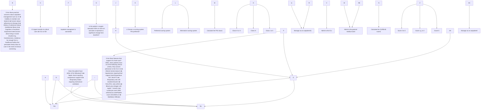
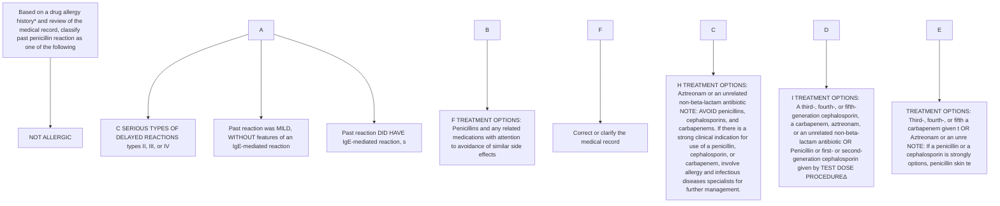
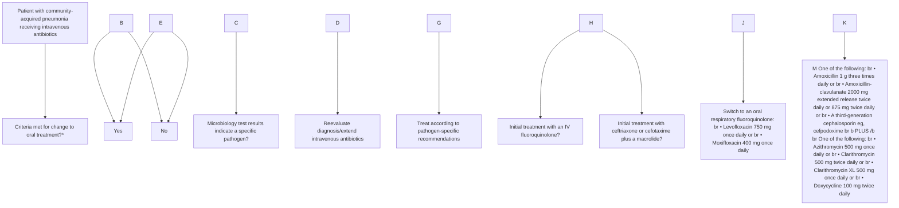
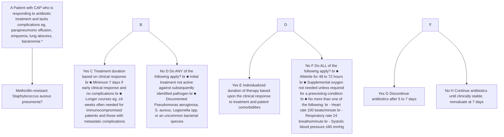

3/18/26, 5:08 PM Treatment of community-acquired pneumonia in adults who require hospitalization - UpToDate

# UpToDate®

Official reprint from UpToDate®
www.uptodate.com © 2026 UpToDate, Inc. and/or its affiliates. All Rights Reserved.

# Treatment of community-acquired pneumonia in adults who require hospitalization

**AUTHOR:** Thomas M File, Jr, MD
**SECTION EDITOR:** Julio A Ramirez, MD, FACP
**DEPUTY EDITORS:** Jennifer Mitty, MD, MPH, Han Li, MD, Sheila Bond, MD

All topics are updated as new evidence becomes available and our peer review process is complete.

Literature review current through: **Feb 2026.**
This topic last updated: **Apr 13, 2023.**

## INTRODUCTION

Community-acquired pneumonia (CAP) is defined as an acute infection of the pulmonary parenchyma in a patient who has acquired the infection in the community, as distinguished from hospital-acquired (nosocomial) pneumonia (HAP).

CAP is a common and potentially serious illness [1-5]. It is associated with considerable morbidity and mortality, particularly in older adult patients and those with significant comorbidities. (See "Morbidity and mortality associated with community-acquired pneumonia in adults").

The treatment of CAP in adults who require hospitalization will be reviewed here. A variety of other important issues related to CAP are discussed separately:

- (See "Clinical evaluation and diagnostic testing for community-acquired pneumonia in adults").
- (See "Community-acquired pneumonia in adults: Assessing severity and determining the appropriate site of care").
- (See "Treatment of community-acquired pneumonia in adults in the outpatient setting").
- (See "Epidemiology, pathogenesis, and microbiology of community-acquired pneumonia in adults").

Pneumonia in special populations, such as aspiration pneumonia, immunocompromised patients, HAP, and ventilator-associated pneumonia (VAP) are also discussed separately. (See "Aspiration pneumonia in adults" and "Epidemiology of pulmonary infections in <u>immunocompromised patients</u>" and "Treatment of hospital-acquired and ventilator-associated pneumonia in adults").

The management of coronavirus disease 2019 is discussed separately. (See "COVID-19: Management in hospitalized adults").

## DEFINITIONS

CAP is defined as an acute infection of the pulmonary parenchyma in a patient who has acquired the infection in the community, as distinguished from hospital-acquired (nosocomial) pneumonia (HAP) (table 1).

Health care-associated pneumonia (HCAP; no longer used) referred to pneumonia acquired in health care facilities (eg, nursing homes, hemodialysis centers) or after recent hospitalization [6,7]. The term HCAP was used to identify patients at risk for infection with multidrug-resistant pathogens. However, this categorization may have been overly sensitive, leading to increased, inappropriately broad antibiotic use and was thus retired [5,8-11].

Patients previously classified as having HCAP should be managed similarly to those with CAP, with the need for therapy targeting multidrug-resistant pathogens being considered on a case-by-case basis. Specific risk factors for resistance that should be assessed include recent receipt of antimicrobials, major comorbidities, functional status, and severity of illness [12,13]. As rapid molecular diagnostics and predictive algorithms advance, our accuracy in distinguishing which patients require empiric treatment for multidrug pathogens is expected to grow.

## DETERMINING THE SITE OF CARE

Determining whether a patient with CAP can be safely treated as an outpatient or requires admission to an observation unit, general medical ward, or higher acuity level of inpatient care, such as an intensive care unit (ICU), is an essential first step. Severity of illness is the most critical factor in making this determination, but other factors should also be taken into account (algorithm 1). (Related Pathway(s): 📊 Community-acquired pneumonia: Determining the appropriate site of care for adults).

Prediction rules have been developed to assist in the decision of site of care for CAP. Of the available rules, we strongly prefer the Pneumonia Severity Index (PSI) (calculator 1) because it is the most accurate and its safety and effectiveness in guiding clinical decision-making have been empirically confirmed. The CURB-65 score (calculator 2) is an alternative that can be used when a less complex scoring system for prognosis is desired, but its safety and effectiveness in guiding the initial site of treatment have not been empirically assessed. Clinical

https://www.uptodate.com/contents/treatment-of-community-acquired-pneumonia-in-adults-who-require-hospitalization/print?search=pneumonia... 1/46

3/18/26, 5:08 PM Treatment of community-acquired pneumonia in adults who require hospitalization - UpToDate
**Intensive care unit** — The distribution is different in patients with CAP who require admission to an ICU. *S. pneumoniae* is the most common, but *Legionella*, gram-negative bacilli, *Staphylococcus aureus*, and influenza are also important (<u>table 3</u>). Community-associated methicillin-resistant *S. aureus* (CA-MRSA) typically produces a necrotizing pneumonia with high morbidity and mortality. (See "<u>Epidemiology, pathogenesis, and microbiology of community-acquired pneumonia in adults</u>", section on 'S. aureus'.))

judgment should be used for all patients, incorporating the prediction rule scores as a component of the decision for hospitalization or ICU admission but not as an absolute determinant [14].

The approach to site of care is discussed in greater detail elsewhere. (See "<u>Community-acquired pneumonia in adults: Assessing severity and determining the appropriate site of care</u>", section on 'Approach to site of care'.)

## LIKELY PATHOGENS

Although a variety of bacterial pathogens can cause CAP, a limited number are responsible for the majority of cases; in addition, the causative organism is not identified in an appreciable proportion of patients (<u>table 2</u> and <u>table 3</u>). (See "<u>Epidemiology, pathogenesis, and microbiology of community-acquired pneumonia in adults</u>", section on 'Microbiology'.))

**Medical ward** — In patients who require hospitalization but not admission to an intensive care unit (ICU), the most frequently isolated pathogens are *Streptococcus pneumoniae*, respiratory viruses (eg, influenza, parainfluenza, respiratory syncytial virus, rhinovirus, and during the coronavirus disease 2019 pandemic, severe acute respiratory syndrome coronavirus 2, which has been most common cause of CAP), and, less often, *Mycoplasma pneumoniae*, *Haemophilus influenzae*, and *Legionella* spp (<u>table 3</u>).

## Risk factors for Pseudomonas or drug-resistant pathogens

**Pseudomonas (and other gram-negative bacilli)** — The strongest risk factors for infection with *Pseudomonas* and other drug-resistant gram-negative bacilli are known colonization or past infection with these organisms and hospitalization with receipt of intravenous antibiotics within the prior three months [5]. Patients with these risk factors generally require treatment with an empiric regimen that includes coverage for these organisms. The detection of gram-negative bacilli on a good-quality sputum Gram stain also warrants empiric treatment for *Pseudomonas* (<u>table 4</u>).

Other risk factors include recent antibiotic therapy of any kind, recent hospitalization, immunosuppression, pulmonary comorbidity (eg, cystic fibrosis, bronchiectasis, or repeated exacerbations of chronic obstructive pulmonary disease [COPD] that require frequent glucocorticoid and/or antibiotic use), probable aspiration, and the presence of multiple medical comorbidities (eg, diabetes mellitus, alcoholism) [15-19]. The presence of these factors should raise suspicion for infection with *Pseudomonas* and generally warrant treatment in those who are severely ill (eg, admitted to the ICU); in other patients hospitalized with CAP, the need for empiric treatment should take into account local prevalence, severity of illness, and overall clinical assessment.

In a multinational prospective cohort study evaluating 3193 patients hospitalized with CAP at 22 different sites, *Pseudomonas aeruginosa* was identified as a cause of CAP in 4.2 percent of all cases [19]. Pseudomonal isolates were drug resistant in approximately half of cases. Independent risk factors for *P. aeruginosa* infection included prior *Pseudomonas* infection/colonization (odds ratio [OR] 16.10, 95% CI 9.48-27.35), tracheostomy (OR 6.50, 95% CI 2.61-16.19), bronchiectasis (OR 2.88, 95% CI 1.65-5.05), need for respiratory or vasopressor support (OR 2.33, 95% CI 1.44-3.78), and very severe COPD (OR 2.76, 95% CI 1.25-6.06). The prevalence of pseudomonal CAP among patients with prior *Pseudomonas* infection/colonization and at least one other risk factor was 67 percent. (See "<u>Epidemiology, pathogenesis, and microbiology of community-acquired pneumonia in adults</u>", section on 'Gram-negative bacilli' and "<u>*Pseudomonas aeruginosa pneumonia*</u>").

**Methicillin-resistant Staphylococcus aureus** — The strongest risk factors for MRSA infection include known MRSA colonization or past infection with MRSA [5]. Patients with these risk factors generally require treatment with an empiric regimen that includes MRSA treatment. The presence of gram-positive cocci on a good-quality sputum Gram stain also warrants empiric MRSA treatment (<u>table 4</u>).

Other factors that raise suspicion for MRSA infection include recent antibiotic use (particularly receipt of intravenous antibiotics during hospitalization within the past three months), recent hospitalization (regardless of antibiotic use), end-stage kidney disease, participation in contact sports, injection drug use, crowded living conditions, men who have sex with men, prisoners, recent influenza-like illness, antimicrobial therapy, necrotizing or cavitary pneumonia, and presence of empyema. The presence of these factors should raise suspicion for MRSA pneumonia and generally warrants empiric MRSA treatment in those who are severely ill (eg, admitted to the ICU); in other patients hospitalized with CAP, the need for empiric treatment should take into account local prevalence, severity of illness, and overall clinical assessment.

**Drug-resistant Streptococcus pneumoniae** — Risk factors for drug-resistant *S. pneumoniae* in adults include:

- Age >65 years
- Beta-lactam, macrolide, or fluoroquinolone therapy within the past three to six months
- Alcoholism
- Medical comorbidities
- Immunosuppressive illness or therapy

https://www.uptodate.com/contents/treatment-of-community-acquired-pneumonia-in-adults-who-require-hospitalization/print?search=pneumonia... 2/46

3/18/26, 5:08 PM Treatment of community-acquired pneumonia in adults who require hospitalization - UpToDate

- Exposure to a child in a daycare center

Another risk factor is prior exposure to the health care setting such as from prior hospitalization or from residence in a long-term care facility.

Recent therapy or a repeated course of therapy with beta-lactams, macrolides, or fluoroquinolones are risk factors for pneumococcal resistance to the same class of antibiotic [20]. Thus, an antimicrobial agent from an alternative class is preferred for a patient who has recently received one of these agents.

The impact of discordant drug therapy, which refers to treatment of an infection with an antimicrobial agent to which the causative organism has demonstrated in vitro resistance, appears to vary with antibiotic class and possibly with specific agents within a class. Most studies have been performed in patients with *S. pneumoniae* infection and suggest that current levels of beta-lactam resistance generally do not cause treatment failure when appropriate agents (eg, <u>amoxicillin</u>, <u>ceftriaxone</u>, <u>cefotaxime</u>) and doses are used [21-25]. <u>Cefuroxime</u> is a possible exception with beta-lactams, and there appears to be an increased risk of macrolide failure in patients with macrolide-resistant *S. pneumoniae*.

## DIAGNOSTIC TESTING

The approach to diagnostic testing for hospitalized patients with CAP is summarized in the following table (<u>table 5</u>). In addition to the tests recommended in the table, we recommend testing for a specific organism when, based on clinical or epidemiologic data, pathogens that would not respond to usual empiric therapy are suspected (<u>table 6</u>). These include *Legionella* species, seasonal influenza, avian (H5N1, H7N9) influenza, Middle East respiratory syndrome coronavirus, community-acquired methicillin-resistant *S. aureus*, *Mycobacterium tuberculosis*, and agents of bioterrorism such as anthrax [26]. (See "<u>Clinical evaluation and diagnostic testing for community-acquired pneumonia in adults</u>").

Tests that are indicated (especially sputum Gram stain and culture and blood cultures) should ideally be performed before antibiotics have been started. However, initiation of treatment should not be delayed if it is not possible to obtain specimens immediately (eg, if the patient cannot produce a sputum specimen). As the availability and accuracy of rapid molecular diagnostics grows, we anticipate that there will be greater opportunity for early pathogen-directed treatment.

We also typically obtain a procalcitonin level at the time of diagnosis and serially thereafter to help guide antibiotic duration. (See '<u>Duration of therapy</u>' below.)

## INITIAL EMPIRIC THERAPY

Antibiotic therapy is typically begun on an empiric basis, since the causative organism is not identified in an appreciable proportion of patients (<u>table 2</u> and <u>table 3</u>) [3-5,27]. The clinical features and chest radiographic findings are not sufficiently specific to determine etiology and influence treatment decisions.

The Gram stain of respiratory secretions can be useful for directing the choice of initial therapy if performed on a good-quality sputum sample and interpreted by skilled examiners using appropriate criteria [6]. (See "<u>Clinical evaluation and diagnostic testing for community-acquired pneumonia in adults</u>", section on 'Sputum Gram stain and culture'.)

Antibiotic recommendations for hospitalized patients with CAP are divided by the site of care (medical ward or intensive care unit [ICU]). Most hospitalized patients are initially treated with an intravenous (IV) regimen but can transition to oral therapy as they improve. (See '<u>Route of administration</u>' below and '<u>Switching to oral therapy</u>' below.)

The selection of antimicrobial regimens for empiric therapy is based upon a number of factors, including:

- The most likely pathogen(s) (see '<u>Likely pathogens</u>' above)
- Clinical trials demonstrating efficacy
- Risk factors for antimicrobial resistance (see '<u>Risk factors for Pseudomonas or drug-resistant pathogens</u>' above)
- Medical comorbidities, which may influence the likelihood of a specific pathogen and may be a risk factor for treatment failure
- Epidemiologic factors such as travel and concurrent epidemics (eg, Middle East respiratory syndrome coronavirus, avian influenza) (see "<u>Avian influenza: Epidemiology and transmission</u>")

Additional factors that may affect the choice of antimicrobial regimen include the potential for inducing antimicrobial resistance, pharmacokinetic and pharmacodynamic properties, safety profile, and cost [15].

**Antimicrobial initiation**

https://www.uptodate.com/contents/treatment-of-community-acquired-pneumonia-in-adults-who-require-hospitalization/print?search=pneumonia... 3/46

3/18/26, 5:08 PM Treatment of community-acquired pneumonia in adults who require hospitalization - UpToDate

# **Timing of antibiotics** — We generally start antibiotic therapy as soon as we are confident that CAP is the appropriate working diagnosis and, ideally, within four hours of presentation for patients being admitted to the general medical ward [<u>28,29</u>]. In patients with septic shock, antibiotics should be started within one hour. (See "<u>Evaluation and management of suspected sepsis and septic shock in adults</u>", section on 'Empiric antibiotic therapy (first hour)').

Although several studies have suggested a survival benefit to early initiation of antibiotics, some experts have questioned whether it is an independent risk factor for this outcome. It is important to note, however, that a delay in antimicrobial therapy for seriously ill patients can adversely affect outcomes.

A 2016 systematic review included eight studies that evaluated time to initiation of antibiotics and noted that all of the studies were observational in design and therefore represented low-quality evidence [<u>30</u>]. The four studies that showed an association between early initiation of antibiotics and reduced mortality were the largest of the studies, and three of them included patients ≥65 years of age with greater illness severity at presentation. In contrast, the four smallest studies included adults of all ages with less severe illness and found no association between early antibiotic initiation and mortality.

Two of the larger studies showed the following findings:

- In a retrospective study of 13,771 Medicare patients, antibiotic administration within four hours of hospital arrival was associated with reductions in mortality (6.8 compared with 7.4 percent with delay in antibiotics) and length of stay (0.4 days shorter) [<u>28</u>].

- In a matched-propensity analysis of national data from the British Thoracic Society CAP audit that included 13,725 patients with CAP, adjusted 30-day inpatient mortality was lower for adults who first received antibiotics in four or fewer hours compared with more than four hours (adjusted odds ratio 0.84, 95% CI 0.74-0.94) [<u>31</u>]. However, it is not clear whether early antibiotics result in lower mortality or whether they are a marker for overall quality of care.

# **Route of administration** — Generally, we favor administration of IV antibiotics for patients hospitalized for CAP at the start of therapy because of the high mortality associated with CAP and the uncertainty of adequate gastrointestinal absorption of oral antibiotics in severely ill patients. Upon clinical improvement, IV antibiotics can be transitioned to oral therapy (see <u>'Switching to oral therapy'</u> below). Some experts use oral therapy when prescribing fluoroquinolones, macrolides, and <u>doxycycline</u> at the start of therapy in selected hospitalized patients without evidence or risk of severe pneumonia because of the high oral bioavailability of these agents. The selection of specific antibiotic regimen varies based on severity of illness and risk factors for methicillin-resistant *S. aureus* (MRSA) and *Pseudomonas* infection, as outlined below.

# Medical ward

## **Without suspicion for MRSA or Pseudomonas** — For patients admitted to a general ward without suspicion for *Pseudomonas* or other drug-resistant pathogens, we suggest (<u>⚙ algorithm 2</u>) [<u>5,32</u>]:

- Combination therapy with **ceftriaxone** (1 to 2 g IV daily), **cefotaxime** (1 to 2 g IV every 8 hours), **ceftaroline** (600 mg IV every 12 hours), <u>ertapenem</u> (1 g IV daily), or **ampicillin-sulbactam** (3 g IV every 6 hours) **plus** a macrolide (<u>azithromycin</u> [500 mg IV or orally daily] or <u>clarithromycin</u> [500 mg twice daily] or clarithromycin XL [two 500 mg tablets once daily]). <u>Doxycycline</u> (100 mg orally or IV twice daily) may be used as an alternative to a macrolide.

- Monotherapy with a respiratory fluoroquinolone (<u>levofloxacin</u> [750 mg IV or orally daily] or <u>moxifloxacin</u> [400 mg IV or orally daily] or gemifloxacin [320 mg orally daily]) is an appropriate alternative for patients who cannot receive a beta-lactam plus a macrolide.

Combination therapy with a beta-lactam plus a macrolide and monotherapy with a respiratory fluoroquinolone are of generally comparable efficacy for CAP overall [<u>30,33-38</u>]. However, many observational studies have suggested that beta-lactam plus macrolide combination regimens are associated with better clinical outcomes in patients with severe CAP, possibly due to the immunomodulatory effects of macrolides [<u>39-42</u>].

Furthermore, the severity of adverse effects (including the risk for *Clostridioides difficile* infection) and the risk of selection for resistance in colonizing organisms are generally thought to be greater with fluoroquinolones than with the combination therapy regimens. For both of these reasons, we generally prefer combination therapy with a beta-lactam plus a macrolide rather than monotherapy with a fluoroquinolone. Nevertheless, cephalosporins and other antibiotic classes also increase the risk of *C. difficile* infection. (See <u>"Clostridioides difficile infection in adults: Epidemiology, microbiology, and pathophysiology"</u>, section on <u>'Antibiotic use'</u>.)

<u>Omadacycline</u> and <u>lefamulin</u> are potential alternatives to the above agents and may be particularly appropriate for patients who are unable to use a beta-lactam and wish to avoid the potential adverse effects associated with fluoroquinolones. (See <u>'New antimicrobial agents'</u> below.)

Recent antibiotic use should also inform the decision about the most appropriate regimen; if the patient has used a beta-lactam in the prior three months, a fluoroquinolone should be chosen, if possible, and vice versa. (See <u>'Risk factors for Pseudomonas or drug-resistant pathogens'</u> above.)

https://www.uptodate.com/contents/treatment-of-community-acquired-pneumonia-in-adults-who-require-hospitalization/print?search=pneumonia... 4/46

3/18/26, 5:08 PM Treatment of community-acquired pneumonia in adults who require hospitalization - UpToDate

The approach to patients with penicillin allergy and/or cephalosporin allergy is presented below. (See <u>Penicillin and cephalosporin allergy</u> below.)

**With suspicion for MRSA or Pseudomonas** — If there is strong suspicion for MRSA, *Pseudomonas*, or other gram-negative pathogens not covered by the standard CAP regimens outlined above, coverage should be expanded (📊 table 4). (See <u>With suspicion for Pseudomonas</u> below and <u>With suspicion for MRSA</u> below.)

**Penicillin and cephalosporin allergy** — For penicillin-allergic patients, empiric antibiotic selection varies based on the type and severity of reaction ( algorithm 3).

- Patients with mild, non-immunoglobulin (Ig)E-mediated reactions to penicillins (eg, maculopapular rash) can generally receive a third- or fourth-generation cephalosporin safely. Carbapenems have broader coverage but are also reasonable and safe alternatives for most patients. Skin testing is indicated in some situations and is reviewed elsewhere. (See "<u>Choice of antibiotics in penicillin-allergic hospitalized patients</u>".)

- Patients with IgE-mediated reactions (eg, urticaria, angioedema, anaphylaxis), severe delayed reactions (eg, Stevens-Johnson syndrome, toxic epidermal necrolysis) should generally not use cephalosporins or carbapenems empirically. For these patients, our empiric selection varies based on the need to treat *Pseudomonas* ( algorithm 2):

- Patients **without** suspicion for *Pseudomonas* infection who are admitted to the general medical ward can be treated with a respiratory fluoroquinolone (<u>levofloxacin</u> [750 mg IV or orally daily]; <u>moxifloxacin</u> [400 mg IV or orally daily]; gemifloxacin [320 mg orally daily]).

Monotherapy with <u>tigecycline</u> is another alternative, but it should be limited to patients intolerant of both beta-lactams and fluoroquinolones since it has been associated with increased mortality [43-45]. <u>Omadacycline</u> and <u>lefamulin</u> are also potential alternatives in this setting, though clinical experience with these agents is limited. (See <u>'New antimicrobial agents'</u> below.)

- Most patients **with** known pseudomonal colonization, prior pseudomonal colonization, recent hospitalization with IV antibiotic use, or other strong suspicion for *Pseudomonas* infection who are admitted to the general medical ward should receive <u>levofloxacin</u> (750 mg IV daily) **plus** <u>aztreonam</u> (2 g IV every 8 hours) plus an aminoglycoside (<u>gentamicin</u>, <u>tobramycin</u>, or <u>amikacin</u>).

Patients with a prior life-threatening or anaphylactic reaction (involving urticaria, bronchospasm, and/or hypotension) to <u>ceftazidime</u> should not be given <u>aztreonam</u> unless evaluated by an allergy specialist because of the possibility of cross-reactivity. Such patients can receive <u>levofloxacin</u> plus an aminoglycoside for antipseudomonal coverage in the interim.

These regimens do not include an agent for community-acquired methicillin-resistant S. *aureus* (CA-MRSA). Agents for patients at risk for CA-MRSA are discussed below. (See <u>'With suspicion for MRSA'</u> below.)

Regimens for patients admitted to the ICU are presented below. (See <u>Penicillin and cephalosporin allergy</u> below.)

**Intensive care unit** — Patients requiring admission to an ICU are more likely to have risk factors for resistant pathogens, including CA-MRSA and *Legionella* spp <u>[6,46]</u>. Establishing an etiologic diagnosis is particularly important in such patients. (See "<u>Clinical evaluation and diagnostic testing for community-acquired pneumonia in adults</u>".)

The approach to therapy is summarized in the following algorithm ( algorithm 4) and discussed below.

**Without suspicion for Pseudomonas or MRSA** — In patients without suspicion for or microbiologic evidence of *P. aeruginosa* or MRSA, we recommend IV combination therapy with a potent antipneumococcal beta-lactam (<u>ceftriaxone</u> [1 to 2 g daily], <u>cefotaxime</u> [1 to 2 g every 8 hours], <u>ceftaroline</u> [600 mg every 12 hours], <u>ampicillin-sulbactam</u> [3 g every 6 hours], or <u>ertapenem</u> [1 g IV daily]) **plus** an advanced macrolide (<u>azithromycin</u> [500 mg daily]). Although the optimal doses of the beta-lactams (ceftriaxone, cefotaxime, ampicillin-sulbactam) have not been studied adequately, we favor the higher doses, at least initially, until the minimum inhibitory concentrations (MICs) against possible isolates (eg, *S. pneumoniae*) are known.

For the second agent, an alternative to <u>azithromycin</u> is a respiratory fluoroquinolone (<u>levofloxacin</u> [750 mg daily] or <u>moxifloxacin</u> [400 mg daily]). Regimens containing either a macrolide or fluoroquinolone have been generally comparable in clinical trials <u>[32,37,47-50]</u>. However, many observational studies have suggested that macrolide-containing regimens are associated with better clinical outcomes for patients with severe CAP, possibly due to their immunomodulatory effects <u>[39-42]</u>. For this reason, we generally favor a macrolide-containing regimen in this setting, unless there is a specific reason to avoid macrolides, such as patient allergy or intolerance.

Furthermore, the severity of adverse effects (including the risk for *C. difficile* infection) and the risk of selection for resistance in colonizing organisms are generally thought to be greater with fluoroquinolones than with other antibiotic classes. Nevertheless, cephalosporins and other antibiotic classes also increase the risk of *C. difficile* infection. (See "<u>Clostridioides difficile infection in adults: Epidemiology, microbiology, and pathophysiology</u>", section on <u>'Antibiotic use'</u>.)

Recent antibiotic use should also inform the decision about the most appropriate regimen. (See <u>'Risk factors for Pseudomonas or drug-resistant pathogens'</u> above.)

https://www.uptodate.com/contents/treatment-of-community-acquired-pneumonia-in-adults-who-require-hospitalization/print?search=pneumonia... 5/46

3/18/26, 5:08 PM Treatment of community-acquired pneumonia in adults who require hospitalization - UpToDate

# **With suspicion for Pseudomonas** — In patients who may be infected with *P. aeruginosa* or other gram-negative pathogens not covered by standard CAP regimens (particularly patients with structural lung abnormalities [eg, bronchiectasis], chronic obstructive pulmonary disease [COPD] and frequent antimicrobial or glucocorticoid use, and/or gram-negative bacilli seen on sputum Gram stain), empiric therapy should include agents effective against pneumococcus, *P. aeruginosa*, and *Legionella* spp. However, if *P. aeruginosa* or another resistant gram-negative pathogen is not isolated, coverage for these organisms should be discontinued. Acceptable regimens include combination therapy with an antipseudomonal/antipneumococcal beta-lactam antibiotic and an antipseudomonal fluoroquinolone, such as the following regimens:

- <u>Piperacillin-tazobactam</u> (4.5 g every 6 hours) **or**
- <u>Imipenem</u> (500 mg every 6 hours) **or**
- <u>Meropenem</u> (1 g every 8 hours) **or**
- <u>Cefepime</u> (2 g every 8 hours) **or**
- <u>Ceftazidime</u> (2 g every 8 hours; activity against pneumococcus more limited than agents listed above)

## **PLUS**

- <u>Ciprofloxacin</u> (400 mg every 8 hours) **or**
- <u>Levofloxacin</u> (750 mg daily)

The dose of <u>levofloxacin</u> is the same when given intravenously and orally, while the dose of <u>ciprofloxacin</u> is 750 mg orally twice daily. (See "<u>Fluoroquinolones</u>", section on '<u>Pharmacokinetics</u>'.))

# **With suspicion for MRSA** — Empiric therapy for CA-MRSA should be given to hospitalized patients with septic shock or respiratory failure requiring mechanical ventilation.

We also suggest empiric therapy of MRSA in patients with CAP admitted to the ICU who have any of the following: gram-positive cocci in clusters seen on sputum Gram stain, known colonization with MRSA, risk factors for colonization with MRSA (eg, end-stage kidney disease, contact sport participants, people who inject drugs, those living in crowded conditions, men who have sex with men, prisoners), recent influenza-like illness, antimicrobial therapy (particularly with a fluoroquinolone) in the prior three months, necrotizing or cavitary pneumonia, or presence of empyema. For hospitalized patients with less severe pneumonia who have these risk factors, we generally determine the need for empiric MRSA treatment based on local prevalence and our overall clinical assessment.

For treatment of MRSA, empiric regimens should include either <u>vancomycin</u> (📊 table 7) or <u>linezolid</u> (600 mg IV every 12 hours).

In all patients treated empirically for MRSA, we obtain a rapid nasal polymerase chain reaction (PCR) for MRSA (when available) in addition to Gram stain and culture of sputum or other respiratory tract infection to help guide subsequent therapy [5,51]. For those who are stable or improving with negative PCR and/or sputum Gram stain results, MRSA coverage can generally be discontinued.

<u>Clindamycin</u> (600 mg IV or orally three times daily) may be used as an alternative to <u>vancomycin</u> or <u>linezolid</u> if the isolate is known to be susceptible. However, clindamycin should not be used for empiric treatment, as resistance is increasingly common in many centers. <u>Ceftaroline</u> is active against most strains of MRSA but is not US Food and Drug Administration (FDA) approved for pneumonia caused by *S. aureus*. If MRSA is not isolated, coverage for this organism should be discontinued. (See '<u>Community-acquired MRSA</u>' below.)

The combination of <u>vancomycin</u> and <u>piperacillin-tazobactam</u> has been associated with acute kidney injury. In patients who require an anti-MRSA agent and an antipseudomonal/antipneumococcal beta-lactam, options include using a beta-lactam other than piperacillin-tazobactam (eg, <u>cefpeme</u> or <u>ceftazidime</u>) or, if piperacillin-tazobactam is favored, using <u>linezolid</u> instead of vancomycin. (See "<u>Vancomycin: Parenteral dosing, monitoring, and adverse effects in adults</u>", section on '<u>Acute kidney injury</u>'.))

# **Penicillin and cephalosporin allergy** — As noted above, for penicillin-allergic patients, the type and severity of reaction should be assessed. (See '<u>Penicillin and cephalosporin allergy</u>' above.)

For penicillin-allergic patients, if a skin test is positive or if there is significant concern to warrant avoidance of a cephalosporin or carbapenem, an alternative regimen should be given.

The appropriate regimen depends upon several factors, including the risk of *Pseudomonas* infection (📊 table 4 and 🧬 algorithm 4):

- For most patients **without** suspicion for *Pseudomonas* infection who are admitted to the ICU, a respiratory fluoroquinolone **plus** <u>aztreonam</u> (2 g IV every 8 hours) should replace the beta-lactams recommended for those without penicillin allergy.

<u>Ceftazidime</u> and <u>aztreonam</u> have similar side chain groups, and cross-reactivity between the two drugs is variable. Patients with a prior life-threatening or anaphylactic reaction (involving urticaria, bronchospasm, and/or hypotension) to ceftazidime should not be given aztreonam unless evaluated by an allergy specialist because of the possibility of cross-reactivity. Such patients can receive <u>levofloxacin</u> plus an aminoglycoside for antipseudomonal coverage in the interim.

https://www.uptodate.com/contents/treatment-of-community-acquired-pneumonia-in-adults-who-require-hospitalization/print?search=pneumonia... 6/46

3/18/26, 5:08 PM Treatment of community-acquired pneumonia in adults who require hospitalization - UpToDate

The prevalence of cross-sensitivity between <u>ceftazidime</u> and <u>aztreonam</u> has been estimated at <5 percent of patients, based upon limited data. A reasonable approach in those with mild past reactions to ceftazidime (eg, uncomplicated maculopapular rash) would involve informing the patient of the low risk of cross-reactivity and administering aztreonam with a graded challenge (1/10 dose followed by a one-hour period of observation; if no symptoms, give the full dose followed by another hour of observation). (See "<u>Immediate cephalosporin hypersensitivity: Allergy evaluation, skin testing, and cross-reactivity with other beta-lactam antibiotics</u>", section on 'Carbapenems and monobactams' and "<u>An approach to the patient with drug allergy</u>", section on 'Graded challenge and drug provocation'.)

- Most patients **with** known pseudomonal colonization or other strong suspicions for *Pseudomonas* infection (<u>table 4</u>) who are admitted to the ICU should receive <u>levofloxacin</u> (750 mg IV or orally daily) **plus** <u>aztreonam</u> (2 g IV every 8 hours) plus an aminoglycoside (<u>gentamicin, tobramycin, or amikacin</u>). Patients with a prior life-threatening or anaphylactic reaction (involving urticaria, bronchospasm, and/or hypotension) to <u>ceftazidime</u> should not be given aztreonam unless evaluated by an allergy specialist because of the possibility of cross-reactivity. Such patients can receive levofloxacin plus an aminoglycoside for antipseudomonal coverage in the interim.

These regimens do not include an agent for CA-MRSA. Agents for patients at risk for CA-MRSA are discussed below. (See '<u>Community-acquired MRSA</u>' below.)

## **Adjunctive glucocorticoids** — The role of adjunctive glucocorticoid treatment for CAP is evolving. The rationale for use is to reduce the inflammatory response to pneumonia, which may in turn reduce progression to lung injury, ARDS, and mortality. Based on randomized trials, the greatest benefit is for patients with impending respiratory failure or those requiring mechanical ventilation, particularly when glucocorticoids are given early in the course.

- For most immunocompetent patients with respiratory failure due to CAP who require invasive or non-invasive mechanical ventilation or with significant hypoxemia (ie, PaO2:FiO2 ratio <300 with an FiO2 requirement of ≥50 percent and use of either high flow nasal cannula or a nonrebreathing mask), we suggest continuous infusion of <u>hydrocortisone</u> 200 mg daily for 4 to 7 days followed by a taper. Because mortality benefit appears to be greatest with early initiation, hydrocortisone should ideally be started as soon as possible. The decision to taper glucocorticoids at day 4 or 7 is based on clinical response.

- Because glucocorticoid use may impair the immune control of influenza, tuberculosis, and fungal pathogens, we avoid <u>hydrocortisone</u> use in patients with CAP caused by these pathogens or for patients with concurrent acute viral hepatitis or active herpes viral infection, which may also be worsened with glucocorticoid use.

- For immunocompromised patients, we weigh the risks and benefits of use on an individual basis.

- While we do not treat CAP with adjunctive glucocorticoids in most other circumstances, we do not withhold glucocorticoids when they are indicated for other reasons, including:
  - Refractory septic shock (see "<u>Corticosteroid therapy for refractory septic shock in adults</u>")
  - Acute exacerbations of COPD (see "<u>COPD exacerbations: Management</u>", section on 'Glucocorticoids (inpatient)')
  - COVID-19 (see "<u>COVID-19: Management in hospitalized adults</u>", section on 'Dexamethasone and other glucocorticoids')

In a multi-center randomized trial of 795 patients admitted to the ICU for severe CAP, administration of a continuous infusion of <u>hydrocortisone</u> within 20 hours of admission reduced 28-day mortality by 5.6 percent (95% CI -9.6 to -1.7 percent) when compared with placebo [52]. Severe CAP was defined as CAP requiring invasive or noninvasive mechanical ventilation, FiO2 requirement of ≥50 percent and use high flow nasal cannula or a nonrebreathing mask with a PaO2:FiO2 <300, or Pneumonia Severity Index >130. The incidence of endotracheal intubation and vasopressor initiation were also reduced (hazard ratio [HR] 0.59 [95% CI 0.40-0.86] and HR 0.59 [95% CI 0.43-0.82] respectively). Subset analyses suggest that mortality benefit could be greater in patients with CRP levels >15 mg/dL and in patients in whom no pathogen was identified, however, the numbers in each subset are too small to draw conclusions from. No significant difference in hospital-acquired infections, gastrointestinal bleeding, or other adverse events was detected. Patients with septic shock, immunocompromise, pregnancy, influenza, tuberculosis, fungal infections, active herpes viral infections, and acute viral hepatitis were excluded from the trial.

This trial follows several meta-analyses and smaller trials evaluating the efficacy of adjunctive glucocorticoids in hospitalized patients with CAP [53-60]. While most suggested a reduction in mortality, particularly among patients with severe CAP, the patient population that would benefit most was not precisely defined and methodologic limitations precluded high confidence in results [61-63]. As example, one trial comparing <u>methylprednisolone</u> versus placebo in >500 patients with severe CAP (based on ATS/IDSA criteria) did not find a significant difference in 60-day mortality (16 percent versus 18 percent, adjusted odds ratio 0.90, 95% CI 0.57–1.40) or other outcomes, but the trial was underpowered to detect a true difference; in addition, glucocorticoids were not consistently given early in the patient's course, which may have lessened their effect [60]. One meta-analyses showed an absolute risk reduction of 5 percent (risk ratio [RR] 0.39, 95% CI 0.20-0.77) [53]; another, based on individual patient data, detected a smaller reduction in absolute risk (3.2 percent) that did not reach statistical significance (RR 0.70, 95% CI 0.44-1.13). In each, estimates in risk reduction were based on subgroup analyses of small trials evaluating <600 patients in total. [61-66]

https://www.uptodate.com/contents/treatment-of-community-acquired-pneumonia-in-adults-who-require-hospitalization/print?search=pneumonia... 7/46

3/18/26, 5:08 PM Treatment of community-acquired pneumonia in adults who require hospitalization - UpToDate

Whether the mortality benefit of adjunctive glucocorticoid therapy extends to other hospitalized patients is uncertain. Modest mortality benefits have been detected in meta-analyses that have included all hospitalized patients with CAP, but inconsistently so <u>[53-59]</u>. One meta-analysis evaluating 12 randomized trials involving over 1900 patients hospitalized with CAP showed a 2.6 percent absolute reduction in mortality in patients who received glucocorticoids compared with placebo (5.3 versus 7.9 percent; RR 0.67, 95% CI 0.45-1.01) <u>[53]</u>. However, the detected risk reduction was largely driven by the mortality benefit observed in patients with severe CAP.

Harms associated with glucocorticoid use are not trivial, thus the threshold to use them in patients with less severe illness is higher. An increase in serious adverse events with glucocorticoid use was not detected in the above trials and meta-analyses <u>[53-57]</u>, however, most trials excluded patients at risk for adverse events, including immunocompromised patients, pregnant women, patients who had recent gastrointestinal bleeding, and patients at increased risk of neuropsychiatric side effects <u>[53]</u>. Hyperglycemia was consistently reported with corticosteroid use when compared with placebo <u>[53,58]</u>. One randomized trial comparing bundled care that included adjunctive glucocorticoid use versus usual care for 917 patients hospitalized with CAP, adjunctive glucocorticoid use was associated with a higher rate of gastrointestinal bleeding (2.2 versus 0.7 percent); no difference in mortality, length of stay, or hospital readmission was found <u>[67]</u>. The baseline severity of illness was low, with only 2.5 percent of patients admitted to the ICU; thus, potential benefits would be difficult to detect. Observational data also suggest that short-term glucocorticoid use may lead to other harms such as fracture or thromboembolism <u>[68]</u>.

Whether the benefits and harms of glucocorticoids vary by pathogen is also uncertain. In patients with influenza infection and *Aspergillus* infection, glucocorticoid use has been associated with worse outcomes <u>[69,70]</u>. We therefore avoid glucocorticoid use in patients with CAP caused by influenza or fungal pathogen, apart from SARS-CoV-2. (See "<u>COVID-19: Management in hospitalized adults</u>", section on <u>'Dexamethasone and other glucocorticoids'</u>.)

Because glucocorticoids have a general immunosuppressive effect, we also avoid glucocorticoid use in patients with CAP that is caused by a pathogen for which no antimicrobial therapy is available.

**Influenza therapy** — Antiviral treatment is recommended as soon as possible for all persons with suspected or confirmed influenza requiring hospitalization or who have progressive, severe, or complicated influenza infection, regardless of previous health or vaccination status <u>[71]</u>.

## SUBSEQUENT MANAGEMENT

**Clinical response to therapy** — With appropriate antibiotic therapy, some improvement in the patient's clinical course is usually seen within 48 to 72 hours (📊 table 8). Patients who do not demonstrate some clinical improvement within 72 hours are considered nonresponders.

The time course of the clinical response to therapy is illustrated by the following observations:

- In a prospective multicenter cohort study of 686 adults hospitalized with CAP, the median time to becoming afebrile was two days when fever was defined as 38.3°C (101°F) and three days when defined as either 37.8°C (100°F) or 37.2°C (99°F) <u>[72]</u>. However, fever in patients with lobar pneumonia may take three days or longer to improve.
- In a second prospective multicenter trial of 1424 patients hospitalized with CAP, the median time to stability (defined as resolution of fever, heart rate <100 beats/minute, respiratory rate <24 breaths/minute, systolic blood pressure of ≥90 mmHg, and oxygen saturation ≥90 percent for patients not receiving prior home oxygen) was four days <u>[73]</u>.

Although a clinical response to appropriate antibiotic therapy is seen relatively quickly, the time to resolution of all symptoms and radiographic findings is more prolonged. With pneumococcal pneumonia, for example, the cough usually resolves within eight days, and auscultatory crackles clear within three weeks. (See "<u>Pneumococcal pneumonia in patients requiring hospitalization</u>".)

In addition, as many as 87 percent of inpatients with CAP have persistence of at least one pneumonia-related symptom (eg, fatigue, cough with or without sputum production, dyspnea, chest pain) at 30 days compared with 65 percent by history in the month prior to the onset of CAP <u>[74]</u>. Patients should be told that some symptoms can last this long so that they are able to set reasonable expectations for their clinical course. (See "<u>Morbidity and mortality associated with community-acquired pneumonia in adults</u>", section on 'Short-term morbidity and mortality'.)

Issues relating to nonresolving pneumonia are discussed in detail separately. (See "<u>Nonresolving pneumonia</u>".)

**Radiographic response** — Radiographic improvement typically lags behind the clinical response <u>[18,75-77]</u>. This issue was addressed in a prospective multicenter trial of 288 patients hospitalized for severe CAP; the patients were followed for 28 days in order to assess the timing of resolution of chest radiograph abnormalities <u>[75]</u>. The following findings were noted:

- At day 7, 56 percent had clinical improvement but only 25 had resolution of chest radiograph abnormalities.
- At day 28, 78 percent had attained clinical cure but only 53 percent had resolution of chest radiograph abnormalities. The clinical outcomes were not significantly different between patients with and without deterioration of chest radiograph findings during the follow-up period.
- Delayed radiographic resolution was independently associated with multilobar disease.

https://www.uptodate.com/contents/treatment-of-community-acquired-pneumonia-in-adults-who-require-hospitalization/print?search=pneumonia... 8/46

3/18/26, 5:08 PM Treatment of community-acquired pneumonia in adults who require hospitalization - UpToDate

In other studies, the timing of radiologic resolution of the pneumonia varied with patient age and the presence of underlying lung disease [76,77]. The chest radiograph usually cleared within four weeks in patients younger than 50 years of age without underlying pulmonary disease. In contrast, resolution could be delayed for 12 weeks or more in older individuals and in those with underlying lung disease.

## Patients who respond to therapy

**Narrowing therapy** — If a bacterial pathogen has been established based upon reliable microbiologic methods and there is no laboratory or epidemiologic evidence of coinfection, we recommend narrowing therapy ("deescalation") to target the specific pathogen in order to avoid antibiotic overuse. The results of diagnostic studies that provide identification of a specific etiology within 24 to 72 hours can be useful for guiding continued therapy. (See <u>Clinical evaluation and diagnostic testing for community-acquired pneumonia in adults</u>.)

Pathogen-specific therapy for specific bacterial organisms is summarized in the table (📋 table 9) and discussed in greater detail separately. (See <u>Pneumococcal pneumonia in patients requiring hospitalization</u> and <u>Mycoplasma pneumoniae infection in adults</u> and <u>Pneumonia caused by Chlamydia pneumoniae in adults</u> and <u>Treatment and prevention of Legionella infection</u> and <u>Pseudomonas aeruginosa pneumonia</u> and <u>Clinical features, diagnosis, and treatment of Klebsiella pneumoniae infection</u> and <u>Seasonal influenza in nonpregnant adults: Treatment</u>.)

In a randomized trial, pathogen-directed treatment (PDT) was compared with empiric broad-spectrum antibiotic treatment (EAT) in 262 hospitalized patients with CAP [78]. PDT was based upon microbiologic studies (rapid diagnostic tests) or clinical presentation; EAT patients received a beta-lactam-beta-lactamase inhibitor plus <u>erythromycin</u> or, if admitted to the intensive care unit (ICU), <u>ceftazidime</u> and erythromycin. Overall, clinical outcomes (length of stay, 30-day mortality, fever resolution, and clinical failure) were the same for both groups. Adverse events were more frequent in the EAT group but were primarily related to the specific antimicrobial choice (ie, erythromycin).

Several studies also support deescalation of empiric methicillin-resistant *S. aureus* (MRSA) treatment for patients who have negative MRSA nasal screening results [51,79,80]. In one meta-analysis of 22 studies evaluating MRSA screening results from >5000 patients with CAP or hospital-acquired pneumonia, the negative predictive value of MRSA nasal screening was 96.5 percent (based on an expected MRSA prevalence of 10 percent) [51]. The negative predictive value rose to 98.1 percent when the analysis was limited to CAP/health care-associated pneumonia (HCAP). In contrast, the positive predictive value was substantially lower, both overall (44.8 percent) and for patients with CAP/HCAP (56.8 percent). Taken together, these findings suggest that discontinuing empiric MRSA treatment for patients with negative nasal screening results is generally safe and can help avoid unnecessary antibiotic exposure.

**Switching to oral therapy** — Patients requiring hospitalization for CAP are generally begun on intravenous (IV) therapy (see 'Route of <u>administration</u>' above). They can be switched to oral therapy when they are improving clinically, are hemodynamically stable, are able to take oral medications, and have a normally functioning gastrointestinal tract ( algorithm 5).

If the pathogen has been identified, the choice of oral antibiotic therapy is based upon the susceptibility profile (📋 table 9). If a pathogen is not identified, the choice of antibiotic for oral therapy is usually either the same as the IV antibiotic or in the same drug class. If *S. aureus*, *Pseudomonas*, or a resistant gram-negative bacillus have not been isolated from a good-quality sputum specimen, then empiric therapy for these organisms is not necessary. (See <u>Sputum cultures for the evaluation of bacterial pneumonia</u>.)

The choice of oral regimen depends on the risk of drug-resistant *S. pneumoniae* and on the initial IV regimen:

- In patients who are treated with the combination of an IV beta-lactam and a macrolide who have risk factors for drug-resistant *S. pneumoniae* (DRSP), we replace the IV beta-lactam with high-dose <u>amoxicillin</u> (1 g orally three times daily) to complete the course of therapy. When DRSP is not a concern, amoxicillin can be given at a dose of 500 mg orally three times daily or 875 mg orally twice daily. In patients who have already received 1.5 g of <u>azithromycin</u> who do not have *Legionella* pneumonia, we do not continue atypical coverage. Conversely, in patients who have not received 1.5 g of azithromycin, we give amoxicillin in combination with a macrolide or <u>doxycycline</u>. An alternative for patients without risk factors for DRSP is to give a macrolide or doxycycline alone to complete the course of therapy. The dosing for macrolides and doxycycline is as follows (see 'Risk factors for <u>Pseudomonas or drug-resistant pathogens</u>' above and <u>"Treatment of community-acquired pneumonia in adults in the outpatient setting"</u>, section on 'Empiric antibiotic treatment'):

- <u>Azithromycin</u> (500 mg once daily)
  - <u>Clarithromycin</u> (500 mg twice daily)
  - <u>Clarithromycin</u> XL (two 500 mg tablets [1000 mg] once daily)
  - <u>Doxycycline</u> (100 mg twice daily)

- Patients who are treated initially with an IV respiratory fluoroquinolone can switch to the oral formulation of the same agent (eg, <u>levofloxacin</u> 750 mg once daily or <u>moxifloxacin</u> 400 mg once daily) to complete the course of therapy.

The duration of therapy is discussed below. (See <u>Duration of therapy</u> below.)

https://www.uptodate.com/contents/treatment-of-community-acquired-pneumonia-in-adults-who-require-hospitalization/print?search=pneumonia... 9/46

3/18/26, 5:08 PM Treatment of community-acquired pneumonia in adults who require hospitalization - UpToDate

Two prospective observational studies in 253 patients evaluated the clinical outcome of an early switch from IV to oral therapy in the treatment of CAP [<u>81,82</u>]. Patients met the following criteria prior to switching: resolution of fever, improvement in respiratory function, decrease in white blood cell count, and normal gastrointestinal tract absorption. Only two patients failed treatment, and the protocol was associated with high patient satisfaction [<u>82</u>].

Similar outcomes were noted in a multicenter randomized trial in the Netherlands of 265 patients with CAP (mean age 70 years) admitted to nonintensive care wards [<u>83</u>]. Patients were initially treated with three days of IV antibiotics and, when clinically stable, were assigned either to oral antibiotics to complete a total course of 10 days or to a standard regimen of 7 days of IV antibiotics. There was no difference in 28-day mortality (4 versus 2 percent) or clinical cure rate (83 versus 85 percent), while the length of hospital stay was reduced in the oral switch group by a mean of 1.9 days (9.6 versus 11.5 days).

In another randomized trial, a three-step pathway that involved early mobilization of patients in combination with the use of objective criteria for switching to an oral antibiotic regimen and for deciding on hospital discharge was compared with usual care [<u>84</u>]. The median length of stay was significantly shorter in the patients who were assigned to the three-step pathway (3.9 versus 6 days). In addition, the median duration of IV antibiotics was significantly shorter in the patients who were assigned to the three-step pathway (2 versus 4 days). More patients assigned to usual care experienced adverse drug reactions (4.5 versus 16 percent). No significant differences were observed in the rate of readmission, the case-fatality rate, or patients' satisfaction with care.

Documentation of pneumococcal bacteremia does not appear to alter the effect of switching to oral therapy early (no clinical failures in 18 such patients switched based upon the above criteria in one report) [<u>85</u>].

## **Duration of hospitalization** — Hospital discharge is appropriate when the patient is clinically stable from the pneumonia, can take oral medication, has no other active medical problems, and has a safe environment for continued care; patients do not need to be kept overnight for observation following the switch. Early discharge based on clinical stability and criteria for switch to oral therapy is encouraged to reduce unnecessary hospital costs and hospital-associated risks, including iatrogenic complications and greater risk for antimicrobial resistance.

Several studies have shown that it is not necessary to observe stable patients overnight after switching from IV to oral therapy, although this has been common practice [<u>86,87</u>]. As an example, a retrospective review of the United States Medicare National Pneumonia Project database compared outcomes between patients hospitalized for CAP who were not (n = 2536) and who were (n = 2712) observed overnight after switching to oral therapy [<u>87</u>]. The following findings were noted:

- No significant difference in 14-day hospital readmission rate (7.8 versus 7.2 percent)
- No significant difference in the 30-day mortality rate (5.1 versus 4.4 percent)

The importance of clinical stability at discharge was illustrated in a prospective observational study of 373 Israeli patients discharged with a diagnosis of CAP [<u>88</u>]. On the last day of hospitalization, seven parameters of instability were evaluated (temperature >37.8°C [100°F], respiratory rate >24 breaths/minute, heart rate >100 beats/minute, systolic blood pressure [SBP] ≤90 mmHg, oxygen saturation <90 percent on room air, inability to receive oral nutrition, and change of mental status from baseline). At 60 days postdischarge, patients with at least one parameter of instability at discharge were significantly more likely to have died or required readmission than patients with no parameters of instability (death rates 14.6 versus 2.1 percent; readmission rates 14.6 versus 6.5 percent).

As noted above, in one trial, a three-step pathway that involved early mobilization of patients in combination with the use of objective criteria for switching to an oral antibiotic regimen and for deciding on hospital discharge was compared with usual care [<u>84</u>]. The median length of stay was significantly shorter in the patients who were assigned to the three-step pathway (3.9 versus 6.0 days).

## **Duration of therapy**

### **General approach** — Based upon the available data, we agree with the recommendation of the American Thoracic Society (ATS)/Infectious Diseases Society of America (IDSA) guidelines that patients with CAP should generally be treated for a minimum of five days [<u>4,5</u>].

Before stopping therapy, the patient should be afebrile for 48 to 72 hours, breathing without supplemental oxygen (unless required for preexisting disease), and have no more than one clinical instability factor (defined as heart rate >100 beats/minute, respiratory rate >24 breaths/minute, and SBP ≤90 mmHg) (algorithm 6). Most patients become clinically stable within three to four days of starting antibiotic treatment [<u>72,73,89</u>]. Thus, the recommended duration for patients with good clinical response within the first two to three days of therapy is usually five to seven days total.

Similarly to the ATS/IDSA, we do not use procalcitonin to help decide whether to start antibiotics in patients with CAP [<u>5</u>]. However, we sometimes use procalcitonin to help guide the decision to stop antibiotics (algorithm 7). We generally obtain a level at the time of diagnosis and repeat the level every two days in patients who are clinically stable. We determine the need for continued antibiotic therapy based on clinical improvement, serial procalcitonin levels, microbiologic diagnosis, and the presence of complications. (See <u>"Procalcitonin use in lower respiratory tract infections"</u>, section on 'Community-acquired pneumonia in hospitalized patients'.)

https://www.uptodate.com/contents/treatment-of-community-acquired-pneumonia-in-adults-who-require-hospitalization/print?search=pneumoni... 10/46

3/18/26, 5:08 PM Treatment of community-acquired pneumonia in adults who require hospitalization - UpToDate

Longer duration of therapy is needed for certain patients even if they are clinically stable and procalcitonin levels are low:

- If the initial therapy was not active against the subsequently identified pathogen (see 'Clinical response to therapy' above)
- If extrapulmonary infection is identified (eg, meningitis or endocarditis)
- If the patient has pneumonia caused by *P. aeruginosa* or pneumonia caused by some unusual and less common pathogen (eg, <u>Burkholderia pseudomallei</u>, fungus) (see "<u>Pseudomonas aeruginosa pneumonia</u>", section on 'Directed antimicrobial therapy' and "<u>Treatment and prevention of Legionella infection</u>" and "<u>Treatment and prevention of Legionella infection</u>", section on 'Treatment of other Legionella infections')
- If the patient has necrotizing pneumonia, empyema, or lung abscess [90]

Longer treatment durations (eg, ≥7 days) should also be considered for patients with parapneumonic effusions. Patients with uncomplicated effusions can typically be treated with antibiotics alone. For these patients, we typically treat until there is both clear clinical and radiographic response, which often requires a 7- to 14-day course of therapy. The intent of the longer course is to prevent relapse and/or the development of empyema. For those with complicated parapneumonic effusions, drainage in addition to a longer course of antibiotics is needed for cure. (See "<u>Management and prognosis of parapneumonic pleural effusion and empyema in adults</u>").

For the treatment of methicillin-resistant *S. aureus* (MRSA) pneumonia without metastatic infection, duration will vary. For patients with MRSA pneumonia without complications (eg, bacteremia), we generally treat for approximately seven days, provided that they are responding to therapy within 72 hours of starting treatment. For patients with MRSA pneumonia complicated by bacteremia, a minimum of two weeks of treatment is needed. Longer courses (eg, ≥4 weeks) are needed for patients with metastatic complications of bacteremia and for immunocompromised patients. (See "<u>Methicillin-resistant Staphylococcus aureus (MRSA) in adults: Treatment of bacteremia</u>").

Several meta-analyses support a five- to seven-day antibiotic treatment regimen for most patients with CAP. In one meta-analysis of 21 trials evaluating 4861 patients with CAP, no significant difference in clinical cure or relapse rates were detected when comparing antibiotic durations of ≤6 days versus durations of ≥7 days [91-93]. Subgroup analyses suggest that these findings hold true regardless of treatment setting or disease severity. However, the number of patients with severe pneumonia included in the meta-analysis was likely small. Mortality and serious adverse event rates were lower among those treated with shorter courses (risk ratio [RR] 0.52, 95% CI 0.33-0.82, and RR 0.73, 95% CI 0.55-0.97, respectively). Trials included in this analysis compared antibiotics from different classes and/or antibiotics with different half-lives, which may confound results. However, in a previous meta-analysis of five randomized trials evaluating adults with CAP comparing short (3 to 7 days) versus long (7 to 10 days) antibiotic courses, no differences in clinical success, relapse, or mortality were detected [92].

In a multicenter trial designed to validate the ATS/IDSA guidelines on antibiotic duration for CAP, 312 hospitalized patients with CAP were randomized to an intervention or control group on day 5 of antibiotic therapy [94]. In the intervention group, antibiotics were discontinued for patients whose temperature was ≤37.8°C (100°F) for at least 48 hours and who had no more than one CAP-associated sign of clinical instability. In the control group, antibiotic duration was determined by the treating physician. Antibiotic duration was shorter in the intervention group (median 5 versus 10 days); 70 percent of patients in the intervention group received only five days of antibiotics compared with 3 percent in the control group. In the intention-to-treat analysis, clinical success was similar in the intervention group and the control group at day 10 (56 versus 49 percent) and day 30 (92 versus 89 percent). Mean CAP symptom questionnaire scores were similar between the intervention and control groups at days 5 and 10. There were also no differences in the secondary outcomes of in-hospital mortality, 30-day mortality, and pneumonia recurrence. Readmission at day 30 was less common in the intervention group than in the control group (1 versus 7 percent).

Data supporting the efficacy of shorter courses of therapy is growing. A randomized trial compared early cessation of antibiotics (at day 3) for patients who met prespecified stability criteria with an 8-day course of therapy in >300 noncritically ill patients hospitalized with CAP [95]. In the early cessation group, approximately 69 percent of patients met stability criteria at day 3 and antibiotics were stopped. In both intention-to-treat and per-protocol analyses, clinical cure, adverse event, and 30-day mortality were similar between groups. While this study suggests that antibiotics can be safely discontinued for selected patients who rapidly respond to treatment, it is uncertain whether these findings are generalizable. The percentage of patients with bacterial CAP versus viral CAP is unknown; similarly, rapid response to treatment could indicate the initial diagnosis of CAP was incorrect.

Despite these data, patients are often treated with antibiotics for longer than necessary [96,97]. In a cohort study evaluating >6400 patients hospitalized with pneumonia in the United States from 2017 to 2018, approximately two-thirds received antibiotics for a longer duration than recommended by ATS/IDSA guidelines [97]. Antibiotics prescribed at transition from hospital to outpatient care accounted for most of the excess use. Among patients with CAP, the median duration was eight days overall and the median excess duration was two days. Cumulatively, 2526 excess days of treatment per 1000 patients hospitalized with pneumonia were given. Longer courses of therapy were not associated with greater treatment success; however, patient-reported adverse events (primarily diarrhea and rash) were 5 percent higher for each excess day of antibiotic use (95% CI 2-8 percent).

Antimicrobial stewardship programs can help to shorten the duration of antibiotics and narrow the spectrum of antibiotics [98]. (See <u>"Antimicrobial stewardship in hospital settings"</u>.))

https://www.uptodate.com/contents/treatment-of-community-acquired-pneumonia-in-adults-who-require-hospitalization/print?search=pneumonia... 11/46

3/18/26, 5:08 PM Treatment of community-acquired pneumonia in adults who require hospitalization - UpToDate

# **Early antibiotic discontinuation** — Antibiotics can be discontinued early in patients who are ultimately found to have an alternate diagnosis (eg, heart failure) or in whom viral CAP is the likely diagnosis (<u>algorithm 8</u>).

Making the diagnosis of viral CAP is challenging. Viruses are frequently cofactors for bacterial CAP, thus, a positive test for respiratory virus does not exclude the possibility of concurrent bacterial infection. However, when a patient is clinically improving, a viral pathogen has been detected on testing, and no bacterial pathogen has been identified after a comprehensive evaluation (ie, sputum gram stain and culture, blood cultures, urine antigen testing), stopping antibiotics is reasonable. A low procalcitonin level (ie, <0.25 ng/mL) also supports the diagnosis of viral CAP and the decision to stop antibiotic therapy (<u>algorithm 7</u>). (See "<u>Procalcitonin use in lower respiratory tract infections</u>".)

# **Clinical follow-up after discharge** — Patients who have been discharged from the hospital with CAP should have a follow-up visit, usually within one week. In addition, a later visit is often indicated to assess for resolution of pneumonia.

# **Follow-up chest radiograph** — Most patients with clinical resolution after treatment do not require a follow-up chest radiograph, as radiographic response generally lags behind clinical improvement [7,75]. However, follow-up clinic visits are good opportunities to review the patient's risk for lung cancer based on age, smoking history, and recent imaging findings (<u>algorithm 9</u>).

## SPECIFIC CONSIDERATIONS

# **Community-acquired MRSA** — As discussed above, empiric therapy for community-acquired methicillin-resistant *S. aureus* (CA-MRSA) should be given to hospitalized patients with septic shock or respiratory failure requiring mechanical ventilation. It should also be given to those with known MRSA colonization, gram-positive cocci on sputum Gram stain, history of MRSA infection, or other strong clinical suspicion for MRSA infection (<u>table 4</u>). (See 'Methicillin-resistant *Staphylococcus aureus*' above.)

We generally prefer <u>linezolid</u> over <u>vancomycin</u> when CA-MRSA is suspected (eg, young, otherwise healthy patient who plays contact sports presenting with necrotizing pneumonia) because of linezolid's ability to inhibit bacterial toxin production [99]. However, in each case, we select between these agents based on other factors such as renal function, monitoring convenience, potential drug interactions (eg, linezolid can interact with selective serotonin-reuptake inhibitors), blood cell counts, and quality of intravenous access.

The data regarding the therapy of pneumonia caused by CA-MRSA are limited. A randomized trial showed superiority in clinical outcomes, but not mortality, of <u>linezolid</u> compared with <u>vancomycin</u> in hospital-acquired or health care-associated pneumonia caused by MRSA [99]. In contrast, in a meta-analysis of nine randomized trials of patients with hospital-acquired pneumonia that compared linezolid and vancomycin, there were no differences in mortality or clinical response [100]. The treatment of MRSA pneumonia is discussed in detail separately.

Although CA-MRSA is typically susceptible to more antibiotics than hospital-acquired MRSA, it appears to be more virulent [101]. CA-MRSA often causes a necrotizing pneumonia [102,103]. The strain causing CA-MRSA is known as "USA 300" and the gene for Panton-Valentine leukocidin (PVL) characterizes this strain [104-108]. However, an animal study suggests that the virulence of CA-MRSA strains is probably not due to PVL [109]. In addition, one study of patients with hospital-acquired pneumonia due to MRSA observed that the severity of infection and clinical outcome was not influenced by the presence of the PVL gene [110]. It is possible that other cytolytic toxins play a role in the pathogenesis of CA-MRSA infections. <u>Vancomycin</u> does not decrease toxin production, whereas <u>linezolid</u> has been shown to reduce toxin production in experimental models [111,112].

One concern with <u>vancomycin</u> is the increasing minimum inhibitory concentrations (MICs) of MRSA that have emerged in recent years, which may reduce the efficacy of vancomycin in pulmonary infection. In patients with a MRSA isolate with an increased vancomycin MIC (≥2 mcg/mL), we prefer <u>linezolid</u>. Vancomycin-intermediate and vancomycin-resistant *S. aureus* infection is discussed in greater detail separately. (See "<u>Staphylococcus aureus bacteremia with reduced susceptibility to vancomycin</u>".)

When <u>vancomycin</u> is used, trough concentrations should be monitored in order to ensure that a target trough concentration between 15 and 20 mcg/mL is achieved. There may be important differences in potency and toxicity based on the supply source of generic formulations of vancomycin [113]. (See "<u>Vancomycin: Parenteral dosing, monitoring, and adverse effects in adults</u>".)

Factors associated with rapid mortality include infection with influenza, the need for ventilator or inotropic support, onset of respiratory distress syndrome, hemoptysis, and leukopenia. In a report of 51 cases of CAP caused by *S. aureus* (79 percent of which were MRSA), 39 percent had a white blood cell (WBC) count <4000/microL, and this finding was associated with a poor prognosis. In contrast, a WBC >10,000/microL appeared to be protective [114].

If a sputum culture reveals methicillin-susceptible *S. aureus*, therapy should be changed to <u>nafcillin</u> (2 g IV every 4 hours) or <u>oxacillin</u> (2 g IV every 4 hours) (<u>table 9</u>).

# **Atypical bacteria** — We treat all hospitalized patients with CAP with a regimen that includes coverage for atypical pathogens because pneumonia caused by atypical pathogens can be severe and cannot be clearly distinguished from other types of pneumonia at the time of diagnosis. However, the value of providing empiric coverage for atypical pathogens (eg, *M. pneumoniae*, *C. pneumoniae*, *Legionella* spp) is debated [5,33,115].

https://www.uptodate.com/contents/treatment-of-community-acquired-pneumonia-in-adults-who-require-hospitalization/print?search=pneumoni... 12/46

3/18/26, 5:08 PM Treatment of community-acquired pneumonia in adults who require hospitalization - UpToDate
Since the use of macrolides (and azithromycin in particular) has been associated with reduced mortality in CAP patients who require hospitalization, the risks and benefits should be considered when selecting a regimen. For the general population, azithromycin can be prescribed without significant concern; for patients at high risk of QT interval prolongation, the use of azithromycin should be weighed against the risk of cardiac effects. For patients with known QT interval prolongation, we favor doxycycline since it has not been associated with QT interval prolongation. However, doxycycline should be avoided during pregnancy. It should also be noted that doxycycline has been less well studied for the treatment of CAP than the macrolides and fluoroquinolones. Patients at particular risk for QT prolongation include those with existing QT interval prolongation, hypokalemia, hypomagnesemia, significant bradycardia, bradyarrhythmias, uncompensated heart failure, and those receiving certain antiarrhythmic drugs (eg, class IA [quinidine, procainamide] or class III [dofetilide, amiodarone, sotalol]) antiarrhythmic drugs). Older adult patients may also be more susceptible to drug-associated QT interval prolongation. (See "Acquired long QT syndrome: Definitions, pathophysiology, and causes" and "Pharmacology of azoles", section on 'Selected clinical effects' and "Azithromycin and clarithromycin", section on 'QT interval prolongation and cardiovascular events' and "Fluoroquinolones", section on 'QT interval prolongation'.)

One randomized trial evaluating >600 hospitalized patients with CAP found decreased time to clinical stability among patients treated with combination beta-lactam-macrolide therapy compared with beta-lactam monotherapy [116]. The decrease was most pronounced among patients ultimately diagnosed with pneumonia caused by an atypical pathogen and those with more severe pneumonia (hazard ratio [HR] 0.33, 95% CI 0.13-0.85, and HR 0.81, 95% CI 0.59-1.10, respectively). In another trial evaluating >2200 hospitalized patients with CAP, no differences in mortality, length of stay, or complication rates were detected when comparing beta-lactam monotherapy with combination beta-lactam-macrolide therapy [34]. However, the overall rate of infection with atypical pathogens was low (2.1 percent) and the rate of important deviations from the protocol were high; for example, 38.7 percent of patients in the beta-lactam monotherapy cluster received an antibiotic with activity against atypical agents during their treatment course. In a prior meta-analysis including 28 randomized trials and >5900 hospitalized patients with CAP, mortality was also similar when comparing regimens that included atypical coverage with those that did not [117]. However, a small decrease in clinical failure was detected among patients who received a regimen with atypical coverage (risk ratio [RR] 0.93, 95% CI 0.84-1.04). While this did not reach statistical significance in the overall population, in a subgroup analysis of 43 patients with *Legionella* pneumonia, the risk reduction was pronounced (RR 0.17, 95% CI 0.05-0.63).

## **Caveats for fluoroquinolones and macrolides** — Both the macrolides and the fluoroquinolones can cause a prolonged QT interval, which can result in torsades de pointes and death. Studies assessing the risk-benefit ratio of azithromycin are reviewed elsewhere. (See "Azithromycin and clarithromycin", section on 'Adverse reactions'.)

There is concern that widespread use of fluoroquinolones will promote the development of fluoroquinolone resistance among respiratory pathogens (as well as other colonizing pathogens) and, as noted above, increases the risk of *C. difficile* colitis. In addition, empiric use of fluoroquinolones should not be used for patients at risk for *M. tuberculosis* without an appropriate assessment for tuberculosis infection. The administration of a fluoroquinolone in patients with tuberculosis has been associated with a delay in diagnosis, increase in resistance, and poor outcomes [118-122]. (See "Clostridioides difficile infection in adults: Epidemiology, microbiology, and pathophysiology", section on 'Antibiotic use'.)

## **Risk factors for rehospitalization** — Risk factors for rehospitalization were assessed in a multicenter randomized trial of hospitalized patients with CAP [123]. Among 577 patients, 70 (12 percent) were rehospitalized within 30 days, 52 were related to comorbidities (most commonly cardiovascular, pulmonary, or neurologic), and 14 were related to pneumonia. Factors that were independently associated with rehospitalization included less than a high school education, unemployment, coronary artery disease, and chronic obstructive pulmonary disease.

In a similar study of 1117 patients from a single center, 81 (7 percent) were rehospitalized within 30 days, 29 due to pneumonia-related causes and the remainder due to pneumonia-unrelated causes [124]. Risk factors for pneumonia-related rehospitalization were initial treatment failure and one or more instability factors (eg, vital signs or oxygenation) on discharge; risk factors for non-pneumonia-related readmissions were age ≥65 years and decompensated comorbidities (most commonly cardiac or pulmonary).

## **NEW ANTIMICROBIAL AGENTS**

Several new agents are available or in development for the treatment of CAP. These include omadacycline (a tetracycline derivative), delafoxacin (an extended-spectrum fluoroquinolone), and lefamulin (a systemic pleuromutilin). Because clinical experience with these agents is limited, particularly for patients with severe CAP or infection with more virulent pathogens (eg, methicillin-resistant *S. aureus* [MRSA]), we generally reserve their use for situations in which alternate treatment options are not available or pose risk of adverse effects (eg, drug allergy or intolerance).

Omadacycline is US Food and Drug Administration (FDA) approved for the treatment of CAP and has in vitro activity against common atypical and typical CAP pathogens, MRSA, many gram-negative rods (but not *Pseudomonas* spp), and anaerobes [125,126]. In a randomized trial comparing omadacycline with moxifloxacin in 774 adults hospitalized with CAP, clinical response and adverse event rates were similar [125]. Omadacycline has not yet been well studied in the outpatient population with CAP.

https://www.uptodate.com/contents/treatment-of-community-acquired-pneumonia-in-adults-who-require-hospitalization/print?search=pneumoni... 13/46

3/18/26, 5:08 PM Treatment of community-acquired pneumonia in adults who require hospitalization - UpToDate

**Lefamulin**'s spectrum of activity includes MRSA, *S. pneumoniae*, and atypical CAP pathogens. However, apart from *H. influenza* and *M. catarrhalis*, its activity against certain gram-negative pathogens including Enterobacteriaceae (eg, *E. coli*, *Klebsiella* spp) and *Pseudomonas* spp is limited [127-129]. Lefamulin is also FDA approved for the treatment of CAP based on two randomized trials demonstrating similar clinical efficacy when compared with moxifloxacin [129,130]. In the first trial, performed in 551 hospitalized patients with CAP, lefamulin demonstrated similar clinical efficacy (87 versus 90 percent; risk difference -2.9, 95% CI -8.5 to 2.8) when compared with moxifloxacin, both overall and when stratified by pathogen or disease severity [129]. In a second trial evaluating 738 patients with CAP, clinical response rates were similar when comparing oral lefamulin versus moxifloxacin (87.5 versus 89.1 percent) [130]. Pooled data from the two trials showed similar discontinuation and mortality rates. The most common adverse effects associated with lefamulin were mild or moderate and included diarrhea, nausea, vomiting, hepatic enzyme elevation, and hypokalemia. QT prolongation did occur but less so than with moxifloxacin. Lefamulin is not recommended in moderate to severe hepatic dysfunction or in patients with known long QT syndrome or with concomitant QT prolonging agent use. There are drug interactions with CYP3A4 and P-gp inducers and substrates (refer to the drug interactions program included within UpToDate); in addition, lefamulin tablets are contraindicated with QT-prolonging CYP3A4 substrates. Use has not been studied in pregnancy, but lefamulin may cause fetal harm and should be avoided in females with reproductive potential not using effective contraception. (See "Lefamulin (United States and Canada: Not available): Drug information").

**<u>Delafoxacin</u>** has activity against many respiratory pathogens including MRSA and *Pseudomonas* spp and is also FDA approved for the treatment of respiratory tract infections [131,132]. (See "<u>Fluoroquinolones</u>".)

## PREVENTION

**Pneumococcal and influenza vaccination** — Vaccination is an effective and important component of pneumonia prevention.

- Annual vaccination against seasonal influenza viruses is indicated for all patients (without contraindications). (See "Seasonal influenza vaccination in adults".)
- Pneumococcal vaccination is indicated for all patients ≥65 years old and others with specific risk factors (eg, certain comorbidities including chronic heart, lung, and liver disease, immunocompromising conditions, and impaired splenic function). (See "Seasonal influenza vaccination in adults" and "Pneumococcal vaccination in adults".)

Recommendations for other routine vaccinations are provided separately. (See "Standard immunizations for nonpregnant adults".)

The United States Centers for Disease Control and Prevention provides online ☑ clinician and ☑ patient resources for all seasonal respiratory viral vaccinations.

**Smoking cessation** — Smoking cessation should be a goal for patients with CAP who smoke, and we discuss this at the time of diagnosis and when providing follow-up care. (See "Overview of smoking cessation management in adults".)

**Fall prevention** — It is important to ensure that patients, particularly older patients, are mobilized early and often during their hospitalization to prevent falls and reduce functional decline. (See "Hospital management of older adults".)

## SOCIETY GUIDELINE LINKS

Links to society and government-sponsored guidelines from selected countries and regions around the world are provided separately. (See "Society guideline links: Community-acquired pneumonia in adults".)

## INFORMATION FOR PATIENTS

UpToDate offers two types of patient education materials, "The Basics" and "Beyond the Basics." The Basics patient education pieces are written in plain language, at the 5th to 6th grade reading level, and they answer the four or five key questions a patient might have about a given condition. These articles are best for patients who want a general overview and who prefer short, easy-to-read materials. Beyond the Basics patient education pieces are longer, more sophisticated, and more detailed. These articles are written at the 10th to 12th grade reading level and are best for patients who want in-depth information and are comfortable with some medical jargon.

Here are the patient education articles that are relevant to this topic. We encourage you to print or email these topics to your patients. (You can also locate patient education articles on a variety of subjects by searching on "patient info" and the keyword(s) of interest.)

- Basics topic (see "Patient education: Community-acquired pneumonia in adults (The Basics)")
- Beyond the Basics topic (see "Patient education: Pneumonia in adults (Beyond the Basics)")

## SUMMARY AND RECOMMENDATIONS

https://www.uptodate.com/contents/treatment-of-community-acquired-pneumonia-in-adults-who-require-hospitalization/print?search=pneumoni... 14/46

3/18/26, 5:08 PM Treatment of community-acquired pneumonia in adults who require hospitalization - UpToDate

- **Common CAP pathogens** – Most initial treatment regimens for hospitalized patients with community-acquired pneumonia (CAP) are empiric. A limited number of pathogens are responsible for the majority of cases (table 2

) for which a pathogen is known, but in most cases a pathogen is not identified. The most commonly detected bacterial pathogen is *Streptococcus pneumoniae*. Other common pathogens include *Haemophilus influenzae*, the atypical bacteria (*Mycoplasma pneumoniae, Chlamydia pneumoniae, and Legionella spp*), oropharyngeal aerobes and anaerobes (in the setting of aspiration), and respiratory viruses. (See <u>'Likely pathogens'</u> above.)

- **Diagnostic approach** – The approach to diagnostic testing for hospitalized patients with CAP is summarized in the following table (table 5

). In addition to the tests recommended in the table, we recommend testing for a specific organism when, based on clinical or epidemiologic data, pathogens that would not respond to usual empiric therapy are suspected (table 6

). (See <u>'Diagnostic testing'</u> above.)

- **Timing of antibiotics** – We generally start antibiotic therapy as soon as we are confident that CAP is the appropriate working diagnosis and, ideally, within four hours of presentation for patients being admitted to the general medical ward. In patients with septic shock, antibiotics should be started within one hour of presentation. We favor administration of intravenous (IV) antibiotics at the start of therapy because of the high mortality associated with CAP and the uncertainty of adequate gastrointestinal absorption of oral antibiotics in severely ill patients. (See <u>'Antimicrobial initiation'</u> above.)

- **Empiric antibiotic selection** – Empiric antibiotic selection varies based on the severity of illness, the likelihood of infection with drug-resistant pathogens or *Pseudomonas*, and patient drug allergy or intolerance. (See <u>'Initial empiric therapy'</u> above.)

- **Hospitalized patients not requiring ICU admission** – For hospitalized patients not requiring intensive care unit (ICU) admission, we suggest initial combination therapy with an antipneumococcal beta-lactam (<u>ceftriaxone, cefotaxime, ceftaroline, ertapenem</u>, or <u>ampicillin-sulbactam</u>) plus a macrolide (<u>azithromycin</u> or <u>clarithromycin XL</u>) (<u>algorithm 2</u>) (**Grade 2C**).

For patients who cannot take a beta-lactam plus a macrolide, we suggest monotherapy with a respiratory fluoroquinolone (<u>levofloxacin, moxifloxacin</u>, or gemifloxacin) (**Grade 2C**). Coverage for *Pseudomonas* or drug-resistant pathogens, such as methicillin-resistant *Staphylococcus aureus* (MRSA), should be included in patients with risk factors (table 4

|   |
| - |

). <u>Doxycycline</u> may be used as an alternative to a macrolide, especially in patients at high risk of QT interval prolongation. (See <u>'Medical ward'</u> above.)

- **Patients admitted to the ICU** – For hospitalized patients requiring ICU care, we suggest initial combination therapy with an antipneumococcal beta-lactam (<u>ceftriaxone, cefotaxime, ceftaroline, ampicillin-sulbactam</u>, or <u>ertapenem</u>) **plus** IV therapy with <u>azithromycin</u> (<u>algorithm 4</u>) (**Grade 2C**). For patients who cannot take azithromycin, we suggest a respiratory fluoroquinolone (<u>levofloxacin</u> or <u>moxifloxacin</u>) for the second agent (ie, in combination with a beta-lactam) (**Grade 2C**). (See <u>'Intensive care unit'</u> above.)

- **Suspicion for MRSA, Pseudomonas, or other drug resistant infection**

), we suggest the addition of **either** **vancomycin** (table 7

|   |
| - |

) or **linezolid** (600 mg IV every 12 hours) to the empiric regimen (<u>algorithm 4</u>) (**Grade 2B**). (See <u>'With suspicion for MRSA'</u> above.)

- For patients at risk for *Pseudomonas* or drug-resistant pathogens (table 4

), coverage for these pathogens should be included in the empiric regimen. (See <u>'Intensive care unit'</u> above and <u>'With suspicion for Pseudomonas'</u> above.)

- **Adjunctive glucocorticoids** – The role of adjunctive glucocorticoid treatment for CAP is evolving. Benefit appears to be greatest for patients with impending respiratory failure or those requiring mechanical ventilation. (See <u>'Adjunctive glucocorticoids'</u> above.)

- For most immunocompetent patients with respiratory failure due to CAP who require invasive or non-invasive mechanical ventilation or with significant hypoxemia (ie, PaO2:FIO2 ratio <300 with an FiO2 requirement of ≥50 percent and use of either high flow nasal cannula or a nonrebreathing mask), we suggest continuous infusion of <u>hydrocortisone</u> 200 mg daily for 4 to 7 days followed by a taper (**Grade 2B**). Because mortality benefit appears to be greatest with early initiation, hydrocortisone should ideally be started as soon as possible.

- Because glucocorticoid use may impair the immune control of certain infections (eg, influenza, tuberculosis, fungal infection, herpes viral infections, acute viral hepatitis), we avoid <u>hydrocortisone</u> use in patients with such infections.

- For immunocompromised patients, we weigh the risks and benefits of use on an individual basis.

- While we do not treat CAP with adjunctive glucocorticoids in most other circumstances, we do not withhold glucocorticoids when they are indicated for other reasons (eg, refractory septic shock, acute COPD exacerbations, COVID-19).

- **Antibiotic de-escalation** – Once a pathogen has been established based upon reliable microbiologic methods, we favor narrowing therapy ("deescalation") to target the specific pathogen in order to avoid antibiotic overuse. (See <u>'Narrowing therapy'</u> above.)

- **IV to oral transition** – Patients should be switched from IV to oral therapy when they are hemodynamically stable, demonstrate some clinical improvement (in fever, respiratory status, white blood count), and are able to take oral medications (<u>algorithm 5</u>). (See <u>'Switching to oral therapy'</u> above.)

- **Duration of antibiotics** – Duration of treatment in patients with CAP who have a good clinical response within the first two to three days of therapy should generally be five to seven days. In addition, we use procalcitonin to guide the decision to stop antibiotics. We generally

https://www.uptodate.com/contents/treatment-of-community-acquired-pneumonia-in-adults-who-require-hospitalization/print?search=pneumoni... 15/46

3/18/26, 5:08 PM Treatment of community-acquired pneumonia in adults who require hospitalization - UpToDate

obtain a level at the time of diagnosis and repeat the level every two days in patients who are clinically stable. We determine the need for continued antibiotic therapy based on clinical improvement, serial procalcitonin levels, microbiologic diagnosis, and the presence of complications (<u>algorithm 7</u>). (See 'Duration of therapy' above.)

The duration of therapy may need to be extended beyond seven days in certain patients despite clinical stability and low procalcitonin levels. Longer treatment is indicated if the initial therapy was not active against the subsequently identified pathogen, if extrapulmonary infection is identified (eg, meningitis or endocarditis), or if the patient has documented *Pseudomonas aeruginosa*, *S. aureus*, or pneumonia caused by some less common pathogens (<u>algorithm 6</u>). (See 'Duration of therapy' above.)

- **Discharge and follow-up** – Hospital discharge is appropriate when the patient is clinically stable from the pneumonia, can take oral medication, has no other active medical problems, and has a safe environment for continued care; patients do not need to be kept overnight for observation following the switch. Patients who have been discharged from the hospital with CAP should have a follow-up visit usually within one week. (See 'Duration of hospitalization' above and '<u>Clinical follow-up after discharge</u>' above.)

Most patients with clinical resolution after treatment do not require a follow-up chest radiograph. However, follow-up clinic visits are good opportunities to review the patient's risk for lung cancer based on age, smoking history, and recent imaging findings (<u>algorithm 9</u>). (See '<u>Radiographic response</u>' above.)

## ACKNOWLEDGMENT

The UpToDate editorial staff acknowledges John G Bartlett, MD, who contributed to an earlier version of this topic review.

Use of UpToDate is subject to the <u>Terms of Use</u>.

## REFERENCES

1. <u>File TM</u>. Community-acquired pneumonia. Lancet 2003; 362:1991.
2. <u>Wunderink RG, Waterer GW</u>. Clinical practice. Community-acquired pneumonia. N Engl J Med 2014; 370:543.
3. <u>Musher DM, Thorner AR</u>. Community-acquired pneumonia. N Engl J Med 2014; 371:1619.
4. <u>Prina E, Ranzani OT, Torres A</u>. Community-acquired pneumonia. Lancet 2015; 386:1097.
5. <u>Metlay JP, Waterer GW, Long AC, et al</u>. Diagnosis and Treatment of Adults with Community-acquired Pneumonia. An Official Clinical Practice Guideline of the American Thoracic Society and Infectious Diseases Society of America. Am J Respir Crit Care Med 2019; 200:e45.
6. <u>Mandell LA, Wunderink RG, Anzueto A, et al</u>. Infectious Diseases Society of America/American Thoracic Society consensus guidelines on the management of community-acquired pneumonia in adults. Clin Infect Dis 2007; 44 Suppl 2:S27.
7. <u>American Thoracic Society, Infectious Diseases Society of America</u>. Guidelines for the management of adults with hospital-acquired, ventilator-associated, and healthcare-associated pneumonia. Am J Respir Crit Care Med 2005; 171:388.
8. <u>Kalil AC, Metersky ML, Klompas M, et al</u>. Management of Adults With Hospital-acquired and Ventilator-associated Pneumonia: 2016 Clinical Practice Guidelines by the Infectious Diseases Society of America and the American Thoracic Society. Clin Infect Dis 2016; 63:e61.
9. <u>Chalmers JD, Rother C, Salih W, Ewig S</u>. Healthcare-associated pneumonia does not accurately identify potentially resistant pathogens: a systematic review and meta-analysis. Clin Infect Dis 2014; 58:330.
10. <u>Gross AE, Van Schooneveld TC, Olsen KM, et al</u>. Epidemiology and predictors of multidrug-resistant community-acquired and health care-associated pneumonia. Antimicrob Agents Chemother 2014; 58:5262.
11. <u>Yap V, Datta D, Metersky ML</u>. Is the present definition of health care-associated pneumonia the best way to define risk of infection with antibiotic-resistant pathogens? Infect Dis Clin North Am 2013; 27:1.
12. <u>Shorr AF, Zilberberg MD, Reichley R, et al</u>. Validation of a clinical score for assessing the risk of resistant pathogens in patients with pneumonia presenting to the emergency department. Clin Infect Dis 2012; 54:193.
13. <u>Webb BJ, Dascomb K, Stenehjem E, et al</u>. Derivation and Multicenter Validation of the Drug Resistance in Pneumonia Clinical Prediction Score. Antimicrob Agents Chemother 2016; 60:2652.
14. <u>Marrie TJ, Shariatzadeh MR</u>. Community-acquired pneumonia requiring admission to an intensive care unit: a descriptive study. Medicine (Baltimore) 2007; 86:103.
15. <u>File TM Jr, Niederman MS</u>. Antimicrobial therapy of community-acquired pneumonia. Infect Dis Clin North Am 2004; 18:993.
16. <u>Arancibia F, Bauer TT, Ewig S, et al</u>. Community-acquired pneumonia due to gram-negative bacteria and pseudomonas aeruginosa: incidence, risk, and prognosis. Arch Intern Med 2002; 162:1849.
17. <u>Shindo Y, Ito R, Kobayashi D, et al</u>. Risk factors for drug-resistant pathogens in community-acquired and healthcare-associated pneumonia. Am J Respir Crit Care Med 2013; 188:985.
18. <u>Almirall J, Bolíbar I, Vidal J, et al</u>. Epidemiology of community-acquired pneumonia in adults: a population-based study. Eur Respir J 2000; 15:757.

https://www.uptodate.com/contents/treatment-of-community-acquired-pneumonia-in-adults-who-require-hospitalization/print?search=pneumoni... 16/46

3/18/26, 5:08 PM Treatment of community-acquired pneumonia in adults who require hospitalization - UpToDate

19. <u>Restrepo MI, Babu BL, Reyes LF, et al.</u> Burden and risk factors for Pseudomonas aeruginosa community-acquired pneumonia: a multinational point prevalence study of hospitalised patients. Eur Respir J 2018; 52.

20. <u>Kuster SP, Rudnick W, Shigayeva A, et al.</u> Previous antibiotic exposure and antimicrobial resistance in invasive pneumococcal disease: results from prospective surveillance. Clin Infect Dis 2014; 59:944.

21. <u>Low DE.</u> What is the relevance of antimicrobial resistance on the outcome of community-acquired pneumonia caused by Streptococcus pneumoniae? (should macrolide monotherapy be used for mild pneumonia?). Infect Dis Clin North Am 2013; 27:87.

22. <u>Metlay JP.</u> Update on community-acquired pneumonia: impact of antibiotic resistance on clinical outcomes. Curr Opin Infect Dis 2002; 15:163.

23. <u>Falagas ME, Siempos II, Bliziotis IA, Panos GZ.</u> Impact of initial discordant treatment with beta-lactam antibiotics on clinical outcomes in adults with pneumococcal pneumonia: a systematic review. Mayo Clin Proc 2006; 81:1567.

24. <u>Fuller JD, McGeer A, Low DE.</u> Drug-resistant pneumococcal pneumonia: clinical relevance and approach to management. Eur J Clin Microbiol Infect Dis 2005; 24:780.

25. <u>File TM Jr.</u> Clinical implications and treatment of multiresistant Streptococcus pneumoniae pneumonia. Clin Microbiol Infect 2006; 12 Suppl 3:31.

26. <u>File TM Jr.</u> New diagnostic tests for pneumonia: what is their role in clinical practice? Clin Chest Med 2011; 32:417.

27. <u>Read RC.</u> Evidence-based medicine: empiric antibiotic therapy in community-acquired pneumonia. J Infect 1999; 39:171.

28. <u>Houck PM, Bratzler DW, Nsa W, et al.</u> Timing of antibiotic administration and outcomes for Medicare patients hospitalized with community-acquired pneumonia. Arch Intern Med 2004; 164:637.

29. <u>Battleman DS, Callahan M, Thaler HT.</u> Rapid antibiotic delivery and appropriate antibiotic selection reduce length of hospital stay of patients with community-acquired pneumonia: link between quality of care and resource utilization. Arch Intern Med 2002; 162:682.

30. <u>Lee JS, Kiesler DL, Gellad WF, Fine MJ.</u> Antibiotic Therapy for Adults Hospitalized With Community-Acquired Pneumonia: A Systematic Review. JAMA 2016; 315:593.

31. <u>Daniel P, Rodrigo C, McKeever TM, et al.</u> Time to first antibiotic and mortality in adults hospitalised with community-acquired pneumonia: a matched-propensity analysis. Thorax 2016; 71:568.

32. <u>Ruhe J, Mildvan D.</u> Does empirical therapy with a fluoroquinolone or the combination of a β-lactam plus a macrolide result in better outcomes for patients admitted to the general ward? Infect Dis Clin North Am 2013; 27:115.

33. <u>File TM Jr, Marrie TJ.</u> Does empiric therapy for atypical pathogens improve outcomes for patients with CAP? Infect Dis Clin North Am 2013; 27:99.

34. <u>Postma DF, van Werkhoven CH, van Elden LJ, et al.</u> Antibiotic treatment strategies for community-acquired pneumonia in adults. N Engl J Med 2015; 372:1312.

35. <u>Arnold FW, Summersgill JT, Lajoie AS, et al.</u> A worldwide perspective of atypical pathogens in community-acquired pneumonia. Am J Respir Crit Care Med 2007; 175:1086.

36. <u>Nie W, Li B, Xiu Q.</u> β-Lactam/macrolide dual therapy versus β-lactam monotherapy for the treatment of community-acquired pneumonia in adults: a systematic review and meta-analysis. J Antimicrob Chemother 2014; 69:1441.

37. <u>Asadi L, Sligl WI, Eurich DT, et al.</u> Macrolide-based regimens and mortality in hospitalized patients with community-acquired pneumonia: a systematic review and meta-analysis. Clin Infect Dis 2012; 55:371.

38. <u>Raz-Pasteur A, Shasha D, Paul M.</u> Fluoroquinolones or macrolides alone versus combined with β-lactams for adults with community-acquired pneumonia: Systematic review and meta-analysis. Int J Antimicrob Agents 2015; 46:242.

39. <u>Metersky ML, Ma A, Houck PM, Bratzler DW.</u> Antibiotics for bacteremic pneumonia: Improved outcomes with macrolides but not fluoroquinolones. Chest 2007; 131:466.

40. <u>Martínez JA, Horcajada JP, Almela M, et al.</u> Addition of a macrolide to a beta-lactam-based empirical antibiotic regimen is associated with lower in-hospital mortality for patients with bacteremic pneumococcal pneumonia. Clin Infect Dis 2003; 36:389.

41. <u>Restrepo MI, Mortensen EM, Waterer GW, et al.</u> Impact of macrolide therapy on mortality for patients with severe sepsis due to pneumonia. Eur Respir J 2009; 33:153.

42. <u>Martin-Loeches I, Lisboa T, Rodriguez A, et al.</u> Combination antibiotic therapy with macrolides improves survival in intubated patients with community-acquired pneumonia. Intensive Care Med 2010; 36:612.

43. US Food and Drug Administration (FDA). FDA drug safety communication: Increased risk of death with Tygacil (tigecycline) compared to other antibiotics used to treat similar infections. http://www.fda.gov/Drugs/DrugSafety/ucm224370.htm (Accessed on August 13, 2025).

44. <u>Prasad P, Sun J, Danner RL, Natanson C.</u> Excess deaths associated with tigecycline after approval based on noninferiority trials. Clin Infect Dis 2012; 54:1699.

45. US Food and Drug Administration (FDA). FDA drug safety communication: FDA warns of increased risk of death with IV antibacterial Tygacil (tigecycline) and approves new boxed warning. http://www.fda.gov/Drugs/DrugSafety/ucm369580.htm (Accessed on August 13, 2025).

https://www.uptodate.com/contents/treatment-of-community-acquired-pneumonia-in-adults-who-require-hospitalization/print?search=pneumoni... 17/46

3/18/26, 5:08 PM Treatment of community-acquired pneumonia in adults who require hospitalization - UpToDate

46. Sibila O, Restrepo MI, Anzueto A. What is the best antimicrobial treatment for severe community-acquired pneumonia (including the role of steroids and statins and other immunomodulatory agents). Infect Dis Clin North Am 2013; 27:133.

47. Lode H, Aronkyto T, Chuchalin AG, et al. A randomised, double-blind, double-dummy comparative study of gatifloxacin with clarithromycin in the treatment of community-acquired pneumonia. Clin Microbiol Infect 2004; 10:403.

48. Moola S, Hagberg L, Churchyard GA, et al. A multicenter study of grepaflloxacin and clarithromycin in the treatment of patients with community-acquired pneumonia. Chest 1999; 116:974.

49. Bratzler DW, Ma A, Nsa W. Initial antibiotic selection and patient outcomes: observations from the National Pneumonia Project. Clin Infect Dis 2008; 47 Suppl 3:S193.

50. Vardakas KZ, Siempos II, Grammatikos A, et al. Respiratory fluoroquinolones for the treatment of community-acquired pneumonia: a meta-analysis of randomized controlled trials. CMAJ 2008; 179:1269.

51. Parente DM, Cunha CB, Mylonakis E, Timbrook TT. The Clinical Utility of Methicillin-Resistant Staphylococcus aureus (MRSA) Nasal Screening to Rule Out MRSA Pneumonia: A Diagnostic Meta-analysis With Antimicrobial Stewardship Implications. Clin Infect Dis 2018; 67:1.

52. Dequin PF, Meziani F, Quenot JP, et al. Hydrocortisone in Severe Community-Acquired Pneumonia. N Engl J Med 2023; 388:1931.

53. Siemieniuk RA, Meade MO, Alonso-Coello P, et al. Corticosteroid Therapy for Patients Hospitalized With Community-Acquired Pneumonia: A Systematic Review and Meta-analysis. Ann Intern Med 2015; 163:519.

54. Horita N, Otsuka T, Haranaga S, et al. Adjunctive Systemic Corticosteroids for Hospitalized Community-Acquired Pneumonia: Systematic Review and Meta-Analysis 2015 Update. Sci Rep 2015; 5:14061.

55. Wan YD, Sun TW, Liu ZQ, et al. Efficacy and Safety of Corticosteroids for Community-Acquired Pneumonia: A Systematic Review and Meta-Analysis. Chest 2016; 149:209.

56. Wu WF, Fang Q, He GJ. Efficacy of corticosteroid treatment for severe community-acquired pneumonia: A meta-analysis. Am J Emerg Med 2018; 36:179.

57. Marti C, Grosgurin O, Harbarth S, et al. Adjunctive Corticotherapy for Community Acquired Pneumonia: A Systematic Review and Meta-Analysis. PLoS One 2015; 10:e0144032.

58. Briel M, Spooreenberg SMC, Snijders D, et al. Corticosteroids in Patients Hospitalized With Community-Acquired Pneumonia: Systematic Review and Individual Patient Data Metaanalysis. Clin Infect Dis 2018; 66:346.

59. Stern A, Skalsky K, Avni T, et al. Corticosteroids for pneumonia. Cochrane Database Syst Rev 2017; 12:CD007720.

60. Meduri GU, Shih MC, Bridges L, et al. Low-dose methylprednisolone treatment in critically ill patients with severe community-acquired pneumonia. Intensive Care Med 2022; 48:1009.

61. Restrepo MI, Angel LF, Mortensen EM, Anzueto A. Steroid infusion for severe pneumonia: not so fast... Am J Respir Crit Care Med 2005; 172:781; author reply 782.

62. Chalmers JD. Corticosteroids for community-acquired pneumonia: a critical view of the evidence. Eur Respir J 2016; 48:984.

63. Wunderink RG. Corticosteroids for severe community-acquired pneumonia: not for everyone. JAMA 2015; 313:673.

64. Restrepo MI, Anzueto A, Torres A. Corticosteroids for Severe Community-Acquired Pneumonia: Time to Change Clinical Practice. Ann Intern Med 2015; 163:560.

65. Torres A, Ferrer M. What's new in severe community-acquired pneumonia? Corticosteroids as adjunctive treatment to antibiotics. Intensive Care Med 2016; 42:1276.

66. Wunderink RG, Waterer G. Advances in the causes and management of community acquired pneumonia in adults. BMJ 2017; 358:j2471.

67. Lloyd M, Karahalios A, Janus E, et al. Effectiveness of a Bundled Intervention Including Adjunctive Corticosteroids on Outcomes of Hospitalized Patients With Community-Acquired Pneumonia: A Stepped-Wedge Randomized Clinical Trial. JAMA Intern Med 2019; 179:1052.

68. Waljee AK, Rogers MA, Lin P, et al. Short term use of oral corticosteroids and related harms among adults in the United States: population based cohort study. BMJ 2017; 357:j1415.

69. Parody R, Martino R, Sánchez F, et al. Predicting survival in adults with invasive aspergillosis during therapy for hematological malignancies or after hematopoietic stem cell transplantation: Single-center analysis and validation of the Seattle, French, and Strasbourg prognostic indexes. Am J Hematol 2009; 84:571.

70. Rodrigo C, Leonardi-Bee J, Nguyen-Van-Tam J, Lim WS. Corticosteroids as adjunctive therapy in the treatment of influenza. Cochrane Database Syst Rev 2016; 3:CD010406.

71. Fiore AE, Fry A, Shay D, et al. Antiviral agents for the treatment and chemoprophylaxis of influenza --- recommendations of the Advisory Committee on Immunization Practices (ACIP). MMWR Recomm Rep 2011; 60:1.

72. Halm EA, Fine MJ, Marrie TJ, et al. Time to clinical stability in patients hospitalized with community-acquired pneumonia: implications for practice guidelines. JAMA 1998; 279:1452.

https://www.uptodate.com/contents/treatment-of-community-acquired-pneumonia-in-adults-who-require-hospitalization/print?search=pneumoni... 18/46

3/18/26, 5:08 PM Treatment of community-acquired pneumonia in adults who require hospitalization - UpToDate

73. Menéndez R, Torres A, Rodríguez de Castro F, et al. Reaching stability in community-acquired pneumonia: the effects of the severity of disease, treatment, and the characteristics of patients. Clin Infect Dis 2004; 39:1783.

74. Fine MJ, Stone RA, Singer DE, et al. Processes and outcomes of care for patients with community-acquired pneumonia: results from the Pneumonia Patient Outcomes Research Team (PORT) cohort study. Arch Intern Med 1999; 159:970.

75. Bruns AH, Oosterheert JJ, Prokop M, et al. Patterns of resolution of chest radiograph abnormalities in adults hospitalized with severe community-acquired pneumonia. Clin Infect Dis 2007; 45:983.

76. Mittl RL Jr, Schwab RJ, Duchin JS, et al. Radiographic resolution of community-acquired pneumonia. Am J Respir Crit Care Med 1994; 149:630.

77. El Solh AA, Aquilina AT, Gunen H, Ramadan F. Radiographic resolution of community-acquired bacterial pneumonia in the elderly. J Am Geriatr Soc 2004; 52:224.

78. van der Eerden MM, Vlaspolder F, de Graaff CS, et al. Comparison between pathogen directed antibiotic treatment and empirical broad spectrum antibiotic treatment in patients with community acquired pneumonia: a prospective randomised study. Thorax 2005; 60:672.

79. Dangerfield B, Chung A, Webb B, Seville MT. Predictive value of methicillin-resistant Staphylococcus aureus (MRSA) nasal swab PCR assay for MRSA pneumonia. Antimicrob Agents Chemother 2014; 58:859.

80. Carr AL, Daley MJ, Givens Merkel K, Rose DT. Clinical Utility of Methicillin-Resistant Staphylococcus aureus Nasal Screening for Antimicrobial Stewardship: A Review of Current Literature. Pharmacotherapy 2018; 38:1216.

81. Ramirez JA, Srinath L, Ahkee S, et al. Early switch from intravenous to oral cephalosporins in the treatment of hospitalized patients with community-acquired pneumonia. Arch Intern Med 1995; 155:1273.

82. Ramirez JA, Vargas S, Ritter GW, et al. Early switch from intravenous to oral antibiotics and early hospital discharge: a prospective observational study of 200 consecutive patients with community-acquired pneumonia. Arch Intern Med 1999; 159:2449.

83. Oosterheert JJ, Bonten MJ, Schneider MM, et al. Effectiveness of early switch from intravenous to oral antibiotics in severe community acquired pneumonia: multicentre randomised trial. BMJ 2006; 333:1193.

84. Carratalà J, Garcia-Vidal C, Ortega L, et al. Effect of a 3-step critical pathway to reduce duration of intravenous antibiotic therapy and length of stay in community-acquired pneumonia: a randomized controlled trial. Arch Intern Med 2012; 172:922.

85. Ramirez JA, Bordon J. Early switch from intravenous to oral antibiotics in hospitalized patients with bacteremic community-acquired Streptococcus pneumoniae pneumonia. Arch Intern Med 2001; 161:848.

86. Dunn AS, Peterson KL, Schechter CB, et al. The utility of an in-hospital observation period after discontinuing intravenous antibiotics. Am J Med 1999; 106:6.

87. Nathan RV, Rhew DC, Murray C, et al. In-hospital observation after antibiotic switch in pneumonia: a national evaluation. Am J Med 2006; 119:512.e1.

88. Dagan E, Novack V, Porath A. Adverse outcomes in patients with community acquired pneumonia discharged with clinical instability from Internal Medicine Department. Scand J Infect Dis 2006; 38:860.

89. el Moussaoui R, de Borgia CA, van den Broek P, et al. Effectiveness of discontinuing antibiotic treatment after three days versus eight days in mild to moderate-severe community acquired pneumonia: randomised, double blind study. BMJ 2006; 332:1355.

90. Hayashi Y, Paterson DL. Strategies for reduction in duration of antibiotic use in hospitalized patients. Clin Infect Dis 2011; 52:1232.

91. Li JZ, Winston LG, Moore DH, Bent S. Efficacy of short-course antibiotic regimens for community-acquired pneumonia: a meta-analysis. Am J Med 2007; 120:783.

92. Dimopoulos G, Matthaiou DK, Karageorgopoulos DE, et al. Short- versus long-course antibacterial therapy for community-acquired pneumonia : a meta-analysis. Drugs 2008; 68:1841.

93. Tansarli GS, Mylonakis E. Systematic Review and Meta-analysis of the Efficacy of Short-Course Antibiotic Treatments for Community-Acquired Pneumonia in Adults. Antimicrob Agents Chemother 2018; 62.

94. Uranga A, España PP, Bilbao A, et al. Duration of Antibiotic Treatment in Community-Acquired Pneumonia: A Multicenter Randomized Clinical Trial. JAMA Intern Med 2016; 176:1257.

95. Dinh A, Ropers J, Duran C, et al. Discontinuing β-lactam treatment after 3 days for patients with community-acquired pneumonia in non-critical care wards (PTC): a double-blind, randomised, placebo-controlled, non-inferiority trial. Lancet 2021; 397:1195.

96. Yi SH, Hatfield KM, Baggs J, et al. Duration of Antibiotic Use Among Adults With Uncomplicated Community-Acquired Pneumonia Requiring Hospitalization in the United States. Clin Infect Dis 2018; 66:1333.

97. Vaughn VM, Flanders SA, Snyder A, et al. Excess Antibiotic Treatment Duration and Adverse Events in Patients Hospitalized With Pneumonia: A Multihospital Cohort Study. Ann Intern Med 2019; 171:153.

98. Avdic E, Cushinotto LA, Hughes AH, et al. Impact of an antimicrobial stewardship intervention on shortening the duration of therapy for community-acquired pneumonia. Clin Infect Dis 2012; 54:1581.

99. Wunderink RG, Niederman MS, Kollef MH, et al. Linezolid in methicillin-resistant Staphylococcus aureus nosocomial pneumonia: a randomized, controlled study. Clin Infect Dis 2012; 54:621.

https://www.uptodate.com/contents/treatment-of-community-acquired-pneumonia-in-adults-who-require-hospitalization/print?search=pneumoni... 19/46

3/18/26, 5:08 PM Treatment of community-acquired pneumonia in adults who require hospitalization - UpToDate

100. Kalil AC, Klompas M, Haynatzki G, Rupp ME. Treatment of hospital-acquired pneumonia with linezolid or vancomycin: a systematic review and meta-analysis. BMJ Open 2013; 3:e003912.

101. Rubinstein E, Kollef MH, Nathwani D. Pneumonia caused by methicillin-resistant Staphylococcus aureus. Clin Infect Dis 2008; 46 Suppl 5:S378.

102. Hageman JC, Uyeki TM, Francis JS, et al. Severe community-acquired pneumonia due to Staphylococcus aureus, 2003-04 influenza season. Emerg Infect Dis 2006; 12:894.

103. Francis JS, Doherty MC, Lopatin U, et al. Severe community-onset pneumonia in healthy adults caused by methicillin-resistant Staphylococcus aureus carrying the Panton-Valentine leukocidin genes. Clin Infect Dis 2005; 40:100.

104. Labandeira-Rey M, Couzon F, Boisset S, et al. Staphylococcus aureus Panton-Valentine leukocidin causes necrotizing pneumonia. Science 2007; 315:1130.

105. Gillet Y, Issartel B, Vanhems P, et al. Association between Staphylococcus aureus strains carrying gene for Panton-Valentine leukocidin and highly lethal necrotising pneumonia in young immunocompetent patients. Lancet 2002; 359:753.

106. Graves SF, Kobayashi SD, Braughton KR, et al. Relative contribution of Panton-Valentine leukocidin to PMN plasma membrane permeability and lysis caused by USA300 and USA400 culture supernatants. Microbes Infect 2010; 12:446.

107. Li M, Diep BA, Villaruz AE, et al. Evolution of virulence in epidemic community-associated methicillin-resistant Staphylococcus aureus. Proc Natl Acad Sci U S A 2009; 106:5883.

108. Diep BA, Chan L, Tattevin P, et al. Polymorphonuclear leukocytes mediate Staphylococcus aureus Panton-Valentine leukocidin-induced lung inflammation and injury. Proc Natl Acad Sci U S A 2010; 107:5587.

109. Bubeck Wardenburg J, Palazzo-Ballance AM, Otto M, et al. Panton-Valentine leukocidin is not a virulence determinant in murine models of community-associated methicillin-resistant Staphylococcus aureus disease. J Infect Dis 2008; 198:1166.

110. Peyrani P, Allen M, Wiemken TL, et al. Severity of disease and clinical outcomes in patients with hospital-acquired pneumonia due to methicillin-resistant Staphylococcus aureus strains not influenced by the presence of the Panton-Valentine leukocidin gene. Clin Infect Dis 2011; 53:766.

111. Bernardo K, Pakulat N, Fleer S, et al. Subinhibitory concentrations of linezolid reduce Staphylococcus aureus virulence factor expression. Antimicrob Agents Chemother 2004; 48:546.

112. Stevens DL, Ma Y, Salmi DB, et al. Impact of antibiotics on expression of virulence-associated exotoxin genes in methicillin-sensitive and methicillin-resistant Staphylococcus aureus. J Infect Dis 2007; 195:202.

113. Vesga O, Agudelo M, Salazar BE, et al. Generic vancomycin products fail in vivo despite being pharmaceutical equivalents of the innovator. Antimicrob Agents Chemother 2010; 54:3271.

114. Kallen AJ, Brunkard J, Moore Z, et al. Staphylococcus aureus community-acquired pneumonia during the 2006 to 2007 influenza season. Ann Emerg Med 2009; 53:358.

115. File TM Jr, Eckburg PB, Talbot GH, et al. Macrolide therapy for community-acquired pneumonia due to atypical pathogens: outcome assessment at an early time point. Int J Antimicrob Agents 2017; 50:247.

116. Garin N, Genné D, Carballo S, et al. β-Lactam monotherapy vs β-lactam-macrolide combination treatment in moderately severe community-acquired pneumonia: a randomized noninferiority trial. JAMA Intern Med 2014; 174:1894.

117. Eliakim-Raz N, Robenshtok E, Shefet D, et al. Empiric antibiotic coverage of atypical pathogens for community-acquired pneumonia in hospitalized adults. Cochrane Database Syst Rev 2012; :CD004418.

118. Dooley KE, Golub J, Goes FS, et al. Empiric treatment of community-acquired pneumonia with fluoroquinolones, and delays in the treatment of tuberculosis. Clin Infect Dis 2002; 34:1607.

119. Yoon YS, Lee HJ, Yoon HI, et al. Impact of fluoroquinolones on the diagnosis of pulmonary tuberculosis initially treated as bacterial pneumonia. Int J Tuberc Lung Dis 2005; 9:1215.

120. Ginsburg AS, Grosset JH, Bishai WR. Fluoroquinolones, tuberculosis, and resistance. Lancet Infect Dis 2003; 3:432.

121. Long R, Chong H, Hoepppner V, et al. Empirical treatment of community-acquired pneumonia and the development of fluoroquinolone-resistant tuberculosis. Clin Infect Dis 2009; 48:1354.

122. Wang JY, Hsueh PR, Jan IS, et al. Empirical treatment with a fluoroquinolone delays the treatment for tuberculosis and is associated with a poor prognosis in endemic areas. Thorax 2006; 61:903.

123. Jasti H, Mortensen EM, Obrosky DS, et al. Causes and risk factors for rehospitalization of patients hospitalized with community-acquired pneumonia. Clin Infect Dis 2008; 46:550.

124. Capelastegui A, España Yandiola PP, Quintana JM, et al. Predictors of short-term rehospitalization following discharge of patients hospitalized with community-acquired pneumonia. Chest 2009; 136:1079.

125. Stets R, Popescu M, Gonong JR, et al. Omadacycline for Community-Acquired Bacterial Pneumonia. N Engl J Med 2019; 380:517.

126. Ramirez JA, Tzanis E, Curran M, et al. Early Clinical Response in Community-acquired Bacterial Pneumonia: From Clinical Endpoint to Clinical Practice. Clin Infect Dis 2019; 69:S33.

https://www.uptodate.com/contents/treatment-of-community-acquired-pneumonia-in-adults-who-require-hospitalization/print?search=pneumoni... 20/46

3/18/26, 5:08 PM Treatment of community-acquired pneumonia in adults who require hospitalization - UpToDate

127. <u>Veve MP, Wagner JL.</u> Lefamulin: Review of a Promising Novel Pleuromutilin Antibiotic. <u>Pharmacotherapy</u> 2018; 38:935.

128. <u>Paukner S, Gelone SP, Arends SJR, et al.</u> Antibacterial Activity of Lefamulin against Pathogens Most Commonly Causing Community-Acquired Bacterial Pneumonia: SENTRY Antimicrobial Surveillance Program (2015-2016). <u>Antimicrob Agents Chemother</u> 2019; 63.

129. <u>File TM, Goldberg L, Das A, et al.</u> Efficacy and Safety of Intravenous-to-oral Lefamulin, a Pleuromutilin Antibiotic, for the Treatment of Community-acquired Bacterial Pneumonia: The Phase III Lefamulin Evaluation Against Pneumonia (LEAP 1) Trial. <u>Clin Infect Dis</u> 2019; 69:1856.

130. <u>Alexander E, Goldberg L, Das AF, et al.</u> Oral Lefamulin vs Moxifloxacin for Early Clinical Response Among Adults With Community-Acquired Bacterial Pneumonia: The LEAP 2 Randomized Clinical Trial. <u>JAMA</u> 2019; 322:1661.

131. <u>Saravoltz LD, Stein GE.</u> Delafloxacin: A New Anti-methicillin-resistant Staphylococcus aureus Fluoroquinolone. <u>Clin Infect Dis</u> 2019; 68:1058.

132. <u>Horcajada JP, Salata RA, Álvarez-Sala R, et al.</u> A Phase 3 Study to Compare Delafloxacin With Moxifloxacin for the Treatment of Adults With Community-Acquired Bacterial Pneumonia (DEFINE-CABP). <u>Open Forum Infect Dis</u> 2020; 7:ofz514.

Topic 7027 Version 129.0

https://www.uptodate.com/contents/treatment-of-community-acquired-pneumonia-in-adults-who-require-hospitalization/print?search=pneumoni... 21/46

3/18/26, 5:08 PM Treatment of community-acquired pneumonia in adults who require hospitalization - UpToDate

# GRAPHICS

## Table 1: Pneumonia terminology

| Term                                               | Definition                                                                                                                                                                                                                                  |
| -------------------------------------------------- | ------------------------------------------------------------------------------------------------------------------------------------------------------------------------------------------------------------------------------------------- |
| **Classification by site of acquisition**          |                                                                                                                                                                                                                                             |
| Community-acquired pneumonia (CAP)                 | An acute infection of the pulmonary parenchyma acquired outside of health care settings                                                                                                                                                     |
| Nosocomial pneumonia                               | An acute infection of the pulmonary parenchyma acquired in hospital settings, which encompasses hospital-acquired pneumonia and ventilator-associated pneumonia                                                                             |
| Hospital-acquired pneumonia (HAP)                  | Pneumonia acquired ≥48 hours after hospital admission; includes both HAP and VAP                                                                                                                                                            |
| Ventilator-associated pneumonia (VAP)              | Pneumonia acquired ≥48 hours after endotracheal intubation                                                                                                                                                                                  |
| Non-ventilated hospital-acquired pneumonia (nvHAP) | Pneumonia that develops in hospitalized patients who are not on mechanical ventilation nor underwent extubation within 48 hours before pneumonia developed                                                                                  |
| Health care-associated pneumonia (HCAP)            | Retired term, which referred to pneumonia acquired in health care facilities (eg, nursing homes, hemodialysis centers) or after recent hospitalization\*                                                                                    |
| **Classification by etiology**                     |                                                                                                                                                                                                                                             |
| Atypical pneumonia                                 | Pneumonia caused by "atypical"‡ pathogens including *Legionella* spp, *Mycoplasma pneumoniae*, *Chlamydia pneumoniae*, *Chlamydia psittaci*, *Coxiella burnetii*                                                                            |
| Aspiration pneumonia                               | Pneumonia resulting from entry of gastric or oropharyngeal fluid, which may contain bacteria and/or exogenous substances (eg, ingested food particles or liquids, mineral oil, salt or fresh water) or be of low pH, into the lower airways |
| Chemical pneumonitis                               | Aspiration of substances (eg, acidic gastric fluid) that cause an inflammatory reaction in the lower airways, independent of bacterial infection                                                                                            |
| Bacterial aspiration pneumonia                     | An active infection caused by inoculation of large amounts of bacteria into the lungs via orogastric contents                                                                                                                               |

* The term HCAP was used to identify patients at risk for infection with multidrug-resistant pathogens. This categorization may have been overly sensitive, leading to increased, inappropriately broad antibiotic use.

‡ The origin of the term "atypical" is a matter of debate. The term may refer to the fact that these organisms are not "typical" bacteria (eg, *Streptococcus pneumoniae*), which can be identified by standard microbiologic techniques. Others suggest that atypical refers to the mild nature of the pneumonia caused by some of these organisms compared with pneumonia caused by *S. pneumoniae*.

Graphic 130821 Version 6.0

https://www.uptodate.com/contents/treatment-of-community-acquired-pneumonia-in-adults-who-require-hospitalization/print?search=pneumoni... 22/46

3/18/26, 5:08 PM Treatment of community-acquired pneumonia in adults who require hospitalization - UpToDate

# Algorithm 1: **Community-acquired pneumonia: Determining the appropriate site of treatment in adults**

CAP: community-acquired pneumonia; CURB-65: confusion, uremia, respiratory rate, blood pressure, age ≥65 years; ED: emergency department; FiO2: fraction of inspired oxygen; ICU: intensive care unit; PaO2: partial pressure of oxygen; PSI: Pneumonia Severity Index.

* Among the available scoring systems for determining the need for admission in patients with CAP, we prefer the PSI because it is the best studied and validated. If a less complex scoring system is desired, the CURB-65 score is a reasonable alternative, although its effectiveness and safety in guiding the initial site of treatment have not been empirically assessed. Refer to the UpToDate topic on assessing severity and determining the appropriate site of care in patients with CAP for additional details and to access PSI and CURB-65 calculators.

† Scoring systems, such as the PSI and CURB-65, and clinical criteria are intended to supplement rather than override the judgment of the physician. Factors other than the predictors included in the rules and the clinical criteria may be important when making an admission decision or selecting the site of inpatient care. As examples, patients with early signs of sepsis or rapidly progressive illness are not well represented by severity scores. Patients with these features may warrant hospitalization and/or ICU admission regardless of score. Conversely, older age may be overrepresented in severity scores; this should be taken into account when determining site of care.

Δ Using the CURB-65 score, if the patient has a score of 1 because he or she is ≥65 years of age and he or she has no major comorbidities, hospital admission is not necessarily indicated.

◇ Although a definitive etiologic diagnosis is often not established until after the site of treatment decision has been made, clinical or epidemiologic evidence favoring pathogens associated with rapidly progressive forms of pneumonia (eg, postinfluenza bacterial pneumonias, severe acute respiratory syndrome, Middle East respiratory syndrome, avian influenza [eg, H5N1, H7N9], *Legionella* pneumonia, coronavirus disease 2019) indicate a need to perform close clinical follow-up to monitor severity of illness particularly for patients initially deemed low risk at presentation and treated outside of the hospital setting.

§ Some PSI class II and III patients may benefit from in-home health care support, also termed "hospital-at-home" (eg, a visiting nurse, intravenous fluids, intravenous antibiotics).

https://www.uptodate.com/contents/treatment-of-community-acquired-pneumonia-in-adults-who-require-hospitalization/print?search=pneumoni... 23/46

3/18/26, 5:08 PM **Treatment of community-acquired pneumonia in adults who require hospitalization - UpToDate**
https://www.uptodate.com/contents/treatment-of-community-acquired-pneumonia-in-adults-who-require-hospitalization/print?search=pneumoni... 24/46

¥ Depending on clinical judgement, such patients may also be managed as outpatients with in-home health care support (eg, visiting nurse, intravenous fluids, intravenous antibiotics), or with a brief (<23 hour) observational stay.

Graphic 113076 Version 10.0

3/18/26, 5:08 PM Treatment of community-acquired pneumonia in adults who require hospitalization - UpToDate

# Table 2: Microbial etiology of community-acquired pneumonia*

|                                             | United States\[1]                                               | United Kingdom\[2]                                      | Spain\[3]                                               | Sweden\[4]                                                     | Asia\[5]                                                         |
| ------------------------------------------- | --------------------------------------------------------------- | ------------------------------------------------------- | ------------------------------------------------------- | -------------------------------------------------------------- | ---------------------------------------------------------------- |
| Total patients evaluated                    | 2259                                                            | 323                                                     | 3524                                                    | 184                                                            | 955                                                              |
| Patients in whom a pathogen was identified  | 853 (37.8)                                                      | 280 (86.7)                                              | 1463 (41.5)                                             | 124 (67.4)‡                                                    | 428 (44.8)                                                       |
| Patients in whom no pathogen was identified | 1406 (62.2)                                                     | 43 (13.3)                                               | 2061 (58.5)                                             | 60 (32.6)                                                      | 527 (55.2)                                                       |
| **PathogenA**                               |                                                                 |                                                         |                                                         |                                                                |                                                                  |
| **Bacteria**                                |                                                                 |                                                         |                                                         |                                                                |                                                                  |
| *Streptococcus pneumoniae*                  | 115 (5.1)                                                       | 115 (35.6)                                              | 613 (17.4)                                              | 70 (38)                                                        | 114 (11.9)                                                       |
| *Klebsiella pneumoniae*                     | 0                                                               | 13 (4.0)                                                | 0                                                       | 0                                                              | 60 (6.3)                                                         |
| *Haemophilus influenzae*                    | 13 (0.6)                                                        | 130 (40.2)                                              | 70 (2)                                                  | 9 (4.9)                                                        | 59 (6.2)                                                         |
| *Pseudomonas aeruginosa*                    | 8 (0.3)                                                         | 9 (2.8)                                                 | 50 (1.4)                                                | 0                                                              | 26 (2.7)                                                         |
| *Staphylococcus aureus*                     | 37 (1.6)                                                        | 33 (10.2)                                               | 25 (0.7)                                                | 4 (2.2)                                                        | 19 (2)                                                           |
| *Mycobacterium tuberculosis*                | 8 (0.3)                                                         |                                                         | 0                                                       | 2 (1.1)                                                        | 13 (1.4)                                                         |
| *Moraxella catarrhalis*                     | 0                                                               | 44 (13.6)                                               | 5 (0.1)                                                 | 7 (3.8)                                                        | 12 (1.3)                                                         |
| *Mycoplasma pneumoniae*                     | 43 (1.9)                                                        | 6 (1.9)                                                 | 65 (1.8)◊                                               | 15 (8.2)◊                                                      | 61/556 (11)◊                                                     |
| *Chlamydia pneumoniae*                      | 9 (0.4)                                                         | 0                                                       | 50 (1.4)◊                                               | 0◊                                                             | 55/411 (13.4)◊                                                   |
| *Chlamydia psittaci*                        |                                                                 | 2 (0.6)                                                 |                                                         |                                                                |                                                                  |
| *Legionella pneumophila*                    | 32 (1.4)                                                        | 3 (0.9)                                                 | 118 (3.3)◊                                              | 3 (1.6)                                                        | 7/648 (1.1)                                                      |
| Non-pneumophila *Legionella* spp            |                                                                 | 3 (0.9)                                                 |                                                         |                                                                |                                                                  |
| *Coxiella burnetii*                         | 0                                                               | 0                                                       | 30 (0.8)◊                                               | 0                                                              | 0                                                                |
| Gram-negative enteric bacilli               | 31 (1.4)                                                        | 37 (11.5)                                               | 27 (0.8)                                                | 0                                                              | 0                                                                |
| *Acinetobacter baumannii*                   | 0                                                               | 3 (0.9)                                                 | 0                                                       | 0                                                              | 0                                                                |
| **Viruses**                                 |                                                                 |                                                         |                                                         |                                                                | $                                                                |
| Respiratory viruses‡                        |                                                                 |                                                         | 148 (4.2)◊                                              |                                                                |                                                                  |
| Influenza viruses                           | 132 (5.8)                                                       | 23 (7.1)                                                |                                                         | 14 (7.6)◊                                                      |                                                                  |
| Rhinovirus                                  | 194 (8.6)                                                       | 41 (12.7)                                               |                                                         | 12 (6.5)                                                       |                                                                  |
| Respiratory syncytial virus                 | 68 (3.0)                                                        | 4 (1.2)                                                 |                                                         | 7 (3.8)◊                                                       |                                                                  |
| Parainfluenza viruses                       | 67 (3.0)                                                        | 11 (3.4)                                                |                                                         | 7 (3.8)◊                                                       |                                                                  |
| Coronaviruses                               | 53 (2.3)                                                        | 9 (2.8)                                                 |                                                         | 4 (2.2)                                                        |                                                                  |
| Human metapneumovirus                       | 88 (3.9)                                                        | 3 (0.9)                                                 |                                                         | 4 (2.2)                                                        |                                                                  |
| Adenovirus                                  | 32 (1.4)                                                        | 7 (2.2)                                                 |                                                         | 3 (1.6)◊                                                       |                                                                  |
| **Other pathogen**                          | 36 (1.6)                                                        |                                                         | 54 (1.5)                                                | 5 (2.7)                                                        | 77 (8)                                                           |
| **Polymicrobial (>1 pathogen identified)**  | 115 (5.1)                                                       | ‡                                                       | 208 (5.9)◊                                              | 46 (25)◊                                                       | 60 (6.3)◊                                                        |
| **Diagnostic methods**                      |                                                                 |                                                         |                                                         |                                                                |                                                                  |
|                                             | Cultures (blood, endotracheal aspirates, quantitative BAL fluid | Fast multiplex real-time PCR of lower respiratory tract | Cultures (sputum, blood, transthoracic needle aspirate, | Cultures (sputum, blood, nasopharyngeal secretions), real-time | Cultures (sputum, blood, BAL fluid, pleural fluid, transthoracic |

https://www.uptodate.com/contents/treatment-of-community-acquired-pneumonia-in-adults-who-require-hospitalization/print?search=pneumoni... 25/46

3/18/26, 5:08 PM

# Treatment of community-acquired pneumonia in adults who require hospitalization - UpToDate

|                  | specimens, pleural fluid), PCR from nasopharyngeal and oropharyngeal swabs (for adenovirus; \*C. pneumoniae\*; coronaviruses 229E, HKU1, NL63, and OC43; human metapneumovirus; rhinovirus; influenza A and B; \*M. pneumoniae\*; parainfluenza viruses 1-3; respiratory syncytial virus), real-time PCR from sputum (for \*L. pneumophila\*), PCR from pleural fluid (for Enterobacteriaceae, \*H. influenzae\*, \*\*Pseudomonas\*\*, \*S. aureus\*, \*S. anginosus\*, \*S. mitis\*, \*S. pneumoniae\*, \*S. pyogenes\*), urinary antigen testing (for \*L. pneumophila\* and \*S. pneumoniae\*), serologic testing (for adenovirus, human metapneumovirus, influenza A and B, parainfluenza viruses, respiratory syncytial virus) | specimens (for \*S. pneumoniae\*, \*H. influenzae\*, \*M. catarrhalis\*, \*S. aureus\*, \*E. coli\*, \*K. pneumoniae\*, \*P. aeruginosa\*, \*A. baumannii\*, \*M. pneumoniae\*, \*C. psittaci\*, \*L. pneumophila\*, non-pneumophila \*Legionella\* spp, influenza A, influenza B, RSV, parainfluenza viruses 1-3, adenovirus, human coronaviruses \[229E, HKU1, NL63, and OC43], human metapneumovirus, rhinovirus)† | transbronchial aspirates, BAL fluid, protected specimen brush respiratory samples, pleural fluid), serologic testing (for \*M. pneumoniae\*, \*C. pneumoniae\*, \*L. pneumophila\*, \*C. burnetti\*, influenza A and B, parainfluenza viruses 1-3, respiratory syncytial virus, adenovirus), urinary antigen testing (for \*S. pneumoniae\* or \*L. pneumophila\*), immunofluorescence assay plus virus isolation or reverse transcriptase PCR for influenza A and B, parainfluenza viruses 1-3, respiratory syncytial virus, adenovirus | PCR on sputum (for \*S. pneumoniae\*, \*H. influenzae\*, \*M. catarrhalis\*), PCR from nasopharyngeal secretions (for \*M. pneumoniae\*), serologic testing (for \*M. pneumoniae\*, \*C. pneumoniae\*, influenza A and B, parainfluenza viruses 1-3, respiratory syncytial virus, adenovirus), urinary antigen testing (for \*S. pneumoniae\*, \*L. pneumophila\*), virus isolation and real-time PCR (for influenza A and B, parainfluenza viruses 1-3, respiratory syncytial virus, adenovirus, human metapneumovirus, rhinovirus) on nasopharyngeal secretions | needle aspiration), serologic testing (for \*M. pneumoniae\*, \*C. pneumoniae\*), urinary antigen testing (for \*L. pneumophila\*) |
| ---------------- | ----------------------------------------------------------------------------------------------------------------------------------------------------------------------------------------------------------------------------------------------------------------------------------------------------------------------------------------------------------------------------------------------------------------------------------------------------------------------------------------------------------------------------------------------------------------------------------------------------------------------------------------------------------------------------------------------------------------------------------- | --------------------------------------------------------------------------------------------------------------------------------------------------------------------------------------------------------------------------------------------------------------------------------------------------------------------------------------------------------------------------------------------------------------------- | ---------------------------------------------------------------------------------------------------------------------------------------------------------------------------------------------------------------------------------------------------------------------------------------------------------------------------------------------------------------------------------------------------------------------------------------------------------------------------------------------------------------------------------------- | ----------------------------------------------------------------------------------------------------------------------------------------------------------------------------------------------------------------------------------------------------------------------------------------------------------------------------------------------------------------------------------------------------------------------------------------------------------------------------------------------------------------------------------------------------------------- | ---------------------------------------------------------------------------------------------------------------------------------- |
| **Site of care** |                                                                                                                                                                                                                                                                                                                                                                                                                                                                                                                                                                                                                                                                                                                                     |                                                                                                                                                                                                                                                                                                                                                                                                                       |                                                                                                                                                                                                                                                                                                                                                                                                                                                                                                                                          |                                                                                                                                                                                                                                                                                                                                                                                                                                                                                                                                                                   |                                                                                                                                    |
|                  | Inpatient                                                                                                                                                                                                                                                                                                                                                                                                                                                                                                                                                                                                                                                                                                                           | Inpatient                                                                                                                                                                                                                                                                                                                                                                                                             | 1302 inpatient, 161 outpatient                                                                                                                                                                                                                                                                                                                                                                                                                                                                                                           | Inpatient                                                                                                                                                                                                                                                                                                                                                                                                                                                                                                                                                         | 593 inpatient, 362 outpatient                                                                                                      |

BAL: bronchoalveolar lavage; PCR: polymerase chain reaction.
* Results are reported as number of patients (percent).
* ¶ A pathogen was identified in 85% of the 38 patients who had all of the diagnostic studies performed, as described in "Diagnostic methods."
Δ Results are reported as the number of patients with a given pathogen, followed by the percentage of patients in whom the pathogen was identified out of all of the patients in the study. For example, in the first column, *S. pneumoniae* was detected in 115 of 2259 patients in the study (5.1%). Among the 853 patients in whom a pathogen was identified, *S. pneumoniae* was detected in 13.5%.
◇ Pathogens detected by serologic methods may represent recent infection rather than active infection.
§ Viral etiology was not evaluated.
¥ Influenza viruses A or B, parainfluenza viruses 1-3, respiratory syncytial virus, adenovirus.
† Some patients had >1 pathogen identified, but the total number was not reported.
† Lower respiratory tract cultures were also sent from patients included in this study, but they are not shown in this table because complete data (ie, total number of patients in whom a pathogen was detected by either molecular methods or by culture) were not reported in the study.

*References:*
1. Jain S, Self WH, Wunderink RG, et al. *Community-acquired pneumonia requiring hospitalization among U.S. adults.* N Engl J Med 2015; 373:415.
2. Gadsby NJ, Russell CD, McHugh MP, et al. *Comprehensive molecular testing for respiratory pathogens in community-acquired pneumonia.* Clin Infect Dis 2016; 62:817.
3. Cillóniz C, Ewig S, Polverino E, et al. *Microbial aetiology of community-acquired pneumonia and its relation to severity.* Thorax 2011; 66:340.
4. Johansson N, Kalin M, Tiveljung-Lindell A, et al. *Etiology of community-acquired pneumonia: increased microbiological yield with new diagnostic methods.* Clin Infect Dis 2010; 50:202.
5. Song JH, Oh WS, Kang CI, et al. *Epidemiology and clinical outcomes of community-acquired pneumonia in adult patients in Asian countries: a prospective study by the Asian network for surveillance of resistant pathogens.* Int J Antimicrob Agents 2008; 31:107.

Graphic 63248 Version 19.0

https://www.uptodate.com/contents/treatment-of-community-acquired-pneumonia-in-adults-who-require-hospitalization/print?search=pneumoni... 26/46

3/18/26, 5:08 PM Treatment of community-acquired pneumonia in adults who require hospitalization - UpToDate

# Table 3: Microbial etiology of community-acquired pneumonia by site of care*

|                                             | Outpatients Spain\[1]                                                                                                                                                                                                                                                                                                                 | Outpatients Canada\[2]                                                       | Ward patients Spain\[1]                                                                                                                                                                                                                                                                                                               | Ward patients United States\[3]                                                                                                                      | Intensive care unit patients Spain\[1]                                                                                                                                                                                                                                                                                                | Intensive care unit patients United States\[3]                                                                                                               |
| ------------------------------------------- | ----------------------------------------------------------------------------------------------------------------------------------------------------------------------------------------------------------------------------------------------------------------------------------------------------------------------------------------- | -------------------------------------------------------------------------------- | ----------------------------------------------------------------------------------------------------------------------------------------------------------------------------------------------------------------------------------------------------------------------------------------------------------------------------------------- | -------------------------------------------------------------------------------------------------------------------------------------------------------- | ----------------------------------------------------------------------------------------------------------------------------------------------------------------------------------------------------------------------------------------------------------------------------------------------------------------------------------------- | ---------------------------------------------------------------------------------------------------------------------------------------------------------------- |
| Total patients evaluated                    | 514                                                                                                                                                                                                                                                                                                                                       | 507                                                                              | 2521                                                                                                                                                                                                                                                                                                                                      | 585                                                                                                                                                      | 488                                                                                                                                                                                                                                                                                                                                       | 145                                                                                                                                                              |
| Patients in whom a pathogen was identified  | 161 (31.3)                                                                                                                                                                                                                                                                                                                                | 244 (48.1)                                                                       | 1042 (41)                                                                                                                                                                                                                                                                                                                                 | 120 (21)                                                                                                                                                 | 260 (53)                                                                                                                                                                                                                                                                                                                                  | 57 (39)                                                                                                                                                          |
| Patients in whom no pathogen was identified | 353 (68.7)                                                                                                                                                                                                                                                                                                                                | 263 (51.9)                                                                       | 1479 (59)                                                                                                                                                                                                                                                                                                                                 | 465 (79)                                                                                                                                                 | 228 (47)                                                                                                                                                                                                                                                                                                                                  | 88 (61)                                                                                                                                                          |
| **Pathogen†**                               |                                                                                                                                                                                                                                                                                                                                           |                                                                                  |                                                                                                                                                                                                                                                                                                                                           |                                                                                                                                                          |                                                                                                                                                                                                                                                                                                                                           |                                                                                                                                                                  |
| *Streptococcus pneumoniae*                  | 56 (10.9)                                                                                                                                                                                                                                                                                                                                 | 30 (5.9)                                                                         | 447 (17.7)                                                                                                                                                                                                                                                                                                                                | 38 (6.5)                                                                                                                                                 | 110 (22.5)                                                                                                                                                                                                                                                                                                                                | 22 (15.2)                                                                                                                                                        |
| Other *Streptococcus* spp                   | 0                                                                                                                                                                                                                                                                                                                                         | 5 (1.0)                                                                          | 0                                                                                                                                                                                                                                                                                                                                         | 0                                                                                                                                                        | 0                                                                                                                                                                                                                                                                                                                                         | 0                                                                                                                                                                |
| *Haemophilus influenzae*                    | 8 (1.6)                                                                                                                                                                                                                                                                                                                                   | 25 (4.9)                                                                         | 54 (2.1)                                                                                                                                                                                                                                                                                                                                  | 16 (2.7)                                                                                                                                                 | 8 (1.6)                                                                                                                                                                                                                                                                                                                                   | 3 (2.1)                                                                                                                                                          |
| *Haemophilus parainfluenzae*                | 0                                                                                                                                                                                                                                                                                                                                         | 10 (2.0)                                                                         | 0                                                                                                                                                                                                                                                                                                                                         | 0                                                                                                                                                        | 0                                                                                                                                                                                                                                                                                                                                         | 0                                                                                                                                                                |
| *Moraxella catarrhalis*                     | 0                                                                                                                                                                                                                                                                                                                                         | 6 (1.2)                                                                          | 4 (0.2)                                                                                                                                                                                                                                                                                                                                   | 0                                                                                                                                                        | 1 (0.2)                                                                                                                                                                                                                                                                                                                                   | 0                                                                                                                                                                |
| *Legionella pneumophila*                    | 10 (1.9)                                                                                                                                                                                                                                                                                                                                  | Δ                                                                                | 87 (3.5)                                                                                                                                                                                                                                                                                                                                  | ◇                                                                                                                                                        | 21 (4.3)                                                                                                                                                                                                                                                                                                                                  | ◇                                                                                                                                                                |
| *Mycoplasma pneumoniae*                     | 27 (5.3)§                                                                                                                                                                                                                                                                                                                                 | 87 (17.2)§                                                                       | 32 (1.3)§                                                                                                                                                                                                                                                                                                                                 | ¥                                                                                                                                                        | 6 (1.2)§                                                                                                                                                                                                                                                                                                                                  | ¥                                                                                                                                                                |
| *Chlamydia pneumoniae*                      | 10 (1.9)§                                                                                                                                                                                                                                                                                                                                 | 72 (14.2)§                                                                       | 32 (1.3)§                                                                                                                                                                                                                                                                                                                                 | ¥                                                                                                                                                        | 8 (1.6)§                                                                                                                                                                                                                                                                                                                                  | ¥                                                                                                                                                                |
| *Coxiella burnetii*                         | 11 (2.1)§                                                                                                                                                                                                                                                                                                                                 | Δ                                                                                | 17 (0.7)§                                                                                                                                                                                                                                                                                                                                 | ¥                                                                                                                                                        | 2 (0.4)§                                                                                                                                                                                                                                                                                                                                  | ¥                                                                                                                                                                |
| *Staphylococcus aureus*                     | 1 (0.2)                                                                                                                                                                                                                                                                                                                                   | 6 (1.2)                                                                          | 18 (0.7)                                                                                                                                                                                                                                                                                                                                  | 25 (4.3)                                                                                                                                                 | 6 (1.2)                                                                                                                                                                                                                                                                                                                                   | 12 (8.3)                                                                                                                                                         |
| MSSA                                        | 1 (0.2)                                                                                                                                                                                                                                                                                                                                   | NR                                                                               | 9 (0.4)                                                                                                                                                                                                                                                                                                                                   | 18 (3.1)                                                                                                                                                 | 4 (0.8)                                                                                                                                                                                                                                                                                                                                   | 9 (6.2)                                                                                                                                                          |
| MRSA                                        | 0                                                                                                                                                                                                                                                                                                                                         | NR                                                                               | 9 (0.4)                                                                                                                                                                                                                                                                                                                                   | 7 (1.2)                                                                                                                                                  | 2 (0.4)                                                                                                                                                                                                                                                                                                                                   | 3 (2.1)                                                                                                                                                          |
| Gram-negative enteric bacilli               | 1 (0.2)                                                                                                                                                                                                                                                                                                                                   | 2 (0.4)                                                                          | 23 (0.9)                                                                                                                                                                                                                                                                                                                                  | 15 (2.6)                                                                                                                                                 | 3 (0.6)                                                                                                                                                                                                                                                                                                                                   | 4 (2.8)                                                                                                                                                          |
| *Pseudomonas aeruginosa*                    | 1 (0.2)                                                                                                                                                                                                                                                                                                                                   | 1 (0.2)                                                                          | 37 (1.5)                                                                                                                                                                                                                                                                                                                                  | 12 (2.1)                                                                                                                                                 | 12 (2.5)                                                                                                                                                                                                                                                                                                                                  | 8 (5.5)                                                                                                                                                          |
| Respiratory viruses†                        | 15 (2.9)§                                                                                                                                                                                                                                                                                                                                 | †                                                                                | 123 (4.9)§                                                                                                                                                                                                                                                                                                                                | †                                                                                                                                                        | 10 (2.0)§                                                                                                                                                                                                                                                                                                                                 | †                                                                                                                                                                |
| Other pathogen                              | 6 (1.2)                                                                                                                                                                                                                                                                                                                                   | 14 (2.8)                                                                         | 33 (1.3)                                                                                                                                                                                                                                                                                                                                  | 8 (1.4)                                                                                                                                                  | 15 (3.1)                                                                                                                                                                                                                                                                                                                                  | 3 (2.1)                                                                                                                                                          |
| >1 pathogen                                 | 15 (2.9)                                                                                                                                                                                                                                                                                                                                  | \*\*                                                                             | 135 (5.4)                                                                                                                                                                                                                                                                                                                                 | 6 (1.0)                                                                                                                                                  | 58 (11.9)                                                                                                                                                                                                                                                                                                                                 | 7 (4.8)                                                                                                                                                          |
| **Diagnostic methods**                      |                                                                                                                                                                                                                                                                                                                                           |                                                                                  |                                                                                                                                                                                                                                                                                                                                           |                                                                                                                                                          |                                                                                                                                                                                                                                                                                                                                           |                                                                                                                                                                  |
|                                             | Cultures (sputum, blood, transthoracic needle aspirate, transbronchial aspirates, BAL fluid, protected specimen brush respiratory samples, pleural fluid), serologic testing (for *M. pneumoniae, C. pneumoniae, L. pneumophila, C. burnetii, influenza A and B, parainfluenza viruses 1 to 3, respiratory syncytial virus, adenovirus*), | Cultures (sputum, blood), serologic testing (for *M. pneumoniae, C. pneumoniae*) | Cultures (sputum, blood, transthoracic needle aspirate, transbronchial aspirates, BAL fluid, protected specimen brush respiratory samples, pleural fluid), serologic testing (for *M. pneumoniae, C. pneumoniae, L. pneumophila, C. burnetii, influenza A and B, parainfluenza viruses 1 to 3, respiratory syncytial virus, adenovirus*), | Cultures (blood, endotracheal aspirates, protected specimen brush respiratory samples, BAL fluid, pleural fluid), urinary antigen (for *L. pneumophila*) | Cultures (sputum, blood, transthoracic needle aspirate, transbronchial aspirates, BAL fluid, protected specimen brush respiratory samples, pleural fluid), serologic testing (for *M. pneumoniae, C. pneumoniae, L. pneumophila, C. burnetii, influenza A and B, parainfluenza viruses 1 to 3, respiratory syncytial virus, adenovirus*), | Cultures (blood, endotracheal aspirates, protected specimen brush respiratory samples, BAL fluid, pleural fluid), urinary antigen testing (for *L. pneumophila*) |

https://www.uptodate.com/contents/treatment-of-community-acquired-pneumonia-in-adults-who-require-hospitalization/print?search=pneumoni... 27/46

3/18/26, 5:08 PM

# Treatment of community-acquired pneumonia in adults who require hospitalization - UpToDate

|   | Diagnostic Method                                                                                                                                                                                                                               |                                                                                                                                                                                                                                                 |                                                                                                                                                                                                                                                 |   |
| - | ----------------------------------------------------------------------------------------------------------------------------------------------------------------------------------------------------------------------------------------------- | ----------------------------------------------------------------------------------------------------------------------------------------------------------------------------------------------------------------------------------------------- | ----------------------------------------------------------------------------------------------------------------------------------------------------------------------------------------------------------------------------------------------- | - |
|   | urinary antigen testing (for S. \*pneumoniae\* and L. \*pneumophila\*), immunofluorescence assay plus virus isolation or reverse transcriptase PCR for influenza A and B, parainfluenza viruses 1 to 3, respiratory syncytial virus, adenovirus | urinary antigen testing (for S. \*pneumoniae\* and L. \*pneumophila\*), immunofluorescence assay plus virus isolation or reverse transcriptase PCR for influenza A and B, parainfluenza viruses 1 to 3, respiratory syncytial virus, adenovirus | urinary antigen testing (for S. \*pneumoniae\* and L. \*pneumophila\*), immunofluorescence assay plus virus isolation or reverse transcriptase PCR for influenza A and B, parainfluenza viruses 1 to 3, respiratory syncytial virus, adenovirus |   |

MSSA: methicillin-susceptible *Staphylococcus aureus*; MRSA: methicillin-resistant *Staphylococcus aureus*; NR: not reported; BAL: bronchoalveolar lavage; PCR: polymerase chain reaction.

* Results are reported as number of patients (percent). Different methods were used for diagnosis in each study, as described in the row on diagnostic methods.

¶ Results are reported as the number of patients with a given pathogen, followed by the percentage of patients in whom the pathogen was identified out of all of the patients in the study. For example, in the first column, *S. pneumoniae* was detected in 30 of 507 patients in the study (5.9%). Among the 244 patients in whom a pathogen was identified, *S. pneumoniae* was detected in 12.3%.

Δ Testing for *Legionella* spp and *C. burnetii* was not performed.

◇ *Legionella* urinary antigen testing was performed in 35 ward patients and 26 intensive care unit patients, but all results were negative. *Legionella* culture was not performed.

§ Pathogens detected by serologic methods may represent recent infection rather than active infection.

¥ Testing for *M. pneumoniae*, *C. pneumoniae*, and *C. burnetii* was not performed.

† Influenza viruses A or B, parainfluenza viruses 1 to 3, respiratory syncytial virus, adenovirus.

‡ Testing for viruses was not performed.

** Some patients had >1 pathogen isolated, but the details were not reported.

**References:**

1. Cillóniz C, Ewig S, Polverino E, et al. *Microbial aetiology of community-acquired pneumonia and its relation to severity.* Thorax 2011; 66:340.
2. Marrie TJ, Poulin-Costello M, Beecroft MD, Herman-Bnjidic Z. *Etiology of community-acquired pneumonia treated in an ambulatory setting.* Resp Medicine 2005; 99:60.
3. Restrepo MI, Mortensen EM, Velez JA, et al. *A comparative study of community-acquired pneumonia patients admitted to the ward and the ICU.* Chest 2008; 133:610.

Graphic 72014 Version 14.0

https://www.uptodate.com/contents/treatment-of-community-acquired-pneumonia-in-adults-who-require-hospitalization/print?search=pneumoni... 28/46

3/18/26, 5:08 PM Treatment of community-acquired pneumonia in adults who require hospitalization - UpToDate

# Table 4: **Community-acquired pneumonia: Risk factors for MRSA and *Pseudomonas* in adults**

|                                                              | MRSA                                                                                                                                                                                                          | Pseudomonas                                                                |
| ------------------------------------------------------------ | ------------------------------------------------------------------------------------------------------------------------------------------------------------------------------------------------------------- | -------------------------------------------------------------------------- |
| **Strong risk factors\***                                    | Known MRSA colonization                                                                                                                                                                                       | Known *Pseudomonas* colonization                                           |
|                                                              | Prior MRSA infection                                                                                                                                                                                          | Prior *Pseudomonas* infection                                              |
|                                                              | Detection of gram-positive cocci in clusters on a good-quality sputum Gram stain                                                                                                                              | Detection of gram-negative rods on a good-quality sputum Gram stain        |
|                                                              |                                                                                                                                                                                                               | Hospitalization with receipt of IV antibiotics in the prior 3 months       |
| **Other factors that should raise suspicion for infection‡** | Recent hospitalization or antibiotic use, particularly hospitalization with receipt of IV antibiotics in the prior 3 months                                                                                   | Recent hospitalization or stay in a long-term care facility                |
|                                                              | Recent influenza-like illness                                                                                                                                                                                 | Recent antibiotic use of any kind                                          |
|                                                              | Necrotizing or cavitary pneumonia                                                                                                                                                                             | Frequent COPD exacerbations requiring glucocorticoid and/or antibiotic use |
|                                                              | EmpyemaΔ                                                                                                                                                                                                      | Other structural lung diseases (eg, bronchiectasis, cystic fibrosis)       |
|                                                              | Immunosuppression                                                                                                                                                                                             | Immunosuppression                                                          |
|                                                              | Risk factors for MRSA colonization, including: - End-stage kidney disease - Crowded living conditions (eg, incarceration)Δ - Injection drug useΔ - Contact sports participationΔ - Men who have sex with menΔ |                                                                            |

CAP: community-acquired pneumonia; MRSA: methicillin-resistant *Staphylococcus aureus*; IV: intravenous; COPD: chronic obstructive pulmonary disease.

* The presence of these risk factors generally warrant empiric treatment in patients with CAP of any severity.

‡ The presence of these factors should raise suspicion for MRSA or *Pseudomonas* infection and generally warrants treatment in those who are severely ill; in others, the need for empiric treatment should take into account local prevalence, severity of illness, and overall clinical assessment.

Δ This factor is associated with community-acquired MRSA infection, which can cause severe toxin-mediated infection. Refer to the UpToDate topic on MRSA infections and treatment of CAP in patients with risk factors for MRSA infection for further detail.

Graphic 118967 Version 4.0

https://www.uptodate.com/contents/treatment-of-community-acquired-pneumonia-in-adults-who-require-hospitalization/print?search=pneumoni... 29/46

3/18/26, 5:08 PM Treatment of community-acquired pneumonia in adults who require hospitalization - UpToDate

# Table 5: Community-acquired pneumonia: Initial evaluation and site of care based on severity assessment in adults

|              | Severity score\*                                                                                                   | Site of care         | Microbiologic evaluation                                                                                                                                                                                                                                                                                                         |
| ------------ | ------------------------------------------------------------------------------------------------------------------ | -------------------- | -------------------------------------------------------------------------------------------------------------------------------------------------------------------------------------------------------------------------------------------------------------------------------------------------------------------------------- |
| **Mild**     | PSI: I or II \*\*or\*\* CURB-65: 0‡                                                                        | Ambulatory care      | - COVID-19 and influenza testing when incidence is high and results would change managementΔ - Otherwise, testing is usually not needed                                                                                                                                                                                      |
| **Moderate** | PSI: III or IV \*\*or\*\* CURB-65: 1‡ to 2                                                                 | General medical ward | - Blood cultures - Sputum Gram stain and culture - Urine streptococcal antigen - \*Legionella\* testing◇ - Testing for respiratory viruses during respiratory virus season or when community incidence is high (PCR preferred)§ - HIV screening¥                                                             |
| **Severe**   | PSI: IV or V \*\*or\*\* CURB-65: ≥3 **and/or** Fulfillment of ATS/IDSA criteria for ICU admission† | ICU                  | - Blood cultures - Sputum Gram stain and culture - Urine streptococcal antigen test - \*Legionella\* testing◇ - Testing for respiratory viruses (PCR preferred)§ - Bronchoscopy specimens for Gram stain, fungal stain, aerobic, fungal culture, and molecular testing (when feasible)† - HIV screening¥ |

CAP presents along a continuum of severity. For practical purposes, we typically categorize CAP as mild, moderate, or severe. Severity assessment is based on clinical judgement and can be aided by severity scores, such as the PSI or the CURB-65 score. We generally prefer the PSI as it is better validated; however, many clinicians prefer the CURB-65 as it is easier to use. The three levels of severity correspond to the three levels of care (ambulatory care, hospital admission to the general medical ward, and ICU). The severity assessment and site of care each inform the initial microbiologic evaluation and empiric antibiotic selection. For all patients, we modify our approach based on patient-specific factors such as epidemiologic exposures and ability to care for oneself at home. Refer to the UpToDate topic on the treatment of CAP for further detail.

ATS: American Thoracic Society; CAP: community-acquired pneumonia; COVID-19: coronavirus disease 2019; ICU: intensive care unit; IDSA: Infectious Diseases Society of America; PaO2/FiO2: arterial oxygen tension to fraction of inspired oxygen; PCR: polymerase chain reaction; PSI: Pneumonia Severity Index.

* Severity scores should be used as an adjunct to clinical judgment. Patients with early signs of sepsis (eg, patients fulfilling minor ATS/IDSA criteria) or rapidly progressive illness are not well represented in severity scoring systems. Patients with these features may warrant hospitalization and/or ICU admission regardless of score. Conversely, older age may be overrepresented in severity scores; this should be taken into account when determining site of care.

‡ Because age >65 years is a criterion in the CURB-65 score, patients with CURB-65 scores of 1 who are older than 65 years may also be reasonably treated in the ambulatory setting.

Δ Refer to the UpToDate content on the diagnosis of influenza and COVID-19 for details.

◇ PCR on sputum sample is preferred for the diagnosis of *Legionella* spp because it detects most clinically relevant *Legionella* spp. The urine antigen test is an acceptable alternative when PCR is not available but is specific for *Legionella pneumophila* serogroup 1.

§ The approach to testing for respiratory viruses varies among institutions. At a minimum, testing for SARS CoV-2 and influenza should be performed (PCR preferred). However, testing is often expanded to include adenovirus, parainfluenza virus, respiratory syncytial virus, and human metapneumovirus. The specific assay used (eg, PCR, antigen test) may also vary among institutions and multiplex PCR assays are becoming increasingly available. While use of these assays increases the likelihood of detecting a micro-organism, the predictive value of these results is not clear. For example, the detection of a viral pathogen does not rule out the possibility of bacterial coinfection. Similarly, some viral and bacterial pathogens can colonize the airways; their detection does not definitively indicate infection.

¥ Refer to UpToDate content on screening and diagnosis of HIV infection for detail.

† ATS and IDSA major criteria for ICU admission include either septic shock with need for vasopressor support and/or respiratory failure with need for mechanical ventilation. If major criteria are not met, patients should also be considered for ICU admission if 3 or more of the following minor criteria are present: altered mental status, hypotension requiring fluid support, temperature <36°C/96.8°F, respiratory rate ≥30 breaths/minute, PaO2/FiO2 ratio ≤250, blood urea nitrogen ≥20 mg/dL (7 mmol/L), leukocyte count <4000 cells/microL, platelet count <100,000/mL, or multilobar infiltrates.

† We generally weigh the benefits of obtaining a microbiologic diagnosis against the risks of the bronchoscopy (eg, need for intubation, bleeding, bronchospasm, pneumothorax) on a case-by-case basis. When pursuing bronchoscopy, we usually send specimens for aerobic and anaerobic culture, *Legionella* culture, fungal stain and culture, and testing for viral pathogens (influenza, adenovirus, parainfluenza, respiratory syncytial virus, and human metapneumovirus).

Graphic 118966 Version 8.0

https://www.uptodate.com/contents/treatment-of-community-acquired-pneumonia-in-adults-who-require-hospitalization/print?search=pneumoni... 30/46

3/18/26, 5:08 PM Treatment of community-acquired pneumonia in adults who require hospitalization - UpToDate

# Table 6: **Community-acquired pneumonia: Risk factors for specific pathogens in adults**

| Condition                                            | Commonly encountered pathogen(s)                                                                                                                                                                                                  |
| ---------------------------------------------------- | --------------------------------------------------------------------------------------------------------------------------------------------------------------------------------------------------------------------------------- |
| Alcohol use disorder                                 | \*Streptococcus pneumoniae\*, oral anaerobes, \*Klebsiella pneumoniae\*, Acinetobacter species, \*Mycobacterium tuberculosis\*                                                                                                    |
| COPD and/or smoking                                  | \*Haemophilus influenzae\*, \*Pseudomonas aeruginosa\*, \*Legionella\* species, \*S. pneumoniae\*, \*Moraxella catarrhalis\*, \*Chlamydia pneumoniae\*                                                                            |
| Aspiration                                           | Gram-negative enteric pathogens, oral anaerobes                                                                                                                                                                                   |
| Lung abscess                                         | CA-MRSA, oral anaerobes, endemic fungal pneumonia, \*M. tuberculosis\*, atypical mycobacteria                                                                                                                                     |
| Exposure to bat or bird droppings                    | \*Histoplasma capsulatum\*                                                                                                                                                                                                        |
| Exposure to birds                                    | \*Chlamydia psittaci\* (if poultry: avian influenza)                                                                                                                                                                              |
| Exposure to rabbits                                  | \*Francisella tularensis\*                                                                                                                                                                                                        |
| Exposure to farm animals or parturient cats          | \*Coxiella burnetii\* (Q fever)                                                                                                                                                                                                   |
| HIV infection (early)                                | \*S. pneumoniae\*, \*H. influenzae\*, \*M. tuberculosis\*                                                                                                                                                                         |
| HIV infection (late)                                 | The pathogens listed for early infection plus \*Pneumocystis jirovecii\*, \*Cryptococcus\*, \*Histoplasma\*, \*Aspergillus\*, atypical mycobacteria (especially \*Mycobacterium kansasii\*), \*P. aeruginosa\*, \*H. influenzae\* |
| Hotel or cruise ship stay in previous two weeks      | \*Legionella\* species                                                                                                                                                                                                            |
| Travel to or residence in southwestern United States | \*Coccidioides\* species, hantavirus                                                                                                                                                                                              |
| Travel to or residence in Southeast and East Asia    | \*Burkholderia pseudomallei\*, avian (H5N1, H7N9) influenza, SARS coronavirus                                                                                                                                                     |
| Travel to or residence in the Arabian peninsula      | Middle East respiratory syndrome coronavirus                                                                                                                                                                                      |
| Influenza active in community                        | Influenza, \*S. pneumoniae\*, \*Staphylococcus aureus\*, \*H. influenzae\*                                                                                                                                                        |
| Cough >2 weeks with whoop or posttussive vomiting    | \*Bordetella pertussis\*                                                                                                                                                                                                          |
| Structural lung disease (eg, bronchiectasis)         | \*P. aeruginosa\*, \*Burkholderia cepacia\*, \*S. aureus\*                                                                                                                                                                        |
| Injection drug use                                   | \*S. aureus\*, anaerobes, \*M. tuberculosis\*, \*S. pneumoniae\*                                                                                                                                                                  |
| Endobronchial obstruction                            | Anaerobes, \*S. pneumoniae\*, \*H. influenzae\*, \*S. aureus\*                                                                                                                                                                    |
| In context of bioterrorism                           | \*Bacillus anthracis\* (anthrax), \*Yersinia pestis\* (plague), \*Francisella tularensis\* (tularemia)                                                                                                                            |

The most commonly identified causes of community-acquired pneumonia include respiratory viruses (particularly SARS coronavirus 2 during the pandemic), typical bacteria (eg, *S. pneumoniae*, *H. influenzae*, *M. catarrhalis*), and atypical bacteria (eg, *Legionella* spp, *Mycoplasma pneumoniae*, *C. pneumoniae*). The relative prevalence of these pathogens varies with geography, pneumococcal vaccination rates, patient risk factors, season, and pneumonia severity. Certain epidemiologic exposures, like those listed above, also raise the likelihood of infection with a particular pathogen.

**COPD:** chronic obstructive pulmonary disease; **CA-MRSA:** community-acquired methicillin-resistant *Staphylococcus aureus*; **HIV:** human immunodeficiency virus; **SARS:** severe acute respiratory syndrome.

*Adapted with permission from: Mandell, LA, Wunderink, RG, Anzueto, A, et al. Infectious Diseases Society of America/American Thoracic Society consensus guidelines on the management of community-acquired pneumonia in adults. Clin Infect Dis 2007; 44:S27. Copyright © 2007 University of Chicago Press.*

Graphic 52808 Version 5.0

https://www.uptodate.com/contents/treatment-of-community-acquired-pneumonia-in-adults-who-require-hospitalization/print?search=pneumoni... 31/46

3/18/26, 5:08 PM Treatment of community-acquired pneumonia in adults who require hospitalization - UpToDate

# Algorithm 2: **Community-acquired pneumonia: Empiric antibiotic selection for adults admitted to the general ward\***

```mermaid
graph TD
  N0[A Does the patient have a severe beta-lactam allergy eg, anaphylaxis that precludes the use of penicillins, cephalosporins, and carbapenems?] --> N1[Yes B Is the patient at increased risk for MRSA or Pseudomonas?]
  N2[A] --> N3[No C Is the patient at increased risk for MRSA or Pseudomonas?]
  N4[B] --> N5[Refer to Box A for risk factors]
  N6[C] --> N5[Refer to Box A for risk factors]
  N7[D] --> N8[MRSA and Pseudomonas risk factors]
  N7[D] --> N9[G Pseudomonas risk factor s only]
  N7[D] --> N10[H MRSA risk factor s only]
  N7[D] --> N11[No MRSA or Pseudomonas risk factors]
  N12[E] --> N8[MRSA and Pseudomonas risk factors]
  N12[E] --> N13[K Pseudomonas risk factor s only]
  N12[E] --> N14[L MRSA risk factor s only]
  N15[F] --> N16[An anti-MRSA agent plus br Levofloxacin plus br Aztreonam plus br An aminoglycoside]
  N17[M] --> N18[Refer to Box B for antimicrobial classes]
  N19[G] --> N20[Levofloxacin plus br Aztreonam plus br An aminoglycoside]
  N21[O] --> N18[Refer to Box B for antimicrobial classes]
  N22[H] --> N23[An anti-MRSA agent plus br A respiratory fluoroquinolone]
  N24[Q] --> N18[Refer to Box B for antimicrobial classes]
  N25[I] --> N26[Respiratory fluoroquinolone monotherapy]
  N27[S] --> N18[Refer to Box B for antimicrobial classes]
  N28[J] --> N29[An anti-MRSA agent plus br An antipseudomonal/antipneumococcal beta-lactam plus br An antipseudomonal fluoroquinolone]
  N30[U] --> N18[Refer to Box B for antimicrobial classes]
  N31[K] --> N32[An antipseudomonal/antipneumococcal beta-lactam plus br An antipseudomonal fluoroquinolone]
  N33[W] --> N18[Refer to Box B for antimicrobial classes]
  N34[L] --> N35[Select a combination antipneumococcal beta-lactam regimen or a respiratory fluoroquinolone]
  N36[Y] --> N37[Z Combination beta-lactam-based regimen preferred]
  N36[Y] --> N38[AA Fluoroquinolone-based regimen alternative]
  N39[Z] --> N40[Does the patient have a contraindication to a macrolide?]
  N41[AA] --> N42[A respiratory fluoroquinolone plus br An anti-MRSA agent]
  N43[AC] --> N18[Refer to Box B for antimicrobial classes]
  N44[AB] --> N45[Yes AE An anti-MRSA agent plus br An antipneumococcal beta-lactam plus br Doxycycline]
  N46[AE] --> N18[Refer to Box B for antimicrobial classes]
  N44[AB] --> N47[No AG An anti-MRSA agent plus br An antipneumococcal beta-lactam plus br A macrolide]
  N48[AG] --> N18[Refer to Box B for antimicrobial classes]
  N44[AB] --> N49[Yes AI An antipneumococcal beta-lactam br Doxycyclin]
  N50[AI] --> N18[Refer to Box B for antimicrobial classes]
  N51[Box A Box A br Risk factors]
  N52[Box B Box B br Antimicrobial classes]
```

|                                                          | Combination beta-lactam-based regimen (preferred)                                                                                             | Fluoroquinolone-based regimen (alternative)                                                                        |
| -------------------------------------------------------- | --------------------------------------------------------------------------------------------------------------------------------------------- | ------------------------------------------------------------------------------------------------------------------ |
| Does the patient have a contraindication to a macrolide? | **An anti-MRSA agent** ~~plus~~ **An antipneumococcal beta-lactam** ~~plus~~ **A macrolide** **Refer to Box B** for antimicrobial classes | **A respiratory fluoroquinolone** ~~plus~~ **An anti-MRSA agent** **Refer to Box B** for antimicrobial classes |
| Yes                                                      | **An anti-MRSA agent** ~~plus~~ **An antipneumococcal beta-lactam** ~~plus~~ **Refer to Box B** for antimicrobial classes                 | **An antipne beta-lactar** Doxycycline **Refer to Box B** antimicrobia                                     |
| No                                                       | **An anti-MRSA agent** ~~plus~~ **An antipneumococcal beta-lactam** ~~plus~~ **A macrolide** **Refer to Box B** for antimicrobial classes |                                                                                                                    |

## **Box A**

### **Risk factors**

**MRSA:**
**Strong risk factors that indicate need for empiric therapy:**
- Known colonization or prior infection with MRSA (positive rapid nasal PCR or any prior isolation)
- Gram-positive cocci in clusters on good-quality sputum Gram stain

**Other factors that raise suspicion for Pseudomonas and may indicate need for empiric therapy depending on local prevalence and overall clinical assessment:**
- Structural lung abnormalities (eg, bronchiectasis)
- Frequent COPD exacerbations requiring frequent glucocorticoid or antibiotic use

## **Box B**

### **Antimicrobial classes**

**Anti-MRSA agents:**
- Vancomycin †
- Linezolid

**Aminoglycosides:**
- Gentamicin
- Tobramycin
- Amikacin

**Antipseudomonal fluoroquinolones:**
- Ciprofloxacin
- Levofloxacin

**Antipseudomonal/antipneumococcal beta-lactams:**
- Piperacillin-tazobactam †
- Cefepime
- Ceftazidime
- Imipenem
- Meropenem

**Antipneumococcal beta-lactams:**
- Ceftriaxone
- Cefotaxime
- **Ceftaroline****
- Ertapenem
- Ampicillin-sulbactam

CAP: community-acquired pneumonia; MRSA: methicillin-resistant *Staphylococcus aureus*; PCR: polymerase chain reaction; IV: intravenous; COPD: chronic obstructive pulmonary disease.

* This algorithm is intended for patients in whom admission to a general medical ward is considered appropriate. Refer to related UpToDate content to determine the site of care. Antibiotics should be administered as soon as possible after diagnosing CAP. If the etiology of CAP has been identified based upon reliable microbiologic methods and there is no laboratory or epidemiologic evidence of coinfection, treatment regimens should be simplified and directed to that pathogen.

† Individuals with a past reaction to penicillin that was mild (not Stevens Johnson syndrome, toxic epidermal necrolysis, or drug reaction with eosinophilia and systemic symptoms [DRESS]) and did not have features of an immunoglobulin (Ig)E-mediated reaction can receive a broad-spectrum (third- or fourth-generation) cephalosporin or carbapenem safely.

Δ Empiric therapy with aztreonam plus levofloxacin plus an aminoglycoside is generally appropriate for patients who warrant antipseudomonal coverage but have beta-lactam allergies that preclude the use of penicillins, cephalosporins, and carbapenems. However, patients with a prior life-threatening or anaphylactic reaction to ceftazidime should not be given aztreonam unless evaluated by an allergy specialist because of the possibility of cross-reactivity. Such patients can receive levofloxacin plus an aminoglycoside for antipseudomonal coverage in the interim.

https://www.uptodate.com/contents/treatment-of-community-acquired-pneumonia-in-adults-who-require-hospitalization/print?search=pneumoni... 32/46

3/18/26, 5:08 PM **Treatment of community-acquired pneumonia in adults who require hospitalization - UpToDate**
https://www.uptodate.com/contents/treatment-of-community-acquired-pneumonia-in-adults-who-require-hospitalization/print?search=pneumoni... 33/46

- § Omadacycline and lefamulin are newer agents and potential alternatives for patients who cannot tolerate beta-lactams (or other agents) and want to avoid fluoroquinolones, although use may be limited by availability and/or insurance coverage.
- ¥ Examples of contraindications include increased risk for a prolonged QT interval and allergy.
- ‡ Doxycycline should not be used in pregnant women.
- † The combination of vancomycin and piperacillin-tazobactam has been associated with acute kidney injury. In patients who require an anti-MRSA agent and an antipseudomonal/antipneumococcal beta-lactam, options include using a beta-lactam other than piperacillin-tazobactam (eg, cefepime or ceftazidime) or, if piperacillin-tazobactam is favored, using linezolid instead of vancomycin.
- **\*\* Ceftaroline has activity against MRSA but not Pseudomonas; because of its extended spectrum, it is often reserved for patients with concern for MRSA.**

Graphic 112543 Version 8.0

3/18/26, 5:08 PM Treatment of community-acquired pneumonia in adults who require hospitalization - UpToDate

# Algorithm 3: **Approach to the patient with a past penicillin reaction who requires antibiotics**

This algorithm is intended for use in conjunction with the UpToDate content on choice of antibiotics in penicillin-allergic hospitalized patients. It is oriented toward hospitalized patients but also applies to outpatients if test dose procedures can be performed in an appropriately monitored setting with the staff and equipment needed to manage allergic reactions, including anaphylaxis.

IgE: immunoglobulin E.

* Ask the following:

1. What exactly were the symptoms?
   - Raised, red, itchy spots with each lesion lasting less than 24 hours (hives/urticaria)?
   - Swelling of the mouth, eyes, lips, or tongue (angioedema)?
   - Blisters or ulcers involving the lips, mouth, eyes, urethra, vagina, or peeling skin (seen in SJS, TEN, other severe type IV reactions)?
   - Respiratory or hemodynamic changes (anaphylaxis)?
   - Joint pains (seen in serum sickness)?
   - Did the reaction involve organs like the kidneys, lungs, or liver (seen in DRESS, other severe type IV reactions)?

2. What was the timing of the reaction after taking penicillin: Minutes, hours, or days later? Was it after the first dose or after multiple doses?

3. How long ago did the reaction happen? (After 10 years of avoidance, only 20% of patients with IgE-mediated penicillin allergy will still be allergic).

4. How was the reaction treated? Was there a need for urgent care or was adrenaline/epinephrine administered?

5. Has the patient tolerated similar medications, such as ampicillin, amoxicillin, or cephalexin since the penicillin reaction?

‡ Isolated mild hives, without other symptoms of an IgE-mediated reaction, can often occur in the setting of an infection. Patients with this history, especially if it occurred in childhood or >10 years ago, may also be considered to be at minimal risk for a recurrent serious reaction.

Δ This algorithm is intended for use in conjunction with additional UpToDate content. For a description of how to safely perform a TEST DOSE PROCEDURE, refer to the UpToDate topic on choice of antibiotics in penicillin-allergic hospitalized patients.

◇ Consult allergist to perform skin testing. If skin testing is not possible, patient may still be able to receive penicillins or first- or second-generation cephalosporins using a desensitization (also known as tolerance induction) procedure. Refer to the UpToDate topic on rapid drug desensitization for immediate hypersensitivity reactions.

*Original figure modified for this publication. Blumenthal KG, Shenoy ES, Varughese CA, et al. Impact of a clinical guideline for prescribing antibiotics to inpatients reporting penicillin or cephalosporin allergy. Ann Allergy Asthma Immunol 2015; 115:294. Illustration used with the permission of Elsevier Inc. All rights reserved.*

Graphic 112936 Version 5.0

3/18/26, 5:08 PM Treatment of community-acquired pneumonia in adults who require hospitalization - UpToDate

# Algorithm 4: **Community-acquired pneumonia: Empiric antibiotic selection for adults admitted to the intensive care unit**\*

| Question                                                                                                                                     | Yes                                                                                                                                                                         | No                                                                                                                                                                                                                                          |
| -------------------------------------------------------------------------------------------------------------------------------------------- | --------------------------------------------------------------------------------------------------------------------------------------------------------------------------- | ------------------------------------------------------------------------------------------------------------------------------------------------------------------------------------------------------------------------------------------- |
| Does the patient have a severe beta-lactam allergy (eg, anaphylaxis) that precludes the use of penicillins, cephalosporins, and carbapenems? | Is the patient at increased risk for MRSA or *Pseudomonas*? Refer to **Box A** for risk factors                                                                         | Is the patient at increased risk for MRSA or *Pseudomonas*? Refer to **Box A** for risk factors                                                                                                                                         |
| MRSA and *Pseudomonas* risk factors                                                                                                          | **•** An anti-MRSA agent *plus* **•** Levofloxacin *plus* **•** AztreonamΔ *plus* **•** An aminoglycoside  Refer to **Box B** for antimicrobial classes | MRSA and *Pseudomonas* risk factors **•** An anti-MRSA agent *plus* **•** An antipseudomonal/antipneumococcal beta-lactam *plus* **•** An antipseudomonal fluoroquinolone  Refer to **Box B** for antimicrobial classes |
| *Pseudomonas* risk factor(s) only                                                                                                            | **•** Levofloxacin *plus* **•** AztreonamΔ *plus* **•** An aminoglycoside  Refer to **Box B** for antimicrobial classes                                     | *Pseudomonas* risk factor(s) only **•** An antipseudomonal/antipneumococcal beta-lactam *plus* **•** An antipseudomonal fluoroquinolone  Refer to **Box B** for antimicrobial classes                                       |
| MRSA risk factor(s) only                                                                                                                     | **•** An anti-MRSA agent *plus* **•** A respiratory fluoroquinolone *plus* **•** Aztreonam  Refer to **Box B** for antimicrobial classes                    | MRSA risk factor(s) only **•** Select a macrolide- or respiratory fluoroquinolone-containing regimen \<diamond>\</diamond>                                                                                                              |
| No MRSA or *Pseudomonas* risk factors                                                                                                        | **•** A respiratory fluoroquinolone *plus* **•** Aztreonam  Refer to **Box B** for antimicrobial classes                                                        |                                                                                                                                                                                                                                             |

| Regimen Type                                     | Recommendation                                                                                                                                                                 |
| ------------------------------------------------ | ------------------------------------------------------------------------------------------------------------------------------------------------------------------------------ |
| Macrolide-containing regimen (preferred)         | **•** An anti-MRSA agent *plus* **•** An antipneumococcal beta-lactam *plus* **•** A macrolide  Refer to **Box B** for antimicrobial classes                   |
| Fluoroquinolone-containing regimen (alternative) | **•** An anti-MRSA agent *plus* **•** An antipneumococcal beta-lactam *plus* **•** A respiratory fluoroquinolone  Refer to **Box B** for antimicrobial classes |

## Box A

### **Risk factors and other conditions that generally indicate need for empiric therapy**

**MRSA:**
- Septic shock
- Respiratory failure requiring mechanical ventilation
- Gram-positive cocci in clusters on good-quality sputum Gram stain
- Known colonization or prior infection with MRSA (positive rapid nasal PCR or any prior isolation)
- Receipt of IV antibiotics during a hospitalization in the prior 3 months
- Recent influenza-like illness
- Necrotizing or cavitary pneumonia
- Presence of empyema
- Risk factors for MRSA colonization:
  - End-stage renal disease
  - Patients who are men who have sex with men
  - Living in crowded conditions
  - Incarceration
  - Injection drug use
  - Contact sports participation

***Pseudomonas*:</>
- Gram-negative bacilli seen on good-quality sputum Gram stain
- Known colonization or prior infection with *Pseudomonas*
- Receipt of IV antibiotics during a hospitalization in the prior 3 months
- Structural lung abnormalities (eg, bronchiectasis)
- Frequent COPD exacerbations requiring frequent glucocorticoid or antibiotic use

## Box B

### **Antimicrobial classes**

**Anti-MRSA agents:**
- Vancomycin§
- Linezolid

**Aminoglycosides:**
- Gentamicin
- Tobramicin
- Amikacin

**Respiratory fluoroquinolones:**
- Levofloxacin
- Moxifloxacin

**Antipseudomonal fluoroquinolones:**
- Ciprofloxacin
- Levofloxacin

**Antipseudomonal/antipneumococcal beta-lactams:**
- Piperacillin-tazobactam§
- Cefepime
- Ceftazidime
- Imipenem
- Meropenem

**Antipneumococcal beta-lactams:**
- Ceftriaxone
- Cefotaxime
- Cefatorline¥
- Ertapenem
- Ampicillin-sulbactam

CAP: community-acquired pneumonia; MRSA: methicillin-resistant *Staphylococcus aureus*; PCR: polymerase chain reaction; IV: intravenous; COPD: chronic obstructive pulmonary disease.

\* This algorithm is intended for patients in whom admission to an intensive care unit is considered appropriate. Refer to related UpToDate content to determine the site of care. Antibiotics should be administered as soon as possible after diagnosing CAP. If the etiology of CAP has been identified based upon reliable microbiologic methods and there is no laboratory or epidemiologic evidence of coinfection, treatment regimens should be simplified and directed to that pathogen.

♣ Individuals with a past reaction to penicillin that was mild (not Stevens Johnson syndrome, toxic epidermal necrolysis, or drug reaction with eosinophilia and systemic symptoms [DRESS]) and did not have features of an immunoglobulin (Ig)E-mediated reaction can receive a broad-spectrum (third- or fourth-generation) cephalosporin or carbapenem safely.

Δ Empiric therapy with aztreonam plus levofloxacin plus an aminoglycoside is generally appropriate for patients who warrant antipseudomonal coverage but have beta-lactam allergies that preclude the use of penicillins, cephalosporins, and carbapenems. However, patients with a prior life-threatening or anaphylactic reaction to ceftazidime should not be given aztreonam unless evaluated by an allergy specialist because of the possibility of cross-reactivity. Such patients can receive levofloxacin plus an aminoglycoside for antipseudomonal coverage in the interim.

♦ Regimens containing either a macrolide or fluoroquinolone have been generally comparable in clinical trials. However, many observational studies have suggested that macrolide-containing regimens are associated with better clinical outcomes for patients with severe CAP, possibly due to the immunomodulatory effects of macrolides. Furthermore, the severity of adverse effects (including the risk for *Clostridioides* [formerly *Clostridium*] difficile infection) and the risk of selection for resistance in colonizing organisms are generally thought to be greater with fluoroquinolones than with other antibiotic classes. For this reason, we generally favor a macrolide-containing regimen in this setting, unless there is a specific reason to avoid macrolides, such as patient allergy or intolerance. Recent antibiotic use should also inform the decision about the most appropriate regimen; if the patient has used a beta-lactam in the prior three months, a fluoroquinolone should be chosen if possible, and vice versa.

§ The combination of vancomycin and piperacillin-tazobactam has been associated with acute kidney injury. In patients who require an anti-MRSA agent and an antipseudomonal/antipneumococcal beta-lactam, options include using a beta-lactam other than piperacillin-tazobactam (eg, cefepime or ceftazidime) or, if piperacillin-tazobactam is favored, using linezolid instead of vancomycin.

¥ Ceftaroline has activity against MRSA but not *Pseudomonas*; because of its extended spectrum, it is often reserved for patients with concern for MRSA.

https://www.uptodate.com/contents/treatment-of-community-acquired-pneumonia-in-adults-who-require-hospitalization/print?search=pneumoni... 35/46

3/18/26, 5:08 PM
Treatment of community-acquired pneumonia in adults who require hospitalization - UpToDate

Graphic 112544 Version 7.0

https://www.uptodate.com/contents/treatment-of-community-acquired-pneumonia-in-adults-who-require-hospitalization/print?search=pneumoni... 36/46

3/18/26, 5:08 PM Treatment of community-acquired pneumonia in adults who require hospitalization - UpToDate

*

# Table 7: **Approach to vancomycin dosing for adults with normal kidney function**

|                                                                                                     |                                                                                                                                                                                                                                                                                                 |
| --------------------------------------------------------------------------------------------------- | ----------------------------------------------------------------------------------------------------------------------------------------------------------------------------------------------------------------------------------------------------------------------------------------------- |
| **Loading dose** (for patients with known or suspected severe \*Staphylococcus aureus\* infection)† | Load 20 to 35 mg/kg (based on actual body weight, rounded to the nearest 250 mg increment; not to exceed 3000 mg). Within this range, we use a higher dose for critically ill patients; we use a lower dose for patients who are obese and/or are receiving vancomycin via continuous infusion. |
| **Initial maintenance dose and interval**                                                           | Typically 15 to 20 mg/kg every 8 to 12 hours for most patients (based on actual body weight, rounded to the nearest 250 mg increment). In general, the approach to establishing the vancomycin dose/interval is guided by a nomogram.Δ                                                      |
| ***Subsequent dose and interval adjustments***                                                      | Based on AUC-guided or trough-guided serum concentration monitoring.◇                                                                                                                                                                                                                           |

AUC: area under the 24-hour time-concentration curve; CNS: central nervous system.

* Refer to the UpToDate topic on vancomycin dosing for management of patients with abnormal kidney function.

† For patients with known or suspected severe *S. aureus* infection, we suggest administration of a loading dose to reduce the likelihood of suboptimal initial vancomycin exposure. Severe *S. aureus* infections include (but are not limited to) bacteremia, endocarditis, osteomyelitis, prosthetic joint infection, pneumonia warranting hospitalization, infection involving the central nervous system, or infection causing critical illness.

Δ If possible, the nomogram should be developed and validated at the institution where it is used to best reflect the regional patient population. Refer to the UpToDate topic on vancomycin dosing for sample nomogram.

◇ Refer to text for discussion of AUC-guided and trough-guided vancomycin dosing. For patients with severe infection, AUC-guided dosing is generally preferred if feasible[1]. For patients with CNS infection, data on optimal vancomycin dosing are limited. In such cases, most experts recommend targeting the higher end of standard drug exposure (either an AUC of 500 to 600 mg·h/L or a trough concentration of 15 to 20 mcg/mL), based primarily on theoretical considerations of enhanced CNS penetration and activity; however, the benefit of this approach warrants careful consideration in patients at higher risk of nephrotoxicity. For patients with nonsevere infection who receive vancomycin for <3 days (in the setting of stable kidney function and absence of other risk factors for altered vancomycin kinetics), vancomycin concentration monitoring is often omitted; the value of such monitoring prior to achieving steady state (usually around treatment day 2 to 3) is uncertain.

**Reference:**

1. Rybak MJ, Le J, Lodise TP, et al. *Therapeutic Monitoring of Vancomycin for Serious Methicillin-Resistant Staphylococcus Aureus Infections: A Revised Consensus Guideline and Review by the American Society of Health-System Pharmacists, the Infectious Diseases Society of America, the Pediatric Infectious Diseases Society, and the Society of Infectious Diseases Pharmacists. Am J Health Syst Pharm 2020; 77:835.*

Graphic 128911 Version 7.0

https://www.uptodate.com/contents/treatment-of-community-acquired-pneumonia-in-adults-who-require-hospitalization/print?search=pneumoni... 37/46

3/18/26, 5:08 PM Treatment of community-acquired pneumonia in adults who require hospitalization - UpToDate

# Table 8: Usual duration of findings in treated community-acquired pneumonia

| Abnormality                     | Duration (days) |
| ------------------------------- | --------------- |
| Tachycardia and hypotension     | 2               |
| Fever, tachypnea, and hypoxia   | 3               |
| Cough                           | 14              |
| Fatigue                         | 14              |
| Infiltrates on chest radiograph | 30              |

*References:*
1. Marrie TJ, Beecroft MD, Herman-Gnjidic Z. Resolution of symptoms in patients with community-acquired pneumonia treated on an ambulatory basis. J Infect 2004; 49:302.
2. Metlay JP, Atlas SJ, Borowsky LH, Singer DE. Time course of symptom resolution in patients with community-acquired pneumonia. Respir Med 1998; 92:1137.
3. Fine MJ, Stone RA, Singer DE, et al. Processes and outcomes of care for patients with community-acquired pneumonia: results from the Pneumonia Patient Outcomes Research Team (PORT) cohort study. Arch Intern Med 1999; 159:970.

Graphic 74599 Version 2.0

https://www.uptodate.com/contents/treatment-of-community-acquired-pneumonia-in-adults-who-require-hospitalization/print?search=pneumoni... 38/46

3/18/26, 5:08 PM Treatment of community-acquired pneumonia in adults who require hospitalization - UpToDate

# Table 9: Recommended antimicrobial therapy for specific pathogens causing community-acquired pneumonia in adults

| Organism                                         | Preferred antimicrobial(s)                                                                                             | Alternative antimicrobial(s)                                                                                                                                                                  |
| ------------------------------------------------ | ---------------------------------------------------------------------------------------------------------------------- | --------------------------------------------------------------------------------------------------------------------------------------------------------------------------------------------- |
| *Streptococcus pneumoniae*                       |                                                                                                                        |                                                                                                                                                                                               |
| ■ Penicillin nonresistant; MIC <2 mcg/mL\*       | Penicillin G, amoxicillin                                                                                              | Macrolide, cephalosporins (oral \[cefpodoxime, cefprozil, cefuroxime, cefdinir] or parenteral \[cefuroxime, ceftriaxone, cefotaxime]), clindamycin, doxycycline, respiratory fluoroquinolone‡ |
| ■ Penicillin resistant; MIC ≥2 mcg/mL\*          | Agents chosen on the basis of susceptibility, including cefotaxime, ceftriaxone, fluoroquinolone                       | Vancomycin, linezolid, high-dose amoxicillin (3 g/day with penicillin MIC ≤4 mcg/mL)                                                                                                          |
| *Haemophilus influenzae*                         |                                                                                                                        |                                                                                                                                                                                               |
| ■ Non-beta-lactamase producing                   | Amoxicillin                                                                                                            | Fluoroquinolone, doxycycline, azithromycin, clarithromycinΔ                                                                                                                                   |
| ■ Beta-lactamase producing                       | Second- or third-generation cephalosporin, amoxicillin-clavulanate                                                     | Fluoroquinolone, doxycycline, azithromycin, clarithromycinΔ                                                                                                                                   |
| *Mycoplasma pneumoniae/Chlamydophila pneumoniae* | Macrolide, a tetracycline                                                                                              | Fluoroquinolone                                                                                                                                                                               |
| *Legionella species*                             | Fluoroquinolone, azithromycin                                                                                          | Doxycycline                                                                                                                                                                                   |
| *Chlamydophila psittaci*                         | A tetracycline                                                                                                         | Macrolide                                                                                                                                                                                     |
| *Coxiella burnetii*                              | A tetracycline                                                                                                         | Macrolide                                                                                                                                                                                     |
| *Francisella tularensis*                         | Doxycycline                                                                                                            | Gentamicin, streptomycin                                                                                                                                                                      |
| *Yersinia pestis*                                | Streptomycin, gentamicin                                                                                               | Doxycycline, fluoroquinolone                                                                                                                                                                  |
| **Bacillus anthracis (inhalation)**              | Ciprofloxacin, levofloxacin, doxycycline (usually with second agent)                                                   | Other fluoroquinolones; beta-lactam, if susceptible; rifampin; clindamycin; chloramphenicol                                                                                                   |
| Enterobacteriaceae                               | Third-generation cephalosporin, carbapenem ◊ (drug of choice if extended-spectrum beta-lactamase producer)             | Beta-lactam-beta-lactamase inhibitor§, fluoroquinolone                                                                                                                                        |
| *Pseudomonas aeruginosa*                         | Antipseudomonal beta-lactam¥ \*\*plus\*\* (ciprofloxacin or levofloxacin† or aminoglycoside)                           | Aminoglycoside \*\*plus\*\* (ciprofloxacin or levofloxacin†)                                                                                                                                  |
| *Burkholderia pseudomallei*                      | Carbapenem, ceftazidime                                                                                                | Fluoroquinolone, TMP-SMX                                                                                                                                                                      |
| *Acinetobacter species*                          | Carbapenem                                                                                                             | Cephalosporin-aminoglycoside, ampicillin-sulbactam, colistin                                                                                                                                  |
| *Staphylococcus aureus*                          |                                                                                                                        |                                                                                                                                                                                               |
| ■ Methicillin susceptible                        | Antistaphylococcal penicillin †                                                                                        | Cefazolin, clindamycin                                                                                                                                                                        |
| ■ Methicillin resistant                          | Vancomycin or linezolid                                                                                                | TMP-SMX                                                                                                                                                                                       |
| *Bordetella pertussis*                           | Macrolide                                                                                                              | TMP-SMX                                                                                                                                                                                       |
| Anaerobe (aspiration)                            | Beta-lactam-beta-lactamase inhibitor§, clindamycin                                                                     | Carbapenem                                                                                                                                                                                    |
| Influenza virus                                  | Refer to associated topic reviews\*\*                                                                                  |                                                                                                                                                                                               |
| *Mycobacterium tuberculosis*                     | Isoniazid plus rifampin plus ethambutol plus pyrazinamide                                                              | Depends on susceptibility pattern; refer to associated topic reviews                                                                                                                          |
| *Coccidioides species*                           | For uncomplicated infection in a normal host, no therapy generally recommended; for therapy, itraconazole, fluconazole | Amphotericin B                                                                                                                                                                                |
| Histoplasmosis                                   | Itraconazole ‡‡                                                                                                        | Amphotericin B ‡‡                                                                                                                                                                             |
| Blastomycosis                                    | Itraconazole ‡‡                                                                                                        | Amphotericin B ‡‡                                                                                                                                                                             |

Choices should be modified on the basis of susceptibility test results and advice from local specialists. Refer to local references for appropriate doses. Preferred agent may change over time due to changing resistance patterns and depends on many factors, including severity of illness. Refer to associated UpToDate topic reviews for updated and detailed treatment recommendations for each pathogen.

MIC: minimum inhibitory concentration; ATS: American Thoracic Society; CDC: United States Centers for Disease Control and Prevention; IDSA: Infectious Diseases Society of America; TMP-SMX: trimethoprim-sulfamethoxazole.

* The 2 mcg/mL threshold is for nonmeningitis dosing. The threshold is lower for meningitis dosing.

‡ Levofloxacin, moxifloxacin, gemifloxacin (not a first-line choice for penicillin-susceptible strains); ciprofloxacin is appropriate for *Legionella* and most gram-negative bacilli (including *H. influenzae*).

Δ Azithromycin is more active in vitro than clarithromycin for *H. influenzae*.

https://www.uptodate.com/contents/treatment-of-community-acquired-pneumonia-in-adults-who-require-hospitalization/print?search=pneumoni... 39/46

3/18/26, 5:08 PM Treatment of community-acquired pneumonia in adults who require hospitalization - UpToDate

- Imipenem-cilastatin, meropenem, ertapenem.
- § Piperacillin-tazobactam, ampicillin-sulbactam, ticarcillin-clavulanate (not available in the United States), or amoxicillin-clavulanate.
- ¥ Ceftazidime, cefepime, aztreonam, imipenem, meropenem, or piperacillin (not available in the United States).
- ‡ 750 mg daily.
- † Nafcillin, oxacillin, flucloxacillin.
** Choice of antiviral regimen depends on type of influenza virus and expected resistance pattern. (Refer to the UpToDate topic on antiviral drugs for the treatment of influenza in adults.)
** Preferred agent depends on severity of illness. Refer to associated UpToDate topic reviews for full discussions.

*Adapted with permission from: Mandell LA, Wunderink RG, Anzueto A, et al. Infectious Diseases Society of America/American Thoracic Society Consensus Guidelines on the Management of Community-acquired Pneumonia in Adults. Clin Infect Dis 2007; 44:S27. Copyright © 2007 University of Chicago Press.*

Graphic 64816 Version 14.0

https://www.uptodate.com/contents/treatment-of-community-acquired-pneumonia-in-adults-who-require-hospitalization/print?search=pneumoni... 40/46

3/18/26, 5:08 PM Treatment of community-acquired pneumonia in adults who require hospitalization - UpToDate

# Algorithm 5: **Transitioning inpatients with community-acquired pneumonia from IV to oral antibiotics**

IV: intravenous.

* Patients should show some clinical response before switching to oral medications. Fever may persist with lobar pneumonia. Cough from pneumococcal pneumonia may not clear for a week; abnormal chest radiograph findings usually clear within 4 weeks but may persist for 12 weeks in older individuals and those with underlying pulmonary disease.

† Generally avoid in patients with known QT interval prolongation or risk factors for QT interval prolongation.

Δ Dose adjustment is necessary in patients with renal insufficiency.

◇ Cefpodoxime has similar coverage to ceftriaxone and cefotaxime and is generally preferred for patients with structural lung disease and others at risk for infection with Enterobacteriaceae (eg, *Escherichia coli*, *Klebsiella spp*).

§ If the patient has already received 1.5 g of azithromycin, atypical coverage can be discontinued.

Graphic 89822 Version 6.0

https://www.uptodate.com/contents/treatment-of-community-acquired-pneumonia-in-adults-who-require-hospitalization/print?search=pneumoni... 41/46

3/18/26, 5:08 PM Treatment of community-acquired pneumonia in adults who require hospitalization - UpToDate

# Algorithm 6: **Duration of antibiotics for uncomplicated community-acquired pneumonia in inpatients**

For patients with CAP who have a good clinical response within the first two to three days of therapy, the duration of antibiotic treatment is generally 5 to 7 days. Longer courses may be needed for patients who are slower to improve; have CAP caused by *S. aureus*, *Pseudomonas* spp, or other less common pathogens; or when the initial antibiotic regimen was not active against a subsequently identified pathogen. Procalcitonin levels can also be used to help guide antibiotic duration. Refer to the UpToDate text for detail.

* The duration of antibiotics for patients with complications (eg, parapneumonic effusion, empyema, lung abscess, bacteremia) is longer and varies by complication; additional evaluation and/or procedures (eg, drainage of parapneumonic effusion) may be warranted.

Graphic 89823 Version 4.0

https://www.uptodate.com/contents/treatment-of-community-acquired-pneumonia-in-adults-who-require-hospitalization/print?search=pneumoni... 42/46

3/18/26, 5:08 PM Treatment of community-acquired pneumonia in adults who require hospitalization - UpToDate

# Algorithm 7: Algorithm for procalcitonin-guided antibiotic discontinuation in clinically stable adult patients with known or suspected community-acquired pneumonia*

```mermaid
graph TD
  N0[Obtain procalcitonin level every 1 to 2 days] --> N1[B What is the most likely diagnosis based on clinical features, initial procalcitonin levels, and other test results ?]
  N2[B] --> N3[Viral CAP]
  N2[B] --> N4[Bacterial CAP]
  N2[B] --> N5[Noninfectious cause]
  N6[C] --> N7[Procalcitonin 0.25 ng/mL?]
  N8[F] --> N9[Yes]
  N8[F] --> N10[No]
  N11[G] --> N12[Concurrent bacterial CAP unlikely br Antibiotic discontinuation encouraged]
  N13[H] --> N14[Consider concurrent bacterial CAP or alternate cause of procalcitonin elevation]
  N15[D] --> N16[Procalcitonin level declining?]
  N17[K] --> N9[Yes]
  N17[K] --> N10[No]
  N18[L] --> N19[Procalcitonin level 0.25 ng/mL?]
  N20[N] --> N9[Yes]
  N20[N] --> N10[No]
  N21[O] --> N22[Antibiotic discontinuation encouraged if at least 5 days of appropriate antibiotic treatment received]
  N23[P] --> N24[Peak level 5 ng/mL?]
  N25[R] --> N9[Yes]
  N25[R] --> N10[No]
  N26[S] --> N27[≥80% decline from peak?]
  N28[U] --> N9[Yes]
  N28[U] --> N10[No]
  N29[V] --> N30[Antibiotic discontinuation encouraged]
  N31[W] --> N32[Continue antibiotics]
  N33[T] --> N34[Y]
  N35[M] --> N36[Consider changing antibiotic therapy or alternate cause of procalcitonin elevation]
  N37[E] --> N7[Procalcitonin 0.25 ng/mL?]
  N38[AA] --> N9[Yes]
  N38[AA] --> N10[No]
  N39[AB] --> N12[Concurrent bacterial CAP unlikely br Antibiotic discontinuation encouraged]
  N40[AC] --> N14[Consider concurrent bacterial CAP or alternate cause of procalcitonin elevation]
```

CAP: community-acquired pneumonia.

* Procalcitonin has not been well studied in immunocompromised patients, trauma or surgery patients, pregnant women, patients with cystic fibrosis, and patients with chronic kidney disease. The algorithm may not be applicable to these populations or other patients with complex comorbidities.

† Optimal thresholds have not been precisely determined. Some experts use a lower threshold, typically 0.1 ng/mL when deciding to discontinue antibiotics.

Δ Decisions to stop antibiotics should be made in combination with clinical judgment and presume that the patient is stable and that a bacterial infection that requires a longer course of therapy, such as CAP complicated by bacteremia, was not identified.

◇ Systemic inflammation due to other causes, such as burns, trauma, surgery, pancreatitis, malaria, or invasive candidiasis can also lead to elevated procalcitonin levels.

§ Reaching a procalcitonin level of <0.25 ng/mL is not a requirement for antibiotic discontinuation. For patients with clinically resolved pneumonia and levels >0.25 ng/mL, clinical judgment alone is adequate.

Graphic 117052 Version 2.0

https://www.uptodate.com/contents/treatment-of-community-acquired-pneumonia-in-adults-who-require-hospitalization/print?search=pneumoni... 43/46

3/18/26, 5:08 PM Treatment of community-acquired pneumonia in adults who require hospitalization - UpToDate

# Algorithm 8: Follow-up care for immunocompetent adults hospitalized with suspected community-acquired pneumonia

```mermaid
graph TD
  N0[How is the patient responding after 48 to 72 hours of empiric antibiotic treatment?] --> N1[Improving]
  N2[A] --> N3[Stable]
  N2[A] --> N4[Worsening]
  N5[B] --> N6[Does CAP remain the most likely diagnosis?]
  N7[E] --> N8[Yes]
  N7[E] --> N9[No]
  N10[F] --> N11[Has a microbiologic diagnosis been made?]
  N12[H] --> N8[Yes]
  N12[H] --> N9[No]
  N13[I] --> N14[Transition to oral antibiotics and tailor regimen to target the pathogen br Duration varies by pathogen and patient s response to therapy; a 5-day course is often sufficient]
  N15[J] --> N16[Broaden differential diagnosis and consider discontinuing antibiotics]
  N17[C] --> N18[Continue antibiotic treatment, if CAP remains the most likely diagnosis* 1 br Monitor closely over next 72 hours to assess response and/or whether an alternate or additional diagnosis becomes apparent]
  N19[D] --> N20[Rapidly worsening, respiratory distress, and/or signs of sepsis?]
  N21[N] --> N8[Yes]
  N21[N] --> N9[No]
  N22[O] --> N23[Q Broaden empiric antibiotic regimen immediatelyΔ br Provide intensive care and respiratory support as needed br Expand diagnostic evaluation ◇ br Evaluate for complications eg, bacteremia, empyema and non-infectious causes or contributors to the patient s syndrome]
  N24[P] --> N25[R Broaden differential diagnosis and diagnostic evaluation ◇ br Obtain repeat chest imaging to assess for progression of disease, complications eg, empyema and alternate diagnosis br Consider broadening antibiotic regimen based on degree of suspicion for CAP, infectious complications and severity of illness]
```

**Differential diagnosis:**
- Other respiratory tract infections
  - Acute bronchitis
  - Upper respiratory tract infection
- Non-infectious pulmonary disorders
  - Acute exacerbations of COPD
  - Acute asthma exacerbation
  - Acute bronchiectasis exacerbation
  - Atelectasis
  - Aspiration or chemical pneumonitis
  - Drug reaction
  - EVALI
  - Interstitial lung disease
  - Lung cancer
  - Pulmonary hemorrhage
- Cardiovascular diseases
  - Heart failure with pulmonary edema
  - Pulmonary embolism
- Non-respiratory tract infections
  - Urinary tract infection
  - Intra-abdominal infection
  - Endocarditis

Once a patient with CAP is hospitalized, further management will be dictated by the patient's response to initial empiric therapy. Clinical response should be assessed daily. We generally look for:
- Subjective improvement in symptoms (cough, sputum production, dyspnea, and chest pain)
- Resolution of fever
- Normalization (ie, trend towards improvement) of heart rate, respiratory rate, oxygenation, and white blood cell count.

Most patients with CAP demonstrate some clinical improvement within 48 to 72 hours. For patients with an initial clinical diagnosis of CAP who have rapidly resolving pulmonary infiltrates, alternate diagnoses should be investigated and early discontinuation of antibiotics should be considered. Refer to UpToDate text for additional detail.

CAP: community-acquired pneumonia; COPD: chronic obstructive pulmonary disease; EVALI: e-cigarette or vaping use-associated lung injury; SARS-CoV-2: severe acute respiratory syndrome coronavirus 2.

* If a microbiologic diagnosis has been made, the empiric regimen can be tailored to target the pathogen. In general, we continue intravenous antibiotic treatment until there is a clinical improvement.

¶ If an alternate diagnosis seems more likely, antibiotic discontinuation can be considered.

Δ Antibiotics should be broadened when worsening infection is among the suspected causes of deterioration. Antibiotic selection will vary based on patient risk factors, local epidemiology, suspected pathogens, and the initially selected regimen. Generally, regimens that include treatment for methicillin-resistant *Staphylococcus aureus* and Pseudomonas, in addition to routine CAP pathogens (eg, *Streptococcus pneumoniae*, Enterobacteriaceae, atypical organisms) should be selected.

◇ Evaluation varies based upon clinical picture but typically includes blood cultures, repeat sputum Gram stain and culture, or bronchoalveolar lavage, urine pneumococcal antigen testing, testing for Legionella, respiratory viruses including influenza and SARS-CoV-2, and chest computed tomography scan. Noninfectious causes of clinical deterioration should also be considered (eg, acute myocardial infarction, cardiac arrhythmias).

§ For all patients, we treat until the patient has been afebrile and clinically stable for at least 48 hours and for a minimum of five days. Patients with severe infection, chronic comorbidities, or immunocompromise may require longer courses.

¶ Procalcitonin can be used help guide duration of therapy in patients who are improving. Refer to UpToDate content on procalcitonin for detail.

Graphic 131728 Version 3.0

https://www.uptodate.com/contents/treatment-of-community-acquired-pneumonia-in-adults-who-require-hospitalization/print?search=pneumoni... 44/46

3/18/26, 5:08 PM Treatment of community-acquired pneumonia in adults who require hospitalization - UpToDate

# **Algorithm 9: Follow-up imaging for immunocompetent adults who have recovered from community-acquired pneumonia**

Follow-up imaging is not needed for most patients who have promptly recovered from CAP (eg, within 5 to 7 days for an otherwise healthy person). However, follow-up clinic visits are good opportunities to review the patient's risk for lung cancer based on age, smoking history, and recent imaging findings.

CT: computed tomography; CAP: community-acquired pneumonia.

* Criteria for lung cancer screening vary among clinical practice guidelines (eg, thresholds for age and duration of smoking therapy). Refer to UpToDate text for detail.

‡ Exceptions include patients who are followed radiographically for other reasons (eg, selected patients with advanced structural lung disease). Whether patients with small pleural effusions require follow-up is an open question. We generally do not obtain follow-up imaging unless the patient is slow to recover or develops new systemic or respiratory symptoms.

Graphic 131579 Version 3.0

https://www.uptodate.com/contents/treatment-of-community-acquired-pneumonia-in-adults-who-require-hospitalization/print?search=pneumoni... 45/46

3/18/26, 5:08 PM Treatment of community-acquired pneumonia in adults who require hospitalization - UpToDate
https://www.uptodate.com/contents/treatment-of-community-acquired-pneumonia-in-adults-who-require-hospitalization/print?search=pneumoni... 46/46

# **Contributor Disclosures**

**Thomas M File, Jr, MD** Consultant/Advisory Boards: Eagle Pharmaceuticals [Severe community-acquired pneumonia]; Merck [Pneumococcal vaccine]; Paratek [Omadacycline]; Shionogi [Cefiderocol]; ThermoFisher [Biomarker for infection]. Other Financial Interest: Board of Directors of Infectious Diseases Society of America (2017-2022) [Infections diseases]; HealthTrackRX [Travel expenses]; Wolters Kluwer-Editor-in-Chief, Infectious Diseases in Clinical Practice [Infections diseases]. All of the relevant financial relationships listed have been mitigated. **Julio A Ramirez, MD, FACP** Grant/Research/Clinical Trial Support: Pfizer [Vaccines]. All of the relevant financial relationships listed have been mitigated. **Jennifer Mitty, MD, MPH** No relevant financial relationship(s) with ineligible companies to disclose. **Han Li, MD** No relevant financial relationship(s) with ineligible companies to disclose. **Sheila Bond, MD** No relevant financial relationship(s) with ineligible companies to disclose.

Contributor disclosures are reviewed for conflicts of interest by the editorial group. When found, these are addressed by vetting through a multi-level review process, and through requirements for references to be provided to support the content. Appropriately referenced content is required of all authors and must conform to UpToDate standards of evidence.

Conflict of interest policy

→